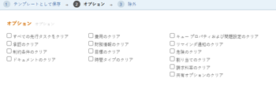
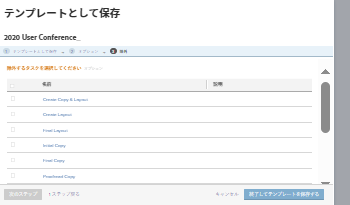

# プロジェクトからテンプレートを作成

<!--

(Note: Keep this article in the Creating and Managing Templates area with the detailed information that this contains. Since this is an article about creating TEMPLATES, this needs to be detailed under Templates; there is a similar article with almost the same title in Managing projects that points to this one - since this functionality is in the UI under Projects, this article must have a presence in that areas as well. Keep both, but make this one the only editable one (iterative))

-->

既存のプロジェクトをテンプレートとして保存する際に、テンプレートを作成できます。

既存のプロジェクトをテンプレートとして保存した後、新しいテンプレートを使用して新しいプロジェクトを作成できます。 これにより、プロジェクト作成プロセスが簡素化され、迅速に実行されます。

>[!NOTE]
>
>プロジェクトをテンプレートとして保存する場合、タスクの実際の日付とプロジェクトの実際の日付は、テンプレートに対して保存されません。
>
>テンプレートとそのタスクには、実際の日付は含まれず、タスクの開始日と終了日（将来のプロジェクトが開始する日から）を示します。 テンプレートを使用して将来のプロジェクトを作成する場合、プロジェクトは実際の日付を受け取ります。 詳しくは、 [プロジェクトの作成](../create-projects/create-project.md).

## アクセス要件

この記事の手順を実行するには、次のアクセス権が必要です。

<table style="table-layout:auto"> 
 <col> 
 <col> 
 <tbody> 
  <tr> 
   <td role="rowheader">Adobe Workfront plan*</td> 
   <td> 
任意 
 </td> 
  </tr> 
  <tr> 
   <td role="rowheader">Adobe Workfront license*</td> 
   <td> 
計画 
 </td> 
  </tr> 
  <tr> 
   <td role="rowheader">アクセスレベル設定*</td> 
   <td> 
テンプレートへのアクセスを編集
 
注意：まだアクセス権がない場合は、Workfront管理者に、アクセスレベルに追加の制限を設定しているかどうかを問い合わせてください。 Workfront管理者がアクセスレベルを変更する方法について詳しくは、 <a href="../../../administration-and-setup/add-users/configure-and-grant-access/create-modify-access-levels.md" class="MCXref xref">カスタムアクセスレベルの作成または変更</a>.
 </td> 
  </tr> 
  <tr> 
   <td role="rowheader">オブジェクト権限</td> 
   <td> 
プロジェクトに対する表示権限以上 
 
テンプレートの作成後、テンプレートに対する管理権限を取得します
 
追加のアクセス権のリクエストについて詳しくは、 <a href="../../../workfront-basics/grant-and-request-access-to-objects/request-access.md" class="MCXref xref">オブジェクトへのアクセスのリクエスト </a>.
 </td> 
  </tr> 
 </tbody> 
</table>

&#42;保有しているプラン、ライセンスの種類、アクセス権を確認するには、Workfront管理者に問い合わせてください。

## プロジェクトからテンプレートを作成

1. テンプレートとして保存するプロジェクトに移動します。
1. 次をクリック： **詳細** メニュー を、 **テンプレートとして保存**.
1. テンプレートの次の情報を指定します。

   <table style="table-layout:auto"> 
    <col> 
    <col> 
    <tbody> 
     <tr> 
      <td role="rowheader">名前</td> 
      <td>テンプレートの名前を指定します。</td> 
     </tr> 
     <tr> 
      <td role="rowheader">説明</td> 
      <td>テンプレートの説明を入力します。</td> 
     </tr> 
     <tr> 
      <td role="rowheader">アクティブ</td> 
      <td> 
次のオプションから選択します。
 
       <ul> 
        <li> 
<strong>はい</strong>:他のユーザーは、テンプレートを見つけてプロジェクトに添付できます。
 </li> 
        <li><strong>いいえ</strong>:他のユーザーはテンプレートを見つけられず、プロジェクトに添付できません。</li> 
       </ul> </td> 
     </tr> 
     <tr> 
      <td role="rowheader">カスタムフォーム</td> 
      <td>ドロップダウンリストを使用して、テンプレートに添付するカスタムフォームを選択します。 カスタムフォームが既にプロジェクトに関連付けられている場合は、それらのカスタムフォームのすべてのデータフィールドが表示されます。 1 つのテンプレートに最大 10 個のカスタムフォームを組み込むことができます。</td> 
     </tr> 
    </tbody> 
   </table>

1. クリック **Formsを管理** フォームを削除または並べ替えるには テンプレート上のカスタムフォームの削除と並べ替えの方法について詳しくは、 [カスタムフォーム](../../../administration-and-setup/customize-workfront/create-manage-custom-forms/create-and-manage-custom-forms.md).

   

1. クリック **次のステップ。**
1. 内&#x200B;**オプション** 「 」セクションで、テンプレートから消去する情報の横にあるチェックボックスを選択します。

   

1. クリック **次のステップ。**
1. 内 **除外** 「 」セクションで、プロジェクトから除外するタスクを選択します。

   

1. クリック **テンプレートを終了して保存します。**

   テンプレートが使用可能なテンプレートのリストに表示され、既存のプロジェクトに添付したり、新しいテンプレートの作成に使用したりできます。

 
