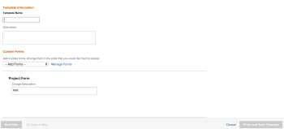

# プロジェクトからテンプレートを作成

<!--

(Note: Keep this article in the Creating and Managing Templates area with the detailed information that this contains. Since this is an article about creating TEMPLATES, this needs to be detailed under Templates; there is a similar article with almost the same title in Managing projects that points to this one - since this functionality is in the UI under Projects, this article must have a presence in that areas as well. Keep both, but make this one the only editable one (iterative))

-->

既存のプロジェクトをテンプレートとして保存する際に、テンプレートを作成できます。

既存のプロジェクトをテンプレートとして保存した後、新しいテンプレートを使用して新しいプロジェクトを作成できます。これにより、プロジェクト作成プロセスが簡素化され、迅速に実行されます。

>[!NOTE]
>
>プロジェクトをテンプレートとして保存する場合、タスクの実際の日付とプロジェクトの実際の日付は、テンプレートに保存されません。
>
>テンプレートとそのタスクには実際の日付はありませんが、タスクが開始される可能性がある日（将来のプロジェクトが開始される可能性がある日）と、タスクを完了する必要がある可能性の日を示します。テンプレートを使用して将来のプロジェクトを作成する場合、プロジェクトは実際の日付を受け取ります。詳しくは、[プロジェクトの作成](../create-projects/create-project.md)を参照してください。

## アクセス要件

+++ 展開すると、この記事の機能のアクセス要件が表示されます。

<table style="table-layout:auto"> 
 <col> 
 <col> 
 <tbody> 
  <tr> 
   <td role="rowheader">Adobe Workfront パッケージ</td> 
   <td> 
任意
 </td> 
  </tr> 
  <tr> 
   <td role="rowheader">Adobe Workfront プラン</td> 
   <td>
標準
 
   
プラン
 </td> 
  </tr> 
  <tr> 
   <td role="rowheader">アクセスレベル設定</td> 
   <td> 
テンプレートへの編集アクセス
</td> 
  </tr> 
  <tr> 
   <td role="rowheader">オブジェクト権限</td> 
   <td> 
プロジェクトに対する表示権限またはそれ以上の権限 
 
テンプレートの作成後に、テンプレートに対する管理権限を取得する
</td> 
  </tr> 
 </tbody> 
</table>

この表の情報について詳しくは、[Workfront ドキュメントのアクセス要件](/help/quicksilver/administration-and-setup/add-users/access-levels-and-object-permissions/access-level-requirements-in-documentation.md)を参照してください。

+++

<!--Old:
<table style="table-layout:auto"> 
 <col> 
 <col> 
 <tbody> 
  <tr> 
   <td role="rowheader">Adobe Workfront plan*</td> 
   <td> 
Any 
 </td> 
  </tr> 
  <tr> 
   <td role="rowheader">Adobe Workfront license*</td> 
   <td> 
Plan 
 </td> 
  </tr> 
  <tr> 
   <td role="rowheader">Access level configurations*</td> 
   <td> 
Edit access to Templates
 
Note: If you still don't have access, ask your Workfront administrator if they set additional restrictions in your access level. For information on how a Workfront administrator can modify your access level, see <a href="../../../administration-and-setup/add-users/configure-and-grant-access/create-modify-access-levels.md" class="MCXref xref">Create or modify custom access levels</a>.
 </td> 
  </tr> 
  <tr> 
   <td role="rowheader">Object permissions</td> 
   <td> 
View or higher permissions to a project 
 
You obtain Manage permissions to the template after you create it
 
For information on requesting additional access, see <a href="../../../workfront-basics/grant-and-request-access-to-objects/request-access.md" class="MCXref xref">Request access to objects </a>.
 </td> 
  </tr> 
 </tbody> 
</table>-->

## プロジェクトからテンプレートを作成

1. テンプレートとして保存するプロジェクトに移動します。
1. **その他** メニュー  をクリックしてから、**テンプレートとして保存** をクリックします。
1. テンプレートに次の情報を指定します。

   <table style="table-layout:auto"> 
    <col> 
    <col> 
    <tbody> 
     <tr> 
      <td role="rowheader">名前</td> 
      <td>テンプレートの名前を指定します。</td> 
     </tr> 
     <tr> 
      <td role="rowheader">説明</td> 
      <td>テンプレートの説明を入力します。</td> 
     </tr> 
     <tr> 
      <td role="rowheader">アクティブ</td> 
      <td> 
次のオプションから選択します。
 
       <ul> 
        <li> 
<strong>はい</strong>：他のユーザーがテンプレートを見つけてプロジェクトに添付することができます。
 </li> 
        <li><strong>いいえ</strong>：他のユーザーはテンプレートを見つけることができず、プロジェクトに添付できません。</li> 
       </ul> </td> 
     </tr> 
     <tr> 
      <td role="rowheader">カスタムフォーム</td> 
      <td>ドロップダウンリストを使用して、テンプレートに添付するカスタムフォームを選択します。カスタムフォームがすでにプロジェクトに関連付けられている場合は、それらのカスタムフォームのデータフィールドがすべて表示されます。 1 つのテンプレートに最大 10 個のカスタムフォームを含めることができます。</td> 
     </tr> 
    </tbody> 
   </table>

1. 「**フォームの管理**」をクリックして、フォームを削除または並べ替えます。テンプレートのカスタムフォームを削除して並べ替える方法については、[カスタムフォーム](../../../administration-and-setup/customize-workfront/create-manage-custom-forms/create-and-manage-custom-forms.md)を参照してください。

   

1. 「**次の手順**」をクリックします。
1. **オプション**&#x200B;セクションで、テンプレートから削除する情報の横にあるチェックボックスを選択します。

   

1. 「**次の手順**」をクリックします。
1. **除外**&#x200B;セクションで、プロジェクトから除外するタスクを選択します。

   

1. 「**完了してテンプレートを保存**」をクリックします。

   テンプレートが使用可能なテンプレートのリストに表示され、既存のプロジェクトに添付することも、新しいプロジェクトの作成に使用することもできます。

 
