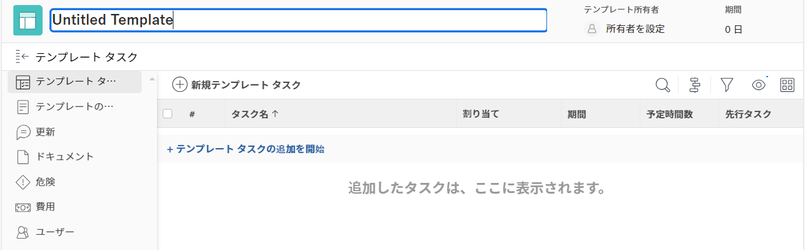

# プロジェクトテンプレートの作成

<!-- Audited: 1/2024 -->

テンプレートエリアからテンプレートを作成および削除できます。新しいテンプレートを作成する際に、すべてのタスクと将来のプロジェクト設定に関する情報を入力できます。 この情報は、その後、テンプレートから作成したすべてのプロジェクトに転送されます。

>[!NOTE]
>
>テンプレートとそのタスクには実際の日付はありませんが、タスクが開始される可能性がある日（将来のプロジェクトが開始される可能性がある日）と、タスクを完了する必要がある可能性の日を示します。テンプレートを使用して将来のプロジェクトを作成する場合、プロジェクトは実際の日付を受け取ります。詳しくは、[プロジェクトの作成](../create-projects/create-project.md)を参照してください。

次の方法で新しいテンプレートを作成できます。

* 最初から（この記事で説明）。
* 既存のプロジェクトから、プロジェクトをテンプレートとして保存。

  既存のプロジェクトからテンプレートを作成する方法について詳しくは、[プロジェクトをテンプレートとして保存](../../../manage-work/projects/manage-projects/save-project-as-template.md)を参照してください。

* 別のテンプレートからコピー。

  既存のテンプレートのコピーについて詳しくは、[プロジェクトテンプレートをコピー](../../../manage-work/projects/create-and-manage-templates/copy-template.md)を参照してください。

* ブループリントを読み込む。 ブループリントを読み込むには、Workfrontの管理者である必要があります。 詳しくは、[ブループリントの設定](../../../administration-and-setup/blueprints/configure-template-package.md)を参照してください。

## アクセス要件

以下が必要です。

<table style="table-layout:auto"> 
 <col> 
 <col> 
 <tbody> 
  <tr> 
   <td role="rowheader">Adobe Workfront プラン</td> 
   <td> 
任意
 </td> 
  </tr> 
  <tr> 
   <td role="rowheader">Adobe Workfront ライセンス</td> 
   <td> 
新規：標準 

または 

現在：プラン 
 
ブループリントからテンプレートを読み込むには、システム管理者である必要があります
 </td> 
  </tr> 
  <tr> 
   <td role="rowheader">アクセスレベル設定*</td> 
   <td> 
テンプレートへの編集アクセス
 </td> 
  </tr> 
  <tr> 
   <td role="rowheader">オブジェクト権限</td> 
   <td> 
デフォルトでは、作成したテンプレートに対する管理権限があります。
  </td> 
  </tr> 
 </tbody> 
</table>

この表の情報の詳細については、 [Workfrontドキュメントのアクセス要件](/help/quicksilver/administration-and-setup/add-users/access-levels-and-object-permissions/access-level-requirements-in-documentation.md).

## テンプレートの作成

1. 次をクリック： **[!UICONTROL メインメニュー]** アイコン  Adobe Workfrontの右上隅にある、または（使用可能な場合）、 **[!UICONTROL メインメニュー]** アイコン  左上隅で、「 **テンプレート**.

1. 「**新規テンプレート**」をクリックします。

   テンプレートは名称未設定です。

   

1. テンプレートヘッダーで新しいテンプレートの名前を指定し、**Enter** キーを押します。
1. 左側のパネルで「**テンプレートタスク**」セクションをクリックします。
1. 「**テンプレートタスクの追加を開始**」をクリックします。

   または

   「**新規テンプレートタスク**」をクリックして、テンプレートへのタスク追加を開始します。

   テンプレートタスクをテンプレートに追加することは、タスクをプロジェクトに追加することと同じです。

   プロジェクトへのタスクの追加の詳細については、[プロジェクトへのタスクの作成](../../../manage-work/tasks/create-tasks/create-tasks-in-project.md)を参照してください。

   >[!NOTE]
   >
   >繰り返しタスクをテンプレートに追加することはできません。

1. （オプション）タスクリストの右上隅にある&#x200B;**ガントチャート**&#x200B;アイコンをクリックすると、テンプレートのタスクリストが視覚的に表示されます。

   >[!TIP]
   >
   >このガントチャートから直接タスクを編集することはできません。

1. 新規テンプレートに情報を追加するには、**その他**&#x200B;メニュー  をクリックし、**編集**&#x200B;を選択します。

   テンプレートの編集について詳しくは、[プロジェクトテンプレートの編集](../../../manage-work/projects/create-and-manage-templates/edit-templates.md)を参照してください。

1. 「**変更を保存**」をクリックします。
1. （オプション）テンプレートに項目を追加する場合は、[プロジェクトテンプレートの編集](../../../manage-work/projects/create-and-manage-templates/edit-templates.md)の記事の[テンプレートに項目を追加](../../../manage-work/projects/create-and-manage-templates/edit-templates.md#add-additional-items-to-a-template)のセクションを参照してください。

## グループの関連性によって決定されるテンプレート設定

プロジェクトテンプレートとグループの関連付け（またはグループの欠如）は、プロジェクト、タスク、問題の環境設定がテンプレート内の特定の設定を決定する方法に影響します。 詳しくは、[グループのプロジェクトテンプレートの作成および変更](../../../administration-and-setup/manage-groups/work-with-group-objects/create-and-modify-a-groups-templates.md)の記事の[グループのプロジェクトテンプレートを作成および変更](../../../administration-and-setup/manage-groups/work-with-group-objects/create-and-modify-a-groups-templates.md#create-and-modify-a-groups-project-templates)のセクションを参照してください。
