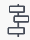

# プロジェクトテンプレートの作成

<!-- Audited: 10/2025 -->

<!--remove all instances of new/ old experience and redo the steps when the toggle is removed-->

<!--

 

The highlighted information on this page refers to functionality not yet generally available. It is available only in the Preview environment for all customers. The same features will also be available in the Production environment for all customers starting with a week from the Preview release.      

For more information, see [Interface modernization](/help/quicksilver/product-announcements/product-releases/interface-modernization/interface-modernization.md).  

-->

テンプレートエリアからテンプレートを作成および削除できます。 新しいテンプレートを作成するときは、すべてのタスクと、将来のプロジェクト設定についての情報を入力できます。 この情報は、テンプレートから作成するプロジェクトに転送されます。

>[!NOTE]
>
>テンプレートとそのタスクには実際の日付はありませんが、タスクが開始される可能性がある日（将来のプロジェクトが開始される可能性がある日）と、タスクを完了する必要がある可能性の日を示します。 テンプレートを使用して将来のプロジェクトを作成する場合、プロジェクトは実際の日付を受け取ります。 詳しくは、[プロジェクトの作成](../create-projects/create-project.md)を参照してください。

次の方法で新しいテンプレートを作成できます。

* 最初から（この記事で説明）。
* 既存のプロジェクトから、プロジェクトをテンプレートとして保存。

  既存のプロジェクトからテンプレートを作成する方法について詳しくは、[プロジェクトをテンプレートとして保存](../../../manage-work/projects/manage-projects/save-project-as-template.md)を参照してください。

* 別のテンプレートからコピー。

  既存のテンプレートのコピーについて詳しくは、[プロジェクトテンプレートをコピー](../../../manage-work/projects/create-and-manage-templates/copy-template.md)を参照してください。

* ブループリントを読み込む。 ブループリントを読み込むには、Workfront の管理者である必要があります。 詳しくは、[ブループリントの設定](../../../administration-and-setup/blueprints/configure-template-package.md)を参照してください。

## アクセス要件

+++ 展開すると、この記事の機能のアクセス要件が表示されます。

<table style="table-layout:auto"> 
 <col> 
 <col> 
 <tbody> 
  <tr> 
   <td role="rowheader">Adobe Workfront パッケージ</td> 
   <td> 
任意
 </td> 
  </tr> 
  <tr> 
   <td role="rowheader">Adobe Workfront プラン</td> 
   <td> 
標準 

プラン
 
ブループリントからテンプレートを読み込むには、システム管理者である必要があります
 </td> 
  </tr> 
  <tr> 
   <td role="rowheader">アクセスレベル設定</td> 
   <td> 
テンプレートへの編集アクセス
 </td> 
  </tr> 
  <tr> 
   <td role="rowheader">オブジェクト権限</td> 
   <td> 
デフォルトでは、作成したテンプレートに対する管理権限があります。
  </td> 
  </tr> 
 </tbody> 
</table>

この表の情報について詳しくは、[Workfront ドキュメントのアクセス要件](/help/quicksilver/administration-and-setup/add-users/access-levels-and-object-permissions/access-level-requirements-in-documentation.md)を参照してください。

+++

<!--
Old:
<table style="table-layout:auto"> 
 <col> 
 <col> 
 <tbody> 
  <tr> 
   <td role="rowheader">Adobe Workfront plan</td> 
   <td> 
Any
 </td> 
  </tr> 
  <tr> 
   <td role="rowheader">Adobe Workfront license</td> 
   <td> 
New: Standard 

Or 

Current: Plan 
 
You must be a system administrator to import templates from Blueprints
 </td> 
  </tr> 
  <tr> 
   <td role="rowheader">Access level configurations*</td> 
   <td> 
Edit access to Templates
 </td> 
  </tr> 
  <tr> 
   <td role="rowheader">Object permissions</td> 
   <td> 
You have Manage permissions to the templates you create, by default
  </td> 
  </tr> 
 </tbody> 
</table>
-->

## テンプレートの作成

{{step1-to-templates}}

1. 「**新規テンプレート**」をクリックします。

1. （条件付き）組織が使用しているドキュメントストレージに応じて、次のいずれかをクリックします。

   * **新しいテンプレート**。Workfront管理者が&#x200B;**Adobe クラウドストレージ**&#x200B;または&#x200B;**レガシーWorkfront**&#x200B;のいずれかを選択し、**ユーザーがストレージプロバイダー**&#x200B;を選択することを許可する設定を選択したか、選択しなかった場合。
   * **新しいテンプレート（レガシーストレージ）**。Workfront管理者が&#x200B;**Adobe クラウドストレージ**&#x200B;または&#x200B;**レガシーWorkfront**&#x200B;のいずれかを選択し、**ユーザーがストレージプロバイダー**&#x200B;を選択することを許可する設定も選択した場合。

     このオプションは、**ユーザーがストレージ プロバイダー**&#x200B;を選択することを許可する設定がセットアップ エリアで選択されている場合にのみ表示されます。

     詳しくは、[組織でAdobe クラウドストレージを有効にする](/help/quicksilver/administration-and-setup/set-up-workfront/configure-system-defaults/enable-esm.md)を参照してください。

     テンプレートが作成され、そのデフォルト名は、Workfrontがドキュメントに使用するストレージに応じて、次のパターンに従います。

      * Workfront ストレージテンプレート用の&#x200B;**名称未設定テンプレート**。

        レガシーWorkfront ストレージテンプレートの名前の横に、**レガシーWorkfront ストレージ** アイコン が表示されます。

      * **名称未設定のテンプレート - Adobe クラウドストレージテンプレートの&lt;月の日、年の時間。分。秒>**

        >[!IMPORTANT]
        >
        >Adobe ストレージを使用するテンプレートには、一意の名前を付ける必要があります。

   

1. テンプレートヘッダーで新しいテンプレートの名前を指定し、**Enter** キーを押します。
1. 左側のパネルで「**テンプレートタスク**」セクションをクリックします。
1. 「**テンプレートタスクの追加を開始**」をクリックして、タスクをインラインで追加します

   または

   「**新しいテンプレートタスク**」をクリックして、**新しいテンプレートタスク** ボックスでテンプレートへのタスクの追加を開始します。

   **新しいテンプレート タスク**&#x200B;をクリックすると、**テンプレート タスクを作成** ボックスが開きます。

   

1. （条件付き）次の領域で、**テンプレート タスクを作成** ボックスの情報を更新します。

   * テンプレート タスク名
   * 概要
   * 割り当て
   * 財務
   * カスタムフォーム
   * ドキュメント
   * 設定

   テンプレートタスクの情報の更新は、テンプレートタスクの編集に似ています。

   詳しくは、[ テンプレートタスクの編集](/help/quicksilver/manage-work/projects/create-and-manage-templates/edit-template-task.md)を参照してください。

   >[!NOTE]
   >
   >繰り返しタスクをテンプレートに追加することはできません。

1. 「**テンプレートタスクを作成**」をクリックします。

1. （オプション）テンプレートタスクを追加した後、**テンプレートタスク** セクションで、タスクリストの右上隅にある&#x200B;**ガントチャート** アイコン をクリックすると、テンプレートのタスクリストが視覚的に表示されます。

   >[!TIP]
   >
   >テンプレートタスクのガントチャートからタスクを直接編集することはできません。

1. 新しいテンプレートに情報を追加するには、ヘッダーのテンプレート名の右側にある&#x200B;**詳細** メニューをクリックし、**編集**&#x200B;をクリックします。

   テンプレートの編集について詳しくは、[プロジェクトテンプレートの編集](../../../manage-work/projects/create-and-manage-templates/edit-templates.md)を参照してください。

   >[!NOTE]
   >
   >プロジェクトテンプレートとグループとの関連付け（またはグループの欠如）は、プロジェクト、タスク、イシューの環境設定がテンプレート内の特定の設定を決定する方法に影響します。
   >
   >詳細については、[ グループのプロジェクトテンプレートの作成と変更](../../../administration-and-setup/manage-groups/work-with-group-objects/create-and-modify-a-groups-templates.md)の記事の「テンプレートとテンプレートタスクに対する環境設定の適用方法」の節を参照してください。

1. 「**保存**」をクリックします。
1. （オプション）次の項目をテンプレートに追加します

   * ドキュメント
   * リスク
   * 承認プロセス
   * 請求レート
   * 費用
   * キューの詳細
   * トピックグループとキューのトピック

1. （オプション）テンプレートのタスクに次の項目を追加します。

   * ドキュメント
   * 費用
   * 承認

   詳しくは、[ プロジェクトテンプレートを編集](../../../manage-work/projects/create-and-manage-templates/edit-templates.md)の記事の「テンプレートにアイテムを追加する」の節を参照してください。

