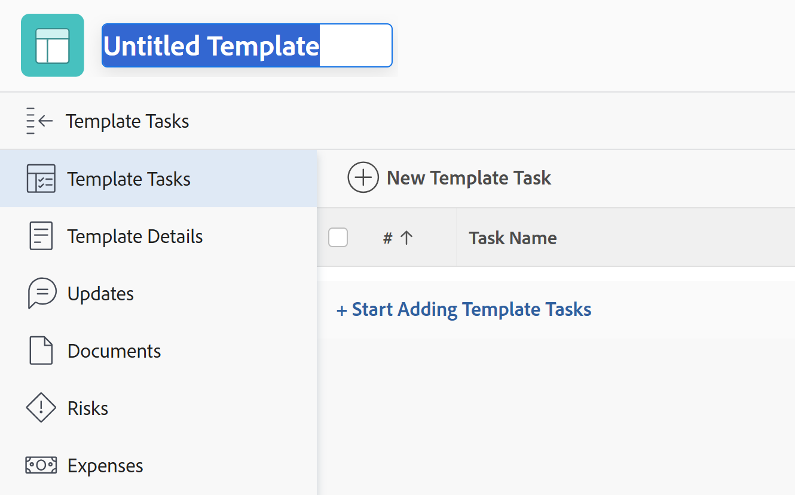

# プロジェクトテンプレートの作成

「テンプレート」領域で、テンプレートを作成および削除できます。 新しいテンプレートを作成する際に、すべてのタスクの情報と将来のプロジェクト設定のすべての情報を入力できます。 この情報は、テンプレートから作成する際に、プロジェクトに転送されます。

>[!NOTE]
>
>テンプレートとそのタスクには、実際の日付は含まれず、タスクの開始日と終了日（将来のプロジェクトが開始する日から）を示します。 テンプレートを使用して将来のプロジェクトを作成する場合、プロジェクトは実際の日付を受け取ります。 詳しくは、 [プロジェクトの作成](../create-projects/create-project.md).

新しいテンプレートは、次の方法で作成できます。

* この記事で説明するように、最初から。
* 既存のプロジェクトから、プロジェクトをテンプレートとして保存する。

  既存のプロジェクトからテンプレートを作成する方法について詳しくは、 [プロジェクトをテンプレートとして保存する](../../../manage-work/projects/manage-projects/save-project-as-template.md).

* 別のテンプレートからコピーする。

  既存のテンプレートのコピーについて詳しくは、 [プロジェクトテンプレートのコピー](../../../manage-work/projects/create-and-manage-templates/copy-template.md).

* Workfrontの管理者は、ブループリントを読み込んでテンプレートを作成できます。 詳しくは、 [ブループリントの設定](../../../administration-and-setup/blueprints/configure-template-package.md).

## アクセス要件

以下が必要です。

<table style="table-layout:auto"> 
 <col> 
 <col> 
 <tbody> 
  <tr> 
   <td role="rowheader">Adobe Workfront plan*</td> 
   <td> 
任意
 </td> 
  </tr> 
  <tr> 
   <td role="rowheader">Adobe Workfront license*</td> 
   <td> 
計画 
 
ブループリントからテンプレートを読み込むためのシステム管理者
 </td> 
  </tr> 
  <tr> 
   <td role="rowheader">アクセスレベル設定*</td> 
   <td> 
テンプレートへのアクセスを編集
 
注意：まだアクセス権がない場合は、Workfront管理者に、アクセスレベルに追加の制限を設定しているかどうかを問い合わせてください。 Workfront管理者がアクセスレベルを変更する方法について詳しくは、 <a href="../../../administration-and-setup/add-users/configure-and-grant-access/create-modify-access-levels.md" class="MCXref xref">カスタムアクセスレベルの作成または変更</a>.
 </td> 
  </tr> 
  <tr> 
   <td role="rowheader">オブジェクト権限</td> 
   <td> 
作成したテンプレートに対する管理権限が、デフォルトで与えられています。
 
追加のアクセス権のリクエストについて詳しくは、 <a href="../../../workfront-basics/grant-and-request-access-to-objects/request-access.md" class="MCXref xref">オブジェクトへのアクセスのリクエスト </a>.
 </td> 
  </tr> 
 </tbody> 
</table>

&#42;保有しているプラン、ライセンスの種類、アクセス権を確認するには、Workfront管理者に問い合わせてください。

## テンプレートの作成

1. 次の **メインメニュー**  クリック **テンプレート**.

1. クリック **新規テンプレート**.

   テンプレートのタイトルが設定されていません。

   

1. テンプレートヘッダーに新しいテンプレートの名前を指定し、「 **を入力します。**
1. 次をクリック： **テンプレートタスク** 」セクションを使用して、
1. クリック&#x200B;**テンプレートタスクの追加を開始**.

   または

   クリック **新規テンプレートタスク** をクリックして、テンプレートへのタスクの追加を開始します。

   テンプレートタスクをテンプレートに追加する方法は、タスクをプロジェクトに追加する方法と同じです。

   プロジェクトへのタスクの追加の詳細については、 [プロジェクトでのタスクの作成](../../../manage-work/tasks/create-tasks/create-tasks-in-project.md).

   >[!NOTE]
   >
   >繰り返しタスクをテンプレートに追加することはできません。

1. （オプション） **ガントチャート** アイコンを使用して、テンプレートのタスクリストを視覚的に表示できます。

   >[!TIP]
   >
   >このガントチャートから直接タスクを編集することはできません。

1. 新しいテンプレートに情報を追加するには、 **詳細** メニュー を選択し、「 **編集**.

   テンプレートの編集について詳しくは、 [プロジェクトテンプレートの編集](../../../manage-work/projects/create-and-manage-templates/edit-templates.md).

1. 「**変更を保存**」をクリックします。
1. （オプション）テンプレートに項目を追加する場合は、「 [テンプレートに項目を追加する](../../../manage-work/projects/create-and-manage-templates/edit-templates.md#adding-items-to-template) 記事内 [プロジェクトテンプレートの編集](../../../manage-work/projects/create-and-manage-templates/edit-templates.md).

## グループの関連付けによって決定されるテンプレート設定

プロジェクトテンプレートとグループ（またはその不足）との関連付けは、プロジェクト、タスク、および問題の環境設定がテンプレート内の特定の設定を決定する方法に影響を与えます。 詳しくは、 [グループのプロジェクトテンプレートの作成と変更](../../../administration-and-setup/manage-groups/work-with-group-objects/create-and-modify-a-groups-templates.md#template2) 記事内 [グループのプロジェクトテンプレートの作成と変更](../../../administration-and-setup/manage-groups/work-with-group-objects/create-and-modify-a-groups-templates.md).
