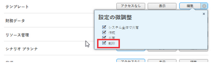
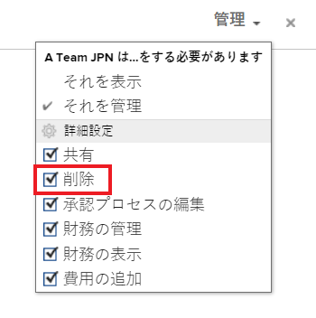

# プロジェクトテンプレートを削除

時間の経過と共にプロジェクトの履歴情報を保持できるように、テンプレートを削除する代わりに、使用しなくなったテンプレートを非アクティブ化することをお勧めします。 テンプレートの非アクティブ化について詳しくは、 [プロジェクトテンプレートの編集](../../../manage-work/projects/create-and-manage-templates/edit-templates.md).

>[!IMPORTANT]
>
>テンプレートを削除しても、そのテンプレートを使用しているプロジェクトは変更されません。 ただし、プロジェクトの「テンプレート」フィールドに元のテンプレートの名前が表示されなくなりました。 また、プロジェクト上のタスクのテンプレートタスクの名前をタスクビューに表示できなくなりました。 プロジェクト上の「テンプレート」フィールドとタスク上の「テンプレートタスク」フィールドは、プロジェクトに最初に関連付けられていたテンプレートを削除した後も空白のままです。

## アクセス要件

この記事の手順を実行するには、次のアクセス権が必要です。

<table style="table-layout:auto"> 
 <col> 
 <col> 
 <tbody> 
  <tr> 
   <td role="rowheader">Adobe Workfront plan*</td> 
   <td> 
任意
 </td> 
  </tr> 
  <tr> 
   <td role="rowheader">Adobe Workfront license*</td> 
   <td> 
計画 
 </td> 
  </tr> 
  <tr> 
   <td role="rowheader">アクセスレベル設定*</td> 
   <td> 
削除へのアクセス権を含むテンプレートへのアクセスを編集
 
  
 
注意：まだアクセス権がない場合は、Workfront管理者に、アクセスレベルに追加の制限を設定しているかどうかを問い合わせてください。 Workfront管理者がアクセスレベルを変更する方法について詳しくは、 <a href="../../../administration-and-setup/add-users/configure-and-grant-access/create-modify-access-levels.md" class="MCXref xref">カスタムアクセスレベルの作成または変更</a>.
 </td> 
  </tr> 
  <tr> 
   <td role="rowheader">オブジェクト権限</td> 
   <td> 
削除する権限を含むテンプレートに対する権限を管理します。
 
  
 
追加のアクセス権のリクエストについて詳しくは、 <a href="../../../workfront-basics/grant-and-request-access-to-objects/request-access.md" class="MCXref xref">オブジェクトへのアクセスのリクエスト </a>.
 </td> 
  </tr> 
 </tbody> 
</table>

&#42;保有しているプラン、ライセンスの種類、アクセス権を確認するには、Workfront管理者に問い合わせてください。

## テンプレートの削除に関する考慮事項

* テンプレートが添付されたときにプロジェクトに追加されたタスクは、プロジェクトに残ります。 ただし、タスクに関連付けられているテンプレートタスク情報は削除されます。
* テンプレートの名前が **テンプレート** フィールド **概要** プロジェクトのサブタブ。

* 最近削除したテンプレートをごみ箱から復元できます。 ごみ箱からアイテムを復元する方法については、 [削除した項目を復元](../../../administration-and-setup/manage-workfront/manage-deleted-items/restore-deleted-items.md).

## テンプレートの削除

1. 次の **メインメニュー** をクリックし、 **テンプレート**. テンプレートのリストが開きます

1. テンプレート名の左側にあるチェックボックスをクリックして、削除するテンプレートを選択し、「 」をクリックします **削除 > はい、削除します** 削除を確定します。

   または

   テンプレートの名前をクリックしてアクセスし、 **詳細** メニュー  を、 **テンプレートを削除 > はい、削除します**.

   テンプレートをプロジェクトに関連付けることはできなくなりました。
