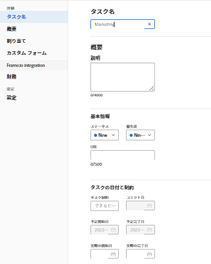
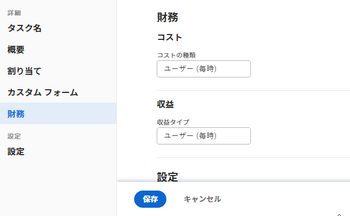
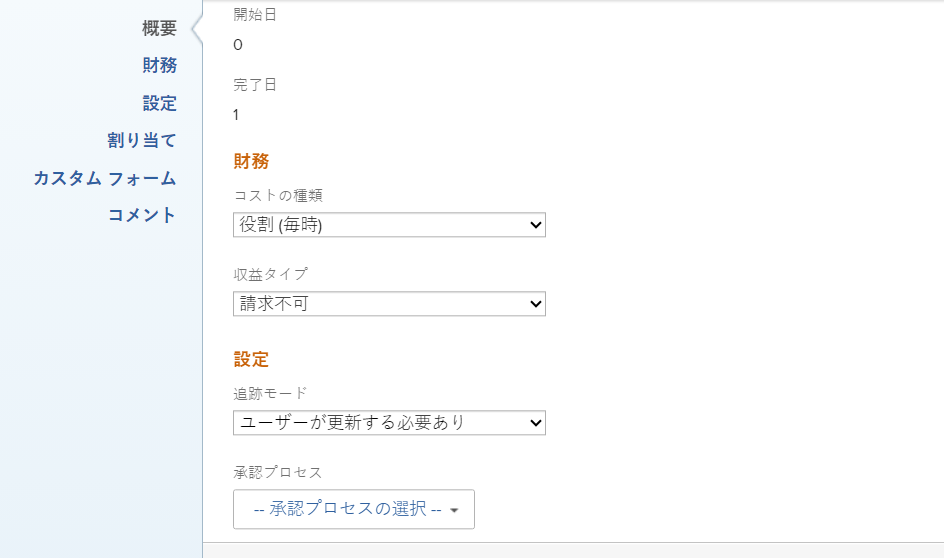
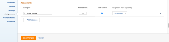
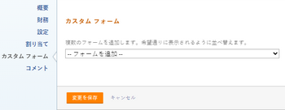
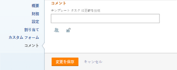

# テンプレートタスクを編集

テンプレートを作成した後、テンプレートタスクに関する情報を編集できます。テンプレートタスクで更新した情報は、テンプレートを使用してプロジェクトを作成した後、またはテンプレートをプロジェクトに添付した後、プロジェクトタスクに関連付けられます。

テンプレートの作成の詳細については、[プロジェクトテンプレートを作成](../../../manage-work/projects/create-and-manage-templates/create-template.md)を参照してください。

テンプレートタスクは、編集することも、一括でテンプレートタスクを編集することもできます。

>[!NOTE]
>
>複数のテンプレートに属するテンプレートタスクは一括で編集できません。 編集できるのは、同じテンプレートに属するテンプレートタスクのみです。

## アクセス要件

この記事の手順を実行するには、次のアクセス権が必要です。

<table style="table-layout:auto"> 
 <col> 
 <col> 
 <tbody> 
  <tr> 
   <td role="rowheader">Adobe Workfront プラン</td> 
   <td> 
任意
 </td> 
  </tr> 
  <tr> 
   <td role="rowheader">Adobe Workfront ライセンス*</td> 
   <td> 
新規：標準 

   
現在：プラン 
 </td> 
  </tr> 
  <tr> 
   <td role="rowheader">アクセスレベル</td> 
   <td> 
テンプレートへの編集アクセス
  </td> 
  </tr> 
  <tr> 
   <td role="rowheader">オブジェクト権限 </td> 
   <td> 
テンプレートの権限を管理します。 
 
テンプレートタスクに対する参加以上の権限。
 </td> 
  </tr> 
 </tbody> 
</table>

*保有するプラン、ライセンスの種類、アクセスレベルを確認するには、Workfront管理者にお問い合わせください。 詳しくは、 [Workfrontドキュメントのアクセス要件](/help/quicksilver/administration-and-setup/add-users/access-levels-and-object-permissions/access-level-requirements-in-documentation.md).

## 前提条件

開始する前に、

* テンプレートを作成する必要があります。

  テンプレートの作成の詳細については、[プロジェクトテンプレートを作成](../../../manage-work/projects/create-and-manage-templates/create-template.md)を参照してください。

## テンプレートタスクの編集

「テンプレートタスクの編集」エリアまたは「テンプレートタスクの詳細」エリアを使用して、テンプレートタスクを編集できます。次の手順では、「テンプレートタスクの編集」ボックスでタスクを編集する方法について説明します。

{{step1-to-templates}}

1. テンプレートの名前をクリックして開きます。
1. 左パネルの「**テンプレートタスク**」をクリックします。
1. リスト内のテンプレートタスクの名前をクリックして、テンプレートタスクを開きます。
1. （オプション）複数のテンプレートタスクを一括編集するには、複数のテンプレートタスクを選択して、 **編集** をクリックします。
1. （条件付き）テンプレートタスクに関する限定的な情報を編集するには、 **テンプレートタスクの詳細** 左側のパネルで、「詳細」セクションの領域に移動して、各領域の情報を編集します。
1. （オプション） **すべて折りたたむ** アイコン  をクリックして、すべての領域を折りたたみます。
1. 「詳細」セクションの情報を編集するには、**編集**&#x200B;アイコン  をクリックし、続いて以下のいずれかのエリアを選択するか、「**すべて編集**」をクリックしてすべてのエリアの情報を編集します。

   * 概要
   * カスタムフォーム

     カスタムフォームの名前は、オブジェクトにカスタムフォームがアタッチされている場合にのみ表示されます。

   * 財務

   >[!TIP]
   >
   >「詳細」領域に表示されるすべてのフィールドの詳細については、下のテンプレートタスクの編集ボックスを使用してすべてのフィールドの編集を続けてください。

1. （条件付き）テンプレートタスクに関するすべての情報を編集するには、テンプレートタスク名の横にある&#x200B;**その他**&#x200B;メニュー 、「**編集**」の順にクリックします。

   「**テンプレートタスクの編集**」ボックスが表示されます。

   >[!TIP]
   >
   >リスト内のテンプレート タスクを選択し、「編集」をクリックして「テンプレートタスクの編集」ボックスを開くこともできます。

   

1. 次のセクションのいずれかに情報を指定することを検討してください。

   * [概要](#overview)
   * [財務](#finance)
   * [設定](#settings)
   * [割り当て](#assignments)
   * [カスタムフォーム](#custom-forms)
   * [コメント](#comment)

### 概要 {#overview}

1. 前述の説明に従って、テンプレートタスクの編集を開始します。
1. 「**概要**」をクリックします。

   

1. 次のいずれかを更新します。

   <table style="table-layout:auto"> 
    <col> 
    <col> 
    <tbody> 
     <tr> 
      <td role="rowheader"><strong>名前</strong> </td> 
      <td>テンプレートタスクの名前を指定します。 テンプレートタスクを一括編集する場合、このフィールドは表示されません。</td> 
     </tr> 
     <tr> 
      <td role="rowheader"><strong>説明</strong> </td> 
      <td>テンプレートタスクに関する追加情報を追加します。</td> 
     </tr> 
     <tr> 
      <td role="rowheader"><strong>URL</strong> </td> 
      <td>テンプレートタスクに関する情報に関連する web リンクを指定します。</td> 
     </tr> 
     <tr> 
      <td role="rowheader"><strong>優先度</strong> </td> 
      <td> 
これは、テンプレートタスクに優先順位を付けるための視覚的なフラグです。 
 
次のオプションから選択します。
 
       <ul> 
        <li> 
<strong>なし</strong> 
 </li> 
        <li> 
<strong>低</strong> 
 </li> 
        <li> 
 <b>標準</b>
 </li> 
        <li> 
<b>高</b> 
 </li> 
        <li> 
<b>緊急</b> 
 </li> 
       </ul> 
Workfront 管理者が選択したプロジェクト設定に応じて、優先順位の名前が異なる場合があります。優先順位の編集について詳しくは、<a href="../../../administration-and-setup/customize-workfront/creating-custom-status-and-priority-labels/create-customize-priorities.md" class="MCXref xref">優先順位の作成とカスタマイズ</a>を参照してください。
 </td> 
     </tr> 
     <tr> 
      <td role="rowheader"><strong>期間タイプ</strong> </td> 
      <td> 
このテンプレートから作成される今後のタスクには、この期間タイプが設定されます。 期間タイプは、次の関係を識別します。
 
- タスクに割り当てられたリソースの数
 
- タスクを完了するために必要な総労力
 
- タスクの総期間。 
 
期間タイプを使用すると、タスクのニーズに基づいて一貫したリソース割り当てを設定できます。タスクの期間タイプについて詳しくは、<a href="../../../manage-work/tasks/taskdurtn/task-duration-and-duration-type.md" class="MCXref xref">タスク継続期間と期間タイプの概要</a>を参照してください。
 
次のオプションから選択します。
 
       <ul> 
        <li> 
予定割り当て時間 
 </li> 
        <li> 
予定作業 
 </li> 
        <li> 
残存作業時間の優先 
 </li> 
        <li> 
シンプル  
 </li> 
       </ul> </td> 
     </tr> 
     <tr> 
      <td role="rowheader"><strong>期間</strong> </td> 
      <td> 
今後のタスクの期間を分、時間、日、週または月単位で指定します。このテンプレートから作成される将来のタスクは、ここで指定した期間になります。
 
デフォルトで、Workfront は期間を日数単位で測定します。タスクが完了するまで、タスクを未完了のままにしておく時間です。タスクの期間は、タスクの<strong>期間タイプ</strong>が<strong>シンプル</strong>、または<strong>タスクの制約</strong>が<strong>固定日付</strong>である場合は指定できません。
 
<b>重要</b>
 
通常、期間は、テンプレートタスクの「計画開始日」から「計画完了日」までの時間です。このため、テンプレートのタイムラインに影響を与えます。 これにより、テンプレートから作成される今後のプロジェクトのタイムラインが決まります。 
 </td> 
     </tr> 
     <tr> 
      <td role="rowheader"><strong>予定時間数</strong> </td> 
      <td> 
このテンプレートで作成されたプロジェクトの将来のタスクの予定時間数を指定します。タスクの担当者がタスクを完了するのにかかる実際の時間です。タスクの予定時間数は、 <strong>期間のタイプ</strong> が <strong>計算された割り当て</strong>. 
 </td> 
     </tr>

   <tr> 
      <td role="rowheader"><strong>タスクの制約</strong> </td> 
      <td> 
このテンプレートから作成されたプロジェクトのタスクには、この制約が適用されます。タスク制約は、タスクを完了する必要があるタイミングを識別します。 
 
次のオプションから選択します。
 
       <ul> 
        <li><strong>固定日付</strong>：<strong>予定開始日</strong>および<strong>予定完了日</strong>を指定します。</li> 
        <li><strong>指定日に開始</strong>：<strong>予定開始日</strong>を指定します。</li> 
        <li><strong>指定日に終了</strong>：<strong>予定完了日</strong>を指定します。</li> 
        <li><strong>できるだけ早く</strong> </li> 
        <li><strong>できるだけ遅く</strong> </li> 
        <li style="font-weight: bold;"><strong>最も早い空き時間</strong> </li> 
        <li style="font-weight: bold;"><strong>最も遅い空き時間</strong> </li> 
        <li>指定日までに開始：<strong>予定開始日</strong>を指定します。</li> 
        <li><strong>指定日以後に開始</strong>：<strong>予定開始日</strong>を指定します。</li> 
        <li><strong>これよりも遅く終了しない</strong>：<strong>予定完了日</strong>を指定します。</li> 
        <li><strong>これよりも早く終了しない</strong>：<strong>予定完了日</strong>を指定します。</li> 
       </ul> 
タスクの制約について詳しくは、<a href="../../../manage-work/tasks/task-constraints/task-constraint-overview.md" class="MCXref xref">タスクの制約の概要</a>を参照してください。
 </td> 
     </tr> 
     <tr> 
      <td role="rowheader">開始日 （オプションおよび条件付き） </td> 
      <td> 
 テンプレートのタスクの開始日は、タスク制約が次のいずれかの場合にのみ指定できます。
 
       <ul> 
        <li>指定日に開始</li> 
        <li>指定日以後に開始</li> 
        <li>指定日までに開始</li> 
        <li>固定日付</li> 
       </ul> 
タスクが開始される将来のプロジェクトのタイムライン内の日付に対応します。その他のすべての制約について、Workfrontはタスク間の先行タスクの依存関係に基づいて開始日を計算します。 
 </td> 
     </tr> 
     <tr> 
      <td role="rowheader"><strong>完了日</strong>（オプションおよび条件付き） </td> 
      <td> 
 テンプレートタスクの完了日は、タスク制約が次のいずれかの場合にのみ指定できます。
 
       <ul style="list-style-type: circle;"> 
        <li>指定日に終了</li> 
        <li>これよりも早く終了しない</li> 
        <li>これよりも遅く終了しない</li> 
        <li>固定日付</li> 
       </ul> 
これは、タスクが終了される将来のプロジェクトのタイムライン内の日付に対応します。その他のすべての制約について、Workfrontは、期間と先行者の依存関係に基づいて完了日を計算します。 
 </td> 
     </tr> 
    </tbody> 
   </table>

1. （オプション）変更する情報に応じて、以降のセクションを引き続き編集します。

   または

   「**変更を保存**」をクリックします。

### 財務 {#finance}

1. 上記の説明に従ってタスクの編集を開始します。
1. 「**財務**」をクリックします。

   

1. 次のいずれかを更新します。

   <table style="table-layout:auto"> 
    <col> 
    <col> 
    <tbody> 
     <tr> 
      <td role="rowheader"><strong>コストの種類</strong> </td> 
      <td> 
将来のタスクのコストタイプを指定します。これにより、タスクの時間数に基づいて、タスクのコストの計算方法が決まります。 
 
次のオプションから選択します。
 
       <ul> 
        <li> 
コストなし 
 </li> 
        <li> 
固定（毎時） 
 </li> 
        <li> 
ユーザー（毎時） 
 </li> 
        <li> 
役割（毎時） 
 </li> 
       </ul> 
コストの追跡について詳しくは、<a href="../../../manage-work/projects/project-finances/track-costs.md" class="MCXref xref">コストの追跡</a>を参照してください。
 </td> 
     </tr> 
     <tr> 
      <td role="rowheader"><strong>収益タイプ</strong> </td> 
      <td> 
将来のタスクの収益タイプを指定します。これにより、タスクの時間数に基づいて、タスクの収益の計算方法が決まります。
 
次のオプションから選択します。 
 
       <ul> 
        <li> 
請求不可
 </li> 
        <li> 
ユーザー (毎時)
 </li> 
        <li> 
役割（毎時）
 </li> 
        <li> 
固定 (毎時)
 </li> 
        <li> 
ユーザー (毎時) (キャップ付き)
 </li> 
        <li> 
役割（毎時）（上限付き）
 </li> 
        <li> 
ユーザー（毎時）+ 固定
 </li> 
        <li> 
役割（毎時）+ 固定
 </li> 
        <li> 
固定収益
 </li> 
       </ul> 
収益の追跡について詳しくは、<a href="../../../manage-work/projects/project-finances/billing-and-revenue-overview.md" class="MCXref xref">請求と収益の概要</a>を参照してください。
 </td> 
     </tr> 
    </tbody> 
   </table>

1. （オプション）変更する情報に応じて、以降のセクションを引き続き編集します。

   または

   「**変更を保存**」をクリックします。

### 設定 {#settings}

1. 上記の説明に従ってタスクの編集を開始します。
1. 「**設定**」クリックします。

   

1. 次のいずれかを更新します。

   <table style="table-layout:auto"> 
    <col> 
    <col> 
    <tbody> 
   <tr> 
      <td role="rowheader">
<b>マイルストーン</b>
</strong> </td> 
      <td> 
選択したテンプレートのタスクに関連付けるマイルストーンを選択します。

   
<b>重要</b>

   
このフィールドを表示するには、マイルストーンパスをテンプレートに関連付ける必要があります。詳しくは、<a href="../create-and-manage-templates/edit-templates.md">プロジェクトテンプレートの編集</a>を参照してください。
 
   </td> 
     </tr>
     <tr> 
      <td role="rowheader"><strong>追跡モード</strong> </td> 
      <td> 
今後のタスクの進捗ステータスの追跡方法を指定します。 
 
次のオプションから選択します。
 
       <ul> 
        <li> 
<strong>ユーザーが更新する必要あり</strong> 
 </li> 
        <li> 
<strong>時間通りを想定</strong> 
 </li> 
        <li> 
<strong>遅延警告を無視</strong> 
 </li> 
        <li> 
<strong>オートコンプリート</strong> 
 </li> 
        <li> 
<strong>先行タスク</strong> 
 </li> 
       </ul> 
タスクのトラッキングモードについて詳しくは、<a href="../../../manage-work/tasks/task-information/task-tracking-mode.md" class="MCXref xref">タスクトラッキングモードの概要</a>を参照してください。
 </td> 
     </tr> 
     <tr> 
      <td role="rowheader"><strong>承認プロセス</strong> </td> 
      <td> 
テンプレートタスクに関連付ける承認プロセスを選択します。ユーザーが承認プロセスをテンプレートタスクに関連付けるには、Workfront 管理者がシステムレベルのタスク承認プロセスを定義しておく必要があります。承認プロセスへの管理者アクセス権を持つユーザーは、グループ固有の承認プロセスを作成することもできます。 承認プロセスの作成について詳しくは、<a href="../../../administration-and-setup/customize-workfront/configure-approval-milestone-processes/create-approval-processes.md" class="MCXref xref">作業アイテムの承認プロセスを作成</a>を参照してください。
 
承認プロセスを追加する際は、次の点を考慮してください。 
 
       <ul> 
       <li>アクティブな承認プロセスのみがリストに表示されます。 </li> 
       <li> 
システム全体およびグループ固有の承認プロセスがリストに表示されます。テンプレートのグループ以外のグループに関連付けられている承認プロセスは、リストに表示されません。
 
重要：テンプレートに関連付けられているグループが変更されると、グループ固有の承認プロセスが 1 回限りの承認プロセスになります。プロジェクトのグループに対する変更や承認プロセスの変更が承認設定に及ぼす影響について詳しくは、<a href="../../../administration-and-setup/customize-workfront/configure-approval-milestone-processes/how-changes-affect-group-approvals.md" class="MCXref xref">グループと承認プロセスの変更が割り当てられた承認プロセスに及ぼす影響</a>を参照してください。 
 </li> 
       <li> 
1 回限りの承認プロセスを追加した場合は、このフィールドに「&lt;Custom&gt;」として表示されます。詳しくは、<a href="../../../review-and-approve-work/manage-approvals/associate-approval-with-work.md" class="MCXref xref">新規または既存の承認プロセスを作業に関連付ける</a>を参照してください。 
 <!--
(NOTE: this will be valid only for Classic when they edit the Edit Template box in NWE)
--> </li> 
       <li> 
テンプレートタスクを一括編集する場合は、次のシナリオが存在します。
 
       <ul> 
       <li> 
同じテンプレートグループからテンプレートタスクを選択した場合、システムレベルとグループレベルの両方の承認プロセスがこのフィールドに表示されます。
 </li> 
       <li> 
別のテンプレートグループからテンプレートタスクを選択すると、システムレベルの承認プロセスのみがこのフィールドに表示されます。
 </li> 
       <li> 
テンプレートタスクに 1 回限りの承認プロセスが添付されている場合、その承認プロセスは選択したシステムレベルまたはグループレベルの承認プロセスで置き換えられます。 
 </li> 
       </ul> </li> 
       </ul> </td> 
     </tr> 
     <tr> 
      <td role="rowheader"><strong>リマインダー通知</strong> </td> 
      <td> 
テンプレートタスクに添付するリマインダー通知を選択します。このテンプレートから作成されたプロジェクトの今後のタスクに添付されます。タスクでリマインダー通知を選択するには、システム管理者がリマインダー通知を設定しておく必要があります。リマインダー通知の設定のについて詳しくは、<a href="../../../administration-and-setup/manage-workfront/emails/set-up-reminder-notifications.md" class="MCXref xref">リマインダー通知の設定</a>を参照してください。
 </td> 
     </tr> 
    </tbody> 
   </table>

1. （オプション）変更する情報に応じて、以降のセクションを引き続き編集します。

   または

   「**変更を保存**」をクリックします。

### 割り当て {#assignments}

1. 上記の説明に従ってタスクの編集を開始します。
1. 「**割り当て**」をクリックします。

   

1. 「**割り当て先の追加**」をクリックして、新しい担当者をテンプレートタスクに追加します。ユーザー、役割、チームをタスクに割り当てることができます。1 つのタスクに複数の担当者を割り当てることができます。このテンプレートタスクから作成された場合、今後のタスクには同じリソースが割り当てられます。
1. （オプション）複数の担当者がいる場合は、「**所有者**」ラジオボタンを選択して、タスク責任者またはプライマリ担当者と見なされるユーザーまたは役割を示します。Workfront は、テンプレートタスクに最初に割り当てたユーザーまたは担当業務を、所有者またはプライマリ担当者としてマークします。
1. （条件付きおよびオプション）タスクの制約が「予定作業」または「残存作業時間の優先」である場合は、各担当者の「**配分 %**」（配分率）を指定します。これは、担当者がスケジュールからこのタスクに費やすことができる時間です。担当者の配分率を変更すると、タスクの予定時間数が変更されます。
1. （条件付きおよびオプション）タスクの制約が「シンプル」の場合は、各担当者の「**時間数**」を指定します。

   または

   テンプレートタスクの「**予定時間数**」の合計の数を指定します。これにより、合計時間がすべての担当者間で均等に配分されます。

1. （条件付きおよびオプション）タスクの制約が「シンプル」の場合は、テンプレートタスクの「**期間**」を日数で指定します。これが、このテンプレートから作成されるタスクの期間になります。
1. （オプション）**割り当て先の役割**&#x200B;ドロップダウンメニューから役割を選択します。これが、今後のタスクで担当者が果たせる役割になります。プロファイル内で各担当者に関連付けられている担当業務のみがドロップダウンメニューに表示されます。
1. （オプション）変更する情報に応じて、以降のセクションを引き続き編集します。

   または

   「**変更を保存**」をクリックします。

### カスタムフォーム {#custom-forms}

タスクがプロジェクトに追加されるときに、タスクに自動的に添付されるデフォルトのカスタムフォームを定義できます。デフォルトのタスクカスタムフォームを含めるようにプロジェクトを設定する方法については、記事[プロジェクトの編集](../../../manage-work/projects/manage-projects/edit-projects.md)の「タスク」の節を参照してください。

1. 上記の説明に従ってタスクの編集を開始します。テスト
1. 「**カスタムフォーム**」をクリックします。

   

1. テンプレートタスクに関連付けるカスタムフォームを選択します。このフィールドでカスタムフォームを選択できるようにするには、まずカスタムフォームを作成する必要があります。アクティブなカスタムフォームのみがリストに表示されます。カスタムフォームの作成について詳しくは、[カスタムフォームを作成または編集する](../../../administration-and-setup/customize-workfront/create-manage-custom-forms/create-or-edit-a-custom-form.md)を参照してください。テンプレートタスクには、最大 10 個のカスタムフォームを追加できます。フォームは、テンプレートから作成されたタスクに自動的に追加されます。
1. （条件付きおよびオプション）テンプレートタスクにカスタム フォームを添付した場合は、フォーム上のフィールドを編集します。テンプレートタスクを保存する前に、すべての必須フィールドを指定する必要があります。

   >[!NOTE]
   >
   >Workfront 管理者がカスタムフォーム内のセクションに権限を設定する方法によっては、特定のカスタムフォーム上の同じフィールドを誰もが表示または編集できるわけではありません。カスタムフォームのセクション内のフィールドを編集する権限は、テンプレートタスクまたは将来のタスクに対して持っている権限によって異なります。\
   >カスタムフォームのセクションに対する権限の設定については、[カスタムフォームを共有する](../../../administration-and-setup/customize-workfront/create-manage-custom-forms/share-access-to-a-custom-form.md)を参照してください。\
   >タスク権限の設定については、[タスクを共有する](../../../workfront-basics/grant-and-request-access-to-objects/share-a-task.md)を参照してください。\
   >テンプレートの権限の設定については、[テンプレートの共有](../../../workfront-basics/grant-and-request-access-to-objects/share-a-template.md)を参照してください。

1. （オプション）変更する情報に応じて、以降のセクションを引き続き編集します。

   または

   「**変更を保存**」をクリックします。

### コメント {#comment}

1. 上記の説明に従ってタスクの編集を開始します。
1. 「**コメント**」をクリックします。

   

1. 使用可能なフィールドにあるテンプレートタスクの、更新ストリームに表示するコメントを指定します。このコメントは、テンプレートおよびテンプレートタスクへの表示アクセス権とメモの表示アクセス権を持つすべてのユーザーに表示されます。
1. 「**変更を保存**」をクリックします。

   変更はこのテンプレートタスクに対して送信されます。

   本ユーザーまたは別のユーザーがこのテンプレートからプロジェクトを作成すると、テンプレートタスクに適用したすべての設定がプロジェクトタスクの設定になります。
