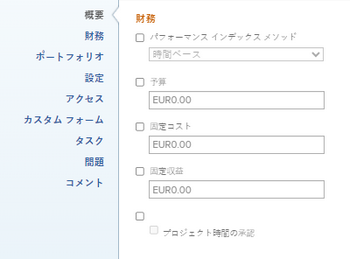
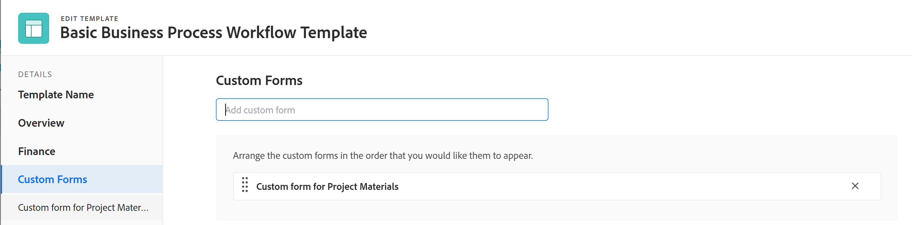

# プロジェクトテンプレートの編集

<!-- Audited: 2/2024 -->

<!--The Resource Pools part also duplicates in the "Working with Resource Pools" article-->

プロジェクトテンプレートを編集して、プロジェクトのプロセスと設定の変更を反映させることができます。テンプレートを更新して変更を保存すると、そのテンプレートを使用してプロジェクトを作成するときに、新しい変更内容が新しいプロジェクトに表示されます。テンプレートに加えた変更は、そのテンプレートを現在使用しているプロジェクトには反映されません。

## アクセス要件

この記事の手順を実行するには、次のアクセス権が必要です。

<table style="table-layout:auto"> 
 <col> 
 <col> 
 <tbody> 
  <tr> 
   <td role="rowheader">Adobe Workfront プラン</td> 
   <td> 
任意 
 </td> 
  </tr> 
  <tr> 
   <td role="rowheader">Adobe Workfrontライセンス</td> 
   <td>
      
新規：標準

      
または

      
現在：プラン

   </td> 
  </tr> 
  <tr> 
   <td role="rowheader">アクセスレベル</td> 
   <td> 
テンプレートへの編集アクセス
 </td> 
  </tr> 
  <tr> 
   <td role="rowheader">オブジェクト権限</td> 
   <td> 
    <ul> 
     <li> 
テンプレートへの参加権限（「テンプレートの詳細」タブでテンプレートを編集するため）
 </li> 
     <li> 
テンプレートの管理権限（テンプレートの編集ボックスでテンプレートを編集するため）
 </li> 
   </td> 
  </tr> 
 </tbody> 
</table>

この表の情報の詳細については、 [Workfrontドキュメントのアクセス要件](/help/quicksilver/administration-and-setup/add-users/access-levels-and-object-permissions/access-level-requirements-in-documentation.md).

## テンプレートを編集 {#edit-a-template}

<!--
Editing a template differs depending on what environment you choose. 

### Edit a template in the Production environment {#edit-a-template-in-the-production-environment} 

1. Go to the template you want to edit.
1. (Conditional) To edit limited information about the template,  click **Template Details** in the left panel, then go to the areas listed in the left panel to edit information for each area. 
1. To edit information in the Details section, click the **Edit** icon , then select from any of the areas below, or click **Edit all** to edit information in all areas:

   * Overview
   * Custom Forms

     Names of customs forms display only if there are custom forms attached to the object.
   
   * Finance

   >[!TIP]
   >
   >For information about all fields that display in the Details area, continue with editing all fields using the Edit Template box below.

1. (Conditional) To edit all information about the template, click the **More** menu  next to the name of the template, then click **Edit**.

   The **Edit Template** box opens. The sections in this box contain the same fields available in  the Template Details section .

1. Consider editing information in any of the following sections:

   * [Overview](#overview) 
   * [Finance](#finance) 
   * [Portfolio](#portfolio) 
   * [Settings](#settings) 
   * [Access](#access) 
   * [Custom Forms](#custom-forms) 
   * [Tasks](#tasks) 
   * [Issues](#issues) 
   * [Comment](#comment)

### Overview {#overview}

1. Begin editing your template as described above.
1. In the **Edit Template** box, click **Overview**.

   

1. Update the following fields:

   <table style="table-layout:auto"> 
    <col> 
    <col> 
    <tbody> 
     <tr> 
      <td role="rowheader"><strong>Name</strong></td> 
      <td>Specify a name for the template.</td> 
     </tr> 
     <tr> 
      <td role="rowheader"><strong>Description</strong></td> 
      <td>Add additional information about the template.</td> 
     </tr> 
     <tr> 
      <td role="rowheader"><strong>Is Active</strong></td> 
      <td>
Select this checkbox if you want the template to be active. Other users can find this template and attach it to projects when creating projects. Deselect this checkbox if you want to deactivate templates that are no longer used. Deactivated templates cannot be attached to projects. This is enabled by default. 

<b>TIP</b>
      
      You can deactivate a template from the template header as described in the [Activate or deactivate a template](#activate-or-deactivate-a-template) section in this article.
</td> 
     </tr> 
     <tr> 
      <td role="rowheader"><strong>URL</strong></td> 
      <td>Specify a web link that relates to information about this template.</td> 
     </tr> 
     <tr> 
      <td role="rowheader"><strong>Schedule From</strong></td> 
      <td>
Specify whether the project using this template is scheduled from the <strong>Start Date</strong>, or from the <strong>Completion Date</strong>. This selection determines the planned dates of the future tasks on the project using this template. 

Select from the following: 
 
       <ul> 
        <li>
<strong>Schedule From Start Date</strong>: The Start Date of the template is actually the Start Day. When you schedule a template from Start Date, Adobe Workfront calculates the Completion Day of the template based on the Duration of all the template tasks. The Start Day of the template becomes the Planned Start Date of the future project.
</li> 
        <li>
<strong>Schedule from Completion Date</strong>: The Completion Date of the template is actually the Completion Day. When you schedule a template from Completion Date, Workfront calculates the Start Day of the template based on the Duration of all the template tasks. The Completion Day of the template becomes the Planned Completion Date of the future project. 
</li> 
       </ul>
For more information about the Start and Completion Days of template tasks, see <a href="../../../manage-work/projects/create-and-manage-templates/overview-of-start-completion-day-on-template.md" class="MCXref xref">Overview of Start and Completion Days in a template</a>. 

The Schedule From setting for templates is similar to that of projects. Your Workfront administrator selects the default Schedule From setting for the projects in your system. For information about setting project defaults, see <a href="../../../administration-and-setup/set-up-workfront/configure-system-defaults/set-project-preferences.md" class="MCXref xref">Configure system-wide project preferences</a>.
</td> 
     </tr> 
     <tr> 
      <td role="rowheader"><strong>Condition Type</strong></td> 
      <td>
Select between the following Condition Types:
 
       <ul> 
        <li><strong>Manual:</strong> The project owner sets the Condition of the project on the project manually. <strong></strong></li> 
        <li><strong>Progress Status:</strong> Workfront automatically sets the Condition of the future project based on the Progress Status of tasks on the Critical Path. For more information about understanding Progress Status, see <a href="../../../manage-work/tasks/task-information/task-progress-status.md" class="MCXref xref">Task Progress Status overview</a>.</li> 
       </ul></td> 
     </tr> 
     <tr> 
      <td role="rowheader"><strong>Priority</strong></td> 
      <td>
This is just a visual flag for you which allows you to prioritize your future projects. Select from the following options:
 
       <ul> 
        <li>
<strong>None</strong>
</li> 
        <li>
<strong>Low</strong>
</li> 
        <li>
<strong>Normal</strong>
</li> 
        <li>
<strong>High</strong>
</li> 
        <li>
<strong>Urgent</strong>
</li> 
       </ul>

Depending on the Project Preferences selected by your Workfront administrator, the names of priorities might be different for you. For more information about editing priorities, see <a href="../../../administration-and-setup/customize-workfront/creating-custom-status-and-priority-labels/create-customize-priorities.md" class="MCXref xref">Create and customize priorities</a>.

</td> 
     </tr> 
     <tr> 
      <td role="rowheader"><strong>Template Owner</strong></td> 
      <td>
The user who is designated as the Template Owner must be a Workfront active user. 

Consider the following about the user designated as the Template Owner: 
 
       <ul> 
        <li>They are automatically given Manage permissions to the template. </li> 
        <li>They are added to the project team and are automatically given Manage permissions to the project created from the template. </li> 
        <li>They become the Project Owner, when the project is created from this template. </li> 
       </ul></td> 
     </tr> 
     <tr> 
      <td role="rowheader"><strong>Template Sponsor</strong></td> 
      <td>
The user specified in this field becomes the Project Sponsor, when the template is added to the project. This user is added to the project team and is automatically given view permissions to the project. The user who is designated as the Template Sponsor must be a Workfront active user. 
</td> 
     </tr> 
     <tr> 
      <td role="rowheader"><strong>Resource Manager</strong></td> 
      <td>
The specified users are automatically given manage permissions to the future projects and can assign resources to the tasks and issues of the projects. You can specify more than one Resource Manager. 
</td> 
     </tr> 
     <tr data-mc-conditions="QuicksilverOrClassic.Quicksilver"> 
      <td role="rowheader"><strong>Group</strong></td> 
      <td>
In the drop-down list, select the group that you want to be associated with projects created from the template. It can be a group of any level. 

You can make sure you are selecting the right group by hovering over it and clicking the information icon  that displays next to it. This displays a tooltip listing information about the group, such as the hierarchy of groups above it and its administrators.
 
<b>NOTES</b>
      
    <ul> 
    <li>
In the Projects area on a group's page, when someone creates a project using a template that doesn't have a group selected, the system associates the currently open group with the project.

This is different from other areas where the system associates a user's Home Group with the project when the user creates the project using a template that doesn't have a group selected.

    </li> 
      <li>
If a user selects a template that has a group selected while creating a project—or while converting a task or issue to a project—the user can choose a different group for the project.
</li> 
      <li>Though this field is available in templates only in the new Adobe Workfront experience, you can see it in lists and reports both there and in Adobe Workfront Classic. </li> 
      </ul> 
</td> 
     </tr> 
     <tr> 
      <td role="rowheader"><strong>Company</strong></td> 
      <td>
Specify the Company that you want to associate with the template. Only active companies display in the list.
</td> 
     </tr> 
    </tbody> 
   </table>

1. (Optional) Continue editing the following sections, depending on the information you want to modify.

   Or

   Click **Save Changes**.

### Finance {#finance}

1. Begin editing your template as described above.
1. In the **Edit Template** box, click **Finance**.

   

1. Update the following fields:

   <table style="table-layout:auto"> 
    <col> 
    <col> 
    <tbody> 
     <tr> 
      <td role="rowheader"><strong>Performance Index Method</strong></td> 
      <td>
Specify whether the Earned Value metrics of the future project are calculated using hours or costs. For more information about the Performance Index Method, see <a href="../../../manage-work/projects/project-finances/set-pim.md" class="MCXref xref">Set the Performance Index Method (PIM)</a>. 
</td> 
     </tr> 
     <tr> 
      <td role="rowheader"><strong>Budget</strong></td> 
      <td>
Specify a Budget for the projects that are created from this template.
</td> 
     </tr> 
     <tr> 
      <td role="rowheader"><strong>Fixed Cost</strong></td> 
      <td>
Specify the Fixed Cost for the projects that are created from this template. This is different than the Labor Cost which comes from the hours on the project and the Expense Cost which comes from the amount of expenses on the project. The Fixed Cost of a project is taken into account when calculating the Net Value of a project and it is part of the Budgeted Cost.
</td> 
     </tr> 
     <tr> 
      <td role="rowheader"><strong>Fixed Revenue</strong></td> 
      <td>
Specify the Fixed Revenue for the projects that are created from this template.
</td> 
     </tr> 
     <tr> 
      <td role="rowheader"><strong>Template Currency</strong></td> 
      <td>
Specify the currency for the future project, if it is different than the default currency of your system. This field is not visible if you have only the default currency in the system. For more information about currency, see <a href="../../../administration-and-setup/manage-workfront/exchange-rates/set-up-exchange-rates.md" class="MCXref xref">Set up exchange rates</a>.
</td> 
     </tr> 
     <tr> 
      <td role="rowheader"><strong>Require time to be approved for this project</strong></td> 
      <td>
Select this option to require the Project Owner of the future project created from this template to approve time logged on the project. If you are using Billing Records and you select this option, only the approved hours on the project appear as available billable hours for the Billing Records. Approving time on the project is independent of approving timesheets. For more information about requiring time to be approved on a project, see <a href="../../../manage-work/projects/manage-projects/require-time-approval-for-projects.md" class="MCXref xref">Require time to be approved for a project</a>.
</td> 
     </tr> 
    </tbody> 
   </table>

1. (Optional) Continue editing the following sections, depending on the information you want to modify.

   Or

   Click **Save Changes**.

### Portfolio {#portfolio}

1. Begin editing your template as described above.
1. In the **Edit Template** box, click **Portfolio**.

   

1. Update the following fields:

   <table style="table-layout:auto">
    <col> 
    <tbody> 
     <tr> 
      <td role="rowheader"><strong>Portfolio</strong></td> 
      <td>
Specify a Portfolio for the projects that are created from this template. You must create a Portfolio first, before it appears in the drop-down list. 

Only active portfolios display in the list. For more information about creating portfolios, see <a href="../../../manage-work/portfolios/create-and-manage-portfolios/create-portfolios.md" class="MCXref xref">Create a portfolio </a>.
</td> 
     </tr> 
     <tr> 
      <td role="rowheader"><strong>Program</strong></td> 
      <td>
If you selected a Portfolio for the template, specify a <strong>Program</strong> for the future project. Some Portfolios might not have Programs. You must create a Program first, before it appears in this drop-down list. Only active programs display in the list.

For more information about creating programs, see <a href="../../../manage-work/portfolios/create-and-manage-programs/create-program.md" class="MCXref xref">Create a program</a>.
</td> 
     </tr> 
     <tr> 
      <td role="rowheader"><strong>Planned Benefit</strong></td> 
      <td>
Specify the Planned Benefit of the projects that are created from this template. The Planned Benefit is used in the Business Case of the project and the Portfolio Optimizer. 

For more information about the Planned Benefit of a project, see <a href="../../../manage-work/projects/project-finances/project-planned-benefit.md" class="MCXref xref">Overview of project Planned Benefit</a>. The Planned Benefit of a project is taken into account when the Net Value of a project is calculated. 

For more information about using the Portfolio Optimizer, see <a href="../../../manage-work/portfolios/portfolio-optimizer/manage-projects-in-portfolio-optimizer.md" class="MCXref xref">Manage projects in the Portfolio Optimizer</a> 
</td> 
     </tr> 
    </tbody> 
   </table>

1. (Optional) Continue editing the following sections, depending on the information you want to modify.

   Or

   Click **Save Changes**.

### Settings {#settings}

1. Begin editing your template as described above.
1. In the **Edit Template** box, click **Settings**.

   

1. Update the following fields: 

   <table style="table-layout:auto"> 
    <col> 
    <col> 
    <tbody> 
     <tr> 
      <td role="rowheader"><strong>Milestone Path</strong> </td> 
      <td> 
Select a Milestone Path for the template. Only active milestone paths display in the list. For more information about Milestone Paths, see <a href="../../../administration-and-setup/customize-workfront/configure-approval-milestone-processes/create-milestone-path.md" class="MCXref xref">Create a milestone path</a>.
 </td> 
     </tr> 
     <tr> 
      <td role="rowheader"><strong>Completion Mode</strong> </td> 
      <td> 
Controls how the future project will be marked as Complete.  Select from the following options:
 
       <ul> 
        <li> 
<strong>Automatic</strong>: The project is marked Complete when all the tasks and issues are completed.
 </li> 
        <li> 
<strong>Manual</strong>: You have to manually select the Complete status for the project, when all the tasks and issues are completed. 
 </li> 
       </ul> </td> 
     </tr> 
     <tr> 
      <td role="rowheader"><strong>Summary Completion Mode</strong> </td> 
      <td> 
Controls how the parent tasks on the future project are marked as Complete.  Select from the following options:
 
       <ul> 
        <li> 
<strong>Automatic</strong>: The parent tasks are marked Complete and they update their percent complete automatically, as the children tasks are completed and the percent complete of the children is updated. 
 </li> 
        <li> 
<strong>Manual</strong>: You have to manually update the percent complete and the status of the parent tasks, independently of what changes are made to the children tasks. 
 </li> 
       </ul> </td> 
     </tr> 
     <tr> 
      <td role="rowheader"><strong>Update Type</strong> </td> 
      <td> 
Controls when the changes you make to the timeline of the future project are saved on the project. 
 
       <b>EXAMPLE </b> 
        
The following changes to the project trigger an update to the timeline of the project:
 
        <ul> 
         <li> 
update the dates of tasks
 </li> 
         <li> 
change predecessor relationships 
 </li> 
         <li> 
change parent-child relationships
 </li> 
         <li> 
add or remove assignments in addition to changing the task constraint or duration type.
 </li> 
        </ul> 
       
 
Select from the following options: 
 
       <ul> 
        <li> 
<strong>Automatic and On Change</strong> (Default setting): The future project timeline is updated each time a change occurs in the project or in another project that the timeline is dependent on (On Change). The project timeline is also updated each night (Automatic). This is the recommended setting for this field because it ensures that the project timeline is always up to date. When you perform an action on a task or project that triggers a timeline recalculation, all available dates are immediately displayed, allowing you to continue working. On projects with more than 100 tasks, dates that require longer recalculations display briefly as a question mark (between 1 and 5 seconds, or up to a minute for large projects). This indicates that the recalculation is not yet finished, and the dates are subject to change. 
 </li> 
       </ul> 
       <ul> 
        <li> 
<strong>Change Only</strong>: The project timeline is updated each time a change occurs in the project or in another project that the timeline is dependent on. You might want to select this option if changes rarely occur in the project or in other projects that the timeline is dependent on. 
 </li> 
       </ul> 
       <ul> 
        <li> 
<strong>Automatic Only</strong>: The project timeline is updated each night; it is not updated immediately after changes are made. You might want to select this option if many changes occur each day in the project or in other projects that the timeline is dependent on. However, be aware that you chose this setting, as the project will not update at the same time that the changes are made. 
 </li> 
       </ul> 
       <ul> 
        <li> 
<strong>Manual Only</strong>: The project timeline is updated only when you select the option to Recalculate Timelines, as described in <a href="../../../manage-work/projects/manage-projects/recalculate-project-timeline.md" class="MCXref xref">Recalculate project timelines</a>. 
 </li> 
       </ul> 
You might want to select this option if you are making many changes to the project at one time, and you want the timeline recalculation to occur after all of the changes have been made (rather than after each individual change).
 </td> 
     </tr> 
     <tr> 
      <td role="rowheader"><strong>Schedule</strong> </td> 
      <td> 
Select a schedule for your template. This will become the schedule of the project that is created from this template. This should be the same schedule assigned to most people that are working on the project. You must create a schedule before you can assign it to a template. For more information about creating schedules, see <a href="../../../administration-and-setup/set-up-workfront/configure-timesheets-schedules/create-schedules.md" class="MCXref xref">Create a schedule</a>.  If you have not created custom schedules in your system, the Default Schedule is selected. 
 </td> 
     </tr> 
     <tr> 
      <td role="rowheader"><strong>User Time Off</strong> </td> 
      <td> 
Determines whether the time off of the Primary Assignee of a task adjusts the task planned dates. When you attach the template to an existing project, and the template has a different setting for this field than the project, the setting on the project remains unchanged. The default option for this setting for a new template is the same as the system-level project preference. 
 
For information about the project preferences at the System level, see <a href="../../../administration-and-setup/set-up-workfront/configure-system-defaults/set-project-preferences.md" class="MCXref xref">Configure system-wide project preferences</a>. 
 
For information about how this setting affects the task dates on a project, see <a href="../../../manage-work/projects/manage-projects/edit-projects.md" class="MCXref xref">Edit projects</a>. Select from the following options: 
 
       <ul> 
        <li> 
<strong>Consider user time off in task durations</strong>: When selecting this option, the planned dates of the tasks on the project created from this template adjust according to the time off of the Primary Assignee of the task, if the time off occurs during the duration of the task. 
 </li> 
        <li> 
<strong>Ignore user time off in task durations</strong>: When selecting this option, the planned dates of the tasks on the project created from this template remain as originally planned, even if the Primary Assignee of the task has time off during the duration of the task. 
 </li> 
       </ul> </td> 
     </tr> 
     <tr> 
      <td role="rowheader"><strong>Resource Leveling Mode</strong> </td> 
      <td> 
Select from the following options: 
 
       <ul> 
        <li> 
<strong>Manual</strong>: you must manually level your resources on the project created from this template (this is the default setting)
 </li> 
        <li> 
<strong>Automatic:</strong> Workfront levels the resources on the future project.  For more information about Resource Leveling, see <a href="../../../manage-work/gantt-chart/use-the-gantt-chart/level-resources-in-gantt.md" class="MCXref xref">Level Resources in the Gantt Chart </a>. 
 </li> 
       </ul> </td> 
     </tr> 
     <tr> 
      <td role="rowheader"><strong>Risk</strong> </td> 
      <td> 
Define the level of risk of the projects created from this template. The risk is just an indicator of how risky a project can be. You can prioritize the execution of your projects based on the level of risk. Consider selecting from the following levels of risk: 
 
       <ul> 
        <li> 
<strong>Very Low</strong> 
 </li> 
        <li> 
<strong>Low</strong> 
 </li> 
        <li> 
<strong>Medium</strong> 
 </li> 
        <li> 
<strong>High</strong> 
 </li> 
        <li> 
<strong>Very High</strong> 
 </li> 
       </ul> </td> 
     </tr> 
     <tr> 
      <td role="rowheader"><strong>Resource Pools</strong> </td> 
      <td> 
Specify the resource pools associated with the template. Resource pools are collections of users that are needed at the same time for the completion of a project. For more information about resource pools, see <a href="../../../resource-mgmt/resource-planning/resource-pools/work-with-resource-pools.md" class="MCXref xref"> Resource pools overview </a>.
 
 
<b>NOTE</b> 
      
      When you edit templates in bulk, only the resource pools that are common to all the templates selected appear in this field. If the templates selected have no shared resource pools, this field will be empty. The resource pools you specify here will overwrite the templates' individual resource pools.
 
 </td> 
     </tr> 
     <tr> 
      <td role="rowheader"><strong>Approval Process</strong> </td> 
      <td> 
Select the approval process you want to associate with the template. Your Workfront administrator or a user with administrative access to Approval Processes must define system-level or group-level project approval processes before you can associate them with a template. For more information about creating approval processes, see <a href="../../../administration-and-setup/customize-workfront/configure-approval-milestone-processes/create-approval-processes.md" class="MCXref xref">Create an approval process for work items</a>.
 
Consider the following when adding approval processes: 
 
      <ul> 
      <li>Only active approval processes display in the list. </li> 
      <li> 
System-wide and group-specific approval processes display in the list. An approval process associated with a group other than that of the template does not display in the list.
 
<b>IMPORTANT</b> 
      
      If the group associated with the template changes, the group-specific approval process becomes a single-use approval process. For more information about how changes to the group of the project or changes in the approval process affect approval settings, see <a href="../../../administration-and-setup/customize-workfront/configure-approval-milestone-processes/how-changes-affect-group-approvals.md">How group and approval process changes affect assigned approval processes</a>. 
 </li> 
      <li> 
If you added a single-use approval process, it displays as "Custom" in this field. For information, see <a href="../../../review-and-approve-work/manage-approvals/associate-approval-with-work.md" class="MCXref xref">Associate a new or existing approval process with work</a>. 
 
      </li> 
      <li> 
When bulk-editing templates, the following scenarios exist:
 
      <ul> 
         <li> 
When you select templates from the same group, both system-level and group-level approval processes display in this field.
 </li> 
         <li> 
When you select templates from different groups, only system-level approval processes display in this field.
 </li> 
         <li> 
When any of the templates has a single-use approval process attached, it is replaced by the system-level you select. 
 </li> 
      </ul> </li> 
      </ul> </td> 
     </tr> 
     <tr> 
      <td role="rowheader"><strong>Filter Hour Types</strong> </td> 
      <td> 
Consider the following:
 
Select <strong>No</strong> to make all project-specific hour types available on the future project. (This is the default selection)
 
Or
 
Select <strong>Yes</strong> to make only a subset of the project-specific hour types available on the future project, then select the hour types you want to make available. (Hold the Shift key to select multiple hour types.)
 
If you select this option, only the hour types you select are made available to select when logging hours on the project (or on tasks and issues within the project). You must select at least one hour type; if you select this option and you do not select any hour types, all hour types are made available on the project.
 
The same hour type selections must be made at the individual user level in order for the user to see these hour type options on the project. 
 
For more information about defining hour types at the user level, see the section <a href="../../../timesheets/create-and-manage-timesheets/log-time.md#understa" class="MCXref xref">Log time</a> in <a href="../../../timesheets/create-and-manage-timesheets/log-time.md" class="MCXref xref">Log time</a>.
 </td> 
     </tr> 
     <tr> 
      <td role="rowheader"><strong>Reminder Notification</strong> </td> 
      <td>Select the Reminder Notification that should be associated with the future project. You must configure Reminder Notifications for projects for this field to appear during editing a template.  For more information about configuring Reminder Notifications, see <a href="../../../administration-and-setup/manage-workfront/emails/set-up-reminder-notifications.md" class="MCXref xref">Set up reminder notifications</a>.</td> 
     </tr> 
    </tbody> 
   </table>

1. (Optional) Continue editing the following sections, depending on the information you want to modify.  
   Or
1. Click **Save Changes**.

### Access {#access}

1. Begin editing your template as described above.
1. In the **Edit Template** box, click **Access**.

   

   The Access you specify for your template will become the Access of users associated with the project when the template is used to create a project.

   Specify the following **Access** information for the template:

   <table style="table-layout:auto"> 
    <col> 
    <col> 
    <tbody> 
     <tr> 
      <td role="rowheader"><strong>When someone is assigned to a task</strong> </td> 
      <td> 
Select from <strong>View</strong>, <strong>Contribute,</strong> or <strong>Manage</strong> access to a task. The user assigned to a task is automatically granted this access to the task. 
 </td> 
     </tr> 
     <tr> 
      <td role="rowheader"><strong>Also grant access to the project</strong> </td> 
      <td> 
 Select from <strong>View</strong>, <strong>Contribute</strong>, or <strong>Manage</strong> access to the project. The user assigned to a task is automatically granted this access to the project, as well. 
 </td> 
     </tr> 
     <tr> 
      <td role="rowheader"><strong>When someone is assigned to an issue</strong> </td> 
      <td> 
Select from <strong>View</strong>, <strong>Contribute,</strong> or <strong>Manage</strong> access to an issue. The user assigned to an issue is automatically granted this access to the issue. 
 </td> 
     </tr> 
     <tr> 
      <td role="rowheader"><strong>Also grant access to the project</strong> </td> 
      <td> 
 Select from <strong>View</strong>, <strong>Contribute</strong>, or <strong>Manage</strong> access to the project. The user assigned to an issue is automatically granted this access to the project, as well. 
 </td> 
     </tr> 
     <tr> 
      <td role="rowheader"><strong>When someone submits a request: Give them access</strong> </td> 
      <td> 
 Select from <strong>View</strong>, <strong>Contribute</strong>, or <strong>Manage</strong> access to the request. When they submit a request to the project, they are granted this access to the request they submitted. For more information, see <a href="../../../workfront-basics/grant-and-request-access-to-objects/share-an-issue.md" class="MCXref xref">Share an issue </a>.
 </td> 
     </tr> 
     <tr> 
      <td role="rowheader"><strong>People from the same company will inherit the same permissions for all requests</strong> </td> 
      <td> 
Select this field if you want people from the same company to have the same access to all the requests on the project, whether they submitted them or not.
 </td> 
     </tr> 
     <tr> 
      <td role="rowheader"><strong>When someone is given access to this project: Give them access to ...</strong> </td> 
      <td> 
Select the access options that you want users to have on the project, if the project is shared with them. Select the specific options for their access, if they are designated as <strong>Viewers</strong>, <strong>Contributors</strong>, or <strong>Managers</strong> when sharing the project with them. 
 </td> 
     </tr> 
    </tbody> 
   </table>

1. (Optional) Continue editing the following sections, depending on the information you want to modify.

   Or

   Click **Save Changes**.

### Custom Forms {#custom-forms}

1. Begin editing your template as described above.
1. In the **Edit Template** box, click **Custom Forms**.

   

1. Select the custom form or forms that you want to associate with the template. You must build the custom forms before they are available to select in this field.

   Only active custom forms display in the list. For more information about building custom forms, see [Create or edit a custom form](../../../administration-and-setup/customize-workfront/create-manage-custom-forms/create-or-edit-a-custom-form.md).

   You can add up to ten custom forms to a template.

   The forms will be added to the project that is created from this template. 

1. (Optional) Continue editing the following section, depending on the information you want to modify.

   Or

   Click **Save Changes**.

### Tasks {#tasks}

You can define the defaults that will be associated with all the new tasks when you add them to a project that is created from the template.

For information about how these settings affect creating new tasks, see [Create tasks overview](../../../manage-work/tasks/create-tasks/create-tasks-overview.md).

1. Begin editing your template as described above.
1. In the **Edit Template** box, click **Tasks**.

   

1. In the **Task Default Approval Process** box, select the Approval Process you want to associate with all new tasks when you add them to a project created from this template. You must create an Approval Process for tasks before you can associate it with tasks. Only active approval processes display in the list. For more information about creating Approval Processes, see [Creating Approval Processes](../../../administration-and-setup/customize-workfront/configure-approval-milestone-processes/create-approval-processes.md).
1. In the **Task Default Custom Forms** box, select the custom form or forms that you want to associate with all new tasks when you add them to a project created from this template. You must build the custom forms before they are available to select in this field. Only active custom forms display in the list. For more information about building custom forms, see [Creating Custom Forms](../../../administration-and-setup/customize-workfront/create-manage-custom-forms/create-or-edit-a-custom-form.md). You can associate up to ten custom forms with a task.
1. (Optional) **Select Use Work Effort to automatically calculate task Planned Hours** if you want to enable managing task effort by using&nbsp;Work Effort instead of Planned Hours in the project created from the template.
1. (Conditional and optional) If you selected Use Work Effort to automatically calculate task Planned Hours, click the drop-down menu to update the percentage for each level of Work Effort. The following percentage values are the defaults:
 
   | Work Effort level |Percentage value|
   |---|---|
   | Small |25% |
   | Medium |50% |
   | Large |75% |

  For information about using Work Effort to manage the effort on tasks on projects, see [Work Effort overview](../../../manage-work/tasks/task-information/work-effort.md).

1. (Optional) Continue editing the following section, depending on the information you want to modify.

   Or

   Click **Save Changes**.

### Issues {#issues}

By editing issue settings, you can prevent users from adding issues inline in the future project created from the template.

1. Begin editing your template as described above.
1. In the **Edit Template** box, click **Issues**.

   

1. (Optional) Deselect the **Allow users to add issues inline** option. It is enabled by default.

   When disabling this option users cannot add issues inline to the project or the tasks in the Issues section, when the project is created from the template.

   >[!TIP]
   >
   >Disable this option if you want to enforce users to complete the New Issue Fields or the custom forms associated with new issues.

   When disabling this option, users with permissions to add issues to the project created from the template can do so by using the New Issue button or a request queue associated with the project.

   For more information about configuring issue settings on projects, see the [Issue Settings](../../../manage-work/projects/manage-projects/edit-projects.md#issue) section in the article [Edit projects](../../../manage-work/projects/manage-projects/edit-projects.md).

   For information about creating issues on projects, see [Create issues](../../../manage-work/issues/manage-issues/create-issues.md). 

1. (Optional) Continue editing the following section, depending on the information you want to modify.

   Or

   Click **Save Changes**.

### Comment {#comment}

1. Begin editing your template as described above.
1. In the **Edit Template** box, click **Comment**.

   

1. Specify a comment that you want to display in the updates stream of the template in the available field.

   This comment is visible for everyone with View access to the template and with access to view Notes.

1. Click **Save Changes**.

   Your changes will be submitted for this template.

   Now, when you use this template to create a project all these settings will transfer to the new project.

   <!--drafted section below for the edit template story: 
   remove this tag and add the Preview blurb at the top of this article in yellow, if it's not already there. Keep the "div class" tags below until 23.1 production: 

### Edit a template in the Preview environment {#edit-a-template-in-the-preview-environment}
-->

1. 編集するテンプレートに移動します。
1. （条件付き）テンプレートに関する限られた情報を編集するには、左パネルの「**テンプレートの詳細**」をクリックし、左パネルに一覧表示されているエリアに移動して、それぞれのエリアの情報を編集します。
1. 「詳細」セクションの情報を編集するには、**編集**&#x200B;アイコン  をクリックし、続いて以下のいずれかのエリアを選択するか、「**すべて編集**」をクリックしてすべてのエリアの情報を編集します。

   * 概要
   * カスタムフォーム

   カスタムフォームの名前は、オブジェクトにカスタムフォームがアタッチされている場合にのみ表示されます。

   * 財務

   >[!TIP]
   >
   >詳細エリアに表示されるすべてのフィールドについては、以下のテンプレートの編集ボックスを使用したすべてのフィールドの編集に進みます。

1. （条件付き）テンプレートに関するすべての情報を編集するには、テンプレート名の横にある&#x200B;**その他**&#x200B;メニューアイコン 、「**編集**」の順にクリックします。

   **テンプレートの編集**&#x200B;ボックスが開きます。このボックスの各セクションには、「テンプレートの詳細」セクションで使用できるフィールドと同じフィールドが含まれています。

1. 以下のセクションのいずれかで、情報の編集を検討します。

   * [テンプレート名](#template-name)
   * [概要](#overview-preview)
   * [財務](#finance-preview)
   * [カスタムフォーム](#custom-forms-preview)
   * [プロジェクト設定](#project-settings)
   * [タスク設定](#task-settings)
   * [問題設定](#issue-settings)
   * [アクセス](#access-preview)

### テンプレート名{#template-name}

1. 前述の説明に従って、テンプレートの編集を開始します。
1. **テンプレートの編集**&#x200B;ボックスで、「**テンプレート名**」をクリックします。
1. （オプション）変更する情報に応じて、以降のセクションの編集を続けます

   または

   「**保存**」をクリックします。

### 概要 {#overview-preview}

1. 前述の説明に従って、テンプレートの編集を開始します。
1. 「**テンプレートを編集**」ボックス内で、**概要**&#x200B;をクリックします。

   

1. 次のフィールドを更新します。

   <table style="table-layout:auto"> 
       <col> 
       <col> 
       <tbody> 
         <tr> 
         <td role="rowheader"><strong>説明</strong></td> 
         <td>テンプレートに関する追加情報を追加します。</td> 
       </tr> 
         <tr> 
         <td role="rowheader"><strong>優先度</strong></td> 
         <td>
これは、将来のプロジェクトに優先順位を付けるための単なる視覚的なフラグです。次のオプションから選択します。
 
         <ul> 
         <li>
<strong>なし</strong>
</li> 
         <li>
<strong>低</strong>
</li> 
         <li>
<strong>標準</strong>
</li> 
         <li>
<strong>高</strong>
</li> 
         <li>
<strong>緊急</strong>
</li> 
         </ul>

Workfront 管理者が選択したプロジェクト設定に応じて、優先順位の名前が異なる場合があります。優先度の編集について詳しくは、<a href="../../../administration-and-setup/customize-workfront/creating-custom-status-and-priority-labels/create-customize-priorities.md" class="MCXref xref">優先度の作成およびカスタマイズ</a>を参照してください。

</td> 
       </tr> 
       <tr> 
       <td role="rowheader"><strong>URL</strong></td> 
         <td>このテンプレートに関する情報に関連する web リンクを指定します。</td> 
       </tr>
       <tr> 
       <td role="rowheader"><strong>状況タイプ</strong></td> 
       <td>
次の状況タイプの中から選択します。
 
         <ul> 
         <li><strong>手動：</strong>プロジェクト所有者は、プロジェクトに対して、プロジェクトの状況を手動で設定します。 <strong></strong></li> 
         <li><strong>進捗ステータス：</strong>Workfront は、クリティカルパス上のタスクの進捗ステータスに基づいて、今後のプロジェクトの状況を自動的に設定します。進捗ステータスについて詳しくは、<a href="../../../manage-work/tasks/task-information/task-progress-status.md" class="MCXref xref">タスクの進捗ステータスの概要</a>を参照してください。</li> 
       </ul>
         </td> 
         </tr> 
       <tr> 
         <td role="rowheader"><strong>スケジュールモード</strong></td> 
         <td>
このテンプレートを使用するプロジェクトを<strong>開始日</strong>からスケジュールするか、<strong>完了日</strong>からスケジュールするかを指定します。この選択により、このテンプレートを使用するプロジェクトの今後のタスクの予定日が決まります。 

次の中から選択します。 
 
       <ul> 
       <li>
<strong>開始日からスケジュール</strong>：テンプレートの開始日は、実際の開始日です。「開始日」からテンプレートをスケジュールする場合、Adobe Workfront は、すべてのテンプレートタスクの期間に基づいて、テンプレートの完了日を計算します。テンプレートの開始日が、将来のプロジェクトの予定開始日になります。
</li> 
       <li>
<strong>完了日からスケジュール</strong>：テンプレートの完了日は、実際の完了日です。「完了日」からテンプレートをスケジュールする場合、Workfront は、すべてのテンプレートタスクの期間に基づいて、テンプレートの開始日を計算します。テンプレートの「完了日」が、将来のプロジェクトの「予定完了日」になります。 
</li> 
       </ul>
テンプレートタスクの開始日と終了日について詳しくは、<a href="../../../manage-work/projects/create-and-manage-templates/overview-of-start-completion-day-on-template.md" class="MCXref xref">テンプレートの開始日と完了日の概要</a>を参照してください。 

テンプレートのスケジュールの基点の設定は、プロジェクトの設定に似ています。Workfront 管理者は、システム内のプロジェクトのデフォルトのスケジュールの基点の設定を選択します。プロジェクトのデフォルトの設定については、<a href="../../../administration-and-setup/set-up-workfront/configure-system-defaults/set-project-preferences.md" class="MCXref xref">システム全体のプロジェクトの環境設定の指定</a>を参照してください。
</td> 
       </tr>

   <tr> 
         <td role="rowheader"><strong>ポートフォリオ</strong></td> 
         <td>
このテンプレートから作成されるプロジェクトのポートフォリオを指定します。ドロップダウンリストに表示される前に、まずポートフォリオを作成する必要があります。 

アクティブなポートフォリオのみが、リストに表示されます。ポートフォリオの作成について詳しくは、<a href="../../../manage-work/portfolios/create-and-manage-portfolios/create-portfolios.md" class="MCXref xref">ポートフォリオの作成</a>を参照してください。
</td> 
       </tr> 
       <tr> 
         <td role="rowheader"><strong>プログラム</strong></td> 
         <td>
テンプレートにポートフォリオを選択した場合、将来のプロジェクトのために<strong>プログラム</strong>を指定します。一部のポートフォリオにはプログラムがない可能性があります。このドロップダウンリストに表示される前に、最初にプログラムを作成する必要があります。リストには、アクティブなプログラムのみが表示されます。

プログラムの作成の詳細については、<a href="../../../manage-work/portfolios/create-and-manage-programs/create-program.md" class="MCXref xref">プログラムの作成</a>を参照してください。
</td> 
       </tr>  
       <tr data-mc-conditions="QuicksilverOrClassic.Quicksilver"> 
         <td role="rowheader"><strong>グループ</strong></td> 
         <td>
ドロップダウンリストで、テンプレートから作成されたプロジェクトに関連付けるグループを選択します。任意のレベルのグループにできます。 

適切なグループを選択していることを確認するには、グループにポインタを合わせて、その横に表示される情報アイコン  をクリックします。グループの上位のグループの階層や管理者など、グループに関する情報が一覧表示されるツールチップが表示されます。
 
<b>メモ</b>

   <ul> 
       <li>
グループのページのプロジェクトエリアで、グループが選択されていないテンプレートを使用してプロジェクトを作成すると、現在開いているグループがプロジェクトに関連付けられます。

これは、グループが選択されていないテンプレートを使用してプロジェクトを作成する際に、システムがユーザーのホームグループとプロジェクトを関連付けるその他のエリアとは異なります。
</li> 
       <li>
プロジェクトの作成時、またはタスクやイシューのプロジェクトへの変換時に、グループが選択されたテンプレートを選択した場合は、別のグループをプロジェクト用に選択できます。
</li> 
       <li>このフィールドは、テンプレートでは新しい Adobe Workfront エクスペリエンスでのみ使用できますが、リストとレポートでは、新しい Adobe Workfront エクスペリエンスおよび Adobe Workfront Classic の両方で表示できます。 </li> 
         </ul> 
</td> 
       </tr> 
       <tr> 
         <td role="rowheader"><strong>会社</strong></td> 
         <td>
テンプレートに関連付ける会社を指定します。アクティブな会社のみがリストに表示されます。
</td> 
       </tr> 
       <tr> 
         <td role="rowheader"><strong>テンプレート所有者</strong></td> 
         <td>
テンプレート所有者として指定されたユーザーは、Workfront のアクティブなユーザーである必要があります。 

テンプレート所有者として指定されたユーザーについて、以下の点に注意してください。 
 
         <ul> 
         <li>テンプレートに対する管理権限が自動的に付与されます。 </li> 
         <li>このユーザーは、プロジェクトチームに追加され、テンプレートから作成されたプロジェクトに対する管理権限が自動的に付与されます。 </li> 
         <li>プロジェクトをこのテンプレートから作成すると、このユーザーはプロジェクト所有者になります。 </li> 
         <li> テンプレート所有者として指定されたユーザーが、自分のアクセスレベルからテンプレートまたはプロジェクトに対する制限付きアクセス権を持っている場合、テンプレートおよびプロジェクトに対する管理権限は制限されます。 例えば、テンプレートまたはプロジェクトの表示アクセス権のみを持つユーザーは、テンプレート所有者に指定されると、テンプレートおよびプロジェクトに対する表示権限を自動的に受け取ります。</li>
         </ul></td> 
       </tr> 
       <tr> 
         <td role="rowheader"><strong>テンプレートスポンサー</strong></td> 
         <td>
テンプレートがプロジェクトに追加されると、このフィールドで指定したユーザーはプロジェクトスポンサーになります。このユーザーはプロジェクトチームに追加され、プロジェクトに対する表示権限が自動的に付与されます。テンプレートスポンサーとして指定されるユーザーは、Workfront のアクティブなユーザーである必要があります。 
</td> 
       </tr> 
       <tr> 
         <td role="rowheader"><strong>リソース管理者</strong></td> 
         <td>
指定したユーザーには、自動的に将来のプロジェクトに対する管理権限が付与され、プロジェクトのタスクやイシューにリソースを割り当てることができます。複数のリソースマネージャーを指定できます。 
</td> 
       </tr> 
      </table>

1. （オプション）変更する情報に応じて、以降のセクションを引き続き編集します。

   または

   「**保存**」をクリックします。

### 財務 {#finance-preview}

1. 前述の説明に従って、テンプレートの編集を開始します。
1. 「**テンプレートを編集**」ボックスで、**財務**&#x200B;をクリックします。

   

1. 次のフィールドを更新します。

   <table style="table-layout:auto"> 
       <col> 
       <col> 
       <tbody>
       <tr> 
         <td role="rowheader"><strong> 通貨</strong></td> 
         <td>
システムのデフォルトの通貨と異なる場合は、将来のプロジェクトの通貨を指定します。システムにデフォルトの通貨のみが存在する場合、このフィールドは表示されません。 通貨について詳しくは、<a href="../../../administration-and-setup/manage-workfront/exchange-rates/set-up-exchange-rates.md" class="MCXref xref">為替レートの設定</a>を参照してください。
</td> 
       </tr>
       <tr> 
       <td role="rowheader"><strong>予算</strong></td> 
       <td>
このテンプレートから作成されるプロジェクトの予算を指定します。
</td> 
       </tr>  
       <tr> 
         <td role="rowheader"><strong>パフォーマンスインデックスメソッド</strong></td> 
         <td>
Workfront が将来のプロジェクトの出来高指標を計算する方法を選択します。次の中から選択します。
         <ul>
         <li>時間ベース</li>
         <li>コストベース</li>
         </ul>

   パフォーマンスインデックスメソッドの詳細については、<a href="../../../manage-work/projects/project-finances/set-pim.md" class="MCXref xref">パフォーマンスインデックスメソッド（PIM）の設定</a>を参照してください。 
</td>
   </tr> 
         <tr> 
         <td role="rowheader"><strong>予定利益</strong></td> 
         <td>
このテンプレートから作成されるプロジェクトの予定利益を指定します。予定利益は、プロジェクトのビジネスケースとポートフォリオオプティマイザーで使用されます。 

プロジェクトの予定利益について詳しくは、<a href="../../../manage-work/projects/project-finances/project-planned-benefit.md" class="MCXref xref">プロジェクトの予定利益の概要</a>を参照してください。プロジェクトの正味価値が計算される際には、プロジェクトの予定利益が考慮されます。 

ポートフォリオオプティマイザーの使用の詳細については、<a href="../../../manage-work/portfolios/portfolio-optimizer/manage-projects-in-portfolio-optimizer.md" class="MCXref xref">ポートフォリオオプティマイザーでのプロジェクトの管理</a>を参照してください。 
</td> 
       </tr> 
       <tr> 
         <td role="rowheader"><strong>固定コスト</strong></td> 
         <td>
このテンプレートから作成されるプロジェクトの固定コストを指定します。これは、プロジェクトの時間に基づく労力コストと、プロジェクトの費用の額に基づく経費コストとは異なります。プロジェクトの固定コストは、プロジェクトの正味値を計算する際に考慮され、予算計上コストに含まれます。
</td> 
       </tr> 
       <tr> 
       <td role="rowheader"><strong>固定収益</strong></td> 
       <td>
このテンプレートから作成されるプロジェクトの固定収益を指定します。
</td> 
       </tr> 
       <tr> 
       <td role="rowheader"><strong>プロジェクト時間の承認</strong></td> 
       <td>
このオプションを選択すると、このテンプレートで作成される今後のプロジェクトの所有者が、プロジェクトにログオンした時間を承認する必要があります。請求記録を使用している場合、このオプションを選択すると、プロジェクトで承認された時間のみが請求記録の請求可能時間として表示されます。プロジェクトの承認時間は、タイムシートの承認とは無関係です。プロジェクトで時間を承認する必要がある場合については詳しくは、<a href="../../../manage-work/projects/manage-projects/require-time-approval-for-projects.md" class="MCXref xref">プロジェクトの承認に要する時間</a>を参照してください。
</td> 
       </tr> 
       </tbody> 
      </table>

1. （オプション）変更する情報に応じて、以降のセクションを引き続き編集します。

   または

   「**保存**」をクリックします。

### カスタムフォーム {#custom-forms-preview}

1. 前述の説明に従って、テンプレートの編集を開始します。
1. **テンプレートを編集**&#x200B;ボックスで、「**カスタムフォーム**」をクリックします。

   

   テンプレートに既に添付されているカスタムフォームの名前が左のパネルに表示されます。

1. 「**カスタムフォームを追加**」フィールドの中をクリックして、テンプレートに関連付けるカスタムフォーム（複数可）を選択します。このフィールドでカスタムフォームを選択できるようにするには、まずカスタムフォームを作成する必要があります。

   アクティブなカスタムフォームのみがリストに表示されます。カスタムフォームの作成について詳しくは、[カスタムフォームの作成または編集](../../../administration-and-setup/customize-workfront/create-manage-custom-forms/create-or-edit-a-custom-form.md)を参照してください。

   1 つのテンプレートに最大 10 個のカスタムフォームを追加できます。

   フォームは、このテンプレートから作成されるプロジェクトに追加されます。

1. （オプション）カスタムフォームの任意のフィールドの情報を更新します。この情報は、テンプレートから作成されるプロジェクトに転送されます。

1. （オプション）カスタムフォーム名の右にある「**x**」アイコン、「**削除**」の順にクリックし、カスタムフォームをテンプレートから削除します。

1. （オプション）変更する情報に応じて、以降のセクションを引き続き編集します。

   または

   「**保存**」をクリックします。

### プロジェクト設定 {#project-settings}

1. 前述の説明に従って、テンプレートの編集を開始します。
1. **テンプレートを編集**&#x200B;ボックスで、「**プロジェクト設定**」をクリックします。

   

1. 次のフィールドを更新します。

   <table style="table-layout:auto"> 
       <col> 
       <col> 
       <tbody> 
       <tr> 
       <td role="rowheader"><strong>マイルストーンパス</strong> </td> 
       <td> 
テンプレートのマイルストーンパスを選択します。アクティブなマイルストーンパスのみがリストに表示されます。 マイルストーンパスについて詳しくは、<a href="../../../administration-and-setup/customize-workfront/configure-approval-milestone-processes/create-milestone-path.md" class="MCXref xref">マイルストーンパスの作成</a>を参照してください。
 </td> 
       </tr> 
       <tr> 
         <td role="rowheader"><strong>完了モード</strong> </td> 
         <td> 
今後のプロジェクトを完了としてマークする方法を制御します。 次のオプションから選択します。
 
         <ul> 
         <li> 
<strong>自動</strong>：すべてのタスクとイシューが完了すると、プロジェクトは「完了」とマークされます。
 </li> 
         <li> 
<strong>手動</strong>：すべてのタスクとイシューが完了したら、プロジェクトの「完了」のステータスを手動で選択する必要があります。 
 </li> 
         </ul> </td> 
       </tr> 
       <tr> 
       <td role="rowheader"><strong>概要完了モード</strong> </td> 
       <td> 
将来のプロジェクトの親タスクを「完了」としてマークする方法を制御します。 次のオプションから選択します。
 
       <ul> 
       <li> 
<strong>自動</strong>：親タスクは「完了」とマークされ、子タスクが完了してその完了率が更新されると、親タスクの完了率が自動的に更新されます。 
 </li> 
       <li> 
<strong>手動</strong>：子タスクに加えられた変更に関係なく、完了率と親タスクのステータスを手動で更新する必要があります。 
 </li> 
       </ul> </td> 
       </tr> 
       <tr> 
         <td role="rowheader"><strong>更新タイプ</strong> </td> 
         <td> 
将来のプロジェクトのタイムラインに対して行った変更がプロジェクトに保存されるタイミングを制御します。 
 
         <b>例</b> 
         
プロジェクトに対する次の変更が、プロジェクトのタイムラインへの更新をトリガーします。
 
         <ul> 
         <li> 
タスクの日付を更新する
 </li> 
         <li> 
先行タスク関係を変更する 
 </li> 
         <li> 
親子関係を変更する
 </li> 
         <li> 
タスクの制約または期間タイプの変更に加えて、割り当てを追加または削除する
 </li> 
         </ul> 
         
 
次のオプションから選択します。 
 
         <ul> 
         <li> 
<strong>自動および変更時</strong>（デフォルト設定）：プロジェクトのタイムラインは、プロジェクト内またはプロジェクトが依存する別のプロジェクト内で変更が発生するたびに更新されます（変更時）。また、プロジェクトのタイムラインは毎晩更新されます（自動）。 プロジェクトタイムラインが常に最新であることが保証されるため、このフィールドではこの設定が推奨されています。 タイムラインの再計算をトリガーするタスクまたはプロジェクトに対してアクションを実行すると、使用可能なすべての日付が直ちに表示され、作業を続行できます。タスクが 100 を超えるプロジェクトでは、再計算に時間がかかる日付が疑問符で短時間（1 から 5 秒、大きなプロジェクトの場合は最大 1 分）のみ表示されます。これは、再計算がまだ完了しておらず、日付が変更される可能性があることを示しています。 
 </li> 
         </ul> 
         <ul> 
         <li> 
<strong>変更時のみ</strong>：プロジェクトのタイムラインは、プロジェクト内またはプロジェクトが依存する別のプロジェクト内で変更が発生するたびに更新されます。プロジェクト内、またはタイムラインが依存する他のプロジェクト内で変更がほとんど発生しない場合は、このオプションを選択できます。 
 </li> 
         </ul> 
         <ul> 
         <li> 
<strong>自動のみ</strong>：プロジェクトタイムラインは毎晩更新されます。変更を加えても即時更新されません。 プロジェクト内またはタイムラインが依存する他のプロジェクト内で毎日多くの変更が発生する場合は、このオプションを選択します。ただし、変更を加えてもプロジェクトがすぐに更新されないので、この設定を選択した場合は注意が必要です。 
 </li> 
         </ul> 
         <ul> 
         <li> 
<strong>手動のみ</strong>：プロジェクトタイムラインは、「タイムラインを再計算」オプションを選択した場合にのみ更新されます（<a href="../../../manage-work/projects/manage-projects/recalculate-project-timeline.md" class="MCXref xref">プロジェクトタイムラインの再計算</a>を参照）。 
 </li> 
         </ul> 
プロジェクトに一度に多くの変更を加え、個々を変更した後ではなくすべての変更が行われた後でタイムラインの再計算を実行する場合は、このオプションを選択できます。
 </td> 
       </tr> 
       <tr> 
         <td role="rowheader"><strong>スケジュール</strong> </td> 
         <td> 
テンプレートのスケジュールを選択します。これは、このテンプレートから作成されるプロジェクトのスケジュールになります。これは、プロジェクトで作業しているほとんどの人に割り当てられているスケジュールと同じである必要があります。スケジュールをテンプレートに割り当てるには、スケジュールを作成する必要があります。 スケジュールの作成について詳しくは、<a href="../../../administration-and-setup/set-up-workfront/configure-timesheets-schedules/create-schedules.md" class="MCXref xref">スケジュールの作成</a>を参照してください。 システムでカスタムスケジュールを作成していない場合は、デフォルトのスケジュールが選択されます。 
 </td> 
       </tr> 
       <tr> 
         <td role="rowheader"><strong>ユーザーの休暇</strong> </td> 
         <td> 
タスクのプライマリ担当者の休暇によって、そのプロジェクトのタスクの予定日を調整するかどうかを指定します。テンプレートを既存のプロジェクトに添付すると、このフィールドの設定がプロジェクトとは異なる場合、プロジェクトの設定は変更されません。新しいテンプレートに対するこの設定のデフォルトのオプションは、システムレベルのプロジェクト環境設定と同じです。 
 
システムレベルでのプロジェクト環境設定について詳しくは、<a href="../../../administration-and-setup/set-up-workfront/configure-system-defaults/set-project-preferences.md" class="MCXref xref">システム全体のプロジェクト環境設定の指定</a>を参照してください。 
 
この設定がプロジェクトのタスク日に与える影響については、<a href="../../../manage-work/projects/manage-projects/edit-projects.md" class="MCXref xref">プロジェクトの編集</a>を参照してください。 次のオプションから選択します。 
 
         <ul> 
         <li> 
<strong>タスク継続期間中のユーザーの休暇を考慮する</strong>：このオプションを選択すると、このテンプレートから作成されたプロジェクトのタスクの予定日は、タスクのプライマリ担当者の休暇がタスクの期間中に発生した場合に、その休暇に応じて調整されます。 
 </li> 
         <li> 
<strong>タスク継続期間中のユーザーの休暇を無視する</strong>：このオプションを選択すると、タスクのプライマリ担当者がタスクの期間中に休暇を取った場合でも、このテンプレートから作成されるプロジェクトのタスクの計画日は、元の計画済みのままになります。 
 </li> 
         </ul> </td> 
       </tr> 
       <tr> 
         <td role="rowheader"><strong>リソースの標準化モード</strong> </td> 
         <td> 
次のオプションから選択します。 
 
         <ul> 
         <li> 
<strong>手動</strong>：このテンプレートから作成されたプロジェクトに対して、リソースを手動で標準化する必要があります（これはデフォルト設定です）。
 </li> 
         <li> 
<strong>自動</strong>：Workfront が将来のプロジェクトに関するリソースを標準化します。 リソースの標準化について詳しくは、<a href="../../../manage-work/gantt-chart/use-the-gantt-chart/level-resources-in-gantt.md" class="MCXref xref">ガントチャートでのリソースの標準化</a>を参照してください。 
 </li> 
         </ul> </td> 
       </tr> 
       <tr> 
         <td role="rowheader"><strong>リスク</strong> </td> 
         <td> 
このテンプレートから作成されるプロジェクトのリスクレベルを定義します。リスクは、プロジェクトの危険性を示す指標に過ぎません。リスクのレベルに基づいて、プロジェクトに優先順位を付けて実行できます。 次のリスクレベルから選択することを検討します。 
 
         <ul> 
         <li> 
<strong>極低</strong> 
 </li> 
         <li> 
<strong>低</strong> 
 </li> 
         <li> 
<strong>中</strong> 
 </li> 
         <li> 
<strong>高</strong> 
 </li> 
         <li> 
<strong>極高</strong> 
 </li> 
         </ul> </td> 
       </tr> 
       <tr> 
         <td role="rowheader"><strong>リソースプール</strong> </td> 
         <td> 
テンプレートに関連付けられたリソースプールを指定します。リソースプールとは、プロジェクトを完了するために同時に必要になるユーザーの集まりです。リソースプールについて詳しくは、<a href="../../../resource-mgmt/resource-planning/resource-pools/work-with-resource-pools.md" class="MCXref xref">リソースプールの概要</a>を参照してください。
 
 
<b>メモ</b>

   テンプレートを一括で編集する場合は、選択したすべてのテンプレートに共通のリソースプールのみがこのフィールドに表示されます。選択したテンプレートに共有リソースプールがない場合、このフィールドは空になります。ここで指定したリソースプールは、テンプレートの個々のリソースプールを上書きします。
 
 </td>
   </tr>
       <tr> 
         <td role="rowheader"><strong>時間タイプのフィルター</strong> </td> 
         <td> 
次の点に注意してください。
 
「<strong>いいえ</strong>」を選択して、プロジェクト固有のすべての時間タイプを今後のプロジェクトで使用できるようにします。（これはデフォルトの選択です）
 
または
 
「<strong>はい</strong>」を選択して、プロジェクト固有の時間タイプのサブセットのみを今後のプロジェクトで使用可能にしたうえで、使用できる時間タイプを選択します。（複数の時間タイプを選択するには、Shift キーを押しながら選択します）。
 
このオプションを選択した場合は、選択した時間タイプのみが、プロジェクト（またはプロジェクト内のタスクやイシュー）の時間を記録する際に選択できるようになります。1 つ以上の時間タイプを選択する必要があります。このオプションを選択し、時間タイプを選択しない場合、すべての時間タイプがプロジェクトで使用可能になります。
 
ユーザーがプロジェクトでこれらの時間タイプのオプションを表示するには、個々のユーザーレベルで同じ時間タイプの選択を行う必要があります。 
 
ユーザーレベルでの時間タイプの定義について詳しくは、<a href="../../../timesheets/create-and-manage-timesheets/log-time.md#understa" class="MCXref xref">時間の記録</a>で<a href="../../../timesheets/create-and-manage-timesheets/log-time.md" class="MCXref xref">時間の記録</a>の節を参照してください。
 </td> 
       </tr> 
       <tr> 
         <td role="rowheader"><strong>承認プロセス</strong> </td> 
         <td> 
テンプレートに関連付ける承認プロセスを選択します。承認プロセスをテンプレートに関連付けるには、まず、Workfront 管理者または承認プロセスへの管理アクセス権を持つユーザーが、システムレベルまたはグループレベルのプロジェクト承認プロセスを定義する必要があります。承認プロセスの作成について詳しくは、<a href="../../../administration-and-setup/customize-workfront/configure-approval-milestone-processes/create-approval-processes.md" class="MCXref xref">作業アイテムの承認プロセスの作成</a>を参照してください。
 
承認プロセスを追加する際は、次の点を考慮してください。 
 
         <ul> 
         <li>アクティブな承認プロセスのみがリストに表示されます。 </li> 
         <li> 
システム全体およびグループ固有の承認プロセスがリストに表示されます。テンプレートのグループ以外のグループに関連付けられている承認プロセスは、リストに表示されません。
 
<b>重要</b>

   テンプレートに関連付けられたグループが変更されると、グループ固有の承認プロセスが 1 回限りの承認プロセスになります。プロジェクトのグループに対する変更や承認プロセスの変更が承認設定に及ぼす影響について詳しくは、<a href="../../../administration-and-setup/customize-workfront/configure-approval-milestone-processes/how-changes-affect-group-approvals.md">グループと承認プロセスの変更が割り当てられた承認プロセスに及ぼす影響</a>を参照してください。 
 </li>
   <li> 
1 回限りの承認プロセスを追加した場合は、このフィールドに「カスタム」として表示されます。詳しくは、<a href="../../../review-and-approve-work/manage-approvals/associate-approval-with-work.md" class="MCXref xref">新規または既存の承認プロセスと作業の関連付け</a>を参照してください。 
 
         </li> 
         <li> 
テンプレートを一括編集する場合は、次のシナリオが存在します。
 
         <ul> 
            <li> 
同じグループからテンプレートを選択すると、システムレベルとグループレベルの両方の承認プロセスがこのフィールドに表示されます。
 </li> 
            <li> 
異なるグループからテンプレートを選択すると、このフィールドにはシステムレベルの承認プロセスのみが表示されます。
 </li> 
            <li> 
いずれかのテンプレートに 1 回限りの承認プロセスが添付されている場合、選択したシステムレベルの承認プロセスに置き換えられます。 
 </li> 
         </ul> </li> 
         </ul> </td> 
       </tr> 
       <tr> 
         <td role="rowheader"><strong>リマインダ通知</strong> </td> 
         <td>今後のプロジェクトに関連付けるリマインダー通知を選択します。テンプレートの編集時にこのフィールドを表示するには、プロジェクトのリマインダー通知を設定する必要があります。 リマインダー通知の設定について詳しくは、<a href="../../../administration-and-setup/manage-workfront/emails/set-up-reminder-notifications.md" class="MCXref xref">リマインダー通知の設定</a>を参照してください。</td> 
       </tr> 
       </tbody> 
      </table>

1. （オプション）変更する情報に応じて、以降のセクションを引き続き編集します。\
   または
1. 「**保存**」をクリックします。

### タスク設定 {#task-settings}

テンプレートから作成されるプロジェクトに新しいタスクを追加する際に、すべての新しいタスクに関連付けるデフォルトを定義できます。

これらの設定が新しいタスクの作成に与える影響については、[タスクの作成の概要](../../../manage-work/tasks/create-tasks/create-tasks-overview.md)を参照してください。

1. 前述の説明に従って、テンプレートの編集を開始します。
1. **テンプレートの編集**&#x200B;ボックスで、「**タスクの設定**」をクリックします。

   

1. 「**タスク既定の承認プロセス**」ボックスで、このテンプレートで作成されたプロジェクトに新しいタスクを追加する場合に、すべての新しいタスクに関連付けるタスク承認プロセスを選択します。承認プロセスをタスクに関連付けるには、まず、タスクの承認プロセスを作成する必要があります。アクティブな承認プロセスのみがリストに表示されます。承認プロセスの作成について詳しくは、[承認プロセスの作成](../../../administration-and-setup/customize-workfront/configure-approval-milestone-processes/create-approval-processes.md)を参照してください。
1. 「**タスクのデフォルトのカスタムフォーム**」ボックスで、このテンプレートから作成されたプロジェクトにカスタムフォーム（複数可）を追加する際に、すべての新しいタスクに関連付けるカスタムフォームを選択します。このフィールドでカスタムフォームを選択できるようにするには、まずカスタムフォームを作成する必要があります。アクティブなカスタムフォームのみがリストに表示されます。カスタムフォームの作成の詳細については、[カスタムフォームの作成](../../../administration-and-setup/customize-workfront/create-manage-custom-forms/create-or-edit-a-custom-form.md)を参照してください。1 つのタスクに最大 10 個のカスタムフォームを関連付けることができます。
1. （オプション）テンプレートから作成されたプロジェクトで予定時間数ではなく作業量を使用してタスクを管理する場合は、「**作業量を使うとタスクの予定時間数を自動的に計算できます**」を選択します。
1. （条件付きおよびオプション）「作業量を使うとタスクの予定時間数を自動的に計算できます」を選択した場合は、ドロップダウンメニューをクリックし、作業量の各レベルで割合を更新します。デフォルト値は以下のとおりです。

   | 作業量レベル | 割合（%） |
   |---|---|
   | 小 | 25% |
   | 中 | 50% |
   | 大 | 75% |

   作業量を使用してプロジェクトのタスクでの取り組みを管理する方法について詳しくは、[作業量の概要](../../../manage-work/tasks/task-information/work-effort.md)を参照してください。

1. （オプション）変更する情報に応じて、以降のセクションを引き続き編集します。

   または

   「**保存**」をクリックします。

### イシュー設定 {#issue-settings}

イシューの設定を編集することで、テンプレートから作成される今後のプロジェクトで、ユーザーがイシューをインラインで追加するのを防ぐことができます。

1. 前述の説明に従って、テンプレートの編集を開始します。
1. 「**テンプレートを編集**」ボックスで、「**問題設定**」をクリックします。

   

1. （オプション）「**ユーザーがインラインで問題を追加できるようにする**」オプションの選択を解除します。これはデフォルトで有効になっています。

   このオプションを無効にすると、プロジェクトがテンプレートから作成されている場合に、ユーザーは「問題」セクションのタスクやプロジェクトにインラインでイシューを追加できません。

   >[!TIP]
   >
   >「新しい問題」フィールドや、新しいイシューに関連付けられたカスタムフォームへの入力をユーザーに強制する場合は、このオプションを無効にします。

   このオプションを無効にすると、テンプレートから作成されたプロジェクトにイシューを追加する権限を持つユーザーは、「新しい問題」ボタンまたはプロジェクトに関連付けられたリクエストキューを使用してイシューを追加することができます。

   プロジェクトでのイシューの設定について詳しくは、[プロジェクトの編集](../../../manage-work/projects/manage-projects/edit-projects.md)の記事にある[イシューの設定](../../../manage-work/projects/manage-projects/edit-projects.md#issue)のセクションを参照してください。

   プロジェクトでのイシューの作成について詳しくは、[イシューの作成](../../../manage-work/issues/manage-issues/create-issues.md)を参照してください。

1. （オプション）変更する情報に応じて、以降のセクションを引き続き編集します。

   または

   「**保存**」をクリックします。

### アクセス {#access-preview}

1. 前述の説明に従って、テンプレートの編集を開始します。
1. 「**テンプレートを編集**」ボックスで「**アクセス**」をクリックします。

   

   テンプレートに指定したアクセス権は、テンプレートを使用してプロジェクトを作成する際に、プロジェクトに関連付けられたユーザーのアクセス権になります。

   テンプレートについて、以下の&#x200B;**アクセス権**&#x200B;の情報を指定します。

   <table style="table-layout:auto"> 
       <col> 
       <col> 
       <tbody> 
       <tr> 
         <td role="rowheader"><strong>ユーザーがタスクに割り当てられた場合</strong> </td> 
         <td> 
タスクへのアクセス権を、「<strong>表示</strong>」、「<strong>参加</strong>」、「<strong>管理</strong>」から選択します。タスクに割り当てられたユーザーには、タスクへのこのアクセス権が自動的に付与されます。 
 </td> 
       </tr> 
       <tr> 
         <td role="rowheader"><strong>プロジェクトへのアクセス権も付与</strong> </td> 
         <td> 
 プロジェクトへのアクセス権を、「<strong>表示</strong>」、「<strong>参加</strong>」、「<strong>管理</strong>」から選択します。タスクに割り当てられたユーザーにも、プロジェクトへのこのアクセス権が自動的に付与されます。 
 </td> 
       </tr> 
       <tr> 
         <td role="rowheader"><strong>ユーザーがタスクに割り当てられた場合</strong> </td> 
         <td> 
イシューへのアクセス権を、「<strong>表示</strong>」、「<strong>参加</strong>」、「<strong>管理</strong>」から選択します。イシューに割り当てられたユーザーには、そのイシューに対するこのアクセス権が自動的に付与されます。 
 </td> 
       </tr> 
       <tr> 
         <td role="rowheader"><strong>プロジェクトへのアクセス権も付与</strong> </td> 
         <td> 
 プロジェクトへのアクセス権に関するアクションを、<strong>表示</strong>、<strong>参加</strong>、<strong>管理</strong>から選択します。イシューに割り当てられたユーザーにも、プロジェクトへのこのアクセス権が自動的に付与されます。 
 </td> 
       </tr> 
       <tr> 
         <td role="rowheader"><strong>誰かがリクエストを送信した場合：アクセス権を付与</strong> </td> 
         <td> 
 リクエストのアクセス権に関するアクションを、<strong>表示</strong>、<strong>参加</strong>、<strong>管理</strong>から選択します。プロジェクトにリクエストを送信すると、送信したリクエストに対してこのアクセス権が付与されます。詳しくは、<a href="../../../workfront-basics/grant-and-request-access-to-objects/share-an-issue.md" class="MCXref xref">イシューの共有</a>を参照してください。
 </td> 
       </tr> 
       <tr> 
         <td role="rowheader"><strong>社内ユーザーは、すべてのリクエストに対して同じ権限を継承</strong> </td> 
         <td> 
同じ会社のユーザーが、リクエストを送信したかどうかに関わらず、プロジェクトのすべてのリクエストに同じアクセス権を持つようにする場合は、このフィールドを選択します。
 </td> 
       </tr> 
       <tr> 
         <td role="rowheader"><strong>誰かがこのプロジェクトへのアクセス権を付与された場合：そのユーザーに以下のアクセス権を付与</strong> </td> 
         <td> 
プロジェクトがユーザーと共有されている場合、ユーザーにそのプロジェクトで持たせたいアクセスオプションを選択します。ユーザーとプロジェクトを共有するときに、ユーザーが<strong>閲覧者</strong>、<strong>コントリビューター</strong>または<strong>管理者</strong>として指定されている場合は、ユーザーのアクセス権のために特定のオプションを選択します。 
 </td> 
       </tr> 
       </tbody> 
      </table>

1. （オプション）変更する情報に応じて、以降のセクションを引き続き編集します。

   または

   「**保存**」をクリックします。

   変更がこのテンプレートに対して送信されます。

   このテンプレートを使用してプロジェクトを作成すると、これらの設定はすべて新しいプロジェクトに転送されます。

## テンプレートを一括編集

一括でテンプレートを編集し、それらのすべての情報を同時に更新できます。

テンプレートを一括編集するには、以下のように行います。

1. Adobe Workfront の右上隅にある&#x200B;**メインメニュー**&#x200B;アイコン  をクリックします。

1. 「**テンプレート**」をクリックします。
1. リスト内の複数のテンプレートを選択します。
1. 「**編集**」をクリックします。

   **テンプレートを編集**&#x200B;ダイアログボックスが開きます。

   

1. 左側のセクションをクリックして、選択したすべてのテンプレートを編集します。

   テンプレートに関する情報の編集について詳しくは、この記事の[テンプレートを編集](#edit-a-template)の節を参照してください。

1. 「**変更を保存**」をクリックします。

   これで、行った変更のすべてが、すべての選択したテンプレートに表示されます。

## テンプレートにタスクを追加

テンプレートを作成し、テンプレート情報を編集した後、そのテンプレートにタスクを追加できます。

テンプレートにタスクを追加する操作は、プロジェクトにタスクを追加する操作と似ています。

プロジェクトへのタスクの追加について詳しくは、[プロジェクトのタスクの作成](../../../manage-work/tasks/create-tasks/create-tasks-in-project.md)を参照してください。

テンプレートにタスクを追加すると、テンプレートの期間と開始日および完了日は、それに応じて変更されます。テンプレートおよびテンプレートタスクの開始日と完了日について詳しくは、[テンプレートの開始日と完了日の概要](../../../manage-work/projects/create-and-manage-templates/overview-of-start-completion-day-on-template.md)を参照してください。

## テンプレートに追加の項目を追加

テンプレートを作成し、テンプレート情報を編集した後、そのテンプレートにさらに項目を追加できます。追加した項目は、テンプレートからプロジェクトを作成する際に、プロジェクトで使用できるようになります。

テンプレートに以下の項目を追加する操作は、プロジェクトに追加する操作と同じです。

* ドキュメント
* リスク

  リスクの作成について詳しくは、[プロジェクトでのリスクの作成および編集](../../../manage-work/projects/define-a-business-case/create-edit-risks-on-projects.md)の記事にある[プロジェクトでリスクを作成および編集](../../../manage-work/projects/define-a-business-case/create-edit-risks-on-projects.md#create)の節を参照してください。

* 承認プロセス

  承認プロセスと作業の関連付けについて詳しくは、[新規または既存の承認プロセスの作業への関連付け](../../../review-and-approve-work/manage-approvals/associate-approval-with-work.md)を参照してください。

* 請求レート

  プロジェクトの請求レートの上書きについて詳しくは、[担当業務の請求レートの上書きとプロジェクトでの収益の計算の概要](../../../manage-work/projects/project-finances/override-role-billing-rates-and-calculate-project-revenue.md)を参照してください。

* 費用

  費用の追加について詳しくは、[プロジェクト費用の管理](../../../manage-work/projects/project-finances/manage-project-expenses.md)を参照してください。

* トピックグループとキューのトピック

  プロジェクトやテンプレートへのトピックグループおよびキュートピックの追加について詳しくは、[リクエストキューの作成](../../../manage-work/requests/create-and-manage-request-queues/create-request-queue.md)を参照してください。

テンプレート内のタスクに以下の項目を追加できます。

* ドキュメント
* 費用

  費用の追加について詳しくは、[プロジェクト費用の管理](../../../manage-work/projects/project-finances/manage-project-expenses.md)を参照してください。

* 承認

  承認の作業への関連付けについて詳しくは、[新規または既存の承認プロセスを作業に関連付け](../../../review-and-approve-work/manage-approvals/associate-approval-with-work.md)を参照してください。

## テンプレートをアクティブ化または非アクティブ化

ユーザーがテンプレートを見つけてそこからプロジェクトを作成できないようにしたい場合は、テンプレートを非アクティブ化することができます。非アクティブ化されたテンプレートをプロジェクトに添付したり、それを使用してプロジェクトを作成したりすることはできません。

非アクティブ化されたテンプレートは、それを使用して作成された既存のプロジェクトには影響しません。

テンプレートを非アクティブ化するには、以下のように行います。

1. アクティブなテンプレートに移動し、テンプレート名の横にある&#x200B;**その他**  メニューをクリックし、続いて「**非アクティブ化**」をクリックします。

   

   このテンプレートはアクティブではなくなり、ユーザーはこのテンプレートからプロジェクトを作成できなくなりました。
1. （オプション）テンプレートをアクティブにするには、テンプレート名の横にある&#x200B;**その他**  メニューをクリックし、続いて「**アクティブ化**」をクリックします。

   これでテンプレートがアクティブになり、プロジェクトにアタッチしたり、プロジェクトの作成に使用したりできます。