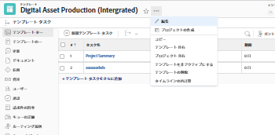

# プロジェクトテンプレートを共有

テンプレートをユーザーと共有したり、テンプレートレベルで以下の共有オプションを使用して、テンプレートから作成されたプロジェクトをユーザーと共有する方法を定義したりできます。

Adobe Workfront でオブジェクトを共有する場合、他のユーザーがそのオブジェクトの表示、オブジェクトへの参加、あるいは編集を行うことを許可します。

Workfront の権限について詳しくは、[オブジェクトに対する共有権限の概要](../../../workfront-basics/grant-and-request-access-to-objects/sharing-permissions-on-objects-overview.md)を参照してください。

テンプレートを共有する際にユーザーに付与できる権限について詳しくは、[テンプレートの共有](../../../workfront-basics/grant-and-request-access-to-objects/share-a-template.md)を参照してください。

## アクセス要件

この記事の手順を実行するには、次のアクセス権が必要です。

<table style="table-layout:auto"> 
 <col> 
 <col> 
 <tbody> 
  <tr> 
   <td role="rowheader">Adobe Workfront プラン*</td> 
   <td> 
任意 
 </td> 
  </tr> 
  <tr> 
   <td role="rowheader">Adobe Workfront ライセンス*</td> 
   <td> 
プラン 
 </td> 
  </tr> 
  <tr> 
   <td role="rowheader">アクセスレベル設定*</td> 
   <td> 
テンプレートへの編集アクセス
 
メモ：まだアクセス権がない場合は、アクセスレベルに追加の制限が設定されていないかどうか Workfront 管理者にお問い合わせください。Workfront 管理者がアクセスレベルを変更する方法について詳しくは、<a href="../../../administration-and-setup/add-users/configure-and-grant-access/create-modify-access-levels.md" class="MCXref xref">カスタムアクセスレベルの作成または変更</a>を参照してください。
 </td> 
  </tr> 
  <tr> 
   <td role="rowheader">オブジェクト権限</td> 
   <td> 
テンプレートに対する管理権限
 
追加のアクセス権のリクエストについて詳しくは、<a href="../../../workfront-basics/grant-and-request-access-to-objects/request-access.md" class="MCXref xref">オブジェクトへのアクセス権のリクエスト</a>を参照してください。
 </td> 
  </tr> 
 </tbody> 
</table>

&#42;保有するプラン、ライセンスタイプ、アクセス権を確認するには、Workfront 管理者に問い合わせてください。

## テンプレートの共有 {#share-a-template}

テンプレート共有を使用して、他のユーザーとテンプレートを共有できます。このアクションは、テンプレートに対する権限を持つユーザーを定義します。

>[!NOTE]
>
>アクティブなユーザーをテンプレート所有者に指定すると、そのユーザーは自動的にテンプレートに対する管理権限を受け取ります。テンプレート所有者に指定する方法については、[プロジェクトテンプレートの編集](../../../manage-work/projects/create-and-manage-templates/edit-templates.md)を参照してください。

テンプレートを共有するには、以下のように行います。

1. **メインメニュー**  から、**テンプレート**&#x200B;をクリックします。

1. 次のいずれかの操作を行います。\
   テンプレートの名前をクリックして開き、**その他**&#x200B;メニュー 、**テンプレートの共有**&#x200B;の順にクリックします。

   または

   リストからテンプレートを選択し、共有アイコン  をクリックし、さらに「**テンプレート**」をクリックします。

   >[!TIP]
   >
   >オブジェクトを共有できるのは、アクティブなユーザー、チーム、役割、または会社のみです。

1. 「**テンプレートアクセス**」ボックスで、テンプレートを共有するユーザー、チーム、役割、グループ、会社を選択します。

   **オプション**&#x200B;アイコンをクリックして、テンプレートをシステム全体で使用できるようにします。

1. 共有するそれぞれのエンティティのドロップダウンメニューから、次のいずれかを選択します。

   * **表示**：この権限を持つユーザーは、テンプレートを表示し、テンプレートを使用してプロジェクトを作成したり、既存のプロジェクトに添付したりすることができます。

     >[!TIP]
     >
     >プロジェクトを作成できるようにするには、Workfront 管理者がプロジェクトへの編集アクセス権を付与する必要があります。

   * **管理**：この権限を持つユーザーは、テンプレートを編集または削除できます。

     ここで利用できる詳細設定  について詳しくは、[テンプレートの共有](../../../workfront-basics/grant-and-request-access-to-objects/share-a-template.md)の記事にある[テンプレート共有の詳細設定](../../../workfront-basics/grant-and-request-access-to-objects/share-a-template.md#template-permissions)の節を参照してください。

1. 「**保存**」をクリックします。

## テンプレートからプロジェクトを共有 {#share-a-project-from-a-template}

テンプレート「プロジェクトの共有」を使用すると、テンプレートから作成されたプロジェクトに対する権限を持つユーザーを、テンプレートレベルで定義できます。

テンプレートから作成された今後のプロジェクトをユーザーと共有するには、以下のように行います。

1. 次のいずれかの操作を行います。\
   テンプレートの名前をクリックして開き、**その他**&#x200B;メニュー 、**テンプレートの共有**&#x200B;の順にクリックします。

   

   または

   リストからテンプレートを選択し、「**共有**」をクリックし、さらに「**プロジェクト**」をクリックします。

1. 「**プロジェクトアクセス**」ボックスで、テンプレートを共有するユーザー、チーム、役割、グループ、会社を選択します。

   >[!TIP]
   >
   >オブジェクトを共有できるのは、アクティブなユーザー、チーム、役割、または会社のみです。

1. 各エンティティのドロップダウンメニューから、次のいずれかを選択します。

   * **アクセスなし**：テンプレートにアクセスできないユーザーを指定できます。\
     このオプションは、テンプレートからプロジェクトを一括共有する場合にのみ使用できます。 
   * **表示**：この権限を持つユーザーは、テンプレートから作成されたプロジェクトを表示できます。
   * **参加**：この権限を持つユーザーは、テンプレートから作成されたプロジェクトに参加できます。
   * **管理**：この権限を持つユーザーは、このテンプレートから作成されたプロジェクトを管理または削除できます。

1. （オプション）**オプション**&#x200B;アイコンをクリックして、プロジェクトをシステム全体で使用できるようにします。
1. 「**保存**」をクリックします。

<!--

<h3>Overview of project sharing from other sources</h3>

You may already have been assigned access to projects from other areas of Workfront.  You may have been assigned access to projects from the following areas: 

<ul>
<li>When a project is created For more information about sharing projects when the project is created, see the "Access" section in <a href="../../../manage-work/projects/manage-projects/edit-projects.md" class="MCXref xref">Edit projects</a>.</li>
<li>When your Workfront administrator sets user access levels For more information about setting access levels, see <a href="../../../administration-and-setup/add-users/configure-and-grant-access/create-modify-access-levels.md" class="MCXref xref">Create or modify custom access levels</a>.</li>
<li>When using the project access template</li>
</ul>

When using the Template Project Sharing feature, if a user's access to a project is View, but you set the access permissions for Template Project Sharing to Manage, the user will have Manage permission for every project created using this specific template. The user will only have View permission for the other projects they are on.

-->

## テンプレートとテンプレートからのプロジェクトを一括で共有

複数のテンプレートと、複数のテンプレートからのプロジェクトを同時に共有できます。

>[!NOTE]
>
>複数のテンプレートを選択した場合、個々のテンプレートに対して権限を既に持っているユーザーを表示することができません。

1. テンプレートのリストに移動します。
1. 複数のテンプレートを選択し、「」をクリックします。

   

   >[!TIP]
   >
   >オブジェクトを共有できるのは、アクティブなユーザー、チーム、役割、または会社のみです。

1. 「**テンプレート**」をクリックして、選択したテンプレートを共有します。

   または

   「**プロジェクト**」をクリックして、選択したテンプレートから作成されるプロジェクトを共有します。

1. この記事の以下の節で説明するように、テンプレートまたはプロジェクトを共有していきます。

   * [テンプレートを共有](#share-a-template)
   * [テンプレートからプロジェクトを共有](#share-a-project-from-a-template)
