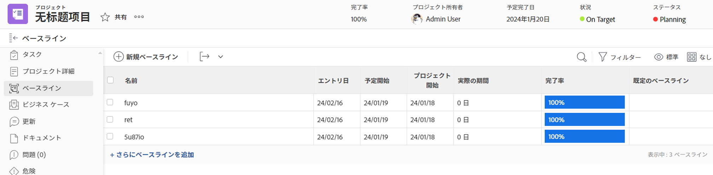

# プロジェクトの基準を作成

<!-- Audited: 12/2023 -->

ベースラインとは、プロジェクトの最初の計画に含まれる主要な情報を表すプロジェクトスナップショット、またはプロジェクトの存続期間中の任意の時点での情報を表します。

ベースラインを使用して、現在のプランの情報を元のプランやその他の時点の情報と比較し、問題のタスク、範囲クリープ、その他の経時的なトレンドを特定できます。

## アクセス要件

<!--
drafted for P&P:

<table style="table-layout:auto"> 
 <col> 
 <col> 
 <tbody> 
  <tr> 
   <td role="rowheader">Adobe Workfront plan*</td> 
   <td> 
Any
 </td> 
  </tr> 
  <tr> 
   <td role="rowheader">Adobe Workfront license*</td> 
   <td> 
Current license: Standard 
 
   Or
   
Legacy license: Plan 
 
   </td> 
  </tr> 
  <tr> 
   <td role="rowheader">Access level*</td> 
   <td> 
Edit access to Projects
 
<b>NOTE</b>
   
   If you still don't have access, ask your Workfront administrator if they set additional restrictions in your access level. For information about access to projects, see <a href="../../../administration-and-setup/add-users/configure-and-grant-access/grant-access-projects.md" class="MCXref xref">Grant access to projects</a>. For information on how a Workfront administrator can change your access level, see <a href="../../../administration-and-setup/add-users/configure-and-grant-access/create-modify-access-levels.md" class="MCXref xref">Create or modify custom access levels</a>. 
 </td> 
  </tr> 
  <tr> 
   <td role="rowheader">Object permissions</td> 
   <td> 
View permissions to the project or higher to view baselines
 
Manage permissions to the project to create baselines
 
 For information about project permissions, see <a href="../../../workfront-basics/grant-and-request-access-to-objects/share-a-project.md" class="MCXref xref">Share a project in Adobe Workfront</a>.
 
For information on requesting additional access, see <a href="../../../workfront-basics/grant-and-request-access-to-objects/request-access.md" class="MCXref xref">Request access to objects </a>.
 </td> 
  </tr> 
 </tbody> 
</table>
-->

この記事の手順を実行するには、次のアクセス権が必要です。

<table style="table-layout:auto"> 
 <col> 
 <col> 
 <tbody> 
  <tr> 
   <td role="rowheader">Adobe Workfront plan*</td> 
   <td> 
任意
 </td> 
  </tr> 
  <tr> 
   <td role="rowheader">Adobe Workfront license*</td> 
    <td>
新規：標準

        
または

        
現在：プラン 
 </td> 
  </tr> 
  <tr> 
   <td role="rowheader">アクセスレベル*</td> 
   <td> 
プロジェクトへのアクセスを編集
 
<b>注意</b>
   まだアクセス権がない場合は、Workfront管理者に、アクセスレベルに追加の制限を設定しているかどうかを問い合わせてください。 プロジェクトへのアクセスについて詳しくは、 <a href="../../../administration-and-setup/add-users/configure-and-grant-access/grant-access-projects.md" class="MCXref xref">プロジェクトへのアクセス権の付与</a>. Workfront管理者がアクセスレベルを変更する方法について詳しくは、 <a href="../../../administration-and-setup/add-users/configure-and-grant-access/create-modify-access-levels.md" class="MCXref xref">カスタムアクセスレベルの作成または変更</a>. 
 </td> 
  </tr> 
  <tr> 
   <td role="rowheader">オブジェクトの権限</td> 
   <td> 
プロジェクトに対する権限を表示するか、それ以上の権限を表示してベースラインを表示します
 
プロジェクトに対する権限を管理してベースラインを作成する
 
 プロジェクト権限について詳しくは、 <a href="../../../workfront-basics/grant-and-request-access-to-objects/share-a-project.md" class="MCXref xref">Adobe Workfrontでプロジェクトを共有する</a>.
 
追加のアクセス権のリクエストについて詳しくは、 <a href="../../../workfront-basics/grant-and-request-access-to-objects/request-access.md" class="MCXref xref">オブジェクトへのアクセスのリクエスト</a>.
 </td> 
  </tr> 
 </tbody> 
</table>

&#42;保有するプラン、ライセンスの種類、アクセス権を確認するには、Workfront管理者に問い合わせてください。

## ベースラインを使用する際の考慮事項

* プロジェクトの有効期間中に、プロジェクトの進行状況のスナップショットを複数回取り込み、複数のベースラインを作成できます。
* プロジェクトのベースラインに含まれる情報は、ベースラインを作成するか、ベースラインレポートを作成することで表示できます。
* 基準計画を作成すると、その基準計画の基準計画タスクに関するタスク情報も取り込まれます。
* [ 基準タスク ] レポートを作成すると、基準タスクの情報を表示できます。

>[!IMPORTANT]
>
>ベースラインは、プロジェクトの名前、日付、および財務情報のスナップショットを作成します。 ベースラインには、プロジェクト上のカスタムフィールドの値は含まれません。 基準計画に含まれる財務情報の詳細は、 [プロジェクトの基準に含まれるプロジェクトの財務](../../../manage-work/projects/project-finances/project-finances-included-in-project-baselines.md).

## ベースラインを作成

ベースラインは、次の方法で作成できます。

* **自動**：プロジェクトが「現在」になったときに、Workfrontが自動的にベースラインを作成するように、Workfront管理者またはグループ管理者がプロジェクト設定を指定します。 この設定を有効にすると、プロジェクトのステータスが [ 現在 ] になると、ベースラインが作成されます。 この設定が有効でない場合は、ベースラインを手動で作成する必要があります。

  プロジェクトの基本設定の構成と、自動ベースライン作成の設定の詳細については、 [システム全体のプロジェクト環境設定の指定](../../../administration-and-setup/set-up-workfront/configure-system-defaults/set-project-preferences.md).

  >[!CAUTION]
  >
  >この設定を有効にすると、プロジェクトのステータスが [ 現在 ] に変わるたびに、プロジェクトのベースラインが自動的に作成されます。 最初に作成されたベースラインがデフォルトのベースラインになります。 プロジェクトの期間中は、他のすべてのベースラインを手動で作成する必要があります。

* **手動**：プロジェクトの進行に応じて、必要に応じて、プロジェクトの新しいベースラインを作成できます。 その後、ベースラインを比較して、プロジェクトの経時的な進行状況を確認できます。

ベースラインを作成するには：

1. プロジェクトに移動します。
1. 左側のパネルで、 **ベースライン**.

   または

   クリック **表示を増やす**&#x200B;を選択し、次に **ベースライン**.

   

1. クリック **新規ベースライン。**
1. ベースラインの名前を指定します。
1. （オプション）これが最初のベースラインの場合、デフォルトとして選択できます。
1. 「**保存**」をクリックします。

   デフォルトでは、作成したベースラインに関する次の情報が表示されます。

   * ベースライン名
   * 基準入力日
   * 計画開始日基準計画が作成されたプロジェクトの計画開始日
   * プロジェクトの予測開始日（ベースラインが作成された日）
   * 基準計画が作成されたプロジェクトの実際の期間
   * %ベースラインが作成されたプロジェクトの完了率
   * 基線がプロジェクトの既定の基線かどうかを示す既定の基線インジケーター

     >[!TIP]
     >
     >同じビューまたはレポートで、2 つのベースラインからの情報を同時に表示することはできません。 同じレポート内で表示できるのは、特定のベースラインとデフォルトのベースラインの情報のみです。 プロジェクトの期間中、デフォルトのベースラインと見なすベースラインをいつでも変更できます。

1. （オプション） **表示** ボタンをクリックし、新しいビューを作成するか、現在のビューを編集して、ビューにフィールドを追加し、ベースライン間で追加情報を比較します。 詳しくは、 [Adobe Workfrontでビューを作成または編集](/help/quicksilver/reports-and-dashboards/reports/reporting-elements/create-edit-views.md).

## 基準計画または基準計画タスクレポートの作成

基準計画情報を表示するには、基準計画レポートまたは基準計画タスクレポートを作成することもできます。 これにより、ベースラインタスクまたはベースラインタスクに関する任意の数のフィールドを表示して、それらを 1 つのビューで比較できます。

>[!TIP]
>
>基準計画または基準計画タスクレポートを作成する前に、基準計画を作成する必要があります。

レポートの作成について詳しくは、 [カスタムレポートの作成](../../../reports-and-dashboards/reports/creating-and-managing-reports/create-custom-report.md).

読みやすくするために、プロジェクト名のグループをベースラインレポートまたはベースラインタスクレポートに追加することをお勧めします。

グループ化の作成について詳しくは、 [Adobe Workfrontでのグループ化の作成](../../../reports-and-dashboards/reports/reporting-elements/create-groupings.md).
