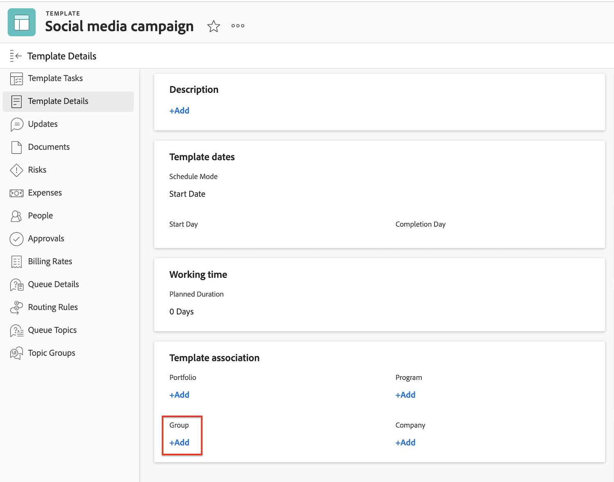
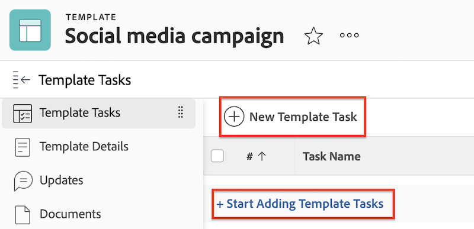
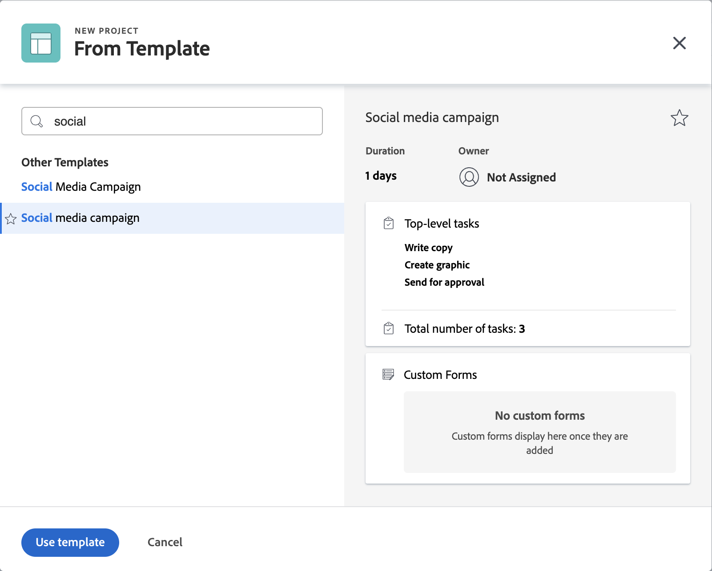
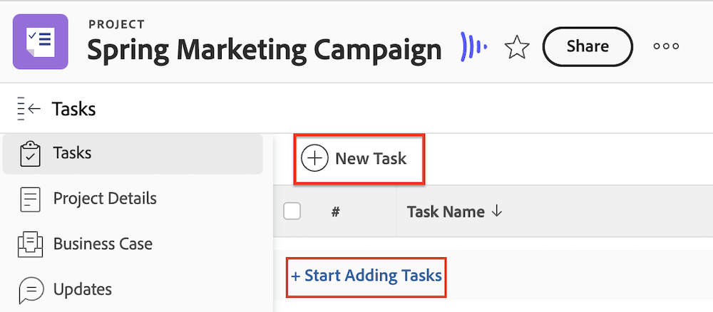

# Frame.ioに接続したプロジェクトの作成

WorkfrontとFrame.ioの連携により、Workfrontでプロジェクトを作成し、Frame.ioに反映することで、シームレスなレビューと承認を実現します。

Workfront プロジェクトをFrame.ioに接続すると、次のことが可能になります

* **Frame.io ユーザーをタスクに割り当て**:Frame.ioが有効なユーザーは、Workfront タスクに割り当てられたときにメールで通知され、完了する作業があることを知らせます。
* **Frame.io ユーザーとプロジェクトを共有**: プロジェクトがFrame.ioが有効なユーザーと共有されている場合、ユーザーはWorkfrontとFrame.ioの両方でプロジェクトにアクセスできます。
* **Frame.ioでクリエイティブ素材を共有**：プロジェクトコーディネーターは、一方向のシンクプロジェクトフォルダーを使用して、WorkfrontからFrame.ioのクリエイティブユーザーに直接指示や素材を送信できます。 [!BADGE 近日リリース予定]{type=Informative}
* **タスクの進捗状況を追跡**：クリエイターはFrame.ioから直接、完成したアセットを送信したり、タスクを完了としてマークしたりできます。

## アクセス要件

+++ 展開すると、この記事の機能のアクセス要件が表示されます。 

>[!IMPORTANT]
>
>この機能は、[!DNL Adobe Admin Console]にオンボーディングされている組織でのみ使用できます。

以下が必要です。

<table style="table-layout:auto"> 
 <col> 
 <col> 
 <tbody> 
  <tr> 
   <td role="rowheader">Adobe Workfront プラン</td> 
   <td> 
任意
 </td> 
  </tr> 
  <tr> 
   <td role="rowheader">Adobe Workfront プラン</td> 
   <td> 
標準
 </td> 
  </tr> 
  <tr> 
   <td role="rowheader">アクセスレベル設定</td> 
   <td> 
プロジェクトへのアクセスを編集
 </td> 
  </tr> 
  <tr> 
   <td role="rowheader">オブジェクト権限</td> 
   <td> 
プロジェクトを作成すると、そのプロジェクトに対する管理権限が自動的に付与されます。
 </td> 
  </tr> 
 </tbody> 
</table>

この表の情報について詳しくは、[Workfront ドキュメントのアクセス要件](/help/quicksilver/administration-and-setup/add-users/access-levels-and-object-permissions/access-level-requirements-in-documentation.md)を参照してください。

+++

## 前提条件

* Workfrontの設定領域でデフォルトのFrame.io アカウントを設定する
* Workfront ユーザープロファイルでFrame.io ユーザーを有効にする

## 新しいプロジェクトテンプレートの作成

新しいテンプレートを作成する際に、すべてのタスクと今後のプロジェクト設定に関する情報を入力できます。 この情報は、テンプレートから作成するプロジェクトに転送されます。

Frame.ioのプロジェクトはチームごとに整理され、Workfront グループと連携されます。 プロジェクトテンプレートを使用して、事前にプロジェクトグループを設定できるため、接続されたプロジェクトを作成することをお勧めします。

プロジェクトをゼロから作成する場合、Workfrontはデフォルトのプロジェクトグループを自動的に追加し、Frame.ioのデフォルトチームの下にミラーFrame.io プロジェクトが作成されます。

>[!NOTE]
>
>プロジェクトの作成後にグループを更新しても、Frame.io チームは変更されません。

### テンプレートを作成し、プロジェクトグループを指定します

{{step1-to-templates}}

1. 「**新規テンプレート**」をクリックします。
1. テンプレートの名前を入力し、**Enter**&#x200B;を押して名前を保存します。
1. 左側のパネルで、**テンプレートの詳細**&#x200B;をクリックします。
1. 「**テンプレートの関連付け**」セクションで、必ずグループを指定してください。 グループを追加しない場合、デフォルトのプロジェクトグループが追加され、Frame.ioのプロジェクトがFrame.ioの対応するデフォルトチームの下に作成されます。

次の節に進みます。

### タスクを追加し、Frame.io対応ユーザーを割り当てる

1. 左側のパネルで、**テンプレート タスク**&#x200B;をクリックします。
1. 「**テンプレートタスクの追加を開始**」をクリックして、テンプレートにタスクをすばやく追加します。 後で追加の設定を行うことができます。

   または

   **新しいテンプレート タスク**&#x200B;をクリックして、一度に1つのタスクを追加し、追加の設定を構成します。
   
1. タスク名を追加します。
1. **割り当て**&#x200B;領域で、ユーザーまたはチームを割り当てます。 Frame.io対応ユーザーを個別またはチーム内に割り当てると、共同作業者にFrame.io プロジェクトへのアクセス権が付与され、Frame.io プロジェクトのタスクに関する通知がメールで送信されます。 そのメールから、Frame.io プロジェクトに参加して作業を開始することができます。
1. 必要に応じて、手順 1 と 2 を繰り返します。

次の節に進みます。

### テンプレートの詳細を追加する

Workfrontは、堅牢なプロジェクト管理能力を備えています。 [&#x200B; プロジェクトテンプレートの編集](/help/quicksilver/manage-work/projects/create-and-manage-templates/edit-templates.md)記事を使用して、テンプレートの次の領域を設定することをお勧めします。

* 概要
* 財務
* カスタムフォーム
* プロジェクト設定
* タスク設定
* イシュー設定
* アクセス

### テンプレートからのプロジェクトの作成

テンプレートを作成したら、それを使用してプロジェクトを作成できます。

{{step1-to-projects}}

1. 「**テンプレートから新規プロジェクト**」をクリックします。
1. 検索ボックスを使用して、必要なテンプレートの名前を入力します。
1. テンプレート名を選択し、**テンプレートを使用**&#x200B;をクリックします。
   
1. 必要に応じてプロジェクト設定を調整し、**プロジェクトを作成**&#x200B;をクリックします。
1. 左側のパネルで、**ドキュメント**&#x200B;をクリックします。
1. 一方向の同期フォルダーを使用すると、Frame.ioでクリエイティブ素材を自動的に共有できます。 [!BADGE 近日リリース予定]{type=Informative}

   >[!NOTE]
   >
   >この機能は現在開発中です。 Frame.ioでユーザーと情報を共有するには、「ドキュメント」タブにファイルをアップロードします。 プロジェクトのステータスが「現在」に設定されている場合、これらのファイルは自動的にFrame.ioにプッシュされます。

1. プロジェクトヘッダーで、プロジェクトを&#x200B;**Planning**&#x200B;から&#x200B;**Current**&#x200B;に変更します。

プロジェクトが作成され、クリエイターが完成したアセットをアップロードしたら、Workfrontでレビューと承認のワークフローをアセットに割り当てることができます。 詳しくは、[&#x200B; ドキュメント承認ワークフローの作成](/help/quicksilver/review-and-approve-work/document-reviews-and-approvals/manage-document-approvals/create-a-document-approval.md)を参照してください。<!-- name may need to change -->

## 新しいプロジェクトをゼロから作成

必要に応じて、新しいプロジェクトをゼロから作成できます。

>[!IMPORTANT]
>
>* Frame.ioのプロジェクトはチームごとに整理され、Workfront グループと連携されます。 プロジェクトテンプレートを使用して、事前にプロジェクトグループを設定できるため、接続されたプロジェクトを作成することをお勧めします。
>
>
>* プロジェクトをゼロから作成する場合、Workfrontはデフォルトのプロジェクトグループを自動的に追加し、Frame.ioのデフォルトチームの下にミラーFrame.io プロジェクトが作成されます。
>
>プロジェクトの作成後にグループを更新しても、Frame.io チームは変更されません。

### プロジェクトの作成

{{step1-to-projects}}

1. **新規プロジェクト**&#x200B;をクリックします。
1. プロジェクトの名前を入力し、**Enter**&#x200B;を押して名前を保存します。

次の節に進みます。

### タスクを追加し、Frame.io対応ユーザーを割り当てる

1. 左側のパネルで、**タスク**&#x200B;をクリックします。
1. 「**タスクの追加を開始**」をクリックして、タスクをプロジェクトにすばやく追加します。 後で追加の設定を行うことができます。

   または

   「**新しいタスク**」をクリックして、一度に1つのタスクを追加し、追加の設定を構成します。
   
1. タスク名を追加します。
1. **割り当て**&#x200B;領域で、ユーザーまたはチームを割り当てます。 Frame.io対応ユーザーを個別またはチーム内に割り当てると、共同作業者にFrame.io プロジェクトへのアクセス権が付与され、Frame.io プロジェクトのタスクに関する通知がメールで送信されます。 そのメールから、Frame.io プロジェクトに参加して作業を開始することができます。
1. 必要に応じて、手順 1 と 2 を繰り返します。

次の節に進みます。

### クリエイティブ素材をアップロード

1. 左側のパネルで、**ドキュメント**&#x200B;をクリックします。
1. 一方向の同期フォルダーを使用すると、Frame.ioでクリエイティブ素材を自動的に共有できます。 [!BADGE 近日リリース予定]{type=Informative}

   >[!NOTE]
   >
   >この機能は現在開発中です。 Frame.ioでユーザーと情報を共有するには、「ドキュメント」タブにファイルをアップロードします。 プロジェクトのステータスが「現在」に設定されている場合、これらのファイルは自動的にFrame.ioにプッシュされます

次の節に進みます。

### プロジェクトの詳細の追加設定

Workfrontは、堅牢なプロジェクト管理能力を備えています。 [&#x200B; プロジェクトの編集](/help/quicksilver/manage-work/projects/manage-projects/edit-projects.md)記事を使用して、プロジェクトの次の領域を設定することをお勧めします。

* 概要
* 財務
* カスタムフォーム
* プロジェクト設定
* タスク設定
* イシュー設定
* アクセス

### プロジェクトを現在に設定

1. プロジェクトヘッダーで、プロジェクトを「計画」から「現在」に変更します。
プロジェクトが作成され、クリエイターが完成したアセットをアップロードしたら、Workfrontでレビューと承認のワークフローをアセットに割り当てることができます。

プロジェクトが作成され、クリエイターが完成したアセットをアップロードしたら、Workfrontでレビューと承認のワークフローをアセットに割り当てることができます。
