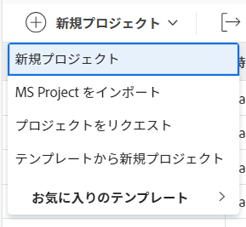
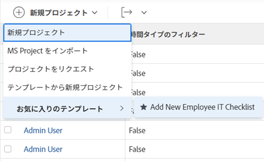
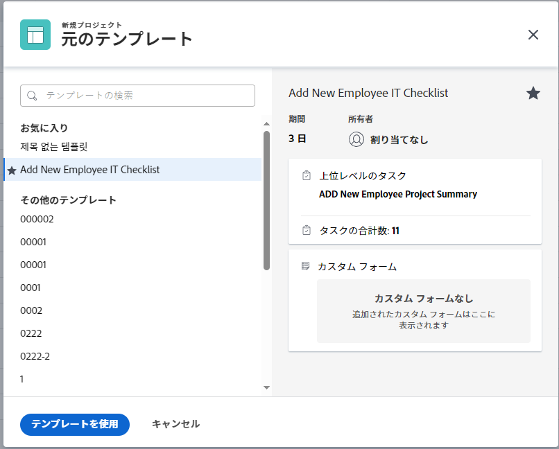
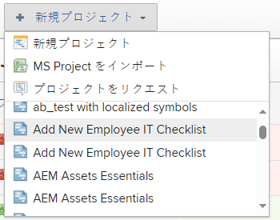
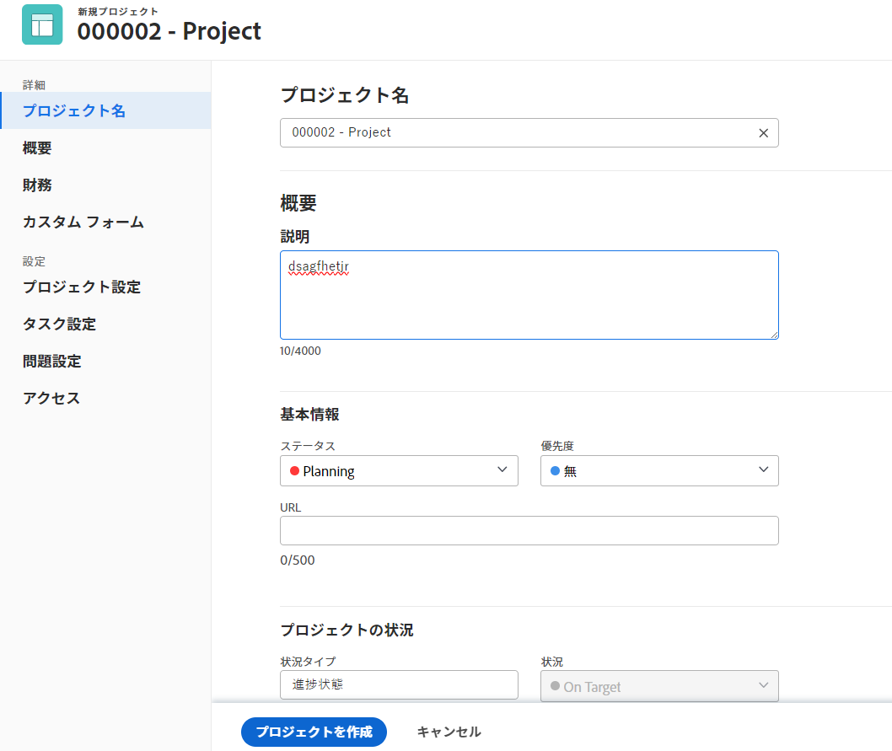
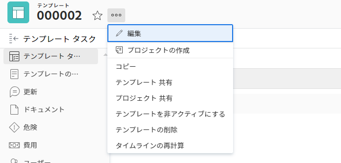

# テンプレートを使用したプロジェクトの作成

<!-- Audited: 01/2024 -->

テンプレートをフレームワークとして使用し、Adobe Workfrontでプロジェクトを作成できます。 頻繁に繰り返されるプロジェクトがある場合、新しいプロジェクトの一般タイムラインでテンプレートを使用すると、同じプロジェクトを繰り返し作成する必要がなくなります。

テンプレートを使用すると、繰り返し可能なプロセス、情報、およびプロジェクトに関連する設定を取り込むことができます。テンプレートに関連付けられた情報は、プロジェクトに転送されます。これには、タスク、割り当て、期間、ドキュメント、財務の詳細、リスク、およびカスタムフォームが含まれます。

>[!TIP]
>
>Workfront では、新しいプロジェクトのグループとステータスが次のように定義されます。
>
>* テンプレートから作成される新しいプロジェクトのデフォルトのステータスは、主な「プロジェクトの環境設定」領域でWorkfront管理者が定義したステータス、またはグループの「プロジェクトの環境設定」領域でグループ管理者 ( またはWorkfront管理者 ) が定義したステータスに対応します。 プロジェクトの環境設定について詳しくは、[システム全体でのプロジェクトの環境設定](../../../administration-and-setup/set-up-workfront/configure-system-defaults/set-project-preferences.md)または[グループのプロジェクトの環境設定](../../../administration-and-setup/manage-groups/create-and-manage-groups/configure-project-preferences-group.md)を参照してください。
>
>* 新しいプロジェクトのグループは、テンプレートのグループです。テンプレートがグループに関連付けられていない場合、プロジェクトのグループは、プロジェクトを作成したユーザーのホームグループになります。
>
>* 新しいプロジェクトで使用できるステータスは、プロジェクトのグループのステータス（テンプレートのグループ、またはプロジェクトを作成するユーザーのホームグループ）に一致します。

テンプレートからプロジェクトを作成する場合は、次のオプションがあります。

* 「プロジェクト」エリアでのテンプレートからのプロジェクトの作成
* テンプレートレベルでのテンプレートからのプロジェクトの作成
* 既存のプロジェクトにテンプレートを添付

  詳しくは、[プロジェクトへのテンプレートの添付](../../../manage-work/projects/create-and-manage-templates/attach-template-to-project.md)を参照してください。

* 「グループ」エリアでのテンプレートからのプロジェクトの作成

## アクセス要件

<!--drafted for P&P:

<table style="table-layout:auto"> 
 <col> 
 <col> 
 <tbody> 
  <tr> 
   <td role="rowheader">Adobe Workfront plan*</td> 
   <td> 
Any 
 </td> 
  </tr> 
  <tr> 
   <td role="rowheader">Workfront license*</td> 
   <td> 
Current license: Standard 

   Or
   
Legacy license: Plan 

    </td> 
  </tr> 
  <tr> 
   <td role="rowheader">Access level configurations*</td> 
   <td> 
Edit access to Projects and to Templates
 
<b>NOTE</b>
   
   If you still don't have access, ask your Workfront administrator if they set additional restrictions in your access level. For information about access to projects, see <a href="../../../administration-and-setup/add-users/configure-and-grant-access/grant-access-projects.md" class="MCXref xref">Grant access to projects</a>. For information on how a Workfront administrator can change your access level, see <a href="../../../administration-and-setup/add-users/configure-and-grant-access/create-modify-access-levels.md" class="MCXref xref">Create or modify custom access levels</a>. 
 </td> 
  </tr> 
  <tr> 
   <td role="rowheader">Object permissions</td> 
   <td> 
View permissions to a template
 
When you create a project you automatically receive Manage permissions to the project 
 
 For information about project permissions, see <a href="../../../workfront-basics/grant-and-request-access-to-objects/share-a-project.md" class="MCXref xref">Share a project in Adobe Workfront</a>.
 
For information on requesting additional access, see <a href="../../../workfront-basics/grant-and-request-access-to-objects/request-access.md" class="MCXref xref">Request access to objects </a>.
 </td> 
  </tr> 
 </tbody> 
</table>
-->

この記事の手順を実行するには、次のアクセス権が必要です。

<table style="table-layout:auto"> 
 <col> 
 <col> 
 <tbody> 
  <tr> 
   <td role="rowheader">Adobe Workfront プラン</td> 
   <td> 
任意 
 </td> 
  </tr> 
  <tr> 
   <td role="rowheader">Workfrontライセンス</td> 
   <td> 
新規：標準

        
または

        
現在：プラン 
 </td> 
  </tr> 
  <tr> 
   <td role="rowheader">アクセスレベル設定</td> 
   <td> 
プロジェクトおよびテンプレートへのアクセス権の編集
 </td> 
  </tr> 
  <tr> 
   <td role="rowheader">オブジェクト権限</td> 
   <td> 
テンプレートに対する権限の表示
 
プロジェクトを作成すると、そのプロジェクトに対する管理権限が自動的に付与されます。
</td> 
  </tr> 
 </tbody> 
</table>

この表の情報の詳細については、 [Workfrontドキュメントのアクセス要件](/help/quicksilver/administration-and-setup/add-users/access-levels-and-object-permissions/access-level-requirements-in-documentation.md).

## 「プロジェクト」エリアでのテンプレートからのプロジェクトの作成

プロジェクトは、「メインメニュー」の「プロジェクト」エリアや、ポートフォリオまたはプログラムの「プロジェクト」エリアから作成できます。

1. 次のいずれかの操作を行います。

   * 次をクリック： **[!UICONTROL メインメニュー]** アイコン  Adobe Workfrontの右上隅にある、または（使用可能な場合）、 **[!UICONTROL メインメニュー]** アイコン  をクリックします。 クリック **プロジェクト**&#x200B;を展開し、を展開します。 **新規プロジェクト**.
   * ポートフォリオに移動し、「**新規プロジェクト**」を展開します。

     >[!TIP]
     >
     >ポートフォリオのテンプレートを使用してプロジェクトを作成すると、新しいプロジェクトの「ポートフォリオ」フィールドが更新され、プロジェクトの作成元として選択したポートフォリオが表示されます。これにより、テンプレートの「ポートフォリオ」フィールドが指定されている場合、それが上書きされます。

   * プログラムに移動し、「**新規プロジェクト**」を展開します。

     >[!TIP]
     >
     >プログラムのテンプレートを使用してプロジェクトを作成すると、新しいプロジェクトの「プログラム」フィールドが更新され、プロジェクトの作成元として選択したプログラムが表示されます。テンプレートの「ポートフォリオ」フィールドが更新され、プロジェクトの作成元として選択したプログラムのポートフォリオが表示されます。これにより、テンプレートの「プログラム」フィールドと「ポートフォリオ」フィールドが指定されている場合、それらが上書きされます。

   * グループ管理者の場合は、管理するグループの「プロジェクト」セクションでプロジェクトを作成することもできます。詳しくは、[グループのプロジェクトの作成および変更](../../../administration-and-setup/manage-groups/work-with-group-objects/create-and-modify-a-groups-projects.md)を参照してください。

     >[!TIP]
     >
     >グループのテンプレートを使用してプロジェクトを作成する場合、新しいプロジェクトの「グループ」フィールドには、テンプレートの「グループ」フィールドが指定されていない場合にのみ、そのプロジェクトの作成元のグループが表示されます。テンプレートの「グループ」フィールドを指定した場合、新しいプロジェクトの「グループ」フィールドはテンプレートの「グループ」フィールドになります。

   <!--
   
(this, above, is hyperlinked to the classic version of this article; the Milestone View steps are similar to creating a project in Classic than to the way you do it in NWE)

   -->

   

1. テンプレートの名前をクリックします。 **お気に入りのテンプレート** リスト。

   

   または

   次の操作を実行します。

   1. 「**テンプレートからの新規プロジェクト**」を選択します。
   1. **テンプレートの検索**&#x200B;フィールドで、テンプレートの名前を入力し、リストに表示されたらクリックして選択します。
   1. 右側でテンプレートの詳細を確認します。

      テンプレートの詳細には、以下の情報が含まれています。

      * テンプレートの期間
      * テンプレート所有者
      * 上位 3 つのタスクの名前を含む最上位タスクの数
      * テンプレート内のすべてのタスクの数
      * テンプレートのカスタムフォームの名前

   1. （オプション）左側のウィンドウでテンプレート名の上にマウスポインターを置き、 **お気に入力** **アイコン**  将来の使用のお気に入りとしてマークする

      または

      **お気に入りのテンプレート**&#x200B;リストを展開し、ドロップダウンリストからテンプレートを選択します。

      >[!TIP]
      >
      >お気に入りに登録できる Workfront の項目は最大 40 個です。これには、テンプレートやその他の項目が含まれます。

   1. テンプレートを選択したら、「**テンプレートを使用**」をクリックします。

      

      >[!NOTE]
      >
      >プロジェクトのリストにマイルストーンビューを適用している場合は、「**テンプレートから新規作成**」セクションでテンプレートの名前をクリックします。
      >
      >
      >
      >

   **新規プロジェクト**&#x200B;ボックスが開きます。

   

1. テンプレートに既にフィールドが入力されている場合、そのフィールドは&#x200B;**新規プロジェクト**&#x200B;ボックスで事前に入力されています。事前入力された値を編集し、プロジェクトに合わせて調整できます。詳しくは、[プロジェクトの編集](../../../manage-work/projects/manage-projects/edit-projects.md)を参照してください。
1. 「**プロジェクトを作成**」をクリックします。

   前の手順で変更しなかった場合、テンプレートで定義したすべての詳細は、新しく作成されたプロジェクトに自動的に関連付けられます。

## テンプレート領域でテンプレートからプロジェクトを作成

プロジェクト領域から始める代わりに、テンプレートからプロジェクトを作成するできます。

{{step1-to-templates}}

1. 使用するテンプレートの名前をクリックします。
1. 次をクリック： **その他** メニュー を選択し、次に **プロジェクトを作成**.

   

    **新規プロジェクト** ボックスが開きます。

1. プロジェクトの名前を入力し、各セクションを確認して必要な変更を行います。

   

   テンプレートに既にフィールドが入力されている場合、そのフィールドは&#x200B;**新規プロジェクト**&#x200B;ボックスで事前に入力されています。事前入力された値を編集し、プロジェクトに合わせて調整できます。詳しくは、[プロジェクトの編集](../../../manage-work/projects/manage-projects/edit-projects.md)を参照してください。

1. 「**プロジェクトを作成**」をクリックします。

   前の手順で変更しなかった場合、テンプレートで定義したすべての詳細は、新しく作成されたプロジェクトに自動的に関連付けられます。
