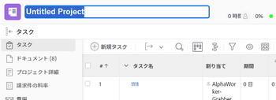

# プロジェクトの作成

<!--

(NOTE:this is linked from the UI from the Projects global nav section in classic. Do not change/ remove)

-->

プロジェクトとは、Adobe Workfrontで行う必要のある大量の作業を表します。

## アクセス要件

<!--drafted for P&P - replace table below with this:

<table style="table-layout:auto"> 
 <col> 
 <col> 
 <tbody> 
  <tr> 
   <td role="rowheader">Workfront plan*</td> 
   <td> 
Any
 </td> 
  </tr> 
  <tr> 
   <td role="rowheader">Workfront license*</td> 
   <td> 
Current license: Standard 

   Or
   
Legacy license: Plan 

    </td> 
  </tr> 
  <tr> 
   <td role="rowheader">Access level*</td> 
   <td> 
Edit access to Projects
 
<b>NOTE</b>
   
   If you still don't have access, ask your Workfront administrator if they set additional restrictions in your access level. For information about access to projects, see <a href="../../../administration-and-setup/add-users/configure-and-grant-access/grant-access-projects.md" class="MCXref xref">Grant access to projects</a>. For information on how a Workfront administrator can change your access level, see <a href="../../../administration-and-setup/add-users/configure-and-grant-access/create-modify-access-levels.md" class="MCXref xref">Create or modify custom access levels</a>. 
 </td> 
  </tr> 
  <tr> 
   <td role="rowheader">Object permissions</td> 
   <td> 
When you create a project you automatically receive Manage permissions to the project 
 
 For information about project permissions, see <a href="../../../workfront-basics/grant-and-request-access-to-objects/share-a-project.md" class="MCXref xref">Share a project in Adobe Workfront</a>.
 
For information on requesting additional access, see <a href="../../../workfront-basics/grant-and-request-access-to-objects/request-access.md" class="MCXref xref">Request access to objects </a>.
 </td> 
  </tr> 
 </tbody> 
</table>

-->

この記事の手順を実行するには、次のアクセス権が必要です。

<table style="table-layout:auto"> 
 <col> 
 <col> 
 <tbody> 
  <tr> 
   <td role="rowheader">Workfront plan*</td> 
   <td> 
任意
 </td> 
  </tr> 
  <tr> 
   <td role="rowheader">Workfront license*</td> 
   <td> 
計画 
 </td> 
  </tr> 
  <tr> 
   <td role="rowheader">アクセスレベル*</td> 
   <td> 
プロジェクトへのアクセスを編集
 
<b>メモ</b>

まだアクセス権がない場合は、Workfront管理者に、アクセスレベルに追加の制限を設定しているかどうかを問い合わせてください。 プロジェクトへのアクセスについて詳しくは、 <a href="../../../administration-and-setup/add-users/configure-and-grant-access/grant-access-projects.md" class="MCXref xref">プロジェクトへのアクセス権の付与</a>. Workfront管理者がアクセスレベルを変更する方法について詳しくは、 <a href="../../../administration-and-setup/add-users/configure-and-grant-access/create-modify-access-levels.md" class="MCXref xref">カスタムアクセスレベルの作成または変更</a>. 
 </td>
</tr> 
  <tr> 
   <td role="rowheader">オブジェクト権限</td> 
   <td> 
プロジェクトを作成すると、自動的にプロジェクトに対する管理権限が付与されます 
 
 プロジェクト権限について詳しくは、 <a href="../../../workfront-basics/grant-and-request-access-to-objects/share-a-project.md" class="MCXref xref">Adobe Workfrontでプロジェクトを共有する</a>.
 
追加のアクセス権のリクエストについて詳しくは、 <a href="../../../workfront-basics/grant-and-request-access-to-objects/request-access.md" class="MCXref xref">オブジェクトへのアクセスのリクエスト </a>.
 </td> 
  </tr> 
 </tbody> 
</table>

&#42;保有しているプラン、ライセンスの種類、アクセス権を確認するには、Workfront管理者に問い合わせてください。

## プロジェクトの作成方法

次のいずれかの方法を使用して、Workfrontでプロジェクトを作成できます。

* テンプレートを使用せずに、ゼロからプロジェクトを作成する。 この記事では、プロジェクトを最初から作成する方法について説明します。

* 既存のプロジェクトをコピーします。\
   プロジェクトのコピーの詳細については、 [プロジェクトのコピー](../../../manage-work/projects/manage-projects/copy-project.md).

* テンプレートを使用します。\
   テンプレートを使用して新しいプロジェクトを作成する方法について詳しくは、 [テンプレートを使用したプロジェクトの作成](../../../manage-work/projects/create-projects/create-project-from-template.md).

* Microsoft Project からプロジェクトを読み込みます。\
   MS Project からプロジェクトを読み込む方法について詳しくは、 [Microsoft Project からプロジェクトを読み込む](../../../manage-work/projects/create-projects/import-project-from-ms-project.md).

* キックスタートを使用してプロジェクトを読み込みます。

   Workfrontの管理者は、キックスタートを使用してプロジェクトを読み込むことができます。

   Workfrontでのキックスタートを使用したデータのインポートについて詳しくは、 [キックスタートテンプレートを使用してAdobe Workfrontにデータを読み込む](../../../administration-and-setup/manage-workfront/using-kick-starts/import-data-via-kickstarts.md) .

   キックスタートを使用したプロジェクトの読み込みについては、 [キック開始シナリオ：シンプルなプロジェクトとタスクのインポートの準備](../../../administration-and-setup/manage-workfront/using-kick-starts/kick-starts-scenario-simple-project-task-import-prep.md) .

* Adobe Workfrontシナリオプランナーのシナリオからイニシアチブを公開します。 シナリオ・プランナには、追加のライセンスが必要です。 Workfront Scenario Planner の詳細は、 [シナリオプランナーの概要](../../../scenario-planner/scenario-planner-overview.md). 公開イニシアチブからプロジェクトを作成する方法については、  [シナリオプランナーでイニシアチブを公開して、プロジェクトを更新または作成します](../../../scenario-planner/publish-scenarios-update-projects.md).

## 前提条件

始める前に、次の点を確認する必要があります。

* システムまたはグループ管理者が、「セットアップ」領域で「テンプレートを使用せずにユーザーがプロジェクトを作成できるようにする」設定を有効にしました。

   詳しくは、 [システム全体のプロジェクト環境設定の指定](../../../administration-and-setup/set-up-workfront/configure-system-defaults/set-project-preferences.md).

## 新しいプロジェクトの既定の設定

プロジェクトを作成する際、Workfrontはデフォルト設定のセットを適用します。 例えば、プロジェクトの作成時に、ステータス、グループ、スケジュールモードがあらかじめ設定されているとします。

次の点に注意してください。

* Workfront管理者またはグループ管理者は、プロジェクトの環境設定を行う際に、新しいプロジェクトのデフォルト設定を構成できます。
* Workfrontは、Workfront管理者が設定した設定を適用する前に、グループに設定がある場合はに適用します。
* テンプレートを使用してプロジェクトを作成する場合、テンプレートの設定が、Workfrontまたはグループ管理者が設定した設定よりも優先されます。

>[!NOTE]
>
>新規プロジェクトのデフォルトのステータスは「計画」にすることをお勧めします。 新しいプロジェクトを変更する際に、通知がプロジェクトに割り当てられたユーザーにトリガーされないようにします。

新規プロジェクトの既定の状態とその他の既定の設定の詳細については、 [システム全体のプロジェクト環境設定の指定](../../../administration-and-setup/set-up-workfront/configure-system-defaults/set-project-preferences.md).

## プロジェクトをゼロから作成する

1. 次のいずれかの操作を行います。

   * 次をクリック： **メインメニュー** をクリックし、 **プロジェクト**&#x200B;を展開し、 **新規プロジェクト**.
   * ポートフォリオに移動し、を展開します。 **新規プロジェクト**.

      >[!TIP]
      >
      >ポートフォリオのPortfolioを使用してプロジェクトを作成すると、新しいプロジェクトのテンプレートフィールドが更新され、プロジェクトの作成元として選択したポートフォリオが表示されます。 指定されている場合は、Portfolioのテンプレートフィールドが上書きされます。

   * プログラムに移動し、を展開します。 **新規プロジェクト**.

      >[!TIP]
      >
      >プログラムからテンプレートを使用してプロジェクトを作成すると、新しいプロジェクトの「プログラム」フィールドが更新され、プロジェクトの作成元として選択したプログラムが表示されます。 テンプレートの「Portfolio」フィールドが更新され、プロジェクトの作成元として選択したプログラムのポートフォリオが表示されます。 指定されている場合は、テンプレートの「プログラム」フィールドと「Portfolio」フィールドが上書きされます。

   * グループ管理者は、管理するグループの「プロジェクト」セクションでプロジェクトを作成することもできます。 詳しくは、 [グループのプロジェクトの作成と変更](../../../administration-and-setup/manage-groups/work-with-group-objects/create-and-modify-a-groups-projects.md).

      >[!TIP]
      >
      >グループのテンプレートを使用してプロジェクトを作成する場合、新しいプロジェクトの「グループ」フィールドには、テンプレートの「グループ」フィールドが指定されていない場合にのみ、そのプロジェクトの作成元のグループが表示されます。 テンプレートの「グループ」フィールドを指定した場合、新しいプロジェクトの「グループ」フィールドはテンプレートの「グループ」フィールドになります。
   

1. クリック **新規プロジェクト** プロジェクトをゼロから作成する場合。
1. プロジェクトの名前を入力します。 Enter キーを押して名前を保存します。

   

   プロジェクトページのヘッダーには、プロジェクトの現在の正常性と進行状況の概要がすばやく表示されます。 プロジェクトの情報が更新されると、プロジェクトのヘッダーの情報が変更されます。

1. クリック **追加を開始** **タスク**.

   または

   クリック **新規タスク** をクリックして、プロジェクトにタスクを追加し、リソースを割り当てます。\
   プロジェクトへのタスクの追加の詳細については、 [プロジェクトでのタスクの作成](../../../manage-work/tasks/create-tasks/create-tasks-in-project.md).

1. プロジェクトの詳細を編集するには、**その他のメニュー** その後 **編集**  をクリックします。

   この **プロジェクトを編集** ダイアログボックスが開きます。

   プロジェクトの編集の詳細については、 [プロジェクトを編集](../../../manage-work/projects/manage-projects/edit-projects.md).

1. （オプション）プロジェクトの設定を行い、タスクを追加した後、プロジェクトのステータスを **現在**.

   これは、プロジェクトを開始する準備が整い、タスクに割り当てられたユーザーが、プロジェクトで作業を開始できる状態になったことを示します。

   プロジェクトのステータスの詳細については、 [システムプロジェクトステータスのリストへのアクセス](../../../administration-and-setup/customize-workfront/creating-custom-status-and-priority-labels/project-statuses.md).
