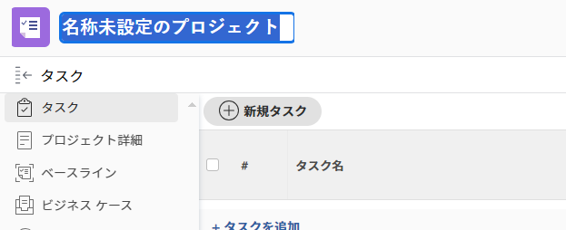

# プロジェクトの作成

<!--remove Preview and Production references-->

<!-- Audited: 110/2025 -->

<!--
The highlighted information on this page refers to functionality not yet generally available. It is available only in the Preview environment for all customers. After the monthly releases to Production, the same features are also available in the Production environment for customers who enabled fast releases.    

For information about fast releases, see [Enable or disable fast releases for your organization](/help/quicksilver/administration-and-setup/set-up-workfront/configure-system-defaults/enable-fast-release-process.md). 
-->

プロジェクトは、Adobe Workfront で行う必要がある大量の作業を表します。

## アクセス要件

+++ 展開すると、この記事の機能のアクセス要件が表示されます。

<table style="table-layout:auto"> 
 <col> 
 <col> 
 <tbody> 
  <tr> 
   <td role="rowheader">Adobe Workfront パッケージ</td> 
   <td> 
任意
 </td> 
  </tr> 
  <tr> 
   <td role="rowheader">Adobe Workfront プラン</td> 
   <td> 
標準

        
プラン
 </td> 
  </tr> 
  <tr> 
   <td role="rowheader">アクセスレベル設定</td> 
   <td> 
プロジェクトへのアクセスを編集
 </td> 
  </tr> 
  <tr> 
   <td role="rowheader">オブジェクト権限</td> 
   <td> 
プロジェクトを作成すると、そのプロジェクトに対する管理権限が自動的に付与されます。
 </td> 
  </tr> 
 </tbody> 
</table>

詳しくは、[Workfront ドキュメントのアクセス要件](/help/quicksilver/administration-and-setup/add-users/access-levels-and-object-permissions/access-level-requirements-in-documentation.md)を参照してください。

+++

<!--
Old:
<table style="table-layout:auto"> 
 <col> 
 <col> 
 <tbody> 
  <tr> 
   <td role="rowheader">Adobe Workfront plan</td> 
   <td> 
Any
 </td> 
  </tr> 
  <tr> 
   <td role="rowheader">Adobe Workfront license*</td> 
   <td> 
New: Standard

        
or

        
Current: Plan 
 </td> 
  </tr> 
  <tr> 
   <td role="rowheader">Access level configurations</td> 
   <td> 
Edit access to Projects
 </td> 
  </tr> 
  <tr> 
   <td role="rowheader">Object permissions</td> 
   <td> 
When you create a project, you automatically receive Manage permissions to the project.
 </td> 
  </tr> 
 </tbody> 
</table>
-->

## プロジェクトの作成方法

Workfront でプロジェクトを作成するには、次のような方法があります。

* テンプレートを使用せずに、プロジェクトを最初から作成します。 この記事では、プロジェクトを最初から作成する方法について説明します。

* 既存のプロジェクトのコピー。\
  プロジェクトのコピーについて詳しくは、 [プロジェクトをコピー](../../../manage-work/projects/manage-projects/copy-project.md)を参照してください。

* テンプレートを使用します。\
  テンプレートを使用して新しいプロジェクトを作成する方法について詳しくは、[テンプレートを使用してプロジェクトを作成](../../../manage-work/projects/create-projects/create-project-from-template.md)を参照してください。

* Microsoft Project からプロジェクトを読み込みます。\
  Microsoft Project からプロジェクトを読み込む方法について詳しくは、[Microsoft Project からプロジェクトを読み込む](../../../manage-work/projects/create-projects/import-project-from-ms-project.md)を参照してください。

* キックスタートを使用してプロジェクトを読み込みます。

  Workfront の管理者は、キックスタートを使用してプロジェクトを読み込むことができます。

  Workfront でのキックスタートを使用したデータの読み込みについて詳しくは、[キックスタートテンプレートを使用して Adobe Workfront にデータを読み込む](../../../administration-and-setup/manage-workfront/using-kick-starts/import-data-via-kickstarts.md)を参照してください。

  キックスタートを使用したプロジェクトの読み込みについて詳しくは、[キックスタートシナリオ：シンプルなプロジェクトおよびタスクの読み込みの準備](../../../administration-and-setup/manage-workfront/using-kick-starts/kick-starts-scenario-simple-project-task-import-prep.md)を参照してください。

* Adobe Workfront Scenario Plannerのシナリオからイニシアチブを公開します。

  Workfront のシナリオプランナーについて詳しくは、[シナリオプランナーの概要](../../../scenario-planner/scenario-planner-overview.md)を参照してください。

  公開したイニシアチブからプロジェクトを作成する方法について詳しくは、[シナリオプランナでイニシアチブを公開してプロジェクトを更新または作成する](../../../scenario-planner/publish-scenarios-update-projects.md)を参照してください。

* Workfront Planningのレコードタイプからプロジェクトを接続する際にプロジェクトを追加します。

  Workfront Planningへのアクセスについて詳しくは、[&#x200B; アクセスの概要](/help/quicksilver/planning/access/access-overview.md)を参照してください。

  レコードにプロジェクトを追加してプロジェクトを作成する方法について詳しくは、「[&#x200B; レコードに接続する際にWorkfront Planningのレコードを使用してプロジェクトを作成する」の節を参照してください。](/help/quicksilver/planning/records/create-workfront-objects-from-workfront-planning.md) レコードに接続する際にWorkfront PlanningからWorkfront オブジェクトを作成する

## 前提条件

開始する前に、次の点を確認する必要があります。

* システム管理者またはグループ管理者が、設定エリアで「テンプレートを使用しないプロジェクトの作成をユーザーに許可」環境設定を有効にしました。

  詳しくは、[システム全体のプロジェクト環境設定を指定](../../../administration-and-setup/set-up-workfront/configure-system-defaults/set-project-preferences.md)を参照してください。

## 新しいプロジェクトのデフォルト設定

プロジェクトを作成すると、Workfront では一連のデフォルト設定がプロジェクトに適用されます。 例えば、プロジェクトを作成すると、ステータス、グループ、スケジュールモードがプリセットされています。

次の点に注意してください。

* Workfront 管理者またはグループ管理者は、Workfront 全体のインスタンスやあるグループのプロジェクト環境設定を行う際に、新しいプロジェクトのデフォルト設定を指定できます。
* Workfront では、グループの設定があれば、Workfront 管理者が指定した設定よりも優先して適用します。
* 新しいプロジェクトのデフォルトステータスは、メインのプロジェクト環境設定エリアで Workfront 管理者が定義したステータス、またはグループのプロジェクト環境設定エリアでグループ管理者（または Workfront 管理者）が定義したステータスに対応します。

  >[!NOTE]
  >
  >新規プロジェクトのデフォルトステータスは、計画中に設定することをお勧めします。 これで、新しいプロジェクトに変更を加えても、そのプロジェクトに割り当てられているユーザーに通知が送信されなくなります。
  >
  >新しいプロジェクトのデフォルトステータスおよびその他のデフォルト設定の指定の詳細については、[システム全体のプロジェクト環境設定を指定](../../../administration-and-setup/set-up-workfront/configure-system-defaults/set-project-preferences.md)または[グループのプロジェクト環境設定を指定](../../../administration-and-setup/manage-groups/create-and-manage-groups/configure-project-preferences-group.md)を参照してください。

* Workfront で新しいプロジェクトのグループとステータスを定義する方法については、次のシナリオが存在します。

   * プロジェクトを最初から作成する場合は、プロジェクトのグループがホームグループになります。

     プロジェクトのステータスは、ホームグループ（存在する場合）または Workfront インスタンスのプロジェクト環境設定のデフォルトステータスになります。 プロジェクトの作成時のデフォルトステータスは、プロジェクトのグループで使用可能な任意のステータスに変更できます。

   * テンプレートを使用してプロジェクトを作成する場合は、テンプレートの設定が、Workfront 管理者またはグループ管理者が指定した設定よりも優先されます。

     新しいプロジェクトのグループは、テンプレートのグループです。 テンプレートがグループに関連付けられていない場合、プロジェクトのグループは、プロジェクトを作成したユーザーのホームグループになります。

     テンプレートから作成された新しいプロジェクトのデフォルトステータスは、メインのプロジェクト環境設定エリアで Workfront 管理者が定義したステータス、またはグループのプロジェクト環境設定エリアでグループ管理者（または Workfront 管理者）が定義したステータスに対応します。 テンプレートからプロジェクトを作成する際のデフォルトのステータスは、テンプレートのグループまたはプロジェクトを作成するユーザーのホームグループであるプロジェクトのグループのステータスのいずれかに変更できます。

   * イシューを変換してプロジェクトを作成する場合、新しいプロジェクトのグループは、イシューの既存のプロジェクトのグループになります。 イシューを変換するユーザーがイシューのプロジェクトにアクセスできない場合、またはイシューのプロジェクトにグループがない場合は、イシューを変換するユーザーのホームグループが新しいプロジェクトのグループになります。

     新しいプロジェクトのステータスは、元のプロジェクトのグループ、またはイシューを変換するユーザーのホームグループである、プロジェクトに関連付けられたグループのグループステータスと一致します。

     イシューを変換してプロジェクトを作成する際にテンプレートを使用している場合は、上記の 2 つ目のシナリオを参照して、新しいプロジェクトに適用されるグループと Workfront のステータスを把握してください。

* プロジェクトとその子オブジェクト（タスクと問題）にドキュメントが保存される場所は、Workfront管理者が設定の「システム環境設定」領域の「ストレージ環境設定」のデフォルトとして選択する場所によって異なります。 Workfront インスタンス内のドキュメントの保存場所に応じて、次の種類のプロジェクトを作成できます。

   * 従来のWorkfront ストレージプロジェクト
   * Adobe エンタープライズストレージプロジェクト。

  詳しくは、[組織でAdobe エンタープライズ ストレージを有効にする](/help/quicksilver/administration-and-setup/set-up-workfront/configure-system-defaults/enable-esm.md)を参照してください。

* エンタープライズストレージプロジェクトを作成すると、プロジェクトの&#x200B;**ドキュメント** セクションに、プロジェクトと同じ名前のドキュメントフォルダーが作成されます。 プロジェクトにタスクを追加すると、各タスクの&#x200B;**ドキュメント** セクションにタスク名のフォルダーが追加されます。

詳しくは、[&#x200B; プロジェクトおよび関連オブジェクトのドキュメント管理の概要](/help/quicksilver/manage-work/projects/manage-projects/manage-documents-on-projects.md)を参照してください。

## ゼロからのプロジェクトの作成

>[!NOTE]
>
>テンプレートを使用してプロジェクトを作成する場合は、[テンプレートを使用したプロジェクトの作成](/help/quicksilver/manage-work/projects/create-projects/create-project-from-template.md)の記事もご覧になることをお勧めします。

1. 次のいずれかの操作を行います。

   * 左上隅の&#x200B;**[!UICONTROL メインメニュー]** アイコン をクリックし、**プロジェクト**&#x200B;をクリックして&#x200B;**新規プロジェクト**&#x200B;を展開します。
   * ポートフォリオに移動し、**新規プロジェクト**&#x200B;を展開します。
   * プログラムに移動し、「**新規プロジェクト**」を展開します。
   * グループ管理者の場合は、管理するグループの「プロジェクト」セクションでプロジェクトを作成することもできます。 詳しくは、[グループのプロジェクトの作成および変更](../../../administration-and-setup/manage-groups/work-with-group-objects/create-and-modify-a-groups-projects.md)を参照してください。

   

1. （条件付き）組織が使用しているドキュメントストレージに応じて、次のいずれかをクリックします。

   * **新しいプロジェクト**。Workfront管理者が&#x200B;**Adobe Enterprise**&#x200B;または&#x200B;**レガシーWorkfront**&#x200B;のいずれかを選択し、**ユーザーがストレージプロバイダー**&#x200B;を選択することを許可する設定を選択したか、選択しなかった場合。
   * **新しいプロジェクト （レガシーストレージ）**。Workfront管理者が&#x200B;**Adobe Enterprise**&#x200B;または&#x200B;**レガシーWorkfront**&#x200B;のいずれかを選択し、**ユーザーにストレージプロバイダー**&#x200B;の選択を許可する設定も選択した場合。

     このオプションは、**ユーザーがストレージ プロバイダー**&#x200B;を選択することを許可する設定がセットアップ エリアで選択されている場合にのみ表示されます。

     詳しくは、[組織でAdobe エンタープライズ ストレージを有効にする](/help/quicksilver/administration-and-setup/set-up-workfront/configure-system-defaults/enable-esm.md)を参照してください。

     >[!NOTE]
     >
     >Workfront ストレージのポートフォリオまたはプログラムからエンタープライズ・ストレージ・プロジェクトを作成すると、そのポートフォリオまたはプログラムもエンタープライズ・ストレージ・オブジェクトに変換されます。 同じポートフォリオまたはプログラム内の他のすべてのWorkfront ストレージプロジェクトは変更されません。

     プロジェクトが作成され、そのデフォルト名は、Workfrontがドキュメントに使用するストレージに応じて、次のパターンに従います。

      * Workfront ストレージ プロジェクトの&#x200B;**名称未設定のプロジェクト**。

        Workfront-storage プロジェクトの名前の横に&#x200B;**従来のWorkfront ストレージ** アイコン が表示されます。

      * **名称未設定のプロジェクト - Adobe-storage プロジェクトの&lt;月の日、年の時間。分。秒>**

        >[!IMPORTANT]
        >
        >Adobe エンタープライズストレージを使用するプロジェクトには、一意の名前が必要です。

1. プロジェクトのヘッダーで、プロジェクト名を更新します。 Enter キーを押して名前を保存します。

   

   プロジェクトページのヘッダーには、プロジェクトの現在の正常性と進行状況の概要がすばやく表示されます。 プロジェクトの情報が更新されると、プロジェクトのヘッダーの情報が変更されます。

1. 「**タスクを追加**」をクリックします。

   または

   「**新規タスク**」をクリックして、プロジェクトにタスクを追加し、リソースを割り当てます。

   プロジェクトへのタスクの追加について詳しくは、[プロジェクトにタスクを作成](../../../manage-work/tasks/create-tasks/create-tasks-in-project.md)を参照してください。

1. プロジェクトの詳細を編集するには、プロジェクト名の右側にあるヘッダーの&#x200B;**詳細** メニューをクリックし、プロジェクト名の横にある&#x200B;**編集** をクリックします。

   「**プロジェクトを編集**」ボックスが開きます。

1. プロジェクトに関する情報を追加します。

   プロジェクトの編集について詳しくは、[プロジェクトの編集](../../../manage-work/projects/manage-projects/edit-projects.md)を参照してください。

   >[!TIP]
   >
   >プロジェクトのステータスは、「計画」または「現在でない別のステータス」である必要があります。 これにより、プロジェクト参加者への通知を生成せずに、プロジェクトに変更を加えることができます。

1. 「**保存**」をクリックして変更を保存します。

1. （オプション）プロジェクト設定を設定してタスクを追加した後、プロジェクトヘッダーでプロジェクトのステータスを&#x200B;**現在**&#x200B;に変更できます。

   これは、プロジェクトを開始する準備が整い、タスクに割り当てられたユーザーが、プロジェクトで作業を開始できる状態になったことを示します。

   プロジェクトのステータスについて詳しくは、[システムプロジェクトステータスのリストにアクセス](../../../administration-and-setup/customize-workfront/creating-custom-status-and-priority-labels/project-statuses.md)を参照してください。
