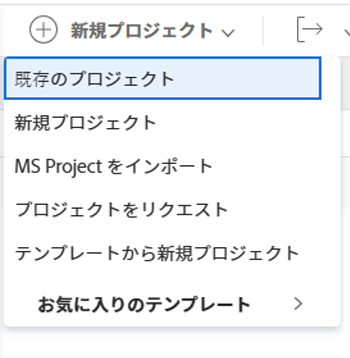

# プロジェクトのリクエスト

プロジェクトの作業を開始する前に、プロジェクトの承認をリクエストできます。 これにより、ステータスが「アイデア」のプロジェクトが作成されます。 プロジェクトのビジネスケースを作成して、完了して達成する重要なポイントの一部を示し、管理者の人件費と費用予算について提示することをお勧めします。

Adobe Workfrontの次の領域で新しいプロジェクトを追加する際に、プロジェクトをリクエストできます。

* 「プロジェクト」領域
* Portfolioの「プロジェクト」領域
* プログラムの「プロジェクト」領域で
* プロジェクトのグループの「グループ」領域で、グループ管理者の場合に使用します。

## アクセス要件

<!--drafted for P&P:

<table style="table-layout:auto"> 
 <col> 
 <col> 
 <tbody> 
  <tr> 
   <td role="rowheader">Adobe Workfront plan*</td> 
   <td> 
Any
 </td> 
  </tr> 
  <tr> 
   <td role="rowheader"> 
Adobe Workfront license*
 </td> 
   <td> 
Current license: Standard 

   Or
   
Legacy license: Plan 

   </td> 
  </tr> 
  <tr> 
   <td role="rowheader">Access level*</td> 
   <td> 
Edit access to Projects
 
<b>NOTE</b>
   
   If you still don't have access, ask your Workfront administrator if they set additional restrictions in your access level. For information about access to projects, see <a href="../../../administration-and-setup/add-users/configure-and-grant-access/grant-access-projects.md" class="MCXref xref">Grant access to projects</a>. For information on how a Workfront administrator can change your access level, see <a href="../../../administration-and-setup/add-users/configure-and-grant-access/create-modify-access-levels.md" class="MCXref xref">Create or modify custom access levels</a>. 
 </td> 
  </tr> 
  <tr> 
   <td role="rowheader">Object permissions</td> 
   <td> 
When you create a project request you automatically receive Manage permissions to the project 
 
 For information about project permissions, see <a href="../../../workfront-basics/grant-and-request-access-to-objects/share-a-project.md" class="MCXref xref">Share a project in Adobe Workfront</a>.
 
For information on requesting additional access, see <a href="../../../workfront-basics/grant-and-request-access-to-objects/request-access.md" class="MCXref xref">Request access to objects </a>.
 </td> 
  </tr> 
 </tbody> 
</table>
-->

この記事の手順を実行するには、次のアクセス権が必要です。

<table style="table-layout:auto"> 
 <col> 
 <col> 
 <tbody> 
  <tr> 
   <td role="rowheader">Adobe Workfront plan*</td> 
   <td> 
任意
 </td> 
  </tr> 
  <tr> 
   <td role="rowheader"> 
Adobe Workfront license*
 </td> 
   <td> 
計画 
 </td> 
  </tr> 
  <tr> 
   <td role="rowheader">アクセスレベル*</td> 
   <td> 
プロジェクトへのアクセスを編集
 
<b>メモ</b>

まだアクセス権がない場合は、Workfront管理者に、アクセスレベルに追加の制限を設定しているかどうかを問い合わせてください。 プロジェクトへのアクセスについて詳しくは、 <a href="../../../administration-and-setup/add-users/configure-and-grant-access/grant-access-projects.md" class="MCXref xref">プロジェクトへのアクセス権の付与</a>. Workfront管理者がアクセスレベルを変更する方法について詳しくは、 <a href="../../../administration-and-setup/add-users/configure-and-grant-access/create-modify-access-levels.md" class="MCXref xref">カスタムアクセスレベルの作成または変更</a>. 
 </td>
</tr> 
  <tr> 
   <td role="rowheader">オブジェクト権限</td> 
   <td> 
プロジェクトリクエストを作成すると、プロジェクトに対する管理権限が自動的に付与されます 
 
 プロジェクト権限について詳しくは、 <a href="../../../workfront-basics/grant-and-request-access-to-objects/share-a-project.md" class="MCXref xref">Adobe Workfrontでプロジェクトを共有する</a>.
 
追加のアクセス権のリクエストについて詳しくは、 <a href="../../../workfront-basics/grant-and-request-access-to-objects/request-access.md" class="MCXref xref">オブジェクトへのアクセスのリクエスト </a>.
 </td> 
  </tr> 
 </tbody> 
</table>

&#42;保有しているプラン、ライセンスの種類、アクセス権を確認するには、Workfront管理者に問い合わせてください。

## プロジェクトのリクエスト

1. 次のいずれかの操作を行います。

   * 次をクリック： **メインメニュー** をクリックし、 **プロジェクト**&#x200B;を展開し、 **新規プロジェクト**.
   * ポートフォリオに移動し、を展開します。 **新規プロジェクト**.
   * プログラムに移動し、を展開します。 **新規プロジェクト**.
   * グループ管理者は、管理するグループの「プロジェクト」セクションでプロジェクトを作成することもできます。 詳しくは、 [グループのプロジェクトの作成と変更](../../../administration-and-setup/manage-groups/work-with-group-objects/create-and-modify-a-groups-projects.md).

1. クリック **プロジェクトをリクエスト**.

   

1. 次のいずれかの操作を行います。

   * ビジネスケースを定義する際のプロジェクトの作成と同じ手順に従います。 （推奨）

      ビジネスケースの定義とプロジェクトのリクエストについては、 [プロジェクトのビジネスケースの作成](../../../manage-work/projects/define-a-business-case/create-business-case.md).

   * プロジェクトを最初から作成するか、テンプレートを使用して、ステータスを「 」に変更します。 **リクエスト**.

      プロジェクトの作成について詳しくは、 [プロジェクトの作成](../../../manage-work/projects/create-projects/create-project.md) または [テンプレートを使用したプロジェクトの作成](../../../manage-work/projects/create-projects/create-project-from-template.md).
   リクエストするプロジェクトのステータスは次のとおりです **リクエスト** そして、 **リクエストされたプロジェクト** タブに表示されます (Portfolioに関連付けている場合 )。Portfolio ポートフォリオマネージャは、レビューを行い、承認または拒否できるようになりました。この場合、プロジェクトのステータスは次のいずれかに変わります。 **承認済み** または **却下**.
