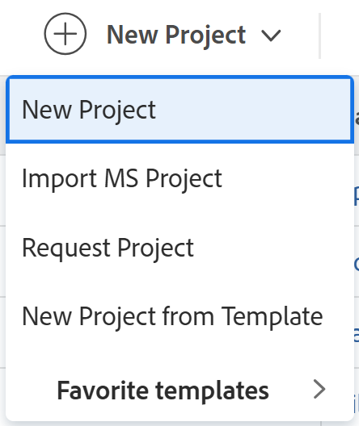

# プロジェクトのリクエスト

<!--Audited: 10/2025-->

プロジェクトの作業を開始する前に、プロジェクトの承認をリクエストできます。

空のプロジェクトを作成すると、プロジェクトのステータスは「アイデア」になります。

プロジェクトの承認を得るために正式なリクエストが必要な場合は、新しいプロジェクトのビジネスケースを作成することをお勧めします。これにより、ビジネスケースを完成することで達成を望む重要なポイントの概要を示し、経営陣に人件費と経費の予算を提示できます。

ビジネスケースに入力し、プロジェクトを送信して承認を得ると、プロジェクトの正式なリクエストが完了します。ビジネスケースを送信して承認を得ると、プロジェクトのステータスは「リクエスト済み」になります。

Adobe Workfront の次のエリアで新しいプロジェクトを追加する際に、プロジェクトをリクエストできます。

* プロジェクトエリアの場合
* ポートフォリオのプロジェクトエリアの場合
* プログラムのプロジェクトエリアの場合
* プロジェクトのグループのグループエリアで、グループ管理者の場合。

## アクセス要件

+++ 展開すると、この記事の機能のアクセス要件が表示されます。 

<table style="table-layout:auto"> 
 <col> 
 <col> 
 <tbody> 
  <tr> 
   <td role="rowheader">Adobe Workfront パッケージ</td> 
   <td> 
任意
 </td> 
  </tr> 
  <tr> 
   <td role="rowheader"> 
Adobe Workfront プラン
 </td> 
   <td> 
標準

   
プラン

   </td> 
  </tr> 
  <tr> 
   <td role="rowheader">アクセスレベル設定</td> 
   <td> 
プロジェクトへのアクセスを編集

   
ポートフォリオまたはプログラムからプロジェクトをリクエストする場合は、ポートフォリオとプログラムへの編集アクセス権が必要です

    </td> 
  </tr> 
  <tr> 
   <td role="rowheader">オブジェクト権限</td> 
   <td> 
プロジェクトのリクエストを作成すると、プロジェクトに対する管理権限が自動的に付与されます。 
 
   
ポートフォリオまたはプログラムからプロジェクトをリクエストする場合は、ポートフォリオとプログラムに対する管理権限が必要です。

   </td> 
  </tr> 
 </tbody> 
</table>

詳しくは、[Workfront ドキュメントのアクセス要件](/help/quicksilver/administration-and-setup/add-users/access-levels-and-object-permissions/access-level-requirements-in-documentation.md)を参照してください。

+++

<!--
Old:

<table style="table-layout:auto"> 
 <col> 
 <col> 
 <tbody> 
  <tr> 
   <td role="rowheader">Adobe Workfront plan</td> 
   <td> 
Any
 </td> 
  </tr> 
  <tr> 
   <td role="rowheader"> 
Adobe Workfront license*
 </td> 
   <td> 
New: Standard 

   Or
   
Current: Plan 

   </td> 
  </tr> 
  <tr> 
   <td role="rowheader">Access level</td> 
   <td> 
Edit access to Projects
 </td> 
  </tr> 
  <tr> 
   <td role="rowheader">Object permissions</td> 
   <td> 
When you create a project request you automatically receive Manage permissions to the project 
 </td> 
  </tr> 
 </tbody> 
</table>
-->

## プロジェクトのリクエスト

1. 次のいずれかの操作を行います。

   * 左上隅の&#x200B;**メインメニュー** アイコン をクリックし、**プロジェクト**&#x200B;をクリックしてから、**新規プロジェクト**&#x200B;を展開します。
   * ポートフォリオに移動し、**新規プロジェクト**&#x200B;を展開します。
   * プログラムに移動し、「**新規プロジェクト**」を展開します。
   * グループ管理者の場合は、管理するグループの「プロジェクト」セクションでプロジェクトを作成することもできます。詳しくは、[グループのプロジェクトの作成および変更](../../../administration-and-setup/manage-groups/work-with-group-objects/create-and-modify-a-groups-projects.md)を参照してください。

1. 「**プロジェクトをリクエスト**」をクリックします。

   

1. 次のいずれかの操作を行います。

   * ビジネスケースを定義する際に、プロジェクトを作成する場合と同じ手順に従います。（推奨）

     詳しくは、[&#x200B; プロジェクトのビジネスケースの作成](../../../manage-work/projects/define-a-business-case/create-business-case.md)を参照してください。

   * プロジェクトを最初から作成するか、テンプレートを使用して作成し、ステータスを「**リクエスト済み**」に変更します。

     詳しくは、[&#x200B; プロジェクトの作成](../../../manage-work/projects/create-projects/create-project.md)または[&#x200B; テンプレートを使用したプロジェクトの作成](../../../manage-work/projects/create-projects/create-project-from-template.md)を参照してください。

   リクエストしたプロジェクトのステータスは&#x200B;**リクエスト済み**&#x200B;で、Portfolioに関連付けた場合は、Portfolioの「**リクエスト済みプロジェクト**」タブに表示されます。

   ポートフォリオマネージャーは、レビューを行い、承認または拒否できるようになりました。この場合、プロジェクトのステータスは「**承認済み**」または「**却下**」に変わります。
