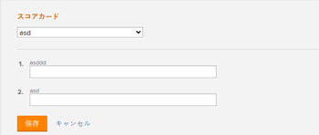
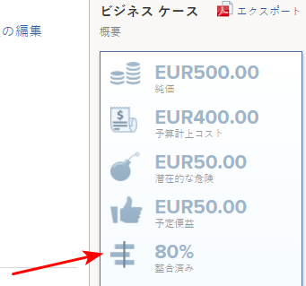

# プロジェクトにスコアカードを適用し、線形スコアを生成する

スコアカードを使用して、プロジェクトが以前に確立されたポートフォリオの条件にどの程度適合しているかを測定できます。 スコアカードは、多くの場合、組織のミッション、価値、戦略目標を反映します。

スコアカードの詳細と作成方法については、「 [スコアカードの作成](../../../administration-and-setup/set-up-workfront/configure-system-defaults/create-scorecard.md).

## アクセス要件

この記事の手順を実行するには、次のアクセス権が必要です。

<table style="table-layout:auto"> 
 <col> 
 <col> 
 <tbody> 
  <tr> 
   <td role="rowheader">Adobe Workfront plan*</td> 
   <td> <p>ビジネス以上</p> </td> 
  </tr> 
  <tr> 
   <td role="rowheader">Adobe Workfront license*</td> 
   <td> <p>計画 </p> </td> 
  </tr> 
  <tr> 
   <td role="rowheader">アクセスレベル設定*</td> 
   <td> <p>プロジェクトへのアクセスを編集</p> <p>Portfolio</p> <p>注意：まだアクセス権がない場合は、Workfront管理者に、アクセスレベルに追加の制限を設定しているかどうかを問い合わせてください。 Workfront管理者がアクセスレベルを変更する方法について詳しくは、 <a href="../../../administration-and-setup/add-users/configure-and-grant-access/create-modify-access-levels.md" class="MCXref xref">カスタムアクセスレベルの作成または変更</a>.</p> </td> 
  </tr> 
  <tr> 
   <td role="rowheader">オブジェクト権限</td> 
   <td> <p>プロジェクトに対する権限の管理</p> <p>ポートフォリオに対する権限を表示または上限に設定する </p> <p>追加のアクセス権のリクエストについて詳しくは、 <a href="../../../workfront-basics/grant-and-request-access-to-objects/request-access.md" class="MCXref xref">オブジェクトへのアクセスのリクエスト </a>.</p> </td> 
  </tr> 
 </tbody> 
</table>

&#42;保有しているプラン、ライセンスの種類、アクセス権を確認するには、Workfront管理者に問い合わせてください。

## プロジェクトスコアカード {#project-scorecards}

* [スコアカードの概要](#scorecards-overview)
* [プロジェクトスコアカード](#project-scorecards)

### スコアカードの概要 {#scorecards-overview}

通常、プロジェクトマネージャはスコアカード情報を完了し、プロジェクトの線形値を 0 ～ 100 に設定します。 ポートフォリオマネージャーがポートフォリオオプティマイザー内のプロジェクトをレビューして比較する際に、後で生成された値が使用されます。

ポートフォリオの最適化の詳細については、「 [Portfolio最適化の概要](../../../manage-work/portfolios/portfolio-optimizer/portfolio-optimizer-overview.md).

### プロジェクトへのスコアカードの適用

プランライセンスを持ち、プロジェクトに対する管理権限を持つユーザーは、スコアカードをプロジェクトに添付できます。

プロジェクト権限の詳細については、 [Adobe Workfrontでプロジェクトを共有する](../../../workfront-basics/grant-and-request-access-to-objects/share-a-project.md).

プロジェクトのビジネス事例を構築する際に、プロジェクトにスコアカードを追加できます。

ビジネスケースの構築について詳しくは、 [プロジェクトのビジネスケースの作成](../../../manage-work/projects/define-a-business-case/create-business-case.md).

ビジネス事例からスコアカードにアクセスするには、Adobe Workfrontの管理者またはグループ管理者が、プロジェクトの「ビジネス事例」領域の「スコアカード」セクションを有効にする必要があります。 プロジェクトの基本設定の設定とビジネス事例の領域の有効化について詳しくは、 [システム全体のプロジェクト環境設定の指定](../../../administration-and-setup/set-up-workfront/configure-system-defaults/set-project-preferences.md).

スコアカードをプロジェクトに適用する手順は、次のとおりです。

1. スコアカードを適用するプロジェクトに移動します。
1. クリック **ビジネス事例** をクリックします。
1. 次を検索： **スコアカード** 」の項を参照してください。\
   スコアカードは、 **スコアカード** 「 」セクションが「ビジネスケース」に表示されます。

   スコアカードの作成について詳しくは、 [スコアカードの作成](../../../administration-and-setup/set-up-workfront/configure-system-defaults/create-scorecard.md).

1. ドロップダウンメニューからスコアカードを選択します。

   

1. スコアカード内のすべての質問に対する回答を指定します。

   Workfrontは、回答した各質問にスコアを適用し、各質問の個々のスコアに基づいてプロジェクト全体のスコアを計算します。

   プロジェクト全体の線形スコアの生成について詳しくは、 [プロジェクトの線形スコアを生成する](#generate-an-alignment-score-for-a-project).

1. クリック **保存** スコアカードを保存し、プロジェクトにスコアを付けます。

   スコアカードがプロジェクトに関連付けられ、プロジェクトにスコアが割り当てられます。

<!--This functionality was removed when we redesigned bulk editing projects with 23.2: 

1. (Conditional) When changes occur in the values of scorecard questions, you must recalculate the scorecard to reflect the new values for the project score. To recaulate the scorecard, do the following: 

   1. Go to a list of projects and select all projects in the list. 
   1. Click the **Edit** icon at the top of the list. 
   1. Click **Settings** in the left panel, then check the **Recalculate Scorecards** option at the end of the Settings area. 
   1. Click Save. This recalculates the score value based on the scorecards attached for all the selected projects.  

      >[!NOTE]
      >
      >   The option to recalculate scorecards has been removed from the Preview environment, when editing projects in bulk. 

-->

## 線形スコアを生成

* [プロジェクトの線形スコアを生成する](#generate-an-alignment-score-for-a-project)
* [ポートフォリオの線形スコアの生成](#generate-an-alignment-score-for-a-portfolio)

### プロジェクトの線形スコアを生成する {#generate-an-alignment-score-for-a-project}

線形スコアは、スコアカードの入力後に生成される値です。

スコアカードには、線形ポイントと呼ばれる数値が割り当てられた回答の選択肢が含まれています。 これらのポイントは、プロジェクトが組織とどの程度適合するかを決定するために使用されます。 各質問の配置ポイントには、0 ～ 100 の数値が含まれます。

スコアカードが完成すると、Workfrontは、次の式を使用して、プロジェクトの線形スコアをパーセンテージで計算します。

```
Project Alignment Score = The sum of the question points from the scorecard met at a given time/ The sum of the possible points on the scorecard
```

詳しくは、 [スコアカードの作成](../../../administration-and-setup/set-up-workfront/configure-system-defaults/create-scorecard.md).

### ポートフォリオの線形スコアの生成 {#generate-an-alignment-score-for-a-portfolio}

ポートフォリオの整列スコアは、ポートフォリオ内のすべてのプロジェクトの整列スコアの平均です。

プロジェクトのスコアカードが完了すると、Workfrontは、次の式を使用して、これらの値を使用して、ポートフォリオの線形スコアをパーセンテージで計算します。

Portfolio線形スコア=プロジェクト線形スコアの割合の合計/ポートフォリオ内のプロジェクト数

>[!NOTE]
>
>プロジェクトにスコアカードが関連付けられていないので、線形スコアが割り当てられていない場合は、ポートフォリオ内での配置が 0%と見なされます。 プロジェクトは、ポートフォリオ内のプロジェクトの数に考慮されます。

## 線形スコアの表示

プロジェクトの線形スコアは、プロジェクトレベルまたはPortfolioの最適化で表示できます。

* [プロジェクトの線形スコアを表示する](#View%20the)
* [プロジェクトとポートフォリオの調整スコアをPortfolio最適化で表示](#View%20the2)

### プロジェクトの線形スコアを表示する

プロジェクトに対する Contribute 権限を持っている場合は、プロジェクトレベルでプロジェクトの配置スコアを表示できます。

1. 線形スコアを表示するプロジェクトに移動します。
1. クリック **ビジネス事例** をクリックします。
1. 次に移動： **ビジネス事例の概要** 画面の右側に表示されます。

   線形スコアは、 **整列** の値です。

   

### プロジェクトとポートフォリオの調整スコアをPortfolio最適化で表示

Portfolioに対する「管理」アクセス権を持っている場合は、ポートフォリオ管理で、プロジェクトまたはポートフォリオの配置スコアを表示できます。

Portfolio・オプティマイザに表示される情報の詳細は、 [Portfolio最適化の概要](../../../manage-work/portfolios/portfolio-optimizer/portfolio-optimizer-overview.md).

* [Adobe Optimizer でプロジェクトの線形スコアを探します。](#locate-the-alignment-score-of-the-project-in-the-portfolio-optimizer)
* [Portfolio・オプティマイザでポートフォリオの線形スコアを見つけます。](#locate-the-alignment-score-of-the-portfolio-in-the-portfolio-optimizer)

   

#### Adobe Optimizer でプロジェクトの線形スコアを探します。 {#locate-the-alignment-score-of-the-project-in-the-portfolio-optimizer}

1. 次をクリック： **メインメニュー** アイコン を、 **Portfolio**.

1. Portfolio名をクリックします。
1. クリック **Portfolioの最適化** をクリックします。

   Portfolio・オプティマイザが表示されます。

1. プロジェクトの線形スコアは、 **整列** Portfolioの最適化の列。

   これは、プロジェクトに関連付けられたスコアカードに基づくプロジェクトの配置スコアです。

#### Portfolio・オプティマイザでポートフォリオの線形スコアを見つけます。  {#locate-the-alignment-score-of-the-portfolio-in-the-portfolio-optimizer}

1. 次に移動： **プロジェクト** 領域がグローバルナビゲーションバーに表示されます。
1. を選択します。 **Portfolio** タブをクリックします。
1. Portfolio名をクリックします。
1. を選択します。 **Portfolioの最適化** タブをクリックします。
1. Portfolio・オプティマイザの上部で、 **整列** 値、および **整列** ポートフォリオの線形スコアを示すゲージ。

   これは、ポートフォリオの配列スコアです。

   ポートフォリオの配列スコアの生成方法について詳しくは、 [ポートフォリオの線形スコアの生成](#generate-an-alignment-score-for-a-portfolio).

## Optimizer スコアの概要

プロジェクトの線形スコアとポートフォリオ最適化スコアには違いがあります。

プロジェクトの線形スコアは、スコアカードの完了後に取得したポイントに基づいて計算されます。 このスコアは、ポートフォリオ配置スコアの決定に使用されます。 線形のスコアは、割合で表示されます。

プロジェクトの線形スコアは、 **整列** Portfolioの最適化の列。

Portfolio Optimizer スコアは、Portfolio Optimizer で自動的に計算されるランキングで、このランキングに基づいてPortfolioを優先順位付けできます。 ポートフォリオ・オプティマイザ・スコアは、数字と共にインジケータ・アイコンとして表示され、 **スコア** Portfolioの最適化の列。 Portfolio・オプティマイザのスコアは、目標を除くビジネス・ケースのすべてのセクションが完了した場合にのみ生成されます。

プロジェクトのビジネスケースの作成の詳細については、 [プロジェクトのビジネスケースの作成](../../../manage-work/projects/define-a-business-case/create-business-case.md).

プロジェクトのポートフォリオ管理者スコアの計算の詳細については、 [Optimizer スコアの概要](../../../manage-work/portfolios/portfolio-optimizer/portfolio-optimizer-score.md).
