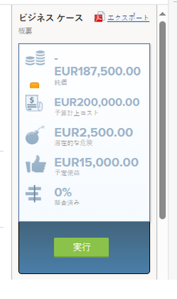

# ビジネスケースの承認

プロジェクトのリクエストに対してビジネス・ケースを完了して送信した後、ビジネス・ケースの承認が必要です。 これは、組織内のワークフローによって異なります。 プロジェクトは、ビジネスケースを承認する必要がなくても開始できますが、Adobe Workfrontの管理者やプロジェクトの所有者は、承認を行うのが理想的ではないと考えている可能性があります。 

ビジネス・ケースの完了と送信の詳細は、「 [プロジェクトのビジネスケースの作成](../../../manage-work/projects/define-a-business-case/create-business-case.md).

## アクセス要件

この記事の手順を実行するには、次のアクセス権が必要です。

<table style="table-layout:auto"> 
 <col> 
 <col> 
 <tbody> 
  <tr> 
   <td role="rowheader">Adobe Workfront plan*</td> 
   <td> <p>Pro 以上</p> </td> 
  </tr> 
  <tr> 
   <td role="rowheader">Adobe Workfront license*</td> 
   <td> <p>計画 </p> </td> 
  </tr> 
  <tr> 
   <td role="rowheader">アクセスレベル設定*</td> 
   <td> <p>プロジェクトへのアクセスを編集</p> <p>注意：まだアクセス権がない場合は、Workfront管理者に、アクセスレベルに追加の制限が設定されているかどうかを問い合わせてください。 Workfront管理者がアクセスレベルを変更する方法について詳しくは、 <a href="../../../administration-and-setup/add-users/configure-and-grant-access/create-modify-access-levels.md" class="MCXref xref">カスタムアクセスレベルの作成または変更</a>.</p> </td> 
  </tr> 
  <tr> 
   <td role="rowheader">オブジェクトの権限</td> 
   <td> <p>プロジェクトに対する権限の管理</p> <p>追加のアクセス権のリクエストについて詳しくは、 <a href="../../../workfront-basics/grant-and-request-access-to-objects/request-access.md" class="MCXref xref">オブジェクトへのアクセスのリクエスト </a>.</p> </td> 
  </tr> 
 </tbody> 
</table>

&#42;保有するプラン、ライセンスの種類、アクセス権を確認するには、Workfront管理者に問い合わせてください。

## ビジネスケースの承認の概要

プロジェクトのビジネス事例を承認する際は、次の点を考慮してください。

* ビジネスケースを承認するには、プロジェクトに対する管理権限が必要です。 
* 自宅の承認の下でビジネスケースが承認されるのを待っているプロジェクトを表示することはできません。
* ビジネスケースの承認が必要な個々のプロジェクトに手動で移動し、承認待ちであることを確認する必要があります。 プロジェクトのビジネス事例を承認する必要があることをユーザーに警告するWorkfront通知メカニズムはありません。
* プロジェクトレポートを作成するか、関連付けられているポートフォリオにアクセスすることで、ビジネスケースの承認を待っているプロジェクトを見つけることができます。 

  記事の詳細については、「Portfolio」を参照してください。 [Adobe WorkfrontのPortfolioの概要](../../../manage-work/portfolios/portfolios-overview/portfolio-overview.md).

## プロジェクトレポートを作成してビジネスケースを承認

プロジェクト用のレポートを作成して、承認されたビジネスケースが必要なプロジェクトを確認できます。 

ビジネス・ケースの承認待ちのプロジェクトのレポートを作成する手順は、次のとおりです。

1. プロジェクト用のレポートを作成します。

   レポートの作成について詳しくは、 [カスタムレポートの作成](../../../reports-and-dashboards/reports/creating-and-managing-reports/create-custom-report.md).

1. を選択します。 **表示** 」タブをクリックし、 **列を追加**.

1. 次の場所に「Status」と入力します。 **この列に表示** フィールドに値を入力し、リストに表示される場合はこのフィールドを選択します。

    この列には、プロジェクトのステータスが表示されます。

1. を選択します。 **フィルター** 」タブをクリックし、 **フィルタールールを追加する**.

1. 次の場所に「Status」と入力します。 **次の項目が含まれるプロジェクトのみを表示：** 」フィールドに入力し、リストに表示される場合に選択します。
1. 選択 **次と等しい** フィルタ修飾子用。
1. 使用可能フィールドに「Requested」と入力します。 

   これにより、レポートには「リクエスト済み」ステータスのプロジェクトのみが含まれます。

     

1. （オプション）「 **別のフィルタールールを追加**.

   フィルターを追加して、自分がプロジェクト所有者、プロジェクトスポンサー、またはPortfolio所有者であるプロジェクトのみを表示できます。

   例えば、次のフィルターステートメントを使用できます。 

   ```
   Project Sponsor ID Equals $$USER.ID
   ```

   プロジェクトスポンサーに指定されたプロジェクトを表示するには

   ```
   Project Owner ID Equals $$USER.ID
   ```

   プロジェクト所有者に指定されたプロジェクトを表示するには

   ```
   Project Portfolio Owner ID Equals $$USER. ID
   ```

   をクリックして、Portfolioマネージャーの指定場所を表示します。 

1. 「**保存して閉じる**」をクリックします。

   レポート内のすべてのプロジェクトのステータスが「 **リクエスト済み**.

1. レポート内のプロジェクトの名前をクリックして開きます。
1. クリック **ビジネス事例** をクリックします。
1. クリック **承認** または **拒否** （「ビジネス・ケース要約」領域）を使用して、ビジネス・ケースを承認または却下します。

   

   プロジェクトのステータスが「 **承認済み** （ビジネスケースが承認された場合）

   プロジェクトのステータスが「 **却下** （ビジネス・ケースが却下された場合）

   >[!NOTE]
   >
   >ビジネスケースの承認を送信したユーザーに、プロジェクトリクエストが承認されたか拒否されたかに関わらず、警告する通知はありません。

## ポートフォリオ内のリクエスト済みプロジェクトにアクセスしてビジネスケースを承認

リクエストされたプロジェクトのレビューの詳細については、「 [リクエストされたプロジェクトを確認](../../../manage-work/portfolios/create-and-manage-portfolios/review-requested-projects.md).
