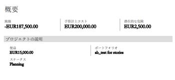

# ビジネスケースのエリアの概要

この記事では、プロジェクトのビジネスケースのエリアについて説明します。

プロジェクトのビジネスケースの作成について詳しくは、[プロジェクトのビジネスケースを作成](../../../manage-work/projects/define-a-business-case/create-business-case.md)を参照してください。

Adobe Workfront 管理者またはグループ管理者は、プロジェクト情報セクションを除き、ビジネスケース内のすべてのセクションを有効にしてプロジェクトに表示されるようにする必要があります。プロジェクト情報セクションは、デフォルトで有効になっています。

ビジネスケースのエリアを有効にする方法について詳しくは、[システム全体のプロジェクト環境設定の指定](../../../administration-and-setup/set-up-workfront/configure-system-defaults/set-project-preferences.md)の「ビジネスケース」の節を参照してください。

プロジェクトのビジネスケースに含まれるエリアを次に示します。

* プロジェクト情報
* Goals
* 費用
* リソース予算計上
* リスク
* スコアカード
* カスタムフォーム
* ビジネスケースの概要

## プロジェクト情報

Workfront 管理者は、ビジネスケースの&#x200B;**プロジェクト情報**&#x200B;エリアを設定できません。すべてのプロジェクトには、ビジネスケース内にプロジェクト情報エリアがあります。

ビジネスケースのプロジェクト情報セクションには、プロジェクトが実際に開始される前の、プロジェクトの基本情報が含まれます。

次のフィールドの編集を検討してください。

* **説明**：プロジェクトの説明を指定します。
* **プロジェクト所有者**

  デフォルトでは、プロジェクトを作成したユーザーがプロジェクト所有者になります。このフィールドを編集し、別のアクティブなユーザーをプロジェクトの所有者として指定できます。

* **プロジェクトスポンサー**

  プロジェクトのスポンサーとして、プロジェクト所有者以外のユーザーを追加することを検討してください。スポンサーは、ビジネスケースの承認を受けます。 

* **ポートフォリオ**：プロジェクトのポートフォリオを指定します。ポートフォリオを作成し、**アクティブ**&#x200B;ステータスに設定すると、このドロップダウンメニューで選択できるようになります。

  ポートフォリオについて詳しくは、[Adobe Workfront でのポートフォリオの概要](../../../manage-work/portfolios/portfolios-overview/portfolio-overview.md)を参照してください。

  ポートフォリオの作成について詳しくは、[ポートフォリオの作成](../../../manage-work/portfolios/create-and-manage-portfolios/create-portfolios.md)を参照してください。

* **予定利益**：このプロジェクトが完了したときに、組織が予定する金銭上の利益を見積もります。任意の金額の通貨を指定できますが、正の値にする必要があります。（例：$10,000）。
* **ステータス**：デフォルトでは、プロジェクトリクエストのステータスは「**アイデア**」に設定されています。

  「ステータス」を「アイデア」または「計画」以外に変更した場合、「**送信**」ボタンがビジネスケースの概要エリアに表示されなくなり、ビジネスケースを承認用に送信できなくなります。

* **固定開始日**：プロジェクトを開始する日付を指定します。
* **固定終了日**：プロジェクトを終了する日付を指定します。

  >[!NOTE]
  >
  >ビジネスケースの「固定開始日」と「終了日」は、プロジェクトの予定開始日と完了日には影響しません。これらは、プロジェクトが理想的に開発される時期に、プロジェクト作成者がリクエストした日付を表します。代わりに、プロジェクトの「予定開始日」と「予定完了日」に、プロジェクト上のタスクに基づくプロジェクトの計画タイムラインが表示されます。

## 目標

目標は、プロジェクトの目標を定義します。このエリアはビジネスケースではデフォルトで有効になっていますが、Workfront の管理者によって表示しないように選択できます。このフィールドには、目標が優先順に表示されます。

<!--

(NOTE: below snippet: NWE only, not classic)

-->

>[!TIP]
>
>プロジェクトの個々のビジネスケースに関連していない組織の戦略目標を作成できます。戦略的目標を作成するには、Adobe Workfront Goals にアクセスする必要があります。その後、ビジネスケース外のプロジェクトに接続できます。Workfront Goals を使用した目標の作成について詳しくは、[Adobe Workfront Goals の概要](../../../workfront-goals/goal-management/wf-goals-overview.md)を参照してください。

目標の定義は、ポートフォリオオプティマイザーでプロジェクトがスコアを受け取るにはオプションです。このセクションは、ビジネスケースの唯一のオプションセクションです。ビジネスケースのその他のセクションは、ポートフォリオオプティマイザーでプロジェクトのスコアリングを行う前に完了する必要があります。目標の作成時に、目標の優先度を指定できます。

目標について詳しくは、[ビジネスケース目標の作成](../../../manage-work/projects/define-a-business-case/create-business-case-goals.md)を参照してください。

## 費用

費用は、プロジェクトの存続中に発生する可能性のある非労務費を表します。このエリアはビジネスケースではデフォルトで有効になっていますが、Workfront の管理者によって表示しないように選択できます。 

ビジネスケースに入力する費用は、計画費用として、プロジェクトの「費用」タブにも入力されます。

費用は、プロジェクトの次のフィールドに影響します。

* 予算計上コスト
* 純価

予算計上コストと純価について詳しくは、[ビジネスケースの財務フィールドの概要](../../../manage-work/projects/define-a-business-case/business-case-finances.md)を参照してください。

費用について詳しくは、[プロジェクト費用を管理](../../../manage-work/projects/project-finances/manage-project-expenses.md)を参照してください。

Workfront 管理者はカスタム費用タイプを設定できます。

カスタム費用タイプの作成について詳しくは、[カスタム費用タイプの作成](../../../administration-and-setup/set-up-workfront/configure-system-defaults/create-custom-expense-types.md)を参照してください。

## リソース予算計上

ビジネスケースの「リソース予算計上」エリアでは、次のアクションを実行できます。

* リソースプールをプロジェクトに関連付ける。
* プロジェクトレベルでリソースを予算に計上する。

プロジェクト上でリソースに予算として計上された時間は、ビジネスケースの「リソース予算計上」エリアに表示され、プロジェクトの予算計上労力コストが生成されます。ビジネスケースのこのエリアは、デフォルトで有効になっています。

ビジネスケースでのプロジェクトのリソース予算計上について詳しくは、[ビジネスケースでのリソースの予算計上](../../../manage-work/projects/define-a-business-case/budget-resources-in-business-case.md)を参照してください。

ビジネスケースの「リソース予算計上」セクションを確認する際は、次の点を考慮してください。

* ここでは、次のツールを使用してリソース情報の予算を計上できます。

   * リソースプランナー

     詳しくは、[リソースプランナーを使用したビジネスケースでのリソースの予算計上](../../../manage-work/projects/define-a-business-case/budget-resources-in-business-case-use-resource-planner.md)を参照してください。

   * シナリオプランナー（会社がシナリオプランナー用に追加ライセンスを購入している場合）

     詳しくは、[シナリオプランナーを使用したビジネスケースでのリソースの予算計上](../../../manage-work/projects/define-a-business-case/budget-resources-in-business-case-use-scenario-planner.md)を参照してください。

     シナリオプランナーは、新しい Adobe Workfront エクスペリエンスでのみ使用でき、追加のライセンスが必要です。Workfront シナリオプランナーについて詳しくは、[シナリオプランナーの概要](../../../scenario-planner/scenario-planner-overview.md)を参照してください。

* ここに表示される情報は、システムレベルのリソースプランナーやシナリオプランナーにも表示されます。 

  <!--
  
(NOTE: the "or" stays in&nbsp;NWE&nbsp;only) 

  -->

* 担当業務が 1 時間当たりのコストのレートに関連付けられている場合は、リソースの予算を計上すると、「リソース予算計上」エリアにプロジェクトの予算計上労力コストが表示されます。予算計上労力コストは、プロジェクトの通貨で表示されます。

  >[!IMPORTANT]
  >
  >予算計上労力コストは、ユーザーではなく、プロジェクトの担当業務に関連付けられたコストです。ユーザーの予算計上労力コストの合計は、ユーザーに関連付けられた担当業務の予算計上労力コストと等しくなる場合もあれば、異なる場合もあります。 

  予算計上労力コストについて詳しくは、[ビジネスケースの財務フィールドの概要](../../../manage-work/projects/define-a-business-case/business-case-finances.md)を参照してください。

  担当業務の作成および 1 時間当たりのコストのレートを担当業務に関連付ける方法について詳しくは、[担当業務の作成と管理](../../../administration-and-setup/set-up-workfront/organizational-setup/create-manage-job-roles.md)を参照してください。

## リスク

リスクとは、プロジェクトが期限や予算を超過せずに完了することを妨げる可能性のある要因のことです。これらの要因を定義することは、ポートフォリオマネージャーやプロジェクトスポンサーが、プロジェクトの承認に関して情報に基づく決定を下すうえで重要です。このエリアはビジネスケースではデフォルトで有効になっていますが、Workfront の管理者によって表示しないように選択できます。

潜在的なコストを、万一発生した場合を想定して定義するリスクに関連付けることができます。プロジェクトのリスクに伴うコストは、プロジェクトの純価に影響を与えます。 

プロジェクトの純価値の詳細については、[ビジネスケースの財務フィールドの概要](../../../manage-work/projects/define-a-business-case/business-case-finances.md)を参照してください。

リスクの作成の詳細については、[プロジェクトでのリスクの作成と編集](../../../manage-work/projects/define-a-business-case/create-edit-risks-on-projects.md)を参照してください。

Workfront 管理者はカスタムリスクタイプを設定できます。

カスタムリスクタイプの作成と編集の詳細については、[リスクタイプの編集と作成](../../../administration-and-setup/set-up-workfront/configure-system-defaults/edit-create-risk-types.md)を参照してください。

## スコアカード

スコアカードは、プロジェクトの整合性を測定します。このエリアはビジネスケースではデフォルトで有効になっていますが、Workfront の管理者によって表示しないように選択できます。

プロジェクトへのスコアカードの適用および整合性スコアの生成について詳しくは、[プロジェクトへのスコアカードの適用および整合性スコアの生成](../../../manage-work/projects/define-a-business-case/apply-scorecard-to-project-to-generate-alignment-score.md)を参照してください。

スコアカードを適用するには、Workfront 管理者がスコアカードを作成する必要があります。スコアカードが作成されていないと、ビジネスケースの&#x200B;**スコアカード**&#x200B;エリアは表示されません。

スコアカード作成の詳細については、[スコアカードの作成](../../../administration-and-setup/set-up-workfront/configure-system-defaults/create-scorecard.md)を参照してください。

## カスタムフォーム

ビジネスケースを定義する際に、プロジェクトにカスタムフォームを添付できます。ビジネスケースでは、このエリアはデフォルトでは有効になっていません。ビジネスケースに表示するには、Workfront 　管理者が有効にする必要があります。

ビジネスケースのエリアを有効にする方法について詳しくは、[システム全体のプロジェクト環境設定の指定](../../../administration-and-setup/set-up-workfront/configure-system-defaults/set-project-preferences.md)を参照してください。

カスタムフォームを適用するには、まず Workfront 管理者がカスタムフォームを作成する必要があります。

カスタムフォームの作成について詳しくは、[カスタムフォームの作成または編集](../../../administration-and-setup/customize-workfront/create-manage-custom-forms/create-or-edit-a-custom-form.md)を参照してください。

カスタムフォームを使用して、ビジネスケースの他のフィールドに表示されない追加情報を収集できます。

カスタムフォームの適用について詳しくは、[ビジネスケースへのカスタムフォームの添付](../../../manage-work/projects/define-a-business-case/attach-custom-form-to-business-case.md)を参照してください。

## ビジネスケースの概要

* [ビジネスケースの概要](#overview-of-the-business-case-summary)
* [ビジネスケースをエクスポート](#export-the-business-case)

### ビジネスケースの概要 {#overview-of-the-business-case-summary}

主なプロジェクトの財務状況の概要と、プロジェクトがスコアカードと整合性が取れているかどうかの概要は、ビジネスケースの右上隅にあるビジネスケースの概要パネルで確認できます。

ビジネスケースの概要は編集できません。これは、財務エリアとスコアカードに関連する、プロジェクトの状態のクイックビューに過ぎません。 \
 

ビジネスケースの概要には、次のフィールドが表示されます。

* プロジェクト純価
* プロジェクト予算計上コスト
* 潜在リスクコスト
* 予定利益
* 整合性スコア

これらのフィールドの詳細については、[ビジネスケースの財務フィールドの概要](../../../manage-work/projects/define-a-business-case/business-case-finances.md)を参照してください。

### ビジネスケースをエクスポート {#export-the-business-case}

<!--

(NOTE: made this into a standalone article, linked in the first paragraph of this section)

-->

ビジネスケースを印刷したり、より圧縮された形式でメールに添付したりする必要がある場合に備えて、ビジネスケースを PDF ファイルに書き出すことができます。 

詳しくは、[プロジェクトのビジネスケースの書き出し](../../../manage-work/projects/define-a-business-case/export-business-case.md)を参照してください。

<!--

To export a Business Case:

<ol>
<li value="1">Go to the <strong>Business Case</strong> area of a project. </li>
<li value="2"> 
In the<strong>Business Case Summary</strong> area, click <strong>Export</strong>. A PDF file is downloaded to your computer. The file contains all areas of the Business Case in an easy to read format.
 
  
 </li>
<li value="3">(Optional) You can attach the PDF file to an email, or print it.&nbsp;</li>
</ol>

-->

<!--

You can export the Business Case to a PDF file, in case you need to print it or attach it to an email in a more condensed format.&nbsp; The file contains all areas of the Business Case in an easy to read format.

For information about how to export the Business Case, see <a href="../../../manage-work/projects/define-a-business-case/export-business-case.md" class="MCXref xref">Export the Business Case of a project </a>
 <!--

(NOTE: drafted and will replace the info above, when the standalone arrticle is live >> Becky!)

-->

--&gt;
