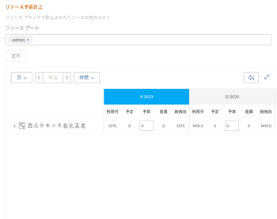

# リソースプランナーを使用したビジネスケースのリソースの予算計上

リソース計画の一環として、プロジェクトレベルのリソースプランナーを使用して、ビジネスケースの作成時にプロジェクトで作業を完了するために必要な担当業務のリソースを予算計上できます。

ビジネスケースの作成について詳しくは、[プロジェクトのビジネスケースの作成](../../../manage-work/projects/define-a-business-case/create-business-case.md)を参照してください。

>[!TIP]
>
>プロジェクトレベルのリソースプランナーに入力した情報は、システムレベルのリソースプランナーにも表示されます。その逆も同じです。リソースプランナーについて詳しくは、[リソースプランナーの概要](../../../resource-mgmt/resource-planning/get-started-resource-planner.md)を参照してください。

Adobe Workfront シナリオプランナーを使用して、ビジネスケースのリソースを予算計上することもできます。詳しくは、[シナリオプランナーを使用したビジネスケースのリソースの予算計上](../../../manage-work/projects/define-a-business-case/budget-resources-in-business-case-use-scenario-planner.md)を参照してください。

## アクセス要件

以下が必要です。

<table style="table-layout:auto"> 
 <col> 
 <col> 
 <tbody> 
  <tr> 
   <td role="rowheader"><a href="https://www.workfront.com/plans" target="_blank">Adobe Workfront プラン</a>*</td> 
   <td> 
Pro 以上
 </td> 
  </tr> 
  <tr> 
   <td role="rowheader"><a href="../../../administration-and-setup/add-users/access-levels-and-object-permissions/wf-licenses.md" class="MCXref xref">Adobe Workfront ライセンスの概要</a>*</td> 
   <td> 
レビュー以上
 
重要：リソース予算計上情報を変更するには、プランライセンスが必要です。 
 </td> 
  </tr> 
  <tr> 
   <td role="rowheader">アクセスレベル設定*</td> 
   <td> 
以下の項目についてアクセス権を編集します。 
 
    <ul> 
     <li> 
プロジェクト
 </li> 
     <li> 
リソース管理
 </li> 
     <li> 
財務データ
 </li> 
    </ul> 
リソースの予算計上に必要なアクセス権について詳しくは、<a href="../../../resource-mgmt/resource-planning/access-needed-to-budget-resources.md" class="MCXref xref">Adobe Workfront のリソース予算計上に必要なアクセス権</a>を参照してください。
 
メモ：まだアクセス権がない場合は、アクセスレベルに追加の制限が設定されていないかどうか Workfront 管理者にお問い合わせください。Workfront 管理者がアクセスレベルを変更する方法について詳しくは、<a href="../../../administration-and-setup/add-users/configure-and-grant-access/create-modify-access-levels.md" class="MCXref xref">カスタムアクセスレベルの作成または変更</a>を参照してください。
 </td> 
  </tr> 
  <tr> 
   <td role="rowheader">オブジェクト権限</td> 
   <td> 
プロジェクトに対する権限を管理
 
追加のアクセス権のリクエストについて詳しくは、<a href="../../../workfront-basics/grant-and-request-access-to-objects/request-access.md" class="MCXref xref">オブジェクトへのアクセス権のリクエスト </a>を参照してください。
 </td> 
  </tr> 
 </tbody> 
</table>

&#42;保有するプラン、ライセンスタイプ、アクセス権を確認するには、Workfront 管理者に問い合わせてください。

## 前提条件

始める前に、以下を行う必要があります。

* Adobe Workfront でのリソース計画に必要な前提条件をすべて満たす。詳しくは、[リソースプランナーの概要](../../../resource-mgmt/resource-planning/get-started-resource-planner.md)を参照してください。

* リソースプールをプロジェクトに関連付ける。

  <!--
  
(NOTE:(you must have tasks assigned to job roles and users on the project - this is optional because the users and their roles come from the pools))

  -->

  >[!NOTE]
  >
  >ビジネスケースのイシューに割り当てられたリソースは予算計上できません。システムレベルのリソースプランナーに予算計上できます。リソースプランナーについて詳しくは、[リソースプランナーの概要](../../../resource-mgmt/resource-planning/get-started-resource-planner.md)を参照してください。

* これは前提条件ではありませんが、プロジェクトのタスクに対して予定時間数を指定することをお勧めします。これにより、タスクの完了に必要な作業量を把握でき、タスクの完了に必要なリソースを予算計上する時間数を決定できます。タスクと予定時間数の関連付けについて詳しくは、[タスクの編集](../../../manage-work/tasks/manage-tasks/edit-tasks.md)を参照してください。

## ビジネスケースでのプロジェクトへのリソースプールの適用とリソースの予算計上

>[!IMPORTANT]
>
>リソースは 15 年の期間にわたって予算計上できます。期間が 15 年を超えるプロジェクトのリソースを予算計上すると、計上する情報が正確でなくなる可能性があります。

リソースプールのないプロジェクトに対して、ビジネスケースでリソースプールを適用しプロジェクトリソースを予算計上する手順は、次のとおりです。

1. 予算計上するプロジェクトにリソースを移動します。
1. 左パネルの&#x200B;**ビジネスケース**&#x200B;をクリックします。
1. （条件付き）会社が Workfront シナリオプランナーのライセンスを持っていない場合は、「**リソース予算計上**」セクションの「**リソース予算計上を編集**」をクリックして、手順 5 に進みます。

   <!--
   
(NOTE: ensure it stays right - this is 5 instead of 6 because step 2 won't print for nwe)

   -->

1. （オプションおよび条件付き）プロジェクト情報がシナリオプランナーのイニシアチブから発行された場合は、次のいずれかの操作を行います。

   * 「**プロジェクトの予算計上労力コストの計算に使用する時間数を選択**」フィールドでリソースプランナーを選択し、**選択／「リソース予算計上を編集」**&#x200B;をクリックします。

     

   * プロジェクトのリソースを予算計上するためにシナリオプランナーを選択した場合は、**変更**／**リソース予算計上の編集**&#x200B;をクリックします。

     

   これは、プロジェクトの予算計上時間数を使用して、プロジェクトの予算計上労力コストを計算します。

   シナリオプランナーは、新しい Adobe Workfront エクスペリエンスでのみ使用でき、追加のライセンスが必要です。Workfront シナリオプランナーについては、[シナリオプランナーの概要](../../../scenario-planner/scenario-planner-overview.md)を参照してください。

   >[!NOTE]
   >
   >プロジェクトの作業を開始する際に、リソースプランナーとシナリオプランナーのどちらを使用するかを決定することをお勧めします。プロジェクトの期間中にこの 2 つを頻繁に切り替えると、プロジェクトのリソースを予算計上する方法に一貫性がなくなる可能性があります。

1. 「**-- リソースプールの選択 --**」フィールドで、1 つまたは複数の&#x200B;**リソースプール**&#x200B;を指定します。

   アクティブなユーザーがいるリソースプールのみを指定する必要があります。

   >[!TIP]
   >
   >プロジェクトが既にリソースプールに関連付けられている場合、リソースプランナーがデフォルトで表示されます。プロジェクトにさらにリソースプールを追加するには、プロジェクトを編集します。プロジェクトの編集については、[プロジェクトの編集](../../../manage-work/projects/manage-projects/edit-projects.md)を参照してください。

1. 「**適用**」をクリックします。

   選択したプロジェクトを対象に、リソースプランナーが表示されます。

   デフォルトでは、このプロジェクトに関連付けられている最初の 20 件の担当業務が、「リソース予算計上」セクションにアルファベット順に表示されます。 

   リソースプランナーについて詳しくは、[リソースプランナーの概要](../../../resource-mgmt/resource-planning/get-started-resource-planner.md)を参照してください。

   

1. （オプションおよび条件付き）担当業務を展開して、関連付けられているユーザーを表示します。

   >[!NOTE]
   >
   >アクティブなユーザーが関連付けられている担当業務の下に表示されるのは、そのユーザーが次の条件を満たす場合のみです。
   >
   >   
   >   
   >* プロジェクトのリソースプールの 1 つに属している。
   >* 予算計上時間数が割り当てられている。
   >* プロジェクトの担当業務の 1 つに関連付けられている。
   >   
   >

    

1. 「**本日**」をクリックして、今日の時間枠に戻ります。
1. （オプション）「**週**」、「**月**」または「**四半期**」をクリックして、異なる時間枠でプロジェクトの情報を表示します。
1. （オプション）**時間**&#x200B;ドロップダウンメニューをクリックして、「**時間**」、「**FTE**」または「**コスト**」を選択して、リソースプランナーでの情報の表示方法を変更します。デフォルトでは時間が表示されます。

1. （オプション）「**書き出し**」をクリックして、リソースプランナーを Excel ファイルに書き出します。

   >[!NOTE]
   >
   >一度に最大 12 個の期間のデータを書き出せます。

1. （オプション）**全画面表示**&#x200B;アイコン  をクリックして、リソースプランナーを全画面表示モードで表示します。

1. 次のいずれかを行って、ユーザー、役割またはプロジェクトの時間、FTE またはコストの値で「**BDG**（予算計上時間数）」を更新します。

   * 役割、ユーザーまたはプロジェクトの時間、FTE またはコストの値を手動で見積もります。

     または

   * プロジェクトまたは担当業務の&#x200B;**オプション**&#x200B;アイコンをクリックし、役割、ユーザーまたはプロジェクトの時間数を自動的に予算計上するオプションを選択します。

   リソースプランナーのプロジェクトビューでの予算計上について詳しくは、[リソースプランナーのプロジェクトビューおよび役割ビューを使用したリソースの予算計上](../../../resource-mgmt/resource-planning/budget-resources-project-role-views-resource-planner.md)を参照してください。

   >[!NOTE]
   >
   >プロジェクトのタイムラインに関係なく、リソース予算計上エリアに表示されるあらゆる時間枠のリソースの時間、FTE またはコストを予算計上できます。例えば、（予定時間数に関連付けられた）プロジェクトのタイムラインではリソースが使用できないが別の時間では使用できる可能性があることを示す場合は、予定時間数がゼロの時間枠にリソースの予算を計上することができます（その期間にリソースが作業に使用できるようになる場合）。

1. （オプション）予算計上された時間、FTE またはコストを別の時間枠に移動できるかどうかを把握するには、**オプション**&#x200B;アイコンをクリックしたあと、「**予算日の調整**」をクリックします。

   予算日の調整について詳しくは、[リソースプランナーでの予算日の調整](../../../resource-mgmt/resource-planning/adjust-budgeting-dates.md)を参照してください。

1. 「**保存**」をクリックします。

   1 時間あたりのコスト率が担当業務に関連付けられている場合は、リソース予算計上エリアでリソースの予算を計上すると、プロジェクトの&#x200B;**予算計上労力コスト**&#x200B;が計算されます。予算計上労力コストは、ビジネスケースのリソース予算計上エリアとビジネスケース概要に表示されます。

   >[!TIP]
   >
   >コストは、ビジネスケースにプロジェクトの通貨で表示されます。

   ビジネスケースで指定された予算情報は、リソースプランナーにも表示されます。

   プロジェクトをコピーする場合は、予算計上時間数も新規プロジェクトにコピーするオプションがあります。リソースプランナーで予算計上された時間のみがコピーされます。詳しくは、[プロジェクトのコピー](../manage-projects/copy-project.md)を参照してください。
