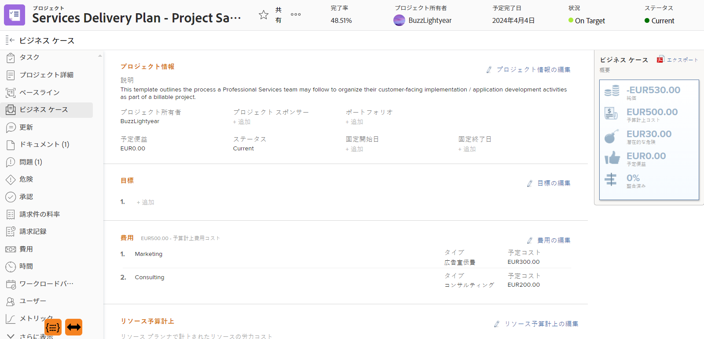
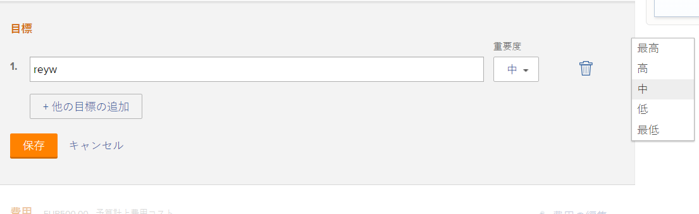

# ビジネスケース目標の作成

ビジネスケースの作成の一環として、一連の目標を作成し、プロジェクトの目標を定義できます。 ビジネス事例の目標は、プロジェクトを完了する目的をPortfolioマネージャーまたはプロジェクトスポンサーに伝えるために使用されます。

<!--

(NOTE: below snippet: NWE only, not classic)

-->

>[!TIP]
>
>プロジェクトの個々のビジネスケースに関連していない組織の戦略目標を作成できます。 戦略的目標を作成するには、Adobe Workfront目標にアクセスできる必要があります。 その後、ビジネスケース外のプロジェクトに接続できます。 Workfront目標を使用した目標の作成について詳しくは、 [Adobe Workfront目標の概要](../../../workfront-goals/goal-management/wf-goals-overview.md).

プロジェクトのビジネスケース目標を作成する際は、次の点を考慮してください。

* ビジネスケースの目標は、プロジェクト固有です。 あるプロジェクトから別のプロジェクトに目標をコピーしたり、システムレベルで目標を設定することはできません。 これらは、各プロジェクトのレベルで定義する必要があります。
* Adobe Workfront管理者またはグループ管理者は、プロジェクトのビジネスケースに表示する前に、プロジェクトの「目標」セクションを有効にする必要があります。 プロジェクトに対してビジネスケースフィールドを有効にする方法については、 [システム全体のプロジェクト環境設定の指定](../../../administration-and-setup/set-up-workfront/configure-system-defaults/set-project-preferences.md).

* 目標は、プロジェクトのビジネス事例の必須の節ではありません。

   ビジネス・ケースの「目標」セクションが定義されていない場合でも、Portfolio・オプティマイザで優先順位付けされるスコアをプロジェクトに割り当てることができます。

   Optimizer のスコアの詳細については、「Portfolio・オプティマイザのスコア」を参照してください。 [プロジェクトにスコアカードを適用し、線形スコアを生成する](../../../manage-work/projects/define-a-business-case/apply-scorecard-to-project-to-generate-alignment-score.md).

* ビジネス事例の目標はレポートできません。

## アクセス要件

この記事の手順を実行するには、次のアクセス権が必要です。

<table style="table-layout:auto"> 
 <col> 
 </col> 
 <col> 
 </col> 
 <tbody> 
  <tr> 
   <td role="rowheader">Adobe Workfront plan*</td> 
   <td> 
Pro 以上
 </td> 
  </tr> 
  <tr> 
   <td role="rowheader">Adobe Workfront license*</td> 
   <td> 
計画 
 </td> 
  </tr> 
  <tr> 
   <td role="rowheader">アクセスレベル設定*</td> 
   <td> 
プロジェクトへのアクセスを編集
 
注意：まだアクセス権がない場合は、Workfront管理者に、アクセスレベルに追加の制限を設定しているかどうかを問い合わせてください。 Workfront管理者がアクセスレベルを変更する方法について詳しくは、 <a href="../../../administration-and-setup/add-users/configure-and-grant-access/create-modify-access-levels.md" class="MCXref xref">カスタムアクセスレベルの作成または変更</a>.
 </td> 
  </tr> 
  <tr> 
   <td role="rowheader">オブジェクト権限</td> 
   <td> 
プロジェクトに対する権限以上の管理
 
追加のアクセス権のリクエストについて詳しくは、 <a href="../../../workfront-basics/grant-and-request-access-to-objects/request-access.md" class="MCXref xref">オブジェクトへのアクセスのリクエスト </a>.
 </td> 
  </tr> 
 </tbody> 
</table>

&#42;保有しているプラン、ライセンスの種類、アクセス権を確認するには、Workfront管理者に問い合わせてください。

## プロジェクトのビジネス事例に目標を追加

1. ビジネス事例の目標を定義するプロジェクトに移動します。
1. クリック **ビジネスケースを左パネルに表示します。**

   ビジネスケースが表示されます。

   

1. 内 **目標** セクションで、 **目標を編集**.

1. 目標を指定します。
 内 **重要度** ドロップダウンメニューから、重要度のレベルを選択します。

   * 最高
   * 高
   * 中
   * 低
   * 最低

      

      目標の重要度レベルはカスタマイズできません。

1. （オプション）別の目標を追加するには、 **別の目標を追加**&#x200B;手順 5 と手順 6 を繰り返します。
1. クリック **保存**.
