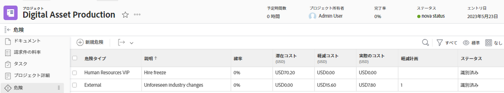

# プロジェクトのリスクの作成と編集

リスクとは、プロジェクトが予定通りに完了しない、または予算内で完了しない可能性のあるイベントや要因です。 リスクは、プロジェクトのビジネス事例の作成の一環として、または「リスク」タブを使用して記録できます。 リスクはプロジェクト上でのみ作成されます。 リスクをタスクやタスクに関連付けることはできません。

リスクはコストに関連付けることができますが、実際のリスクコストはプロジェクトの実際のコストには影響しません。

>[!NOTE]
>
>この記事では、プロジェクトのビジネス事例でプロジェクトを定義する場合、またはプロジェクトの「リスク」タブでプロジェクトに追加する場合に、プロジェクトに関連するリスクを定義します。 プロジェクトの編集時に使用できる [ リスク ] フィールドについては、 [プロジェクトを編集](../../../manage-work/projects/manage-projects/edit-projects.md).

## アクセス要件

この記事の手順を実行するには、次のアクセス権が必要です。

<table style="table-layout:auto"> 
 <col> 
 <col> 
 <tbody> 
  <tr> 
   <td role="rowheader">Adobe Workfront plan*</td> 
   <td> 
任意
 </td> 
  </tr> 
  <tr> 
   <td role="rowheader">Adobe Workfront license*</td> 
   <td> 
計画 
 </td> 
  </tr> 
  <tr> 
   <td role="rowheader">アクセスレベル設定*</td> 
   <td> 
プロジェクトおよび財務データへのアクセスを編集
 
注意：まだアクセス権がない場合は、Workfront管理者に、アクセスレベルに追加の制限を設定しているかどうかを問い合わせてください。 Workfront管理者がアクセスレベルを変更する方法について詳しくは、 <a href="../../../administration-and-setup/add-users/configure-and-grant-access/create-modify-access-levels.md" class="MCXref xref">カスタムアクセスレベルの作成または変更</a>.
 </td> 
  </tr> 
  <tr> 
   <td role="rowheader">オブジェクト権限</td> 
   <td> 
 リスクを作成または編集するプロジェクトに対する財務の管理を含む権限を管理します 
 
プロジェクト権限の詳細については、「 <a href="../../../workfront-basics/grant-and-request-access-to-objects/share-a-project.md" class="MCXref xref">Adobe Workfrontでプロジェクトを共有する</a>.
 </td> 
  </tr> 
 </tbody> 
</table>

&#42;保有しているプラン、ライセンスの種類、アクセス権を確認するには、Workfront管理者に問い合わせてください。

## ビジネスケース内のリスクの作成と編集

プロジェクトのビジネス事例を計画する際に、リスクを作成できます。 確率、緩和計画、コストなどに変更が生じた場合は、後でビジネスケースで編集できます。 ビジネス事例の作成の詳細は、 [プロジェクトのビジネスケースの作成](../../../manage-work/projects/define-a-business-case/create-business-case.md).

Workfront管理者またはグループ管理者が **リスク** 」セクションを参照してください。 プロジェクトの環境設定の詳細については、 [システム全体のプロジェクト環境設定の指定](../../../administration-and-setup/set-up-workfront/configure-system-defaults/set-project-preferences.md).

ビジネス事例のリスクの作成と編集は同じです。

ビジネス・ケース内でリスクを作成または編集する手順は、次のとおりです。

1. リスクを作成するプロジェクトに移動します。
1. クリック **ビジネス事例** をクリックします。
1. 内 **リスク** セクションで、 **リスクを編集**.
1. 次の情報を入力または編集します。

   * **説明：** リスクを説明します。

   * **潜在的なコスト**:リスクが発生する必要がある場合の推定コストを示します。

   * **確率**:リスクが発生する確率を割合 (%) で示します。

   * **タイプ：** リスクのカテゴリを示します。
   * **緩和計画**:リスクを軽減するために、計画の説明を更新します。

   * **緩和コスト**:リスクの発生を防ぐために実施する必要がある緩和計画のコストを示します。

   

1. （オプション）「 **別のリスクを追加** リスクをさらに高める。
1. 「**保存**」をクリックします。

## [ リスク ] 領域でリスクを作成および編集

ビジネスケースでのリスクの作成と編集に加え、 **リスク** プロジェクトのセクション。

* [[ リスク ] 領域にリスクを作成する](#create-risks-in-the-risks-area)
* [[ リスク ] 領域でリスクを編集する](#edit-risks-in-the-risks-area)

### [ リスク ] 領域にリスクを作成する {#create-risks-in-the-risks-area}

1. リスクを作成するプロジェクトに移動します。
1. クリック **リスク** をクリックします。

   

1. クリック **リスクの追加を開始** インライン編集によってリスクを生み出す

   または

   クリック **新しいリスク**. この **新しいリスク** ダイアログボックスが開きます。

1. 次の情報を入力します。

   * **説明**:リスクを説明します。
   * **リスクタイプ**:リスクのカテゴリを示します。\
      Workfront管理者が、お使いの環境で使用可能なリスクタイプを定義します。 リスクタイプの定義の詳細は、この記事を参照してください。 [リスクタイプの編集と作成](../../../administration-and-setup/set-up-workfront/configure-system-defaults/edit-create-risk-types.md).

   * **確率**:リスクが発生する確率を割合 (%) で示します。
   * **潜在的なコスト**:リスクが発生する必要がある場合の推定コストを示します。
   * **緩和コスト**:リスクの発生を防ぐために実施する必要がある緩和計画のコストを示します。
   * **実費**:リスクが発生した場合のリスクの実際のコストを示します。
   * **緩和計画**:リスクを軽減するために、計画の説明を更新します。

1. （条件付き）クリック **入力** インラインでリスクを作成する場合。

   または

   クリック **保存** ( **新しいリスク** ダイアログボックス

1. （オプション）別の **ステータス** リスクに関しては、 **ステータス** ドロップダウンメニュー ( **標準** リスクのリストを表示します。

   デフォルトでは、「リスクのステータス」は **識別済み**.

### [ リスク ] 領域でリスクを編集する {#edit-risks-in-the-risks-area}

プロジェクトの存続期間中、変更の確率、潜在的なコスト、ステータスなどが変化した場合に、リスクを編集できます。

一度に 1 つのリスクを編集することも、複数のリスクを一括で編集することもできます。

リスクを編集する手順は、次のとおりです。

1. 既存のリスクを編集するプロジェクトにナビゲートします。
1. クリック **リスク** をクリックします。
1. リストに表示されるリスクのフィールドをインライン編集して、一度に 1 つのリスクを編集します。

   または

   1 つまたは複数のリスクを選択し、「 **編集** 複数のリスクを同時に編集する。

   >[!NOTE]
   >
   >複数のリスクを同時に編集する場合は、選択したすべてのリスクに同じ情報を適用します。 変更前の各リスクに関連する情報は、一括編集で上書きされます。

1. をクリックした場合、 **編集**、 **リスクの編集** ダイアログボックスが開きます。

   次のフィールドの編集を検討してください。

   * **説明**:リスクの説明を編集します。
   * **リスクタイプ**:リスクのカテゴリを示します。
   * **確率**:リスクが発生する確率を割合 (%) で示します。
   * **潜在的なコスト**:リスクが発生する必要がある場合の推定コストを示します。
   * **緩和コスト**:リスクの発生を防ぐために実施する必要がある緩和計画のコストを示します。
   * **実費**:リスクが発生した場合のリスクの実際のコストを示します。
   * **緩和計画**:リスクを軽減するために、計画の説明を更新します。

1. クリック **変更を保存**.
1. （オプション） **ステータス** 危険を冒して **ステータス** ドロップダウンメニュー ( **標準** リスクのリストを表示します。

   >[!NOTE]
   >
   >次の項目は編集できません： **ステータス** リスクの **リスクの編集** ダイアログボックス これは、インライン編集でのみ可能です。
