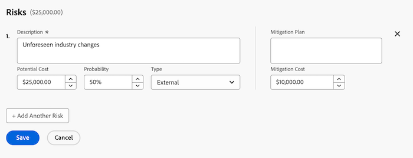
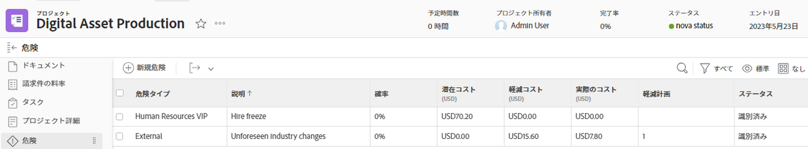

# プロジェクトに関するリスクの作成と編集

<!--Audited: 06/2025-->

<!--
The highlighted information on this page refers to functionality not yet generally available. It is available only in the Preview environment for all customers. The same features will also be available in the Production environment for all customers after a week from the Preview release.    

For more information, see [Interface modernization](/help/quicksilver/product-announcements/product-releases/interface-modernization/interface-modernization.md). 
-->

リスクとは、プロジェクトが時間通りに、または予算内で完了することを妨げる可能性のあるイベントまたは要因のことです。プロジェクトのビジネスケースの作成の一環として、または「リスク」タブを使用して、リスクを記録できます。

リスクは、プロジェクトまたはテンプレートに対してのみ作成できます。 リスクをタスクやイシューに関連付けることはできません。

リスクをコストに関連付けることができますが、実際のリスクコストはプロジェクトの実際のコストには影響しません。

>[!NOTE]
>
>この記事では、プロジェクトのビジネスケースでプロジェクトに関連するリスクを定義するか、プロジェクトの「リスク」タブで追加する際に、プロジェクトに関連するリスクを定義します。
>
>プロジェクトの編集時に使用できる「リスク」フィールドについて詳しくは、[プロジェクトの編集](../../../manage-work/projects/manage-projects/edit-projects.md)を参照してください。

## アクセス要件

+++ 展開すると、この記事の機能のアクセス要件が表示されます。 

<table style="table-layout:auto"> 
 <col> 
 <col> 
 <tbody> 
  <tr> 
   <td role="rowheader">
Adobe Workfront パッケージ
</td> 
   <ul><li>プロジェクトのリスク領域にリスクを追加する任意の計画
</li>
   <li>
プロジェクトのビジネスケースにリスクを追加するには、Prime以上を使用します
</li></ul>
   </td> 
  </tr> 
  <tr> 
   <td role="rowheader">
Adobe Workfront プラン
</td> 
   <td> 
標準 

   
プラン 
 </td> 
  </tr> 
  <tr> 
   <td role="rowheader">
アクセスレベル設定
</td> 
   <td> 
プロジェクトと財務データへのアクセスの編集
 </td> 
  </tr> 
  <tr> 
   <td role="rowheader">
オブジェクト権限
</td> 
   <td> 
 リスクを作成または編集するプロジェクトに対する、財務の管理を含む権限を管理します 
 </td> 
  </tr> 
 </tbody> 
</table>

詳しくは、[Workfront ドキュメントのアクセス要件](/help/quicksilver/administration-and-setup/add-users/access-levels-and-object-permissions/access-level-requirements-in-documentation.md)を参照してください。

+++

## ビジネスケースでのリスクの作成と編集

プロジェクトのビジネスケースを計画する際に、リスクを作成できます。確率、軽減計画、コストなどに変更が生じた場合は、後でビジネスケースでリスクを編集できます。ビジネスケースの作成について詳しくは、[プロジェクトでのビジネスケースの作成](../../../manage-work/projects/define-a-business-case/create-business-case.md)を参照してください。

「ビジネスケース」セクションでプロジェクトレベルでリスクを確認できるようにするには、Workfront 管理者またはグループ管理者がビジネスケースの「**リスク**」セクションを「プロジェクト環境設定」領域で有効にする必要があります。プロジェクト環境設定の指定について詳しくは、[システム全体のプロジェクト環境設定の指定](../../../administration-and-setup/set-up-workfront/configure-system-defaults/set-project-preferences.md)を参照してください。

ビジネスケースでのリスクの作成と編集は同じです。

ビジネスケースでリスクを作成または編集するには、次の操作を実行します。

1. リスクを作成するプロジェクトに移動します。
1. 左側のパネルで「**ビジネスケース**」をクリックします。
1. **リスク** セクションで、**編集** アイコン をクリックします
1. 次の情報を入力または編集します。

   * **説明：** リスクについて説明します。

   * **潜在的なコスト**：リスクが発生する可能性がある場合は、見積もりコストを入力します。

   * **確率**: リスクが発生する確率をパーセント値として入力します。

   * **種類：** リスクがどのカテゴリに属するかを選択します。
   * **緩和計画**：リスクを軽減するために、計画の説明を更新します。

   * **緩和コスト**：リスクが発生するのを防ぐために導入する必要がある緩和プランのコストを入力します。

   

1. （オプション）「**別のリスクを追加**」をクリックして、さらにリスクを追加します。
1. 「**保存**」をクリックします。

## 「リスク」エリアでのリスクの作成と編集

ビジネスケースの他にも、プロジェクトの「**リスク**」セクションを使って、リスクの作成や編集を行えます。

プロジェクトまたはテンプレートの「リスク」セクションで、リスクを作成および編集できます。 テンプレートのリスクの作成は、プロジェクトのリスクの作成と同じです。

1. リスクを作成するプロジェクトに移動します。
1. 左パネルで「**リスク**」をクリックします。

   

1. 「**さらにリスクを追加**」をクリックし、情報をインライン編集してリスクを作成します。

   または

   「**新しいリスク**」をクリックして、**新しいリスク** ボックスを開きます。

   

1. （条件付き）新しいリスク **ボックスにリスクを追加する場合は、次の情報を入力します。**

   * **説明**: リスクについて説明します。 必須フィールドです。
   * **リスクの種類**：リスクがどのカテゴリに属しているかを示します。\
     Workfront 管理者が、お使いの環境で使用可能なリスクタイプを定義します。リスクタイプの定義の詳細情報については、「[リスクタイプの編集と作成](../../../administration-and-setup/set-up-workfront/configure-system-defaults/edit-create-risk-types.md)」の記事を参照してください。

   * **確率**: リスクが発生する確率をパーセント値で示します。
   * **潜在的なコスト**：リスクが発生する可能性がある場合の見積もりコストを示します。
   * **実際のコスト**：リスクが発生した場合の実際のリスクのコストを示します。
   * **緩和コスト**：リスクの発生を防ぐために導入する必要がある緩和プランのコストを示します。
   * **緩和計画**：リスクを軽減するために、計画の説明を更新します。

1. 「**保存**」をクリックします。

1. （オプション）リスクのリストに&#x200B;**標準**&#x200B;ビューを適用する場合、**ステータス**&#x200B;ドロップダウンメニューで、リスクの別の「**ステータス**」を選択します。

   デフォルトでは、リスクの&#x200B;**ステータス**&#x200B;は&#x200B;**識別済み**&#x200B;です。

### リスクエリアでリスクを編集する {#edit-risks-in-the-risks-area}

プロジェクトの進行中や変更（確率、潜在的なコスト、ステータスの変更など）が発生した際にリスクを編集することができます。

一度に1つのリスクを編集することも、複数のリスクを一括編集することもできます。

リスクを編集する手順は、次のとおりです。

1. 既存のリスクを編集するプロジェクトに移動します。
1. 左パネルで「**リスク**」をクリックします。
1. リストに表示されるリスクのフィールドをインライン編集して、一度に 1 つずつリスクを編集します。

   または

   1つまたは複数のリスクを選択し、**編集** アイコン をクリックして、複数のリスクを同時に編集します。

   >[!NOTE]
   >
   >複数のリスクを同時に編集する場合、選択したすべてのリスクに同じ情報が適用されます。変更前の各リスクに関連する情報は、一括編集で上書きされます。

1. **編集** アイコンをクリックすると、**編集リスク**&#x200B;または&#x200B;**編集リスク** ボックスが開きます。

   次のフィールドを更新します。

   * **説明**：リスクの説明を編集します。
   * **リスクの種類**：リスクがどのカテゴリに属するかを更新します。
   * **確率**: リスクが発生する確率をパーセント値で示します。
   * **潜在的なコスト**：リスクが発生する可能性がある場合の見積もりコストを示します。
   * **実際のコスト**：リスクが発生した場合の実際のリスクのコストを示します。
   * **緩和コスト**：リスクの発生を防ぐために導入する必要がある緩和プランのコストを示します。
   * **緩和計画**：リスクを軽減するために、計画の説明を更新します。

1. 「**保存**」をクリックします。
1. （オプション）リスクのリストに&#x200B;**標準**&#x200B;ビューを適用する場合、**ステータス**&#x200B;ドロップダウンメニューでリスクの「**ステータス**」を編集します。

   >[!NOTE]
   >
   >「**リスクを編集**」ダイアログボックスで、リスクの&#x200B;**ステータス**&#x200B;を編集することはできません。 これは、インライン編集でのみ可能です。
