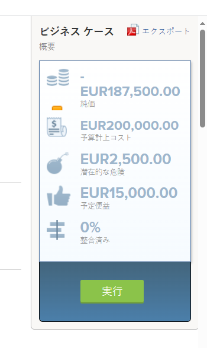
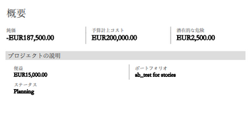

# プロジェクトのビジネス事例のエクスポート

ビジネスケースを印刷したり、より簡潔な形式で E メールに添付したりする必要がある場合は、ビジネスケースをPDFファイルに書き出すことができます。 

## アクセス要件

以下が必要です。

<table style="table-layout:auto"> 
 <col> 
 <col> 
 <tbody> 
  <tr> 
   <td role="rowheader">Adobe Workfront plan*</td> 
   <td> 
任意 
 </td> 
  </tr> 
  <tr> 
   <td role="rowheader">Adobe Workfront license*</td> 
   <td> 
レビュー以上
 </td> 
  </tr> 
  <tr> 
   <td role="rowheader">アクセスレベル設定*</td> 
   <td> 
プロジェクト、財務データ、およびリソース管理へのアクセスの表示
 
注意：まだアクセス権がない場合は、Workfront管理者に、アクセスレベルに追加の制限を設定しているかどうかを問い合わせてください。 Workfront管理者がアクセスレベルを変更する方法について詳しくは、 <a href="../../../administration-and-setup/add-users/configure-and-grant-access/create-modify-access-levels.md" class="MCXref xref">カスタムアクセスレベルの作成または変更</a>.
 </td> 
  </tr> 
  <tr> 
   <td role="rowheader">オブジェクト権限</td> 
   <td> 
プロジェクトに対する表示権限以上の権限
 
追加のアクセス権のリクエストについて詳しくは、 <a href="../../../workfront-basics/grant-and-request-access-to-objects/request-access.md" class="MCXref xref">オブジェクトへのアクセスのリクエスト </a>.
 </td> 
  </tr> 
 </tbody> 
</table>

&#42;保有しているプラン、ライセンスの種類、アクセス権を確認するには、Workfront管理者に問い合わせてください。

## ビジネスケースのエクスポート

1. ビジネス事例のエクスポート元のプロジェクトに移動します。
1. クリック **ビジネス事例** をクリックします。
1. 右上&#x200B;**ビジネス事例の概要** 領域、クリック **書き出し**.

   \
   PDFファイルがコンピューターにダウンロードされます。 ファイルには、ビジネスケースのすべての領域が読みやすい形式で含まれています。

   

1. （オプション）PDFファイルを電子メールに添付したり、他の人と共有するために印刷したりできます。 
