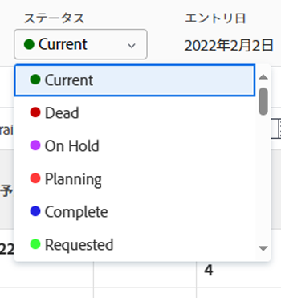

# プロジェクトのステータスの変更

<!--Audited: 02/2024-->

必要に応じて、プロジェクトのステータスを手動で他のステータスに更新できます。

プロジェクトの [ 完了モード ] が [ 手動 ] に設定されている場合にのみ、プロジェクトの [ ステータス ] を [ 完了 ] に設定するステータスに手動で更新できます。

それ以外の場合は、プロジェクトのすべてのタスクと問題が完了し、承認されると、Adobe Workfrontは自動的にプロジェクトを完了としてマークします。

プロジェクトの完了モードの詳細については、 [プロジェクトを編集](/help/quicksilver/manage-work/projects/manage-projects/edit-projects.md).

## アクセス要件

この記事の手順を実行するには、次のアクセス権が必要です。

<table style="table-layout:auto"> 
 <col> 
 <col> 
 <tbody> 
  <tr> 
   <td role="rowheader">Adobe Workfront プラン</td> 
   <td> 
任意
 </td> 
  </tr> 
  <tr> 
   <td role="rowheader">Adobe Workfront ライセンス*</td> 
   <td> 
新規：標準 
 
   または
   
現在：プラン 

   </td> 
  </tr> 
  <tr> 
   <td role="rowheader">アクセスレベル設定</td> 
   <td> 
プロジェクトへのアクセスを編集
 </td> 
  </tr> 
  <tr> 
   <td role="rowheader">オブジェクト権限</td> 
   <td> 
プロジェクトに対する権限を管理
 </td> 
  </tr> 
 </tbody> 
</table>

&#42;保有するプラン、ライセンスの種類、アクセス権を確認するには、Workfront管理者に問い合わせてください。 詳しくは、 [Workfrontドキュメントのアクセス要件](/help/quicksilver/administration-and-setup/add-users/access-levels-and-object-permissions/access-level-requirements-in-documentation.md).

## 特定のステータスに更新する際の考慮事項

* **プロジェクトを完了に更新する場合：**&#x200B;プロジェクトですべてのタスクとイシューが完了していることを確認します。プロジェクトに完了していないタスクやイシューがある場合は、プロジェクトの「完了」のステータス、または「完了」と同等のステータスは選択できません。これには、「完了 - 保留中の承認」ステータスのタスクまたはイシューを承認する場合も含まれます。
* **プロジェクトを「完了」から「現在」に更新する場合：**&#x200B;プロジェクトのすべてのタスクとイシューが完了した場合は、プロジェクトの完了モードが「手動」に設定されていることを確認します。プロジェクトの完了モードが「自動」の場合、プロジェクトのステータスは「完了」のままです。

## プロジェクトステータスを変更する

1. ステータスを更新するプロジェクトに移動します。
1. プロジェクトヘッダーの「**ステータス**」フィールドでステータスの名前をクリックし、新しいステータスを選択します。

   

   または

   プロジェクト名の横にある&#x200B;**その他**&#x200B;メニュー  をクリックし、「**編集**」をクリックして、「**ステータス**」フィールドで新しいステータスを選択してから、「**保存**」をクリックします。

   プロジェクトのステータスは、選択したステータスに更新されます。
