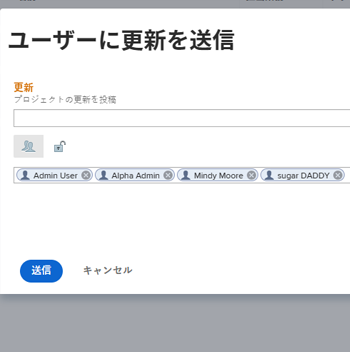

# プロジェクトチームメンバーとのコミュニケーション

Adobe Workfront を通じて、プロジェクトチームのメンバーと簡単にコミュニケーションを取ることができます。

プロジェクトチームは、プロジェクトに関連するすべてのユーザーで構成されます。プロジェクトチームについて詳しくは、[プロジェクトチームの概要](../../../manage-work/projects/planning-a-project/project-team-overview.md)を参照してください。

## アクセス要件

この記事の手順を実行するには、次のアクセス権が必要です。

<table style="table-layout:auto"> 
 <col> 
 </col> 
 <col> 
 </col> 
 <tbody> 
  <tr> 
   <td role="rowheader">Adobe Workfront プラン*</td> 
   <td> 
任意
 </td> 
  </tr> 
  <tr> 
   <td role="rowheader">Adobe Workfront ライセンス*</td> 
   <td> 
リクエスト以上
 </td> 
  </tr> 
  <tr> 
   <td role="rowheader">アクセスレベル設定*</td> 
   <td> 
プロジェクトの表示またはそれ以上のアクセス権
 
メモ：まだアクセス権がない場合は、アクセスレベルに追加の制限が設定されていないかどうか Workfront 管理者にお問い合わせください。Workfront 管理者がアクセスレベルを変更する方法について詳しくは、<a href="../../../administration-and-setup/add-users/configure-and-grant-access/create-modify-access-levels.md" class="MCXref xref">カスタムアクセスレベルの作成または変更</a>を参照してください。
 </td> 
  </tr> 
  <tr> 
   <td role="rowheader">オブジェクト権限</td> 
   <td> 
プロジェクトの表示またはそれ以上の権限
 
追加のアクセス権のリクエストについて詳しくは、<a href="../../../workfront-basics/grant-and-request-access-to-objects/request-access.md" class="MCXref xref">オブジェクトへのアクセス権のリクエスト</a>を参照してください。
 </td> 
  </tr> 
 </tbody> 
</table>

&#42;保有するプラン、ライセンスタイプ、アクセス権を確認するには、Workfront 管理者に問い合わせてください。

## プロジェクトチームメンバーへのメールの送信 {#send-an-email-to-a-project-team-member}

1. メールの送信先となるプロジェクトチームメンバーの属するプロジェクトに移動します。
1. 左パネルの「**ユーザー**」をクリックします。場合によっては、まず「**さらに表示**」をクリックする必要があります。

   プロジェクトチームのすべてのメンバーを更新するには、プロジェクトチームメンバーのリストの左上隅にある「**すべて更新**」をクリックします。

   または

   プロジェクトチームの特定のメンバーを更新するには、リストから 1 人または複数のユーザーを選択したあと、「**ユーザに更新を送信**」をクリックします。\
   

1. 「**プロジェクトの更新を投稿**」フィールドに更新内容を入力します。
1. （オプション）更新をプライベートにするには、**ロック**&#x200B;アイコンをクリックします。

   社外のユーザーは、プライベートの更新を表示できません。

1. （オプション）**ユーザー**&#x200B;アイコンをクリックして、選択されていない受信者をさらに追加します。
1. 「**送信**」をクリックします。

   更新とそれに含まれるユーザーの名前が、プロジェクトの「更新」タブに表示されます。

## プロジェクトチームメンバーおよびその他のユーザーへの更新の送信

プロジェクトの更新をチームメンバーや、プロジェクトチームに属さない他のユーザーに送信できます。すべてのユーザーがアクティブな Workfront アカウントを持っている必要があります。更新は Workfront で通知として送信されます。

1. 他のユーザーに更新を送信するプロジェクトに移動します。
1. （オプションおよび条件付き）更新の送信先のユーザーがプロジェクトチームに属していない場合は、それらのユーザーをプロジェクトチームに追加します。

   プロジェクトチームへのユーザーの追加については、[プロジェクトチームの管理](../../../manage-work/projects/planning-a-project/manage-project-team.md)を参照してください。

1. プロジェクトチームのメンバーに更新を送信します。詳しくは、

   この記事で[プロジェクトチームメンバーへのメールの送信](#send-an-email-to-a-project-team-member)の節を参照してください。

   更新とそれに含まれるユーザーの名前が、プロジェクトの「更新」タブに表示されます。

<!--

 
(NOTE: drafted. No longer valid)

<ol>
<li value="1"> 
Go to a project whose members of the project team you want to send an email to. 
 </li>
<li value="2"> Click <strong>Show More</strong>, then <strong>People</strong> in the left panel.</li>
<li value="3"> 
To update all members of the project team, click <strong>Update All</strong> in the upper-left corner of the list of project team members.
 
Or
 
To update certain members of the project team, select one or several users in the list, then click <strong>Update</strong>. 
 </li>
<li value="4">Type your update in the <strong>Post an update to this project</strong> field.</li>
<li value="5"> 
(Optional) To make the update private, click the <strong>Lock</strong> icon.
 
Users outside the company cannot view a private&nbsp;update.
 </li>
<li value="6"> 
(Optional) Add a user who is not&nbsp;part of the Project&nbsp;Team by typing their name in the people field, then selecting the user from the list when it displays. 
 </li>
<li value="7"> 
Click <strong>Send.</strong>
 
The update and the names of the users included in it display in the Updates tab of the project.
 </li>
</ol> 

-->
