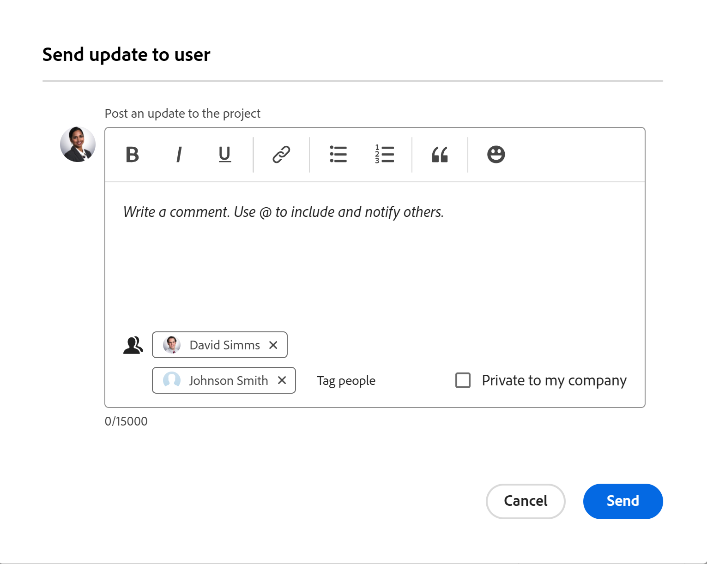

# プロジェクトチームメンバーとのコミュニケーション

Adobe Workfront を通じて、プロジェクトチームのメンバーと簡単にコミュニケーションを取ることができます。

プロジェクトに関連付けられているすべてのユーザーは、プロジェクトチームから委任されます。 プロジェクトチームの詳細については、[プロジェクトチームの概要](../../../manage-work/projects/planning-a-project/project-team-overview.md)を参照してください。

## アクセス要件

+++ 展開すると、この記事の機能のアクセス要件が表示されます。

<table style="table-layout:auto"> 
 <col> 
 </col> 
 <col> 
 </col> 
 <tbody> 
  <tr> 
   <td role="rowheader">Adobe Workfrontのパッケージ</td> 
   <td> 
任意
 </td> 
  </tr> 
  <tr> 
   <td role="rowheader">Adobe Workfront プラン</td> 
   <td>
投稿者以上
 
   
リクエスト以上
 </td> 
  </tr> 
  <tr> 
   <td role="rowheader">アクセスレベル設定</td> 
   <td> 
プロジェクトに対する表示以上のアクセス権
</td> 
  </tr> 
  <tr> 
   <td role="rowheader">オブジェクト権限</td> 
   <td> 
プロジェクトの表示またはそれ以上の権限
</td> 
  </tr> 
 </tbody> 
</table>

詳しくは、[Workfront ドキュメントのアクセス要件](/help/quicksilver/administration-and-setup/add-users/access-levels-and-object-permissions/access-level-requirements-in-documentation.md)を参照してください。

+++

<!--Old:

<table style="table-layout:auto"> 
 <col> 
 </col> 
 <col> 
 </col> 
 <tbody> 
  <tr> 
   <td role="rowheader">Adobe Workfront plan*</td> 
   <td> 
Any
 </td> 
  </tr> 
  <tr> 
   <td role="rowheader">Adobe Workfront license*</td> 
   <td> 
Request or higher
 </td> 
  </tr> 
  <tr> 
   <td role="rowheader">Access level configurations*</td> 
   <td> 
View or higher access to Projects
 
Note: If you still don't have access, ask your Workfront administrator if they set additional restrictions in your access level. For information on how a Workfront administrator can modify your access level, see <a href="../../../administration-and-setup/add-users/configure-and-grant-access/create-modify-access-levels.md" class="MCXref xref">Create or modify custom access levels</a>.
 </td> 
  </tr> 
  <tr> 
   <td role="rowheader">Object permissions</td> 
   <td> 
View or higher permissions to the project
 
For information on requesting additional access, see <a href="../../../workfront-basics/grant-and-request-access-to-objects/request-access.md" class="MCXref xref">Request access to objects </a>.
 </td> 
  </tr> 
 </tbody> 
</table>-->

## プロジェクトチームメンバーへのメールの送信 {#send-an-email-to-a-project-team-member}

1. メールの送信先となるプロジェクトチームメンバーの属するプロジェクトに移動します。
1. 左側のパネルで **人物** をクリックします。

   プロジェクトチームのすべてのメンバーを更新するには、プロジェクトチームメンバーのリストの左上隅にある「**すべて更新**」をクリックします。

   または

   プロジェクト チームの特定のメンバーを更新するには、一覧から 1 人または複数のユーザーを選択し、[**更新をユーザーに送信**] をクリックします。

   

1. **プロジェクトに更新を投稿** 領域に更新を入力します。
1. （オプション）更新をプライベートにするには、「**会社に対してプライベート** オプションを選択します。

   社外のユーザーは非公開の更新を表示できません。

1. （任意）「**ユーザーをタグ付け**」をクリックして、選択されていない受信者をさらに追加します。
1. 「**送信**」をクリックします。

   含まれる更新とユーザーの名前は、プロジェクトの **更新** セクションに表示されます。

## プロジェクトチームメンバーおよびその他のユーザーへの更新の送信

プロジェクトの更新をチームメンバーや、プロジェクトチームに属さない他のユーザーに送信できます。すべてのユーザーがアクティブな Workfront アカウントを持っている必要があります。更新は通知としてWorkfrontに送信されます。

1. 他のユーザーに更新を送信するプロジェクトに移動します。
1. 左側のパネルで **人物** をクリックします。
1. （オプションおよび条件付き）更新の送信先のユーザーがプロジェクトチームに属していない場合は、「**ユーザーを追加**」をクリックして、プロジェクトチームに追加します。

   プロジェクトチームへのユーザーの追加については、[プロジェクトチームの管理](../../../manage-work/projects/planning-a-project/manage-project-team.md)を参照してください。

1. この記事の「[&#x200B; プロジェクトチームメンバーにメールを送信する &#x200B;](#send-an-email-to-a-project-team-member) の節で説明しているように、プロジェクトチームのメンバーに更新を送信します。

   更新とそれに含まれるユーザーの名前は、プロジェクトの「**更新**」セクションに表示されます。

<!--

 
(NOTE: drafted. No longer valid)

<ol>
<li value="1"> 
Go to a project whose members of the project team you want to send an email to. 
 </li>
<li value="2"> Click <strong>People</strong> in the left panel.</li>
<li value="3"> 
To update all members of the project team, click <strong>Update All</strong> in the upper-left corner of the list of project team members.
 
Or
 
To update certain members of the project team, select one or several users in the list, then click <strong>Update</strong>. 
 </li>
<li value="4">Type your update in the <strong>Post an update to this project</strong> field.</li>
<li value="5"> 
(Optional) To make the update private, click the <strong>Lock</strong> icon.
 
Users outside the company cannot view a private update.
 </li>
<li value="6"> 
(Optional) Add a user who is not part of the Project Team by typing their name in the people field, then selecting the user from the list when it displays. 
 </li>
<li value="7"> 
Click <strong>Send.</strong>
 
The update and the names of the users included in it display in the Updates tab of the project.
 </li>
</ol> 

-->
