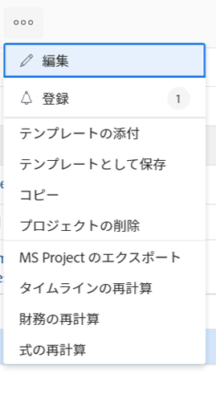
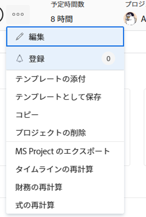
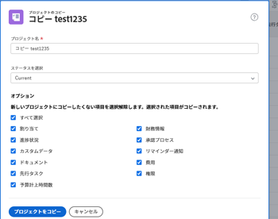

# プロジェクトのコピー

<!--
<(LINKED TO THE PRODUCT IN THE COPY PROJECT BOX)

-->

プロジェクトは、ゼロから作成する代わりにコピーできます。 一度にコピーできるプロジェクトは 1 つだけです。 プロジェクトを一括でコピーすることはできません。

>[!IMPORTANT]
>
>次の項目は、既存のプロジェクトから新しいプロジェクトにコピーされません。
>
>* 問題
>* 請求件の料率
>* 請求記録
>* メモ
>* 時間
>* プロジェクト間の先行タスク
>* 予算計上時間数
>
>次の項目は、常に既存のプロジェクトから新しいプロジェクトにコピーされます。
>
>* タスク
>* テンプレート
>* 危険
>* キューの設定情報
>* Portfolioとプログラム
>* スコアカード
>* タスクのデフォルト情報 ( タスクのデフォルト承認プロセス、タスクのデフォルトカスタムForms)
>

## アクセス要件

<!-- drafted for P&P:
<table style="table-layout:auto"> 
 <col> 
 <col> 
 <tbody> 
  <tr> 
   <td> 
Adobe Workfront plan*
 </td> 
   <td>Any</td> 
  </tr> 
  <tr> 
   <td> 
Adobe Workfront license*
 </td> 
   <td> 
Current license: Standard 
 
   Or
   
Legacy license: Plan 

   </td> 
  </tr> 
  <tr data-mc-conditions=""> 
   <td><strong>Access level configurations*</strong> </td> 
   <td> 
Edit access to Projects with ability to Create and Copy projects
 
<b>NOTE</b>
   
   If you still don't have access, ask your Workfront administrator if they set additional restrictions in your access level. For information on how a Workfront administrator can change your access level, see <a href="../../../administration-and-setup/add-users/configure-and-grant-access/create-modify-access-levels.md" class="MCXref xref">Create or modify custom access levels</a>.
 </td> 
  </tr> 
  <tr data-mc-conditions=""> 
   <td> 
<strong>Object permissions</strong> 
 </td> 
   <td> 
View permissions or higher to the project
 
For information on requesting additional access, see <a href="../../../workfront-basics/grant-and-request-access-to-objects/request-access.md" class="MCXref xref">Request access to objects </a>.
 </td> 
  </tr> 
 </tbody> 
</table>
-->
以下が必要です。

<table style="table-layout:auto"> 
 <col> 
 <col> 
 <tbody> 
  <tr> 
   <td> 
Adobe Workfront plan*
 </td> 
   <td>任意</td> 
  </tr> 
  <tr> 
   <td> 
Adobe Workfront license*
 </td> 
   <td> 
計画 
 </td> 
  </tr> 
  <tr data-mc-conditions=""> 
   <td><strong>アクセスレベル設定*</strong> </td> 
   <td> 
作成機能を使用したプロジェクトへのアクセスの編集 とコピー プロジェクト
 
<b>メモ</b>

まだアクセス権がない場合は、Workfront管理者に、アクセスレベルに追加の制限を設定しているかどうかを問い合わせてください。 Workfront管理者がアクセスレベルを変更する方法について詳しくは、 <a href="../../../administration-and-setup/add-users/configure-and-grant-access/create-modify-access-levels.md" class="MCXref xref">カスタムアクセスレベルの作成または変更</a>.
 </td>
</tr> 
  <tr data-mc-conditions=""> 
   <td> 
<strong>オブジェクト権限</strong> 
 </td> 
   <td> 
プロジェクトに対する権限以上の表示
 
追加のアクセス権のリクエストについて詳しくは、 <a href="../../../workfront-basics/grant-and-request-access-to-objects/request-access.md" class="MCXref xref">オブジェクトへのアクセスのリクエスト </a>.
 </td> 
  </tr> 
 </tbody> 
</table>

&#42;保有しているプラン、ライセンスの種類、アクセス権を確認するには、Workfront管理者に問い合わせてください。

## 単一のプロジェクトをコピー

プロジェクトをコピーすると、元のプロジェクトの情報が新しいプロジェクトにコピーされます。 また、コピー処理中に新しいプロジェクトにコピーしない項目を指定することもできます。

プロジェクトをコピーするには：

1. コピーするプロジェクトに移動し、 **詳細** アイコン  プロジェクト名の右側に

   

   または

   プロジェクトリストまたはレポートに移動してプロジェクトを選択し、 **詳細** アイコン  をクリックします。

   

1. クリック **コピー**.

1. 新しいプロジェクトの名前を更新します。

   デフォルトでは、新しい名前はです。 **のコピー `<Original project name>`.**

   

1. を選択します。 **ステータス** 新規プロジェクト用。

   デフォルトでは、 **ステータス** 元のプロジェクトと一致します。

1. （オプション）新しいプロジェクトにコピーしない項目の選択を解除します。 次の表は、項目を選択解除した場合の動作を示しています。

   <table style="table-layout:auto"> 
    <col> 
    <col> 
    <tbody> 
     <tr> 
      <td role="rowheader">すべて選択</td> 
      <td> 
すべてのオプションを選択し、新しいプロジェクトから一覧表示されるすべてのフィールドとオブジェクトをクリアします。
 
<b>ヒント</b>

   選択解除 <strong>すべて選択</strong> すべての項目の選択を解除します。 
 </td>
   </tr> 
     <tr> 
      <td role="rowheader">割り当て</td> 
      <td>すべてのプロジェクトとタスクの割り当てを削除</td> 
     </tr> 
     <tr> 
      <td role="rowheader">進捗状況</td> 
      <td>すべてのタスクの進行状況を削除し、「新規」と表示します。 </td> 
     </tr> 
     <tr> 
      <td role="rowheader">カスタムデータ</td> 
      <td> 
プロジェクト上のカスタムフォームの情報と、次の項目に関連付けられているカスタムフォームの情報を削除します。
 
       <ul> 
        <li>タスク</li> 
        <li>費用</li> 
        <li> ドキュメント</li> 
       </ul> 
<b>メモ</b>

   カスタムフォームは、タスク、費用、ドキュメント、およびプロジェクトに添付されたままですが、フォームのカスタムフィールドの情報は、新しいプロジェクトにはコピーされません。 
 </td>
   </tr> 
     <tr> 
      <td role="rowheader">ドキュメント</td> 
      <td> 
ドキュメントのバージョン、リンクされたドキュメント、フォルダなど、ドキュメントタブ内のすべてを削除します。
 
デフォルトでは、ドキュメントの配達確認と承認は別のプロジェクトにコピーできません。 
 </td> 
     </tr> 
     <tr> 
      <td role="rowheader">すべての先行タスク</td> 
      <td> 
プロジェクト上のタスク間の先行タスク関係をすべて削除します。 
 
<b>ヒント</b>

   プロジェクト間の先行タスクは、選択されているかどうかに関係なく、新しいプロジェクトに転送されません。 
 </td>
   </tr>

<tr> 
      <td role="rowheader">予算計上時間数</td> 
      <td> 
プロジェクトのビジネスケースの「リソース計画」領域に予算された時間を、コピーしたプロジェクトから削除します。

<b>メモ</b>

シナリオ・プランナを使用して予算化された時間は、新規プロジェクトはシナリオ・プランナのイニシアチブにリンクされていないので、新規プロジェクトにはコピーされません。 詳しくは、 <a href="../../../manage-work/projects/define-a-business-case/budget-resources-in-business-case-use-scenario-planner.md">シナリオ・プランナを使用したビジネス・ケースの予算生産資源</a>
</tr></td>
    <tr> 
      <td role="rowheader">財務情報</td> 
      <td> 
次の領域の情報を削除します。 
 
       <ul> 
        <li>プロジェクトの「財務」サブタブ</li> 
        <li> ビジネス事例における計画給付</li> 
        <li>すべてのタスクの財務情報 </li> 
       </ul> 
プロジェクトの「財務」サブタブの詳細については、 <a href="../../../manage-work/projects/project-finances/manage-project-finance-area.md" class="MCXref xref">プロジェクトの財務エリアで情報を管理します</a>.
 </td> 
     </tr> 
     <tr> 
      <td role="rowheader">承認プロセス</td> 
      <td>タスクまたはプロジェクトに関連付けられているすべての承認を削除します。 </td> 
     </tr> 
     <tr> 
      <td role="rowheader">リマインダー通知</td> 
      <td> タスクまたはプロジェクトに関連付けられているリマインダー通知を削除します。 </td> 
     </tr> 
     <tr> 
      <td role="rowheader">費用</td> 
      <td>タスクまたはプロジェクトに関連する費用を削除します。 </td> 
     </tr> 
     <tr> 
      <td role="rowheader">権限</td> 
      <td> タスクまたはプロジェクトのすべてのユーザーに対する権限を削除します。</td> 
     </tr> 
    </tbody> 
   </table>

1. クリック **コピー** プロジェクトのコピーを作成します。

   これにより、コピーしたプロジェクトに似た新しいプロジェクトが作成されます。

   レビュータスクの割り当てやタイムラインの調整など、新しくコピーされたプロジェクトに対する変更を開始できます。
