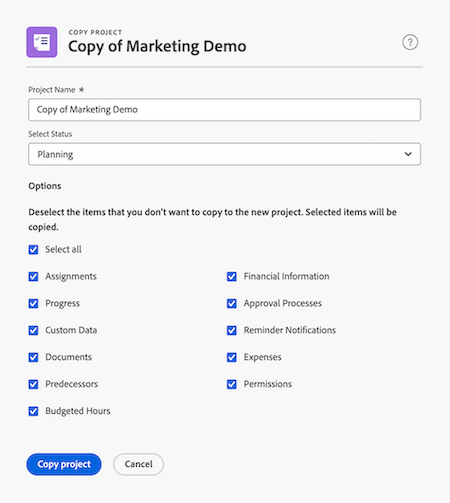

# プロジェクトをコピー

<!--
<(LINKED TO THE PRODUCT IN THE COPY PROJECT BOX)

-->

<!-- Audited: 5/2025 -->

ゼロからプロジェクトを作成するのではなく、既存のプロジェクトからプロジェクトをコピーできます。これにより、時間を節約できます。

プロジェクトを一括でコピーすることはできません。

>[!IMPORTANT]
>
>次の項目は、既存のプロジェクトから新規プロジェクトにコピーされません。
>
>* イシュー
>* 請求レート
>* 請求記録
>* メモ
>* 時間
>* プロジェクト間先行タスク
>* 予算計上時間数
>
>次の項目は、常に既存のプロジェクトから新しいプロジェクトにコピーされます。
>
>* タスク
>* テンプレート
>* リスク
>* キューの設定情報
>* ポートフォリオとプログラム
>* スコアカード
>* タスクのデフォルト情報（タスクのデフォルトの承認プロセス、タスクのデフォルトのカスタムフォーム）
>
> 元のプロジェクトのタスクの日付は、新しいプロジェクトにコピーされます。 タスクの日付を更新するには、プロジェクトの開始日または完了日を（スケジュールモードに応じて）変更する必要があります。 タスクの制限により、プロジェクトの日付を変更できない場合があります。

## アクセス要件

+++ 展開すると、この記事の機能のアクセス要件が表示されます。
この記事の手順を実行するには、次のアクセス権が必要です。

<table style="table-layout:auto"> 
 <col> 
 <col> 
 <tbody> 
  <tr> 
   <td> 
Adobe Workfront パッケージ
 </td>  
   <td>任意</td> 
  </tr> 
  <tr> 
   <td> 
Adobe Workfront プラン
 </td> 
   <td> 
標準
 
   
プラン

      </td> 
  </tr> 
     <td>アクセスレベル設定 </td> 
   <td> 
プロジェクトの作成とコピー機能を使用したプロジェクトへのアクセス権の編集
 </td> 
  </tr>

<td> 
オブジェクト権限 
 </td> 
   <td> 
プロジェクトに対する表示権限以上
  </td> 
  </tr> 
 </tbody> 
</table>

この表の情報について詳しくは、[Workfront ドキュメントのアクセス要件](/help/quicksilver/administration-and-setup/add-users/access-levels-and-object-permissions/access-level-requirements-in-documentation.md)を参照してください。

+++

<!--
 Old:
 
 <table style="table-layout:auto"> 
 <col> 
 <col> 
 <tbody> 
  <tr> 
   <td> 
Adobe Workfront plan
 </td> 
   <td>Any</td> 
  </tr> 
  <tr> 
   <td> 
Adobe Workfront license
 </td> 
   <td> 
New: Standard 
 
   
Or

   
Current: Plan 

   
   </td> 
  </tr> 
  <tr data-mc-conditions=""> 
   <td>Access level configurations </td> 
   <td> 
Edit access to Projects with ability to Create and Copy projects
 </td> 
  </tr> 
  <tr data-mc-conditions=""> 
   <td> 
Object permissions 
 </td> 
   <td> 
View permissions or higher to the project
  </td> 
  </tr> 
 </tbody> 
</table>
-->

## 考慮事項

* プロジェクトをコピーする場合、5分の処理制限があります。 プロジェクトに多数のドキュメントが添付されていて、コピーできない場合は、一部のドキュメントを削除して、もう一度試す必要がある場合があります。

## 単一のプロジェクトをコピーする

プロジェクトをコピーすると、元のプロジェクトの情報が新しいプロジェクトにコピーされます。 また、コピー処理中に新しいプロジェクトにコピーしない項目を指定することもできます。

プロジェクトをコピーするには

{{step1-to-projects}}

1. プロジェクト リストからコピーするプロジェクトを選択し、プロジェクト名の右側にある&#x200B;**詳細** アイコン をクリックします。

   または

   プロジェクトのリストまたはレポートに移動してプロジェクトを選択し、リストの上部にある&#x200B;**詳細** アイコン をクリックします。

1. **詳細** ドロップダウンメニューで、**コピー**&#x200B;をクリックします。 「[ プロジェクト名&#x200B;]**のコピー」ダイアログボックスが表示されます。**

1. （オプション） **プロジェクト名**&#x200B;を更新します。 デフォルトでは、新しい名前は&#x200B;**元のプロジェクト名[のコピー]**&#x200B;です。

   

1. **ステータス**&#x200B;を選択します。 デフォルトでは、元のプロジェクトのステータスが選択されています。

1. （オプション）新しいプロジェクトにコピーしない項目の選択を解除します。 次の表は、項目を選択解除した場合の動作を示しています。

   <table style="table-layout:auto"> 
    <col> 
    <col> 
    <tbody> 
     <tr> 
      <td role="rowheader">すべて選択</td> 
      <td> 
すべてのオプションを選択し、新しいプロジェクトから一覧表示されるすべてのフィールドとオブジェクトをクリアします。 

   
 このオプションの選択を解除すると、すべての項目が選択解除されます。 
 </td> 
     </tr> 
     <tr> 
      <td role="rowheader">割り当て</td> 
      <td>プロジェクトとタスクのすべての割り当てを削除します。</td> 
     </tr> 
     <tr> 
      <td role="rowheader">進捗状況</td> 
      <td>すべてのタスクの進行状況を削除し、新規として表示します。 </td> 
     </tr> 
     <tr> 
      <td role="rowheader">カスタムデータ</td> 
      <td> 
プロジェクトのカスタムフォームの情報と、次の項目に関連付けられているカスタムフォームの情報を削除します。
 
       <ul> 
        <li>タスク</li> 
        <li>費用</li> 
        <li> ドキュメント</li> 
       </ul> 
      
カスタムフォームは、タスク、費用、ドキュメント、プロジェクトに添付されたままですが、フォームのカスタムフィールド内の情報は新しいプロジェクトにコピーされません。 
 </td> 
     </tr> 
     <tr> 
      <td role="rowheader">ドキュメント</td> 
      <td> 
ドキュメントのバージョン、リンクされたドキュメント、フォルダーなど、「ドキュメント」タブのすべての項目を削除します。
 
デフォルトでは、ドキュメントのプルーフと承認は別のプロジェクトにコピーできません。 
 </td> 
     </tr> 
     <tr> 
      <td role="rowheader">すべての先行タスク</td> 
      <td> 
プロジェクト上のタスク間の先行タスク関係をすべて削除します。 
 

   プロジェクト間の先行タスクは、選択されているかどうかに関係なく、新しいプロジェクトに転送されることはありません。 
 </td>
   </tr>

<tr> 
      <td role="rowheader">予算計上時間数</td> 
      <td> 
プロジェクトのビジネスケースのリソース計画エリアの予算計上時間数を、コピーしたプロジェクトから削除します。
 
    

   新規プロジェクトはシナリオプランナーのイニシアチブにリンクされていないため、シナリオプランナーを使用して予算計上された時間数が新規プロジェクトにコピーされることはありません。 詳しくは、<a href="../../../manage-work/projects/define-a-business-case/budget-resources-in-business-case-use-scenario-planner.md">シナリオプランナーを使用したビジネスケースの予算計上リソース</a>を参照してください。

   </tr></td>
    <tr> 
      <td role="rowheader">財務情報</td> 
      <td> 
以下のエリアの情報を削除します。 
 
       <ul> 
        <li>プロジェクトの「財務」サブタブ</li> 
        <li> ビジネスケースにおける予定利益</li> 
        <li>すべてのタスクの財務情報 </li> 
       </ul> 
プロジェクトの財務サブタブについて詳しくは、<a href="../../../manage-work/projects/project-finances/manage-project-finance-area.md" class="MCXref xref"> プロジェクトの財務エリアの情報の管理</a>を参照してください。
 </td> 
     </tr> 
     <tr> 
      <td role="rowheader">承認プロセス</td> 
      <td>タスクやプロジェクトに関連付けられているすべての承認を削除します。 </td> 
     </tr> 
     <tr> 
      <td role="rowheader">リマインダー通知</td> 
      <td> タスクやプロジェクトに関連付けられているリマインダー通知を削除します。 </td> 
     </tr> 
     <tr> 
      <td role="rowheader">費用</td> 
      <td>タスクやプロジェクトに関連する費用を削除します。 </td> 
     </tr> 
     <tr> 
      <td role="rowheader">権限</td> 
      <td> タスクやプロジェクトのすべてのユーザーに対する権限を削除します。</td> 
     </tr> 
    </tbody> 
   </table>

1. 「**プロジェクトをコピー**」をクリックします。 コピーされたプロジェクトが作成されます。
