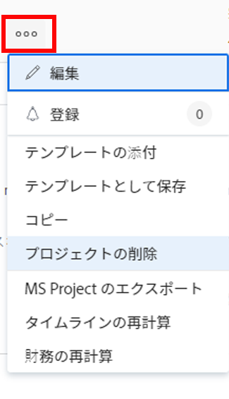

# プロジェクトを削除

プロジェクトとそのデータが不要になった場合は、プロジェクトを削除できます。

プロジェクトを削除する代わりに、プロジェクトを編集し、ステータスを「完了」または「無効」に変更することをお勧めします。 これにより、プロジェクトに関連する現在のタスクがユーザーのタスクリストからすべて削除されますが、プロジェクトに関連するすべてのデータが保存されます。

## アクセス要件

<!-- drafted for P&P:
<table style="table-layout:auto"> 
 <col> 
 <col> 
 <tbody> 
  <tr> 
   <td> 
Adobe Workfront plan*
 </td> 
   <td>Any</td> 
  </tr> 
  <tr> 
   <td> 
Adobe Workfront license*
 </td> 
   <td> 
Current license: Standard 
 
   Or
   
Legacy license: Plan 

   </td> 
  </tr> 
  <tr data-mc-conditions=""> 
   <td><strong>Access level configurations*</strong> </td> 
   <td> 
Edit access to Projects with ability to Create and Delete projects
 
<b>NOTE</b>
   
   If you still don't have access, ask your Workfront administrator if they set additional restrictions in your access level. For information on how a Workfront administrator can change your access level, see <a href="../../../administration-and-setup/add-users/configure-and-grant-access/create-modify-access-levels.md" class="MCXref xref">Create or modify custom access levels</a>.
 </td> 
  </tr> 
  <tr data-mc-conditions=""> 
   <td> 
<strong>Object permissions</strong> 
 </td> 
   <td> 
Edit access to Projects, Tasks, Issues with ability to Delete projects, tasks, and issues
 
Note: If you still don't have access, ask your Workfront administrator if they set additional restrictions in your access level. For information on how a Workfront administrator can modify your access level, see <a href="../../../administration-and-setup/add-users/configure-and-grant-access/create-modify-access-levels.md" class="MCXref xref">Create or modify custom access levels</a>.
 </td> 
  </tr> 
 </tbody> 
</table>
-->

この記事の手順を実行するには、次の手順を実行する必要があります。

<table style="table-layout:auto"> 
 <col> 
 <col> 
 <tbody> 
  <tr> 
   <td role="rowheader">Adobe Workfront plan*</td> 
   <td> 
任意 
 </td> 
  </tr> 
  <tr> 
   <td role="rowheader">Adobe Workfront license*</td> 
   <td> 
計画 
 </td> 
  </tr> 
  <tr> 
   <td role="rowheader">アクセスレベル設定*</td> 
   <td> 
プロジェクト、タスク、タスクおよびタスクを削除できるタスクへのアクセス権を編集します
 
<b>メモ</b>

まだアクセス権がない場合は、Workfront管理者に、アクセスレベルに追加の制限を設定しているかどうかを問い合わせてください。 Workfront管理者がアクセスレベルを変更する方法について詳しくは、 <a href="../../../administration-and-setup/add-users/configure-and-grant-access/create-modify-access-levels.md" class="MCXref xref">カスタムアクセスレベルの作成または変更</a>.
 </td> 
  </tr> 
  <tr> 
   <td role="rowheader">オブジェクトの権限</td> 
   <td> 
プロジェクト、タスク、およびタスクを削除する機能を使用して、プロジェクトに対するプロジェクト、タスク、およびタスクに対する権限を管理します。 
 
追加のアクセス権のリクエストについて詳しくは、 <a href="../../../workfront-basics/grant-and-request-access-to-objects/request-access.md" class="MCXref xref">オブジェクトへのアクセスのリクエスト </a>.
 </td> 
  </tr> 
 </tbody> 
</table>

&#42;保有するプラン、ライセンスの種類、アクセス権を確認するには、Workfront管理者に問い合わせてください。
プロジェクトは、プロジェクトリストまたはプロジェクトレベルで削除できます。

## プロジェクトの削除プロセスを理解する

* [プロジェクトの削除に関する制限](#limitations-for-deleting-projects)
* [プロジェクトを削除した場合の影響](#the-impact-of-deleting-projects)

### プロジェクトの削除に関する制限  {#limitations-for-deleting-projects}

* 削除した項目は 30 日間ごみ箱に移動し、Workfront管理者のみが復元できます。

  オブジェクトの復元の詳細については、「 [削除した項目を復元](../../../administration-and-setup/manage-workfront/manage-deleted-items/restore-deleted-items.md).

* ログに記録された時間に関するタスクや問題がプロジェクトに含まれている場合、タスクを含むプロジェクトを削除できるように、Workfrontまたはグループ管理者がWorkfrontインスタンスでタスクと問題の環境設定を構成して、これらのタスクの削除を許可する必要があります。

  時間が記録されるタスク、イシューまたはプロジェクトの削除を有効にする方法について詳しくは、 [システム全体のタスクと問題の環境設定を構成する](../../../administration-and-setup/set-up-workfront/configure-system-defaults/set-task-issue-preferences.md).

  <!--
  
(NOTE: this bullet stays in NWE only forever)

  -->

### プロジェクトを削除した場合の影響 {#the-impact-of-deleting-projects}

* プロジェクトを削除すると、そのプロジェクトにリンクされている他のオブジェクトに影響を与えます。

  プロジェクトを削除すると、プロジェクトにアタッチされている次のオブジェクトも削除されます。

   * ドキュメント

     チェックアウトされた添付ドキュメントを含むプロジェクトは削除できません。 ドキュメントのチェックアウトの詳細については、 [ドキュメントをチェックアウト](../../../documents/managing-documents/check-out-documents.md).

   * タスク
   * サブタスク
   * イシュー
   * アップデート
   * 承認
   * 費用
   * リスク
   * ベースライン
   * ビジネス事例情報
   * キューの詳細情報
   * 請求件の料率
   * 請求記録

     ステータスが「請求」の請求レコードを持つプロジェクトは削除できません。 詳しくは、 [請求レコードの作成](../../projects/project-finances/create-billing-records.md).

* Workfrontインスタンスの [ タイムシートと時間の基本設定 ] で、Workfrontの管理者が [ プロジェクト ]、[ タスク ]、または [ 問題の削除 ] の基本設定を構成する方法に応じて、タスク、問題、またはプロジェクトに記録された時間は、次のいずれかの方法で処理されます。

   * 時間は、タイムシートに一般時間として残ります。
   * 時間は削除され、プロジェクトが復元された場合は復元されます。

  ログオン時間の問題に対する削除の環境設定について詳しくは、 [タイムシートと時間の基本設定を構成する](../../../administration-and-setup/set-up-workfront/configure-timesheets-schedules/timesheet-and-hour-preferences.md).

* 削除したプロジェクトがWorkfrontシナリオプランナーのイニシアチブにリンクされている場合：

   * イニシアチブは計画に残りますが、プロジェクトへのリンクは削除されます。
   * 削除したプロジェクトが、プランから唯一の公開済みイニシアチブにリンクされている場合は、そのプランが公開されたことを示す表示も削除されます。
   * 削除したプロジェクトを復元すると、そのプロジェクトは復元されますが、イニシアチブへのリンクは復元されず、「シナリオ・プランナ」領域は「プロジェクトの詳細」に表示されなくなります。

     シナリオプランナーは、新しいAdobe Workfrontエクスペリエンスでのみ使用でき、追加のライセンスが必要です。 Workfront Scenario Planner の詳細は、 [シナリオプランナーの概要](../../../scenario-planner/scenario-planner-overview.md).

     シナリオ・プランナのイニシアチブにリンクされたプロジェクトの詳細は、次を参照してください： [シナリオプランナーでイニシアチブを公開して、プロジェクトを更新または作成します](../../../scenario-planner/publish-scenarios-update-projects.md).

* プロジェクトがWorkfront目標の目標のためのアクティビティでもある場合：

   * プロジェクトが目標から削除されます。 プロジェクトによって目標に示された進捗も削除されます。

   * 削除したプロジェクトを復元すると、そのプロジェクトも目標のアクティビティとして復元されます。

     追加のライセンスが必要です。 Workfront目標について詳しくは、 [Adobe Workfront目標の概要](../../../workfront-goals/goal-management/wf-goals-overview.md).

     プロジェクトと目標の関連付けについて詳しくは、 [Adobe Workfront目標の目標へのプロジェクトの追加](../../../workfront-goals/results-and-activities/connect-projects-to-goals-overview.md).

## リスト内のプロジェクトを削除する

プロジェクトのリストからプロジェクトを削除できます。

1. プロジェクトのリストまたはプロジェクトレポートに移動します。
1. 削除する 1 つまたは複数のプロジェクトを選択し、 **削除** アイコン  をクリックします。

1. クリック **はい、削除します** をクリックして削除を確定します。

   プロジェクトが削除され、30 日間ごみ箱に保存されます。 Workfront管理者は、この間に削除したプロジェクトをごみ箱から復元できます。

## プロジェクトレベルでプロジェクトを削除する

1. 削除するプロジェクトに移動します。
1. 次をクリック： **その他** アイコン を選択し、次に **プロジェクトを削除**.

   

1. クリック **はい、削除します**.

   プロジェクトが削除され、30 日間ごみ箱に保存されます。 この間、Workfrontの管理者がごみ箱から復元することができます。

## 削除されたプロジェクトの復元

システム管理者またはグループ管理者は、この記事で説明しているように、削除後 30 日以内にプロジェクトを復元できます [削除した項目を復元](../../../administration-and-setup/manage-workfront/manage-deleted-items/restore-deleted-items.md).
