# プロジェクトの編集

<!--Audited: 01/2024-->

<!--The highlighted information on this page refers to functionality not yet generally available. It is available for all customers in the Preview environment and for a select group of customers in the Production environment.-->

<!--

***Linked to many articles,

The Resource Pools part also duplicates in the "Working with Resource Pools" article 

The Update Type section is also documented in Selecting the Project Update Type article

Keep the reference link to the other article that also documents the Update Type) 

(NOTE 2: information described here also exists in these articles:

** Project Overview area

**Manage project Finance area

If you need to update just one field, check to see if that field is also listed there and update in both places.)

-->

必要に応じて、Adobe Workfront でプロジェクトを編集できます。ステータスが「現在」に変わった後は、プロジェクトを最小限に抑えて編集することをお勧めします。これにより、変更に関する通知をプロジェクトチーム全体に送信して混乱を避けることができます。

プロジェクトが計画ステータスの場合は、プロジェクトを編集するのが理想的です。プロジェクトチームについて詳しくは、[プロジェクトチームの概要](../../../manage-work/projects/planning-a-project/project-team-overview.md)を参照してください。

## アクセス要件

<table style="table-layout:auto"> 
 <col> 
 <col> 
 <tbody> 
  <tr> 
   <td role="rowheader">Adobe Workfront プラン</td> 
   <td> 
任意
 </td> 
  </tr> 
  <tr> 
   <td role="rowheader">Adobe Workfront ライセンス</td> 
   <td>
新規：標準 
 
   または
   
現在：プラン 
 </td> 
  </tr> 
  <tr> 
   <td role="rowheader">アクセスレベル設定</td> 
   <td> 
プロジェクトへのアクセスを編集
 </td> 
  </tr> 
  <tr> 
   <td role="rowheader">オブジェクト権限</td> 
   <td> 
     
プロジェクトに対して権限を管理 
 
     
 プロジェクト権限について詳しくは、<a href="../../../workfront-basics/grant-and-request-access-to-objects/share-a-project.md" class="MCXref xref">Adobe Workfront でのプロジェクトの共有</a>を参照してください。
 
追加のアクセス権のリクエストについて詳しくは、<a href="../../../workfront-basics/grant-and-request-access-to-objects/request-access.md" class="MCXref xref">オブジェクトへのアクセス権のリクエスト</a>を参照してください。
 </td> 
  </tr> 
 </tbody> 
</table>

この表の情報の詳細については、 [Workfrontドキュメントのアクセス要件](/help/quicksilver/administration-and-setup/add-users/access-levels-and-object-permissions/access-level-requirements-in-documentation.md).

## プロジェクト編集の制限事項

プロジェクトを編集できない場合がある制限事項があります。

プロジェクトを編集する際は、次の点を考慮してください。

* 承認プロセス中のプロジェクトは編集できません（ログ時間とステータスの変更を除く）。
* 「完了」、「無効」、または「承認待ち」のステータスを持つプロジェクトにドキュメントやテンプレートを添付できるのは、Workfront 管理者またはグループ管理者がプロジェクト環境設定エリアでこの機能を有効にした場合のみです。プロジェクト環境設定について詳しくは、[システム全体のプロジェクト環境設定の設定](../../../administration-and-setup/set-up-workfront/configure-system-defaults/set-project-preferences.md)を参照してください。
* 「無効」または「完了」のステータスのプロジェクトに関する次の情報のみを編集できます。

   * 既存の費用を変更します。
   * カスタムフォームを追加、削除、または編集します。

## プロジェクトを編集

プロジェクトを編集することで、プロジェクトの情報や設定、タスクやイシューを変更できます。

この記事で説明する一部の設定は、プロジェクトの作成元のテンプレート内の状態によって、デフォルトの状態から変更される場合があります。

テンプレートの編集について詳しくは、[プロジェクトテンプレートを編集](../../../manage-work/projects/create-and-manage-templates/edit-templates.md)を参照してください。

テンプレートからプロジェクトを作成する方法については、 [テンプレートを使用したプロジェクトの作成](/help/quicksilver/manage-work/projects/create-projects/create-project-from-template.md).

{{step1-to-projects}}

1. （オプション）右上隅の「**自分が参加するプロジェクト**」または「**自分が所有するプロジェクト**」をクリックして、自分が所有者であるプロジェクト、またはプロジェクトチームの一員であるプロジェクトを表示します。

   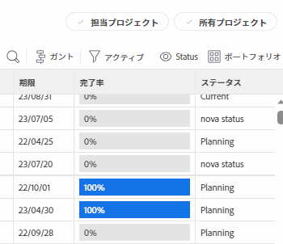

   >[!NOTE]
   >
   >グループ管理者は、グループエリアとプロジェクトエリアで、グループのプロジェクトを表示および編集できます。詳しくは、[グループのプロジェクトを作成および変更](../../../administration-and-setup/manage-groups/work-with-group-objects/create-and-modify-a-groups-projects.md)を参照してください。

1. 編集するプロジェクトの名前をクリックして、プロジェクトページを開きます。

1. （オプション）プロジェクトに関する限定的な情報を編集するには、 **プロジェクトの詳細** をクリックします。 プロジェクトに関するすべての情報を編集する場合は、手順 5 に進みます。 <!--accurate?!-->

   

   >[!NOTE]
   >
   >Workfront 管理者またはグループ管理者がレイアウトテンプレートを変更する方法によっては、プロジェクトの詳細エリアのフィールドが再配置されるか、表示されない場合があります。詳しくは、[レイアウトテンプレートを使用して詳細ビューをカスタマイズ](../../../administration-and-setup/customize-workfront/use-layout-templates/customize-details-view-layout-template.md)を参照してください。

   「詳細」セクションの情報を編集するには、次の手順を実行します。

   1. （オプション） **すべて折りたたむ** アイコン   右上隅で、すべての領域を折りたたみます。
   1. （オプションおよび条件付き）エリアが折りたたまれている場合、各エリアの横にある&#x200B;**右向き矢印**  をクリックして、編集するエリアを展開します。
   1. 「プロジェクトの詳細」タブでの情報の編集について詳しくは、次の記事を参照してください。

      * [プロジェクトの概要エリアで情報を管理](../../../manage-work/projects/manage-projects/understand-project-overview-area.md)
      * [プロジェクトの財務エリアでの情報の管理](../../../manage-work/projects/project-finances/manage-project-finance-area.md)

   1. （オプション）カスタムフォームを添付するには、「**カスタムフォームを追加**」フィールドにフォームの名前の入力を開始し、リストに表示されたらフォームを選択して、「**変更を保存**」をクリックします。
   1. （オプション）**書き出し**&#x200B;アイコン  をクリックして概要とカスタムフォーム情報を PDF ファイルに書き出し、「**書き出し**」をクリックします。次の中から選択します。

      * すべてを選択（1 つ以上のカスタムフォームが添付されている場合にのみ表示）
      * 概要
      * 1 つまたは複数のカスタムフォームの名前

      PDF ファイルがお使いのコンピューターにダウンロードされます。

      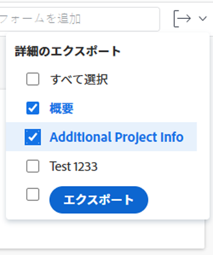

      詳しくは、[カスタムフォームとオブジェクトの詳細を書き出す](../../../workfront-basics/work-with-custom-forms/export-custom-forms-details.md)を参照してください。

   「プロジェクトの詳細」セクションに表示されるフィールドについて詳しくは、次に説明するように、「プロジェクトを編集」ボックスでプロジェクトの編集を続けます。
1. プロジェクトに関するすべての情報を編集するには、プロジェクト名の横にある&#x200B;**その他**&#x200B;メニュー 、「**編集**」の順にクリックします。

   または

   プロジェクトのリストから、1 つまたは複数のプロジェクトを選択し、 **編集** アイコン  をクリックします。

   プロジェクトの一括編集について詳しくは、 [プロジェクトの一括編集](#edit-projects-in-bulk) 」を参照してください。

   「**プロジェクトを編集**」ボックスが開きます。

   >[!IMPORTANT]
   >
   >「編集」オプションを表示するには、プロジェクトに対する管理権限が必要です。

   すべてのプロジェクトフィールドは、「プロジェクトを編集」ボックスで使用でき、左側のパネルに表示されるエリアでグループ化されます。

   >[!NOTE]
   >
   >Workfront 管理者またはグループ管理者がレイアウトテンプレートを変更する方法によっては、「プロジェクトを編集」ボックスの左側のパネルにあるエリアまたはこれらのエリアに表示されるフィールドが再配置されるか、表示されない場合があります。詳しくは、[レイアウトテンプレートを使用して詳細ビューをカスタマイズ](../../../administration-and-setup/customize-workfront/use-layout-templates/customize-details-view-layout-template.md)を参照してください。

1. （条件付き） **その他** メニューとメニュー **編集**、左側のパネルに表示される次のいずれかの領域で情報を更新します。

   * [プロジェクト名](#project-name)
   * [概要](#overview)
   * [カスタムフォーム](#custom-forms)
   * [財務](#finance)
   * [プロジェクト設定](#project-settings)
   * [タスク設定](#task-settings)
   * [イシュー設定](#issue-settings)
   * [アクセス](#access)

   >[!NOTE]
   >
   >Workfront 管理者がレイアウトテンプレートを設定する方法によっては、「プロジェクトを編集」ボックスのセクションとフィールドが環境によって異なる場合があります。詳しくは、[レイアウトテンプレートを使用して詳細ビューをカスタマイズ](../../../administration-and-setup/customize-workfront/use-layout-templates/customize-details-view-layout-template.md)を参照してください。

### プロジェクト名 {#project-name}

1. 前述の説明に従って、プロジェクトの編集を開始します。
1. 左側のパネルの「**プロジェクト名**」をクリックします。

   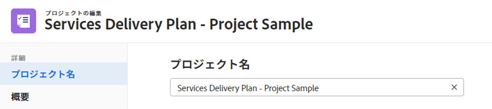

1. プロジェクトの名前を更新します。

   プロジェクトを一括編集する際には、プロジェクト名を編集できません。

### 概要 {#overview}

1. 前述の説明に従って、プロジェクトの編集を開始します。
1. 左側のパネルにある「**承認**」をクリックします。

   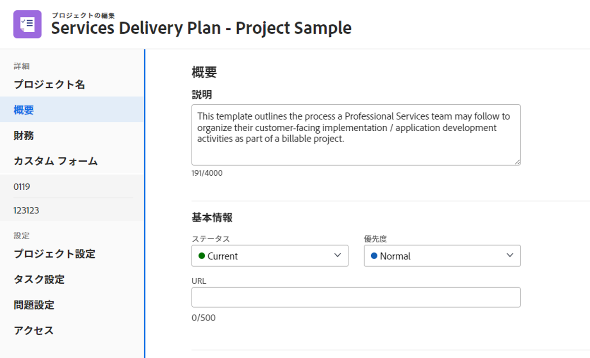

1. プロジェクトに関する次の情報を更新します。

   <table style="table-layout:auto"> 
      <col> 
      <col> 
      <tbody> 
      <tr> 
         <td role="rowheader"><strong>説明</strong> </td> 
         <td> 
プロジェクトに関する追加情報を追加します。
 </td> 
      </tr> 
      <tr> 
         <td role="rowheader"><strong>ステータス</strong> </td> 
         <td> 
プロジェクトのステータスを選択します。すべてのタスクとイシューが完了する前に、プロジェクトを「完了」とマークすることはできません。プロジェクトのステータスについて詳しくは、<a href="../../../administration-and-setup/customize-workfront/creating-custom-status-and-priority-labels/project-statuses.md" class="MCXref xref">システムプロジェクトステータスのリストにアクセス</a>を参照してください。
 </td> 
      </tr> 
      <tr> 
         <td role="rowheader"><strong>優先度</strong> </td> 
         <td> 
 
これは、プロジェクトに優先順位を付けるための単なる視覚的なフラグです。
 
Workfront 管理者が選択したプロジェクト設定に応じて、優先順位の名前が異なる場合があります。優先順位の編集について詳しくは、<a href="../../../administration-and-setup/customize-workfront/creating-custom-status-and-priority-labels/create-customize-priorities.md" class="MCXref xref">優先順位を作成およびカスタマイズ</a>を参照してください。
 
 </td> 
      </tr> 
      <tr> 
         <td role="rowheader"><strong>URL</strong> </td> 
         <td> 
このプロジェクトに関する情報に関連する web リンクを指定します。
 </td> 
      </tr> 
      <tr> 
         <td role="rowheader"><strong>状況タイプ</strong> </td> 
         <td> 
次の状況タイプの中から選択します。 
         <ul> 
         <li><strong>手動：</strong>プロジェクト所有者が、手動でプロジェクトに状況を設定します。</li> 
         <li><strong>進捗状況ステータス：</strong> Workfront は、クリティカルパス上のタスクの進捗状況ステータスに基づいて、状況を自動的に設定します。進捗状況ステータスについて詳しくは、<a href="../../../manage-work/tasks/task-information/task-progress-status.md" class="MCXref xref">タスクの進捗状況ステータスの概要</a>を参照してください。</li> 
         </ul>
Workfront 管理者またはグループ管理者は、自身のシステムまたはグループについて、プロジェクトの状況に対するデフォルトの計算方法を選択します。プロジェクトのデフォルトの設定について詳しくは、<a href="../../../administration-and-setup/set-up-workfront/configure-system-defaults/set-project-preferences.md" class="MCXref xref">システム全体のプロジェクト環境の設定</a>を参照してください。 

 </td> 
      </tr> 
      <tr> 
         <td role="rowheader"><strong>状況</strong> </td> 
         <td> 
 
（「<strong>状況タイプ</strong>」で「<strong>手動</strong>」を選択した後にのみ表示）：プロジェクトの進行状況を示す「状況」を選択します。 
 
プロジェクト状況を自動または手動で設定する方法について詳しくは、<a href="../../../manage-work/projects/manage-projects/project-condition-and-condition-type.md" class="MCXref xref">プロジェクト状況と状況タイプの概要</a>を参照してください。
 
 </td> 
      </tr> 
      <tr> 
         <td role="rowheader"><strong>スケジュールモード</strong> </td> 
         <td> 
プロジェクトを「開始日」からスケジュールするか、「完了日」からスケジュールするかを指定します。この選択により、プロジェクト上のタスクの予定日が決まります。 
         <ul> 
         <li><strong>開始日</strong>：プロジェクトの最初のタスクには、デフォルトでプロジェクトと同じ計画開始日が設定されます。タスクの計画開始日について詳しくは、<a href="../../../manage-work/tasks/task-information/task-planned-start-date.md" class="MCXref xref">タスクの計画開始日の概要</a>を参照してください。プロジェクトタイムラインは開始日から計算され、プロジェクトの完了日は、すべてのタスクの期間に基づいてシステムによって計算されます。 </li> 
         <li><strong>完了日</strong>：プロジェクトの最後のタスクの完了予定日は、プロジェクトと同じ日付になります。プロジェクトタイムラインは、プロジェクトの完了日から計算され、プロジェクトの開始日は、プロジェクトの完了日からすべてのタスクの期間を引くことで、システムによって計算されます。 </li> 
         </ul>
Workfront 管理者またはグループ管理者はシステムまたはグループのデフォルトのスケジュールモード設定を選択します。プロジェクトのデフォルトの設定について詳しくは、<a href="../../../administration-and-setup/set-up-workfront/configure-system-defaults/set-project-preferences.md" class="MCXref xref">システム全体のプロジェクト環境設定の指定</a>を参照してください。

 </td> 
      </tr> 
      <tr> 
         <td role="rowheader"><strong>計画開始日時</strong> </td> 
         <td> 
 
「<strong>開始日からスケジュール</strong>」を選択する際に日付を指定します。  
 
「<strong>完了日からスケジュール</strong>」を選択した場合、これは読み取り専用フィールドになります。 
 
 </td> 
      </tr> 
      <tr> 
         <td role="rowheader"><strong>計画完了日時</strong> </td> 
         <td> 
「<strong>完了日からスケジュール</strong>」を選択する際に日付を指定します。 
 
<strong>開始日からのスケジュール</strong>」を選択した場合、これは読み取り専用フィールドになります。 
 </td> 
      </tr> 
      <tr> 
         <td role="rowheader"><strong>ポートフォリオ</strong></td> 
         <td>プロジェクトが属するポートフォリオを示します。ドロップダウンリストに表示される前に、まずポートフォリオを作成する必要があります。プロジェクトに関連付けることができるのは、アクティブなポートフォリオのみです。ポートフォリオの作成について詳しくは、<a href="../../../manage-work/portfolios/create-and-manage-portfolios/create-portfolios.md" class="MCXref xref">ポートフォリオの作成</a>を参照してください。</td> 
      </tr> 
      <tr> 
         <td role="rowheader"><strong>プログラム</strong></td> 
         <td> 
プロジェクトのポートフォリオを選択した場合は、プロジェクトのプログラムを指定します。一部のポートフォリオにはプログラムがない可能性があります。このドロップダウンリストに表示される前に、最初にプログラムを作成する必要があります。プロジェクトに関連付けることができるのは、アクティブなプログラムのみです。 
 
プログラムの作成について詳しくは、<a href="../../../manage-work/portfolios/create-and-manage-programs/create-program.md" class="MCXref xref">プログラムの作成</a>を参照してください。
 </td> 
      </tr> 
      <tr> 
         <td role="rowheader"><strong>グループ</strong></td> 
         <td> 
 
プロジェクトに関連付けられているグループの名前を指定します。 
必須フィールドです。グループに関連付けられていないプロジェクトを持つことはできません。 
 
適切なグループを選択していることを確認するには、グループにカーソルを移動して、その横に表示される情報アイコン  をクリックします。グループの上位のグループの階層や管理者など、グループに関する情報が一覧表示されるツールチップが表示されます。
 別のグループを指定しない限り、デフォルトでは、次のグループの 1 つがプロジェクトの作成時に自動的にプロジェクトに関連付けられます。
 
         <ul> 
         <li> 
プロジェクトをプロジェクト領域から作成すると、プロジェクト作成者のホームグループがプロジェクトに関連付けられます。 
 
これは、ポートフォリオまたはプログラムの「プロジェクト」セクションからプロジェクトを作成した場合にも当てはまります。
 </li> 
         <li> 
設定領域のグループのメインページからプロジェクトを作成すると、そのグループがプロジェクトに関連付けられます。
 </li> 
         </ul> 
 
 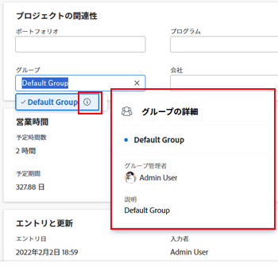 
 
         
<b>メモ</b>

       &lt;ul>
       &lt;li>&lt;p>プロジェクト、またはそのタスクや問題がグループレベルのカスタム状態に関連付けられている場合は、プロジェクトのグループを変更すると、新しいグループに合わせてプロジェクト、タスク、または問題の状態が変更されます。&lt;/p>&lt;/li>
       &lt;li>&lt;p>グループレベルのカスタムステータスを使用して、プロジェクト、またはそのタスクまたは問題が既にグループレベルの承認プロセスに関連付けられている場合、グループを変更すると、前のグループの承認ステータスとシステムレベルの承認ステータスが競合する可能性があります。&lt;/p>
       &lt;p>グループを更新する前に、プロジェクト上のグループレベルの承認プロセス、またはそのタスクや問題を削除することを検討してください。&lt;/p>
       &lt;p>グループレベルの承認プロセスの作成について詳しくは、グループレベルの承認&lt;a href=&quot;../../../administration-and-setup/manage-groups/work-with-group-objects/create-and-modify-groups-approval-processes.md&quot; class=&quot;MCXref xref&quot;>プロセスを参照してください&lt;/a>。&lt;/p>
       &lt;p>グループレベルのカスタムステータスの作成について詳しくは、「グループステータスの作&lt;a href=&quot;../../../administration-and-setup/manage-groups/manage-group-statuses/create-or-edit-a-group-status.md&quot; class=&quot;MCXref xref&quot;>成または編集」を参照してください。&lt;/a>&lt;/p>&lt;/li>&lt;/ul> &lt;/td>
   </tr> 
      <tr> 
         <td role="rowheader"><strong>会社</strong> </td> 
         <td> 
プロジェクトに関連付けられている会社を指定します。会社をプロジェクトに関連付ける前に、会社を作成する必要があります。プロジェクトに関連付けることができるのは、アクティブな会社のみです。会社の作成について詳しくは、<a href="../../../administration-and-setup/set-up-workfront/organizational-setup/create-and-edit-companies.md" class="MCXref xref">会社の作成と編集</a>を参照してください。
 </td> 
      </tr> 
      <tr> 
         <td role="rowheader"><strong>プロジェクト所有者</strong> </td> 
         <td> 
プロジェクトに追加するユーザーの名前の入力を開始し、リストに表示されたらそのユーザーを選択します。ユーザーはプロジェクトチームに追加され、プロジェクトに対する管理権限が自動的に付与されます。プロジェクト所有者として指定されるユーザーは、Workfront のアクティブなユーザーである必要があります。

         </td> 
      </tr> 
      <tr> 
         <td role="rowheader"><strong>プロジェクトスポンサー</strong> </td> 
         <td> 
プロジェクトに追加するユーザーの名前の入力を開始し、リストに表示されたらそのユーザーを選択します。ユーザーはプロジェクトチームに追加され、プロジェクトに対する表示権限が自動的に付与されます。プロジェクトスポンサーとして指定されるユーザーは、Workfront のアクティブなユーザーである必要があります。 
 </td> 
      </tr> 
      <tr> 
         <td role="rowheader"><strong>リソース管理者</strong> </td> 
         <td> 
 プロジェクトに追加するユーザーの名前の入力を開始し、リストに表示されたらそのユーザーを選択します。ユーザーはプロジェクトチームに追加され、プロジェクトに対する管理権限が自動的に付与され、プロジェクトのタスクやイシューにリソースを割り当てることができます。ユーザーが「リソースマネージャー」フィールドから削除された場合でも、プロジェクトに対する管理権限は維持されます。複数のリソースマネージャーを指定できます。 
 </td> 
      </tr>

   <tr> 
         <td role="rowheader"><strong>変換された問題の作成者</strong> </td> 
         <td> 
 デフォルトでは、このフィールドには、プロジェクトを変換したイシューを作成したユーザーの名前が自動入力されます。 この名前は、Workfrontで他のユーザーの名前で更新できます。  
 </td> 
      </tr>

   </tbody> 
      </table>

   >[!TIP]
   >
   >「プロジェクト所有者」、「プロジェクトスポンサー」、「リソースマネージャー」の各フィールドを更新する際には、アバター、ユーザーの主要な役割またはメールアドレスに注意して、同じ名前のユーザーを区別します。
   >
   >ユーザーを追加したときに表示するには、少なくとも 1 つの担当業務に関連付ける必要があります。
   >
   >ユーザーがユーザーのメールを表示するには、アクセスレベルで、連絡情報の表示の設定を有効にしておく必要があります。詳しくは、[ユーザーへのアクセス権の付与](../../../administration-and-setup/add-users/configure-and-grant-access/grant-access-other-users.md)を参照してください。

1. （オプション）変更する情報に応じて、以降のセクションの編集を続けます

   または

   「**保存**」をクリックします。

### カスタムフォーム {#custom-forms}

アクセスレベルとプロジェクトに対する権限によって、次のシナリオが考えられます。

* プロジェクトに対するカスタムフォームの編集権限がない場合は、添付されたカスタムフォームのフィールドを編集できません。プロジェクトに添付されたカスタムフォームのフィールドの表示のみが許可されています。
* カスタムフォームのセクションに対する表示（編集ではない）アクセス権が付与されている場合、そのセクションのフィールドを編集することはできません。
* プロジェクトに添付されているカスタムフォームのいずれかのセクションにアクセスできない場合、そのセクションは「プロジェクトを編集」ボックスに表示されません。

複数のプロジェクトを選択して一括編集する際には、次のシナリオが考えられます。

* 選択した 1 つ以上のプロジェクトに対するカスタムフォームの編集権限がない場合は、添付されたカスタムフォームのフィールドを編集できません。添付されたカスタムフォームのフィールドの表示のみが許可されています。
* カスタムフォームのセクションに対する表示（編集ではない）アクセス権が付与されている場合、そのセクションのフィールドを編集することはできません。そのセクションのフィールドの表示のみが許可されています。
*  1 つ以上のプロジェクトに添付されているカスタムフォームのいずれかのセクションにアクセスできない場合、そのセクションは「プロジェクトを編集」ボックスに表示されません。
* すべてのプロジェクトに添付されているカスタムフォームのいずれかに必須フィールドがあり、実際に編集せずに 1 つのフィールドを選択した場合は、選択したプロジェクトを保存する前にそのフィールドに加えた変更を破棄するか、フィールドに情報を追加する必要があります。必須フィールドを 1 つも選択しない場合は、必須フィールドが空白でも選択したプロジェクトを保存できます。

カスタムフォームへのアクセスについて詳しくは、次の記事を参照してください。

* [カスタムフォームを共有](../../../administration-and-setup/customize-workfront/create-manage-custom-forms/share-access-to-a-custom-form.md)
* [カスタムフォームにセクション区切りを追加](../../../administration-and-setup/customize-workfront/create-manage-custom-forms/add-a-section-break-to-a-custom-form.md)

プロジェクトの編集時にカスタムフォームの情報を編集するには：

1. 前述の説明に従って、プロジェクトの編集を開始します。
1. 左パネルで「**カスタムフォーム**」をクリックします。

   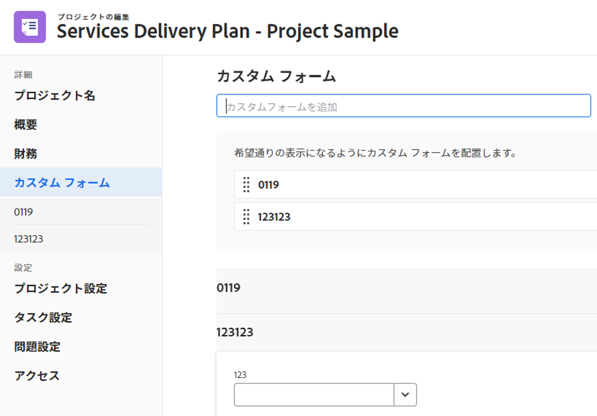

1. 「**カスタムフォームを追加**」ボックスをクリックし、リストからフォームを選択してプロジェクトに添付します。デフォルトでは、最初の 40 個のフォームがアルファベット順に表示されます。リストにフォームが表示されない場合は、名前の入力を開始し、リストに表示されたら選択します。

   >[!NOTE]
   >
   >このフィールドでカスタムフォームを選択できるようにするには、まずカスタムフォームを作成する必要があります。アクティブなカスタムフォームのみがリストに表示されます。カスタムフォームの作成について詳しくは、[カスタムフォームの作成または編集](../../../administration-and-setup/customize-workfront/create-manage-custom-forms/create-or-edit-a-custom-form.md)を参照してください。1 つのプロジェクトには、最大 10 個のカスタムフォームを追加できます。

1. （条件付き）カスタムフォームをプロジェクトに添付した場合は、フォーム上の任意のフィールドを編集します。プロジェクトを保存する前に、すべての必須フィールドを指定する必要があります。
1. （オプション）削除するにはカスタムフォーム名の右側にある **X アイコン**、「**削除**」の順にクリックします。
1. （オプション）変更する情報に応じて、以降のセクションの編集を続けます

   または

   「**保存**」をクリックします。

### 財務 {#finance}

アクセスレベルとプロジェクトに対する権限によって、次のシナリオが考えられます。

* プロジェクトに対する財務データの表示アクセス権と財務の表示権限がある場合は、「財務」セクションのフィールドのみを表示できます。このセクションのフィールドは編集できません。
* プロジェクトに対する財務データの編集アクセス権と財務の管理権限がある場合は、このセクションのフィールドのみを更新できます。

複数のプロジェクトを選択して一括編集する場合、次のシナリオが考えられます。

* （財務の管理ではなく）財務の表示権限を持つプロジェクトを 1 つ以上選択した場合は、選択したすべてのプロジェクトに対して、このセクションのフィールドのみを表示できます。「財務」セクションのフィールドは一括編集できません。
* 財務権限を持たないプロジェクトを 1 つ以上選択した場合、このセクションは表示されません。

財務エリアのフィールドを編集する手順は、次のとおりです。

1. 前述の説明に従って、プロジェクトの編集を開始します。
1. 左側のパネルで「**財務**」をクリックします。

   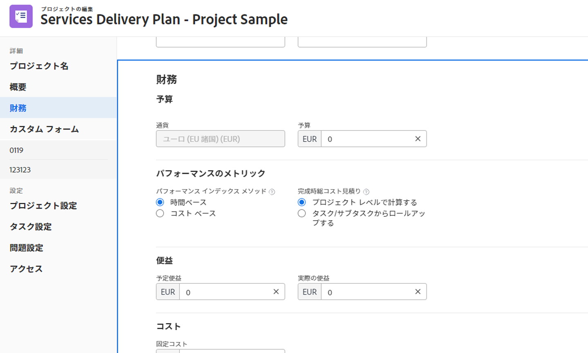

1. プロジェクトの次の財務情報を更新します。

   <table style="table-layout:auto"> 
    <col> 
    <col> 
    <tbody> 
     <tr data-mc-conditions=""> 
      <td role="rowheader"><strong>通貨</strong> </td> 
      <td> 
 
システムのデフォルトの通貨と異なる場合は、プロジェクトの通貨を指定します。プロジェクトにすでに財務情報がある場合、プロジェクトの通貨を変更することはできません。システムにデフォルトの通貨のみが存在する場合、このフィールドは表示されません。 
 
通貨について詳しくは、<a href="../../../administration-and-setup/manage-workfront/exchange-rates/set-up-exchange-rates.md" class="MCXref xref">為替レートを設定</a>を参照してください。 
 
 </td> 
     </tr> 
     <tr> 
      <td role="rowheader"><strong>予算</strong> </td> 
      <td> プロジェクトの予算を指定します。 </td> 
     </tr> 
     <tr> 
      <td role="rowheader"><strong>パフォーマンスインデックスメソッド</strong> </td> 
      <td> 
「<b>時間ベース</b>」または「<b>コストベース</b>」を選択して（コスト効率指数や推定された実際のコストなど）、プロジェクトの出来高指標が時間とコストのどちらを使用して計算されるかを示します。 
 
パフォーマンスインデックスメソッドについて詳しくは、<a href="../../../manage-work/projects/project-finances/set-pim.md" class="MCXref xref">パフォーマンスインデックスメソッド（PIM）を設定</a>を参照してください。 
 
Workfront 管理者またはグループ管理者は、システムまたはグループのデフォルトのパフォーマンスインデックスメソッド設定を選択します。プロジェクトのデフォルトの設定について詳しくは、<a href="../../../administration-and-setup/set-up-workfront/configure-system-defaults/set-project-preferences.md" class="MCXref xref">システム全体のプロジェクト環境設定を指定</a>を参照してください。
 </td> 
     </tr> 
     <tr> 
      <td role="rowheader"><strong>完成時総コスト見積り</strong> </td> 
      <td> 
 
Workfront が完了時の見積もり（EAC）を計算する方法を指定します。 

      次のオプションから選択します。 
      <ul><li><b>プロジェクトレベルで計算</b></li>
      <li><b>タスク／サブタスクからロールアップ</b></li> </ul>
      
完了時の見積もりの計算方法について詳しくは、<a href="../../../manage-work/projects/project-finances/calculate-eac.md" class="MCXref xref">完了時の見積もり（EAC）を計算</a>を参照してください。
 
Workfront またはグループ管理者が、システムまたはグループのデフォルトの完了時の見積もり設定を選択します。プロジェクトのデフォルトの設定について詳しくは、<a href="../../../administration-and-setup/set-up-workfront/configure-system-defaults/set-project-preferences.md" class="MCXref xref">システム全体のプロジェクト環境設定を指定</a>を参照してください。
 
 </td> 
     </tr> 
     <tr> 
      <td role="rowheader"><strong>予定利益</strong> </td> 
      <td> 
プロジェクトの予定利益がどのようなものであるかを見積もります。これは、プロジェクトのビジネスケースとポートフォリオオプティマイザーで使用されます。プロジェクトの予定利益について詳しくは、<a href="../../../manage-work/projects/project-finances/project-planned-benefit.md" class="MCXref xref">プロジェクトの予定利益の概要</a>を参照してください。プロジェクトの正味価値が計算される際には、プロジェクトの予定利益が考慮されます。 
 
詳しくは、<a href="../../../manage-work/portfolios/portfolio-optimizer/manage-projects-in-portfolio-optimizer.md" class="MCXref xref">ポートフォリオオプティマイザーでプロジェクトを管理</a>を参照してください。 
 </td> 
     </tr> 
     <tr> 
      <td role="rowheader"><strong>実際の利益</strong> </td> 
      <td> 
プロジェクトの実際の利益を見積もります。これは、このプロジェクトが完了した後に企業や部門が得る利益を表す通貨金額です。 
 </td> 
     </tr> 
      <tr> 
      <td role="rowheader"><strong>固定コスト</strong> </td> 
      <td> 
プロジェクトの固定コストを指定します。これは、プロジェクトの時間に基づく労力コストと、プロジェクトの費用の額に基づく経費コストとは異なります。プロジェクトの固定コストは、プロジェクトの正味値を計算する際に考慮され、予算計上コストに含まれます。 
 </td> 
     </tr> 
     <tr> 
      <td role="rowheader"><strong>固定収益</strong> </td> 
      <td> 
プロジェクトの固定収益を指定します。 
 </td> 
     </tr> 
    </tbody> 
   </table>

1. （オプション）変更する情報に応じて、以降のセクションを引き続き編集します。

   または

   「**保存**」をクリックします。

### プロジェクト設定 {#project-settings}

1. 前述の説明に従って、プロジェクトの編集を開始します。
1. 左側のパネルで「**プロジェクト設定**」をクリックします。

   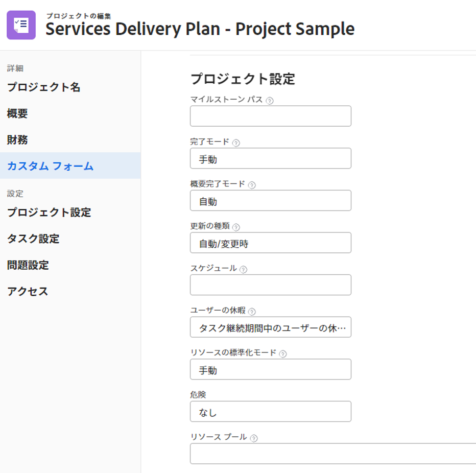

1. 次の情報を更新します。

   <table style="table-layout:auto"> 
      <col> 
      <col> 
      <tbody> 
      <tr> 
      <td role="rowheader"><strong>マイルストーンパス</strong> </td> 
       <td> 
プロジェクトのマイルストーンパスを選択します。アクティブなマイルストーンパスのみがリストに表示されます。
 
マイルストーンパスについて詳しくは、<a href="../../../administration-and-setup/customize-workfront/configure-approval-milestone-processes/create-milestone-path.md" class="MCXref xref">マイルストーンパスを作成</a>を参照してください。
 </td> 
      </tr> 
      <tr> 
      <td role="rowheader"><strong>完了モード</strong> </td> 
      <td> 
プロジェクトを「完了」としてマークする方法を制御します。次のオプションから選択します。 
       <ul> 
       <li>
<strong>自動</strong>：すべてのタスクとイシューが完了すると、プロジェクトは「完了」とマークされます。

タスクが完了したときに、プロジェクトのステータスが「現在」になった場合にのみ、プロジェクトのステータスが「完了」に自動的に変更されます。 
</li> 
       <li><strong>手動</strong>：すべてのタスクとイシューが完了したら、プロジェクトの「完了」のステータスを手動で選択する必要があります。</li> 
       </ul>
 </td> 
       </tr> 
       <tr> 
       <td role="rowheader"><strong>概要完了モード</strong></td> 
       <td> 
親タスクを「完了」としてマークする方法を制御します。次のオプションから選択します。 
       <ul> 
       <li><strong>自動</strong>：親タスクは「完了」とマークされ、子タスクが完了し、子タスクの完了率が更新されると、親タスクの完了率が自動的に更新されます。 </li> 
       <li><strong>手動</strong>：子タスクに加えられた変更に関係なく、完了率と親タスクのステータスを手動で更新する必要があります。 これにより、サブタスクが不完全な場合でも親タスクを完了済みとマークできます。 </li> 
       </ul>
 </td> 
       </tr> 
       <tr> 
       <td role="rowheader"><strong>更新タイプ</strong></td> 
       <td> 
プロジェクトタイムラインに対して行った変更を、プロジェクトまたは親タスクに保存するタイミングを制御します。例えば、プロジェクトトリガーに対する次の変更や、プロジェクトのタイムラインへの更新があります。 
       <ul> 
       <li>タスクの日付を更新</li> 
       <li>タスクの先行関係を変更</li> 
       <li>
親子関係を変更し、タスクの制約や期間タイプを変更するだけでなく、割り当てを追加または削除します。

タスクが更新されると、その親オブジェクト（親タスクまたはプロジェクト）が更新タイプで指定された時間に更新されます。 

更新タイプで「自動・変更時」または「変更時のみ」を選択し、変更直後に親オブジェクトが更新されない場合は、ページを更新します。

次のオプションから選択します。 

- <strong>自動および変更時</strong>（デフォルト設定）：プロジェクトのタイムラインは、プロジェクト内またはプロジェクトが依存する別のプロジェクト内で変更が発生するたびに更新されます（変更時）。また、プロジェクトのタイムラインは毎晩更新されます（自動）。

プロジェクトが常に最新であることが保証されるため、このフィールドではこの設定が推奨されています。

タイムラインの再計算をトリガーするアクションをタスクまたはプロジェクトに対して実行すると、利用可能なすべての日付がすぐに表示され、作業を続行できます。タスクが 100 を超えるプロジェクトでは、再計算に時間がかかる日付が疑問符で短時間（1 から 5 秒、大きなプロジェクトの場合は最大 1 分）のみ表示されます。これは、再計算がまだ完了しておらず、日付が変更される可能性があることを示しています。

- <strong>変更時のみ</strong>：プロジェクトのタイムラインは、プロジェクト内またはプロジェクトが依存する別のプロジェクト内で変更が発生するたびに更新されます。プロジェクト内、またはタイムラインが依存する他のプロジェクト内で変更がほとんど発生しない場合は、このオプションを選択できます。

- <strong>自動のみ</strong>：プロジェクトのタイムラインは毎晩更新され、変更が加えられた直後には更新されません。

プロジェクト内、またはタイムラインが依存する他のプロジェクト内で毎日多くの変更が発生する場合は、このオプションを選択できます。ただし、変更を加えてもプロジェクトがすぐに更新されないので、この設定を選択した場合は注意が必要です。

- <strong>手動のみ</strong>：プロジェクトのタイムラインは、「タイムラインを再計算」オプションを選択した場合にのみ更新されます。プロジェクトタイムラインを手動で再計算する方法について詳しくは、<a href="../../../manage-work/projects/manage-projects/recalculate-project-timeline.md" class="MCXref xref">プロジェクトタイムラインの再計算</a>を参照してください。 

プロジェクトに一度に多くの変更を加え、個々を変更した後ではなくすべての変更が行われた後でタイムラインの再計算を実行する場合は、このオプションを選択できます。
</li> 
       </ul>
 </td> 
       </tr> 
       <tr> 
       <td role="rowheader"><strong>スケジュール</strong> </td> 
       <td> 
プロジェクトのスケジュールを選択します。これは、プロジェクトで作業しているほとんどの人に割り当てられているスケジュールと同じである必要があります。スケジュールをプロジェクトまたはユーザーに割り当てるには、事前にスケジュールを作成する必要があります。システムでカスタムスケジュールを作成していない場合は、デフォルトのスケジュールが選択されます。
 
スケジュールの作成について詳しくは、<a href="../../../administration-and-setup/set-up-workfront/configure-timesheets-schedules/create-schedules.md" class="MCXref xref">スケジュールを作成</a>を参照してください。 
 </td> 
       </tr> 
       <tr> 
       <td role="rowheader"><strong>ユーザーの休暇</strong> </td> 
       <td> 
タスクのプライマリ担当者の休暇によって、そのプロジェクトのタスクの予定日を調整するかどうかを指定します。 

Workfront 管理者またはグループ管理者は、システムまたはグループのこの設定でデフォルトを選択します。プロジェクトのデフォルト設定について詳しくは、<a href="../../../administration-and-setup/set-up-workfront/configure-system-defaults/set-project-preferences.md" class="MCXref xref">システム全体のプロジェクト環境設定を指定</a>を参照してください。 

次のオプションから選択： - <strong>タスク継続期間中のユーザーの休暇を考慮する</strong>：このオプションを選択すると、タスクの期間中に休暇が発生した場合、タスクのプライマリ担当者の休暇に応じてタスクの予定日が調整されます。 

例えば、「できるだけ早く」という制約が設定されたタスクが 6月1日に開始、6月3日に完了とスケジュールされており、6月2日にプライマリ担当者の休暇がマークされている場合、この選択が有効になっていると、タスクの予定日は 6月1日から 6月4日に調整されます。タスクの制約に応じて、次のシナリオが考えられます。 
 
       <ul> 
       <li>開始日からの予定に関連するタスクの制約（できるだけ早く、最も早い空き時間、指定日以後に開始、指定日までに開始、指定日に開始）の場合、予定開始日は変更されませんが、予定完了日は変更されます。</li> 
       <li>完了日からの予定に関連するタスクの制約（できるだけ遅く、最も遅い空き時間、これよりも早く終了しない、これよりも遅く終了しない、指定日に終了）の場合、予定完了日は変更されませんが、予定開始日は変更されます。</li> 
       <li>固定日付の制約があるタスクの場合は、予定開始日も完了日も変更されません。 </li> 
       </ul>
この設定を選択しても、タスクの期間は変わりません。タスクの制約に応じて、予定日のみが変更されます。タスクの制約について詳しくは、<a href="../../../manage-work/tasks/task-constraints/task-constraint-overview.md" class="MCXref xref">タスクの制約の概要</a>を参照してください。 

- <strong>タスク期間中のユーザーの休暇を無視する</strong>：このオプションを選択すると、タスクのプライマリ担当者がタスクの期間中に休暇を取った場合でも、プロジェクトのタスクの予定日は当初の計画どおりに保持されます。 

この設定のオプションを選択する際は、次の点に注意してください。
 
       <ul> 
       <li>
新しいプロジェクトに対するこの設定のデフォルトのオプションは、システムレベルのプロジェクト環境設定と同じです。 

システムレベルでのプロジェクト環境設定について詳しくは、<a href="../../../administration-and-setup/set-up-workfront/configure-system-defaults/set-project-preferences.md" class="MCXref xref">システム全体のプロジェクト環境設定を指定</a>を参照してください。 
</li> 
       <li>テンプレートを既存のプロジェクトに添付すると、プロジェクトの設定がテンプレートの設定と一致するように更新されます。 </li> 
       <li>
Workfront はタスクの制約値に従って、調整する予定タスクの日付を決定します。制約値によっては、予定開始日と予定完了日のいずれか、またはその両方が影響を受ける可能性がありますが、変更されないこともあります。例えば、タスクに固定日付の制約があると、<strong>タスク継続期間中のユーザーの休暇を考慮する</strong>が選択されていても、プライマリ担当者が休暇をとった場合に日付が調整されません。 
</li> 
       </ul></td> 
      </tr> 
      <tr> 
       <td role="rowheader"><strong>リソースの標準化モード</strong> </td> 
       <td> 
 
次のオプションから選択します。
 
- <strong>手動</strong>：リソースを手動でレベル設定する必要があります（これはデフォルト設定です）。
 
- <strong>自動</strong>：Workfront がリソースをレベル設定します。
 
リソースのレベル設定について詳しくは、<a href="../../../manage-work/gantt-chart/use-the-gantt-chart/level-resources-in-gantt.md" class="MCXref xref">ガントチャートでのリソースのレベル設定</a>を参照してください。
 
 </td> 
      </tr> 
      <tr> 
       <td role="rowheader"><strong>リスク</strong> </td> 
       <td> 
 
プロジェクトのリスクのレベルを定義します。リスクは、プロジェクトの危険性を示す指標に過ぎません。リスクのレベルに基づいて、プロジェクトに優先順位を付けて実行できます。
 
 
次のリスクレベルから選択することを検討してください。
 
- 極低
 
- 低
 
- 中
 
- 高
 
- 極高
 
ここで示すリスクのレベルはカスタマイズできません。
 
これらは、プロジェクトの存続期間中に発生する可能性があり、プロジェクトの「リスク」タブまたはビジネスケースに記録する必要がある潜在的なリスクとは関係ありません。潜在的なプロジェクトのリスクについて詳しくは、<a href="../../../administration-and-setup/set-up-workfront/configure-system-defaults/edit-create-risk-types.md" class="MCXref xref">リスクタイプを編集および作成</a>を参照してください。 
 
 
 </td> 
      </tr> 
      <tr> 
       <td role="rowheader"><strong>リソースプール</strong> </td> 
       <td> 
 
プロジェクトに関連付けられたリソースプールを指定します。リソースプールとは、プロジェクトの完了に同時に必要なユーザーのコレクションで、リソースプランナーでプロジェクトの予算を立てることができます。リソースプールについて詳しくは、<a href="../../../resource-mgmt/resource-planning/resource-pools/work-with-resource-pools.md" class="MCXref xref">リソースプールの概要</a>を参照してください。 
 
プロジェクトを一括で編集すると、選択したすべてのプロジェクトに共通のリソースプールのみがこのフィールドに表示されます。選択したプロジェクトに共有のリソースプールがない場合、このフィールドは空になります。ここで指定したリソースプールは、プロジェクトの個々のリソースプールを上書きします。
 
 </td> 
      </tr> 
      <tr> 
       <td role="rowheader"> <strong>会社レベルでの請求レートによるプロジェクトレベルの請求レートの上書きを許可</strong></td> 
       <td>このオプションを選択すると、会社レベルの請求レートが請求済みとしてマークされていない限り、過去の担当業務の請求レートを上書きできるようになります。このオプションを有効にすると、請求済みとしてマークされていない限り、過去の担当業務のレートが上書きされます。 詳しくは、<a href="../../../manage-work/projects/project-finances/override-project-level-with-company-level-billing-rates.md" class="MCXref xref">プロジェクトレベルの請求料金を会社レベルの請求レートで上書き</a>を参照してください。</td> 
      </tr> 
      <tr> 
       <td role="rowheader"><strong>プロジェクト時間の承認</strong></td> 
       <td> 
 このオプションを選択すると、プロジェクト所有者がプロジェクトにログオンした時間を承認する必要があります。請求記録を使用している場合、このオプションを選択すると、プロジェクトで承認された時間のみが請求記録の請求可能時間として表示されます。プロジェクトの承認時間は、タイムシートの承認とは無関係です。 
 
プロジェクトの承認に時間を要することについて詳しくは、<a href="../../../manage-work/projects/manage-projects/require-time-approval-for-projects.md" class="MCXref xref">プロジェクトの承認に時間を要する</a>を参照してください。
 </td> 
      </tr> 
      <tr> 
       <td role="rowheader"><strong>時間タイプをフィルター</strong>および<strong>時間タイプ</strong></td> 
       <td> 
 
次のオプションから選択します。
 
       <ul> 
       <li> 
「<strong>いいえ</strong>」を選択して、プロジェクトでプロジェクト固有の時間タイプをすべて使用できるようにします。（これはデフォルトの選択です）
 
または
 </li> 
       <li>選択 <strong>はい</strong> プロジェクト固有の時間タイプのサブセットのみをプロジェクトで使用可能にするには、使用可能にする時間タイプを <b>時間タイプ</b> フィールドに入力します。</li> 
       
<b>ヒント</b>

       
The <b>時間タイプ</b> フィールドは、 <b>いいえ</b>.
 
       
このオプションを選択した場合は、選択した時間タイプのみが、プロジェクト（またはプロジェクト内のタスクやイシュー）の時間を記録する際に選択できるようになります。1 つ以上の時間タイプを選択する必要があります。このオプションを選択し、時間タイプを選択しない場合、すべての時間タイプがプロジェクトで使用可能になります。
 </ul>

   
ユーザーがプロジェクトでこれらの時間タイプのオプションを表示するには、個々のユーザーレベルで同じ時間タイプの選択を行う必要があります。ユーザーレベルで時間タイプを定義する方法について詳しくは、<a href="../../../timesheets/create-and-manage-timesheets/log-time.md" class="MCXref xref">時間を記録</a>を参照してください。 
 
 </td> 
      </tr> 
      <tr data-mc-conditions=""> 
       <td role="rowheader"><strong>リマインダー通知</strong> </td> 
       <td> 
 
プロジェクトに関連付ける「リマインダー通知」を選択します。プロジェクトの編集中にこのフィールドを表示するには、プロジェクトのリマインダー通知を設定する必要があります。リマインダー通知の設定について詳しくは、<a href="../../../administration-and-setup/manage-workfront/emails/set-up-reminder-notifications.md"><a href="../../../administration-and-setup/manage-workfront/emails/set-up-reminder-notifications.md" class="MCXref xref">リマインダー通知を設定</a>を参照してください。</a>
 
 </td> 
      </tr> 
      <tr data-mc-conditions=""> 
       <td role="rowheader"><strong>承認プロセス</strong></td> 
       <td> 
プロジェクトに関連付ける承認プロセスを選択します。Workfront 管理者は、プロジェクトに関連付ける前に、システムレベルの承認プロセスを定義する必要があります。承認プロセスへの管理者アクセス権を持つユーザーは、グループ固有の承認プロセスを作成することもできます。 承認プロセスの作成について詳しくは、<a href="../../../administration-and-setup/customize-workfront/configure-approval-milestone-processes/create-approval-processes.md" class="MCXref xref">作業アイテムの承認プロセスを作成</a>を参照してください。
 
承認プロセスを追加する際は、次の点を考慮してください。 
 
       <ul> 
       <li>アクティブな承認プロセスのみがリストに表示されます。 </li> 
       <li> 
システム全体およびグループ固有の承認プロセスがリストに表示されます。プロジェクトの承認プロセス以外のグループに関連付けられている承認プロセスは、リストに表示されません。
 
プロジェクトに関連付けられたグループが変更されると、グループ固有の承認プロセスが単一使用の承認プロセスになります。プロジェクトのグループに対する変更や承認プロセスの変更が承認設定に及ぼす影響について詳しくは、<a href="../../../administration-and-setup/customize-workfront/configure-approval-milestone-processes/how-changes-affect-group-approvals.md" class="MCXref xref">グループと承認プロセスの変更が割り当てられた承認プロセスに及ぼす影響</a>を参照してください。 
 </li> <!--(NOTE: this bullet stays here although the sections it might appear in are QS only, so we can use the snippet for both Qs and classic)-->
       
プロジェクトの一括編集では、次のシナリオが存在します。
 
       <ul> 
       <li> 
同じグループからプロジェクトを選択すると、システムレベルとグループレベルの両方の承認プロセスがこのフィールドに表示されます。
 </li> 
       <li> 
異なるグループからプロジェクトを選択すると、このフィールドにはシステムレベルの承認プロセスのみが表示されます。
 </li> 
       <li> 
いずれかのプロジェクトに 1 回限りの承認プロセスが添付されている場合、選択したシステムレベルまたはグループレベルの承認プロセスに置き換えられます。 
 </li> 
      </ul> </td> 
      </tr> 
      <tr> 
      </tr> 
      </tbody> 
      </table>

1. （オプション）変更する情報に応じて、以降のセクションを引き続き編集します。

   または

   「**保存**」をクリックします。

### タスク設定 {#task-settings}

プロジェクトに追加する際に、すべての新しいタスクに関連付けるデフォルトを定義できます。

これらの設定が新規タスクの作成に与える影響については、[タスクの作成の概要](../../../manage-work/tasks/create-tasks/create-tasks-overview.md)の記事で[タスクをプロジェクトに追加する際のタスクのデフォルト](../../../manage-work/tasks/create-tasks/create-tasks-overview.md#understa)の節を参照してください。

1. 前述の説明に従って、プロジェクトの編集を開始します。
1. 左パネルの「**タスク設定**」をクリックします。

   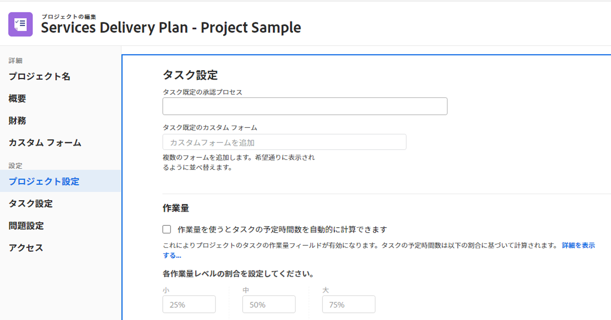

1. 「**タスク既定の承認プロセス**」フィールドで、プロジェクトに追加する際にすべての新規タスクに関連付けるタスク承認プロセスを選択します。

   Workfront管理者（または承認プロセスへの管理者アクセス権を持つユーザー）は、タスクをプロジェクトに関連付ける前に、タスクのシステムレベルまたはグループレベルの承認プロセスを作成する必要があります。 アクティブな承認プロセスのみがリストに表示されます。承認プロセスの作成については、[作業アイテムの承認プロセスの作成](../../../administration-and-setup/customize-workfront/configure-approval-milestone-processes/create-approval-processes.md)を参照してください。プロジェクトのグループに対する変更や承認プロセスの変更が承認設定に及ぼす影響については、[グループと承認プロセスの変更が、割り当てられた承認プロセスに及ぼす影響](../../../administration-and-setup/customize-workfront/configure-approval-milestone-processes/how-changes-affect-group-approvals.md)を参照してください。

   プロジェクトの一括編集では、次のシナリオが存在します。

   * 同じグループから複数のプロジェクトを選択すると、システムレベルとグループ固有の両方のタスク承認プロセスがこのフィールドに表示されます。
   * 異なるグループから複数のプロジェクトを選択すると、このフィールドにはシステムレベルのタスク承認プロセスのみが表示されます。

1. すべての新しいタスクをプロジェクトに追加する際に、それらに関連付けるカスタムフォーム（複数可）を、「**タスク既定のカスタム フォーム**」フィールドで選択します。このフィールドでカスタムフォームを選択できるようにするには、まずカスタムフォームを作成する必要があります。アクティブなカスタムフォームのみがリストに表示されます。カスタムフォームの作成について詳しくは、[カスタムフォームの作成または編集](../../../administration-and-setup/customize-workfront/create-manage-custom-forms/create-or-edit-a-custom-form.md)を参照してください。1 つのタスクに最大 10 個のカスタムフォームを関連付けることができます。
1. （オプション）予定時間数ではなく作業量を使用したタスク作業量の管理を有効にする場合は、「**作業量を使うとタスクの予定時間数を自動的に計算できます**」を選択します。

   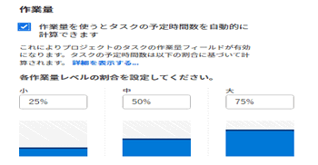

1. （条件付きおよびオプション）「作業量を使うとタスクの予定時間数を自動的に計算できます」を選択した場合、各作業量レベルのドロップダウンメニューをクリックし、各レベルのパーセンテージを選択します。次のパーセンテージ値がデフォルトです。

   | サイズ | パーセンテージ |
   |---|---|
   | 小 | 25% |
   | 中 | 50% |
   | 大 | 75% |

   >[!TIP]
   >
   >プロジェクトの更新タイプが自動に設定されていて、この設定を選択した場合、タスクの期間と作業量の割合に応じて、タスクの予定時間数が更新されます（0 に設定されている場合）。作業量を使用してタスクの工数を計画する方法について詳しくは、[作業量の概要](../../../manage-work/tasks/task-information/work-effort.md)を参照してください。

1. （オプション）変更する情報に応じて、以降のセクションを引き続き編集します。

   または

   「**保存**」をクリックします。

### イシュー設定 {#issue-settings}

1. 前述の説明に従って、プロジェクトの編集を開始します。
1. 左パネルの「**問題設定**」をクリックします。

   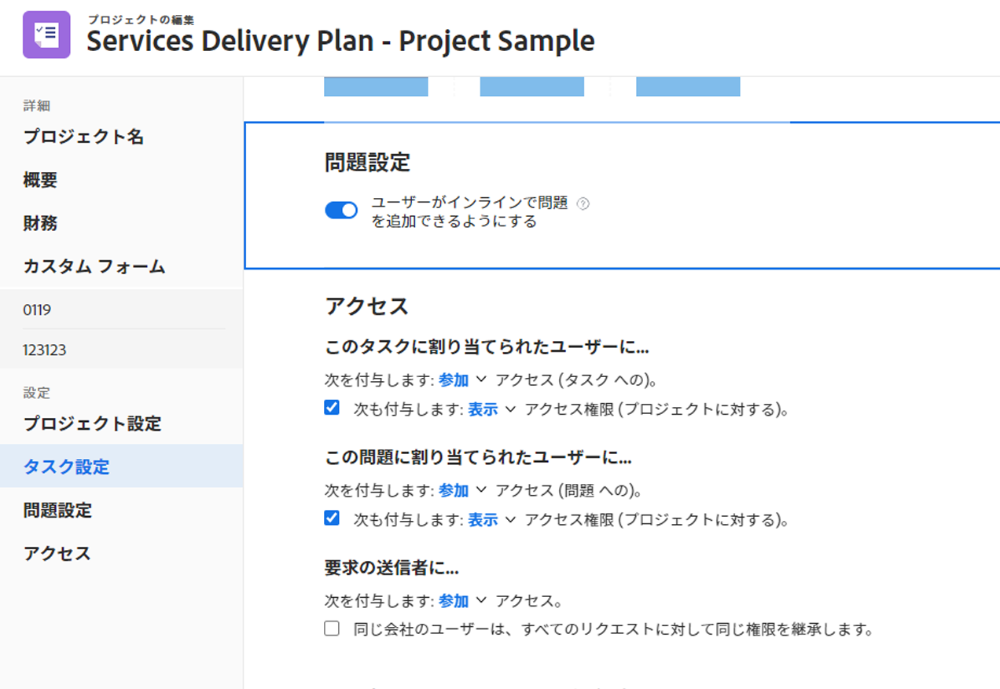

1. （オプション）「**ユーザーがインラインで問題を追加できるようにする**」オプションの選択を解除します。デフォルトで選択されています。

   このオプションの選択を解除すると、ユーザーは、プロジェクトまたは「問題」セクションのタスクにイシューをインラインで追加できなくなります。

   >[!TIP]
   >
   >ユーザーに「新しい問題」フィールドや、新しいイシューに関連するカスタムフォームに強制的に入力させる場合は、このオプションの選択を解除します。ユーザーがイシューをインラインで入力できるようにすると、ユーザーがイシューの作成時に「新しい問題」フィールドやカスタムフォームをスキップすることができます。新しいイシューのフィールドやカスタムフォームの設定については、[リクエストキューの作成](../../../manage-work/requests/create-and-manage-request-queues/create-request-queue.md)を参照してください。

   このオプションの選択を解除する場合、プロジェクトまたはタスクにイシューを追加する権限を持つユーザーは、次の方法でイシューを追加できます。

   * プロジェクトまたはタスクの「問題」セクションのイシューリストの上部にある「新しい問題」をクリックします。
   * プロジェクトをリクエストキューとして設定すると、新しいリクエストをリクエストエリアに入力できます。

   >[!NOTE]
   >
   >一括でプロジェクトを編集する場合、この設定は、少なくとも 1 つのプロジェクトで有効になっている場合に有効になり、選択したすべてのプロジェクトで無効になっている場合に無効になります。

   <!--drafted for bulk edit projects: the statement above needs to be corrected when the new UI for bulk edit projects is updated; not sure if we'll need to describe this at all or we can cover this in  a "Considerations" mini section inside the Editing in bulk section below- ??? -->

1. （オプション）変更する情報に応じて、以降のセクションを引き続き編集します。

   または

   「**保存**」をクリックします。

### アクセス {#access}

1. 前述の説明に従って、プロジェクトの編集を開始します。
1. 左側のパネルで「**アクセス**」をクリックします。

   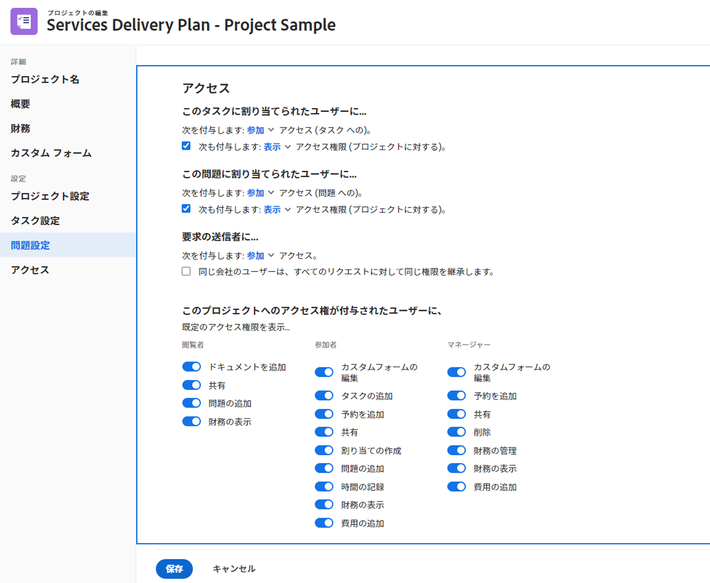

1. プロジェクトに関する以下の&#x200B;**アクセス**&#x200B;情報を指定します。

   <table style="table-layout:auto"> 
    <col> 
    <col> 
    <tbody> 
     <tr data-mc-conditions=""> 
      <td role="rowheader"><strong>誰かがタスクに割り当てられたとき</strong></td> 
      <td>
タスクへのアクセス権を<strong>表示</strong>、<strong>参加</strong>、または<strong>管理</strong>から選択します。タスクに割り当てられたユーザーには、タスクへのこのアクセス権が自動的に付与されます。
</td> 
     </tr> 
     <tr data-mc-conditions=""> 
      <td role="rowheader"><strong>プロジェクトへのアクセス権も付与</strong></td> 
      <td>
プロジェクトへのアクセス権を<strong>表示</strong>、<strong>参加</strong>、または<strong>管理</strong>から選択します。タスクに割り当てられたユーザーにも、プロジェクトへのこのアクセス権が自動的に付与されます。 
</td> 
     </tr> 
     <tr data-mc-conditions=""> 
      <td role="rowheader"><strong>誰かがイシューに割り当てられたとき</strong></td> 
      <td>
イシューへのアクセス権を<strong>表示</strong>、<strong>参加</strong>、または<strong>管理</strong>から選択します。イシューに割り当てられたユーザーには、そのイシューに対するこのアクセス権が自動的に付与されます。詳しくは、<a href="../../../workfront-basics/grant-and-request-access-to-objects/share-an-issue.md" class="MCXref xref">イシューの共有</a>を参照してください。 
</td> 
     </tr> 
     <tr data-mc-conditions=""> 
      <td role="rowheader"><strong>プロジェクトへのアクセス権も付与</strong></td> 
      <td>
プロジェクトへのアクセス権を<strong>表示</strong>、<strong>参加</strong>、または<strong>管理</strong>から選択します。イシューに割り当てられたユーザーにも、プロジェクトへのこのアクセス権が自動的に付与されます。 
</td> 
     </tr> 
     <tr data-mc-conditions=""> 
      <td role="rowheader"><strong>誰かがリクエストを送信したとき：アクセス権を付与</strong></td> 
      <td>
リクエストへのアクセス権を<strong>表示</strong>、<strong>参加</strong>、または<strong>管理</strong>から選択します。プロジェクトがリクエストキューでもあり、ユーザーがリクエストをプロジェクトに送信すると、ユーザーは、送信したリクエストに対してこのアクセス権を付与されます。プロジェクトをリクエストキューとして設定する方法については、<a href="../../../manage-work/requests/create-and-manage-request-queues/create-request-queue.md" class="MCXref xref">リクエストキューの作成</a>を参照してください。 
</td> 
     </tr> 
     <tr data-mc-conditions=""> 
      <td role="rowheader"><strong>同じ会社のユーザーは、すべてのリクエストに対して同じ権限を継承します。</strong></td> 
      <td>
同じ会社のユーザーが、リクエストを送信したかどうかに関わらず、プロジェクトのすべてのリクエストに同じアクセス権を持つようにする場合は、このフィールドを選択します。 
</td> 
     </tr> 
     <tr> 
      <td role="rowheader"><strong>このプロジェクトへのアクセス権が付与された場合：のデフォルトのアクセス権を指定します。</strong></td> 
      <td>
プロジェクトがユーザーと共有されている場合、ユーザーにそのプロジェクトで持たせたいアクセスオプションを選択します。ユーザーが<strong>閲覧者</strong>、<strong>参加者</strong>、または<strong>管理者</strong>に指定されている場合は、プロジェクトを共有する際に、そのユーザーのアクセスに使用する特定のオプションを選択します。 

<strong>管理</strong>権限レベル内の<strong>削除</strong>アクセスは、ユーザーがプロジェクト自体を削除できるかどうかを決定します。プロジェクトの<strong>管理</strong>アクセスを持つユーザーは、このオプションが選択されているかどうかに関係なく、タスクおよびイシューに対する<strong>管理</strong>権限がある場合、プロジェクト内のタスクやタスクを削除できます。
</td> 
     </tr> 
    </tbody> 
   </table>

1. 「**保存**」をクリックします。

## プロジェクトヘッダーでのプロジェクトの編集（制限あり）

プロジェクトヘッダーで限られた情報を編集することができます。

システム管理者またはグループ管理者は、プロジェクトヘッダーに表示されるフィールドをカスタマイズできます。

デフォルトでは、次のフィールドがプロジェクトヘッダーに含まれています。

* プロジェクト名
* 完了率
* プロジェクト所有者
* 予定完了日時

  >[!NOTE]
  >
  >このフィールドは、プロジェクトが「完了日」からスケジュールされている場合にのみ編集できます。プロジェクトが開始日からスケジュールされる場合、Workfront は、タスクの期間に基づいて予定完了日時を計算します。

* 状況

  >[!NOTE]
  >
  >このフィールドは、プロジェクトの「状況タイプ」が「手動」の場合にのみ編集できます。「状況タイプ」が「進捗ステータス」に設定されている場合、Workfront はタスクの進行状況に基づいて状況を計算します。詳しくは、[プロジェクト状況と状況タイプの概要](../../../manage-work/projects/manage-projects/project-condition-and-condition-type.md)を参照してください。

* ステータス
* 現在の承認プロセスで承認者として設定されている場合、承認の決定を行う

## プロジェクトを一括編集

プロジェクトを一括編集すると、選択したすべてのプロジェクトの情報を同時に更新できます。

プロジェクトを一括編集する際は、次の点を考慮してください。

* 選択したすべてのプロジェクトに対して変更する情報は、「リソースマネージャー」を除き、個々のプロジェクトに関する既存の情報を上書きします。

  プロジェクトを一括編集する際に新しいリソースマネージャーを追加すると、選択したすべてのプロジェクトにそのマネージャーが追加されます。選択したプロジェクトに他のリソースマネージャーが関連付けられている場合、一括編集で追加されたプロジェクトに加えて、それらのリソースマネージャーもプロジェクトに残ります。

* 同じフィールドに異なる値を持つプロジェクトを選択すると、フィールドの「プロジェクトを編集」ボックスに「複数の値」のインジケーターが表示されます。チェックボックス、ラジオボタン、トグルの各フィールドの横には、「複数の値」インジケーターが表示されます。

  

* 「複数の値」インジケーターに加えて、選択したプロジェクトの 1 つ以上で選択したオプションが異なる場合、複数のオプションがあるフィールドは、次のいずれかの方法で表示されます。

   * チェックボックスフィールドには、選択したプロジェクトの一部ではチェックされているが、すべてではチェックされていないオプションにチェックボックスの代わりに、線が表示されます。

     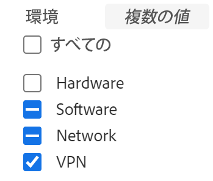

   * トグルタイプのフィールドはグレー表示になり、選択した一部のプロジェクトで有効になっているが、すべてのプロジェクトで有効になっていないオプションが中央に表示されます。

  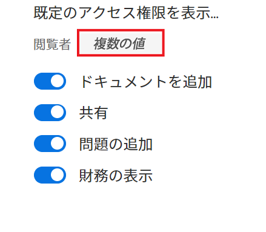

   * 一部のオプションが選択されているが、すべてではないラジオボタンタイプのフィールドは、すべてのラジオボタンが空として表示されます。

     

* 複数オプションフィールドで 1 つのオプションを更新する場合（トグルまたはチェックボックスのセットとして表示されるフィールドなど）、他のすべてのオプションは選択したプロジェクト間で一致する必要があります。

  >[!IMPORTANT]
  >
  >例えば、3 つのチェックボックス（オプション 1、オプション 2、およびオプション 3）を持つチェックボックスフィールドがあり、すべてのプロジェクトで「オプション 1」がオフになっている場合、「オプション 2」と「3」が一部のプロジェクトではオンになり、選択した他のプロジェクトではオフになっています。すべてのプロジェクトで「オプション 1」をオンにする場合は、選択したすべてのプロジェクトで「オプション 2」と「3」を一致させてから変更を保存する必要があります。そのため、選択したすべてのプロジェクトで一致させるには、選択または選択を解除します。オプションを変更しない場合は、フィールドをそのまま保存でき、プロジェクトはすべてのオプションに対して現在の選択を維持します。

* 異なるグループに属する複数のプロジェクトを選択する場合、ステータスフィールドに表示されるステータスは、グループレベルのステータスではなく、システムレベルのステータスになります。

プロジェクトの一括編集

{{step1-to-projects}}

1. リスト内の複数のプロジェクトを選択します。
1. リストの上部にある&#x200B;**編集**&#x200B;アイコンをクリックします。
**プロジェクトを編集**&#x200B;ダイアログボックスが開きます。

   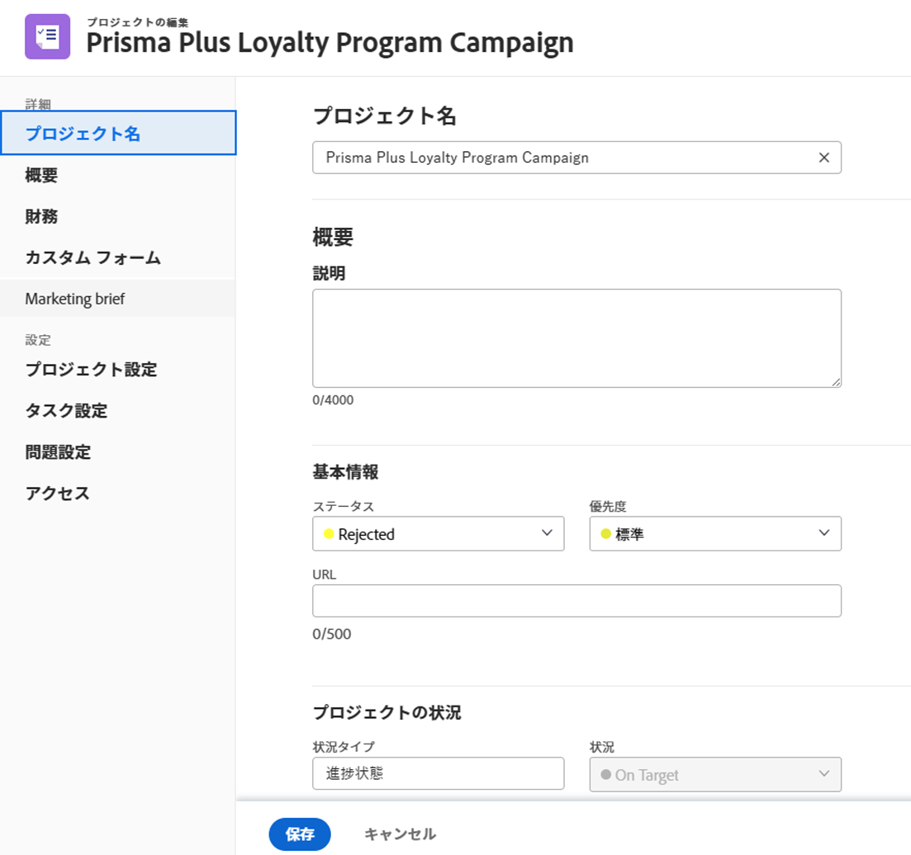

Workfront 管理者またはグループ管理者がレイアウトテンプレートを変更する方法によっては、「プロジェクトを編集」ボックスの左側のパネルにあるエリアまたはこれらのエリアに表示されるフィールドが再配置されるか、表示されない場合があります。詳しくは、[レイアウトテンプレートを使用して詳細ビューをカスタマイズ](../../../administration-and-setup/customize-workfront/use-layout-templates/customize-details-view-layout-template.md)を参照してください。

1. 選択したプロジェクトに関する一般情報を編集するには、「**概要**」をクリックします。概要エリアの編集について詳しくは、この記事の[概要](#overview)の節を参照してください。

   >[!TIP]
   >
   >編集したフィールドは、薄い紫の背景で表示されます。

1. 選択したプロジェクトに関連付けられたカスタムフォームを編集、追加、または置き換える場合、「**カスタムフォーム**」をクリックします。

   選択したすべてのプロジェクトに添付されるカスタムフォームは、**カスタムフォーム**&#x200B;領域の共通の&#x200B;**サブセクションの**&#x200B;カスタムフォームで表示されます。

   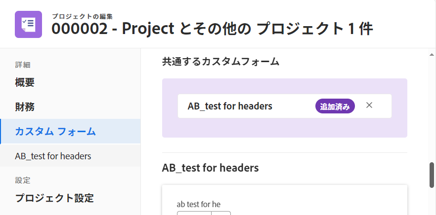

   >[!TIP]
   >
   >   選択したすべてのプロジェクトに共通するフォームの名前は、「プロジェクトを編集」ボックスの左パネルに表示されます。

1. **カスタムフォームを追加**&#x200B;フィールドにカスタムフォームの名前を入力します。

   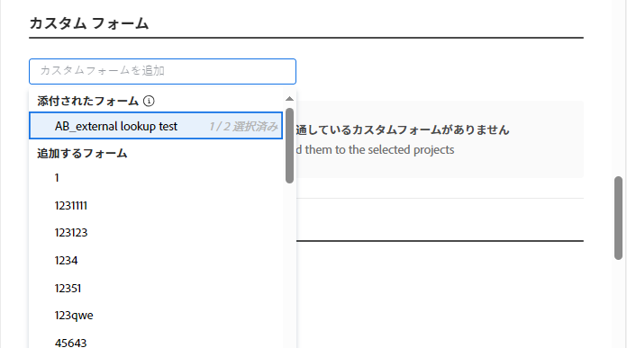

   選択したプロジェクトに既に添付されているカスタムフォームは、**カスタムフォームを追加**&#x200B;フィールドの&#x200B;**添付されたフォーム**&#x200B;サブセクションに表示されます。

   プロジェクトに関連付けることはできるが、選択したプロジェクトに添付されていない追加のカスタムフォームは、「**カスタムフォームを追加**」フィールドの「**フォームを追加**」サブセクションに表示されます。

1. 「**カスタムフォームを追加**」、または「**フォームを追加**」サブセクション内で追加のカスタムフォームをクリックして選択します。

   選択したプロジェクトの一部にカスタムフォームが既に添付されている場合、フォームを追加する際に、フォームの名前の横に、既にフォームが添付されているプロジェクトの数が表示されます。

1. （オプション）カスタムフォーム名の右にある&#x200B;**x**&#x200B;アイコンをクリックし、「**削除**」をクリックして、選択したすべてのプロジェクトから削除します。

   >[!CAUTION]
   >
   >カスタムフォームを削除すると、フォーム上の既存のカスタムフィールド情報がすべて失われます。これは復元できません。

   カスタムフォームの編集について詳しくは、この記事の、[カスタムフォーム](#custom-forms)の節を参照してください。

1. 選択したすべてのプロジェクトの財務情報を編集するには、「**財務**」をクリックします。
財務エリアの編集について詳しくは、この記事の、[財務](#finance)の節を参照してください。
1. 選択したすべてのプロジェクトの設定を編集するには、「**プロジェクト設定**」をクリックします。
プロジェクト設定エリアの編集について詳しくは、この記事の、[プロジェクト設定](#project-settings)の節を参照してください。
1. 選択したすべてのプロジェクトのタスク設定を編集するには、「**タスク設定**」をクリックします。
タスク設定エリアの編集の編集について詳しくは、この記事の、[タスク設定](#task-settings)の節を参照してください。
1. 「**イシューの設定**」をクリックして、選択したすべてのプロジェクトのイシューの設定を編集します。
イシューの設定エリアの編集について詳しくは、この記事の、[イシューの設定](#issue-settings)の節を参照してください。
1. 選択したすべてのプロジェクトのアクセス設定を編集するには、「**アクセス**」をクリックします。
アクセスエリアの編集について詳しくは、この記事の、[アクセス](#access)の節を参照してください。
1. （オプション）「プロジェクトを編集」ボックスに追加した情報を削除するには、編集したフィールドの上にポインタを合わせて、フィールドの右上にある「**x**」破棄アイコンをクリックします。

   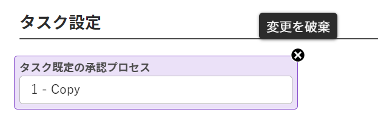

1. （オプション）**プロジェクトを編集**&#x200B;ページの最下部で「**キャンセル**」をクリックして、すべてのプロジェクトに対して行われたすべての変更を削除します。
1. 「**保存**」をクリックします。

<!-- Old information for how to bulk edit in classic/ before project bulk edit redesign: 

### Edit projects in bulk in the Production environment

To edit projects in bulk:

1. Click the **Main Menu** icon  in the upper-right corner of Adobe Workfront.

1. Click **Projects**.  
1. Select several projects in the list.
1. Click **Edit**.

   The **Edit Projects** dialog box opens.

   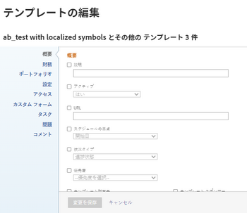

1. Specify the information on all selected projects in the following sections:

   * **Overview**

     For information, see the [Overview](#overview) section in this article.
   
   * **Finance**

     For information, see the [Finance](#finance) section in this article.
   
   * **Portfolio**

     For information, see the "Project association" section in the [Overview](#overview) section in this article.
   
   * **Settings**

     For information, see the [Project Settings](#project-settings) section in this article.
   
   * **Access**

     For information, see the [Access](#access) section in this article.
   
   * **Custom Forms**

     For information, continue with step 7 below.

     <!--   
     
(NOTE:&nbsp;make sure this stays accurate)
   
     

   * **Tasks**

     For information, see the [Task Settings](#task-settings) section in this article.
   
   * **Issues**

     For information, see the   [Issue Settings](#issue-settings) section in this article.
   
   * **Comment**

     For information, continue with step 9 below.

     <!--   
     
(NOTE: ensure this step stays accurate)
   
     

1. (Optional) In the Settings area, select any of the following options:

   * **Recalculate Costs and Revenues**: Select this option to recalculate Costs and Revenues on all projects selected.
   * **Recalculate Timelines**: Select this option to recalculate the Timelines of all projects selected.
   * **Recalculate Scorecards**: Select this option to recalculate the Scorecard values for all projects selected.

   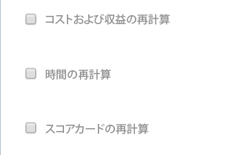

1. Click **Custom Forms** to edit the custom forms attached to all the projects selected.

   If the projects selected do not have any common custom forms, no forms are listed in this section.

   You can edit only the fields on the forms that are attached to all projects selected and which you have permissions to edit. 

1. (Optional) In the Custom Forms section, select the **Recalculate Custom Expressions** option to ensure that all Calculated Custom Fields that are on the Custom Forms attached to the projects selected are up to date.

   >[!IMPORTANT]
   >
   >We recommend not to select more than 500 projects at a time when you recalculate custom expressions.

1. (Optional) Click **Comment**, then select the Post an update to each project box and specify a comment that you want to display in the updates stream of the project in the available field and do one of the following:

   * Click the **People** icon  to tag a user who will be notified about your comment.
   * Click the **Lock** icon  to restrict your comment only to people within your company.

   This comment is visible for everyone with View access to the project and with access to view Notes.

1. Click **Save Changes**.

   All changes you made are now visible on all the selected projects.

-->