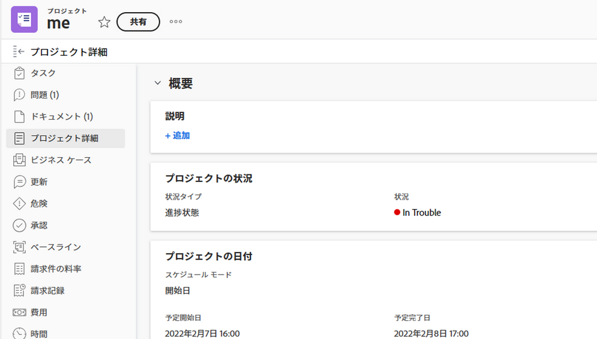

# プロジェクトを編集

<!--The highlighted information on this page refers to functionality not yet generally available. It is available for all customers in the Preview environment and for a select group of customers in the Production environment.-->

<!--

***Linked to many articles,

The Resource Pools part also duplicates in the "Working with Resource Pools" article 

The Update Type section is also documented in Selecting the Project Update Type article

Keep the reference link to the other article that also documents the Update Type) 

(NOTE 2: information described here also exists in these articles:

** Project Overview area

**Manage project Finance area

If you need to update just one field, check to see if that field is also listed there and update in both places.)

-->

必要に応じて、Adobe Workfrontでプロジェクトを編集できます。 ステータスが「現在」に変わった後は、プロジェクトを最小限に抑えて編集することをお勧めします。これにより、変更に関する通知をプロジェクトチーム全体に送信して混乱を避けることができます。 プロジェクトが Planning ステータスの場合は、プロジェクトを編集するのが理想的です。 プロジェクトチームの詳細については、 [プロジェクトチームの概要](../../../manage-work/projects/planning-a-project/project-team-overview.md).

## アクセス要件

<!--drafted - replace table at P&P:

<table style="table-layout:auto"> 
 <col> 
 <col> 
 <tbody> 
  <tr> 
   <td role="rowheader">Adobe Workfront plan*</td> 
   <td> 
Any
 </td> 
  </tr> 
  <tr> 
   <td role="rowheader">Adobe Workfront license*</td> 
   <td>
Current license: Standard 
 
   Or
   
Legacy license: Plan 
 </td> 
  </tr> 
  <tr> 
   <td role="rowheader">Access level configurations*</td> 
   <td> 
Edit access to Projects
 
If you still don't have access, ask your Workfront administrator if they set additional restrictions in your access level. For information about access to projects, see <a href="../../../administration-and-setup/add-users/configure-and-grant-access/grant-access-projects.md" class="MCXref xref">Grant access to projects</a>. For information on how a Workfront administrator can change your access level, see <a href="../../../administration-and-setup/add-users/configure-and-grant-access/create-modify-access-levels.md" class="MCXref xref">Create or modify custom access levels</a>. 
 </td> 
  </tr> 
  <tr> 
   <td role="rowheader">Object permissions</td> 
   <td> 
    <ul> 
     <li> 
Contribute permissions to a project to edit it in the Project Details area 
 </li> 
     <li> 
Manage permissions to a project to edit it in the Edit Project box
 </li> 
    </ul> 
 For information about project permissions, see <a href="../../../workfront-basics/grant-and-request-access-to-objects/share-a-project.md" class="MCXref xref">Share a project in Adobe Workfront</a>.
 
For information on requesting additional access, see <a href="../../../workfront-basics/grant-and-request-access-to-objects/request-access.md" class="MCXref xref">Request access to objects </a>.
 </td> 
  </tr> 
 </tbody> 
</table>
-->

この記事の手順を実行するには、次のアクセス権が必要です。

<table style="table-layout:auto"> 
 <col> 
 <col> 
 <tbody> 
  <tr> 
   <td role="rowheader">Adobe Workfront plan*</td> 
   <td> 
任意
 </td> 
  </tr> 
  <tr> 
   <td role="rowheader">Adobe Workfront license*</td> 
   <td> 
計画 
 </td> 
  </tr> 
  <tr> 
   <td role="rowheader">アクセスレベル設定*</td> 
   <td> 
プロジェクトへのアクセスを編集
 
まだアクセス権がない場合は、Workfront管理者に、アクセスレベルに追加の制限を設定しているかどうかを問い合わせてください。 プロジェクトへのアクセスについて詳しくは、 <a href="../../../administration-and-setup/add-users/configure-and-grant-access/grant-access-projects.md" class="MCXref xref">プロジェクトへのアクセス権の付与</a>. Workfront管理者がアクセスレベルを変更する方法について詳しくは、 <a href="../../../administration-and-setup/add-users/configure-and-grant-access/create-modify-access-levels.md" class="MCXref xref">カスタムアクセスレベルの作成または変更</a>. 
 </td> 
  </tr> 
  <tr> 
   <td role="rowheader">オブジェクト権限</td> 
   <td> 
    <ul> 
     <li> 
プロジェクトに権限を付与して、「プロジェクトの詳細」領域で編集する 
 </li> 
     <li> 
プロジェクトに対する権限を管理して、「プロジェクトを編集」ボックスで編集します
 </li> 
    </ul> 
 プロジェクト権限について詳しくは、 <a href="../../../workfront-basics/grant-and-request-access-to-objects/share-a-project.md" class="MCXref xref">Adobe Workfrontでプロジェクトを共有する</a>.
 
追加のアクセス権のリクエストについて詳しくは、 <a href="../../../workfront-basics/grant-and-request-access-to-objects/request-access.md" class="MCXref xref">オブジェクトへのアクセスのリクエスト </a>.
 </td> 
  </tr> 
 </tbody> 
</table>

*保有するプラン、ライセンスの種類、アクセス権を確認するには、Workfront管理者にお問い合わせください。

## プロジェクト編集の制限

プロジェクトを編集できない場合がある制限事項があります。

プロジェクトを編集する際は、次の点を考慮してください。

* 承認プロセス中のプロジェクトは、ログ時間以外は編集できません。
* 「完了」、「無効」、または「承認待ち」のステータスを持つプロジェクトにドキュメントやテンプレートを添付できるのは、Workfront管理者またはグループ管理者が「プロジェクト環境設定」領域でこの機能を有効にした場合のみです。 プロジェクトの環境設定の詳細については、 [システム全体のプロジェクト環境設定の指定](../../../administration-and-setup/set-up-workfront/configure-system-defaults/set-project-preferences.md).
* 無効または完了のステータスのプロジェクトに関する次の情報のみを編集できます。

   * 既存の費用を変更します。
   * カスタムフォームを追加、削除、または編集します。

## プロジェクトの編集

プロジェクトを編集することで、プロジェクトの情報や設定、タスクやタスクを変更できます。

この記事で説明する一部の設定は、プロジェクトの作成元のテンプレート内の状態によって、デフォルトの状態から変更される場合があります。 テンプレートの編集について詳しくは、 [プロジェクトテンプレートの編集](../../../manage-work/projects/create-and-manage-templates/edit-templates.md).

1. 次をクリック： **メインメニュー** アイコン  Adobe Workfrontの右上隅で、 **プロジェクト**.
1. （オプション）「 **自分がいるプロジェクト** または **自分が所有するプロジェクト** 右上隅には、自分が所有者であるプロジェクト、または自分がプロジェクトチームに属しているプロジェクトが表示されます。

   

1. 編集するプロジェクトの名前をクリックして、プロジェクトページを開きます。

   >[!NOTE]
   >
   >グループ管理者は、グループ領域と「プロジェクト」領域で、グループのプロジェクトを表示および編集できます。 詳しくは、 [グループのプロジェクトの作成と変更](../../../administration-and-setup/manage-groups/work-with-group-objects/create-and-modify-a-groups-projects.md).

1. （オプション）プロジェクトに関する限定的な情報を編集するには、 **プロジェクトの詳細** をクリックします。

   

   >[!NOTE]
   >
   >Workfront管理者またはグループ管理者がレイアウトテンプレートを変更した方法に応じて、「プロジェクトの詳細」領域のフィールドが再配置されたり表示されなかったりする場合があります。 詳しくは、 [レイアウトテンプレートを使用して詳細ビューをカスタマイズする](../../../administration-and-setup/customize-workfront/use-layout-templates/customize-details-view-layout-template.md).

   「詳細」セクションの情報を編集するには、次の手順を実行します。

   1. （オプション） **すべて折りたたむ** アイコンを使用して、すべての領域を折りたたみます。
   1. （オプションおよび条件付き）領域が折りたたまれている場合、 **右向き矢印**  各領域の横に、編集する領域を展開します。
   1. [ プロジェクトの詳細 ] タブでの情報の編集の詳細については、次の記事を参照してください。

      * [プロジェクトの概要領域で情報を管理します。](../../../manage-work/projects/manage-projects/understand-project-overview-area.md)
      * [プロジェクトの財務エリアで情報を管理します](../../../manage-work/projects/project-finances/manage-project-finance-area.md)

   1. （オプション）カスタムフォームを添付するには、 **カスタムフォームを追加** フィールドに値を入力し、リストに表示されるタイミングで選択して、 **変更を保存**.
   1. （オプション） **書き出し** アイコン  概要およびカスタムフォームの情報を書き出すには、PDF・ファイルに **書き出し**. 次の中から選択します。

      * すべてを選択（少なくとも 1 つのカスタムフォームが添付されている場合にのみ表示）
      * 概要
      * 1 つまたは複数のカスタムフォームの名前

      PDFファイルがコンピューターにダウンロードされます。

      

      詳しくは、 [カスタムフォームとオブジェクトの詳細のエクスポート](../../../workfront-basics/work-with-custom-forms/export-custom-forms-details.md).

   「プロジェクトの詳細」セクションに表示されるフィールドの詳細については、次に説明するように、「プロジェクトを編集」ボックスでプロジェクトを編集します。
1. プロジェクトに関するすべての情報を編集するには、 **詳細** メニュー  プロジェクト名の横にあるをクリックし、 **編集**.

   または

   プロジェクトのリストから、プロジェクトを選択し、 **編集** アイコン  をクリックします。

   この **プロジェクトを編集** ボックスが開きます。

   >[!IMPORTANT]
   >
   >「編集」オプションを表示するには、プロジェクトに対する管理権限が必要です。

   すべてのプロジェクトフィールドは、「プロジェクトを編集」ボックスで使用でき、左パネルに表示される領域でグループ化されます。

   >[!NOTE]
   >
   >Workfront管理者またはグループ管理者がレイアウトテンプレートを変更した方法に応じて、「プロジェクトを編集」ボックスの左側のパネルにある領域またはこれらの領域に表示されるフィールドの順序が変わったり表示されなかったりします。 詳しくは、 [レイアウトテンプレートを使用して詳細ビューをカスタマイズする](../../../administration-and-setup/customize-workfront/use-layout-templates/customize-details-view-layout-template.md).

1. （条件付き） **詳細** メニューとメニュー **編集**&#x200B;では、左側のパネルに次のいずれかの領域で情報の更新を検討してください。

   * [プロジェクト名](#project-name)
   * [概要](#overview)
   * [カスタムフォーム](#custom-forms)
   * [財務](#finance)
   * [プロジェクト設定](#project-settings)
   * [タスク設定](#task-settings)
   * [問題設定](#issue-settings)
   * [アクセス](#access)

   >[!NOTE]
   >
   >Workfront管理者がプロジェクトの「詳細」領域にレイアウトテンプレートを設定する方法に応じて、「プロジェクトを編集」ボックスのセクションとフィールドが環境によって異なる場合があります。 詳しくは、 [レイアウトテンプレートを使用して詳細ビューをカスタマイズする](../../../administration-and-setup/customize-workfront/use-layout-templates/customize-details-view-layout-template.md).

### プロジェクト名 {#project-name}

1. 前述の説明に従って、プロジェクトの編集を開始します。
1. クリック **プロジェクト名** をクリックします。

   

1. プロジェクトの名前を更新します。

   プロジェクトを一括編集する際には、プロジェクト名を編集できません。

### 概要 {#overview}

1. 前述の説明に従って、プロジェクトの編集を開始します。
1. クリック **概要** をクリックします。

   

1. プロジェクトに関する次の情報を更新します。

   <table style="table-layout:auto"> 
    <col> 
    <col> 
    <tbody> 
     <tr> 
      <td role="rowheader"><strong>説明</strong> </td> 
      <td> 
プロジェクトに関する追加情報を追加します。
 </td> 
     </tr> 
     <tr> 
      <td role="rowheader"><strong>ステータス</strong> </td> 
      <td> 
プロジェクトのステータスを選択します。 すべてのタスクとタスクが完了する前に、プロジェクトを完了とマークすることはできません。 プロジェクトのステータスについて詳しくは、 <a href="../../../administration-and-setup/customize-workfront/creating-custom-status-and-priority-labels/project-statuses.md" class="MCXref xref">システムプロジェクトステータスのリストへのアクセス</a>
 </td> 
     </tr> 
     <tr> 
      <td role="rowheader"><strong>優先度</strong> </td> 
      <td> 
 
これは、プロジェクトに優先順位を付けるための視覚的なフラグです。
 
Workfront管理者が選択したプロジェクトの環境設定によっては、優先度の名前が異なる場合があります。 優先度の編集の詳細については、 <a href="../../../administration-and-setup/customize-workfront/creating-custom-status-and-priority-labels/create-customize-priorities.md" class="MCXref xref">優先度の作成とカスタマイズ</a>
 
 </td> 
     </tr> 
     <tr> 
      <td role="rowheader"><strong>URL</strong> </td> 
      <td> 
このプロジェクトに関する情報に関する Web リンクを指定します。
 </td> 
     </tr> 
     <tr> 
      <td role="rowheader"><strong>状況タイプ</strong> </td> 
      <td> 
次の条件タイプの中から選択します。 
       <ul> 
       <li><strong>手動：</strong> プロジェクト所有者が、手動でプロジェクトに条件を設定します。</li> 
       <li><strong>進捗状況ステータス：</strong> Workfrontは、クリティカルパス上のタスクの進捗状況ステータスに基づいて、条件を自動的に設定します。 進捗状況ステータスについて詳しくは、 <a href="../../../manage-work/tasks/task-information/task-progress-status.md" class="MCXref xref">タスクの進捗状況ステータスの概要</a>.</li> 
       </ul>
Workfront管理者 またはグループ管理者 システムに対するプロジェクトの条件の計算方法のデフォルトを選択します またはグループ. プロジェクトの既定値の設定については、 <a href="../../../administration-and-setup/set-up-workfront/configure-system-defaults/set-project-preferences.md" class="MCXref xref">システム全体のプロジェクト環境設定の指定</a>. 

 </td> 
     </tr> 
     <tr> 
      <td role="rowheader"><strong>状況</strong> </td> 
      <td> 
 
(「 <strong>手動</strong> の <strong>条件タイプ</strong>):「条件」を選択して、プロジェクトの進行方法を示します。 
 
プロジェクト条件を自動または手動で設定する方法については、 <a href="../../../manage-work/projects/manage-projects/project-condition-and-condition-type.md" class="MCXref xref">プロジェクト条件と条件タイプの概要</a>
 
 </td> 
     </tr> 
     <tr> 
      <td role="rowheader"><strong>スケジュール モード</strong> </td> 
      <td> 
プロジェクトを「開始日」からスケジュールするか、「完了日」からスケジュールするかを指定します。 この選択により、プロジェクト上のタスクの予定日が決まります。 
       <ul> 
       <li><strong>開始日</strong>:プロジェクトの最初のタスクには、デフォルトで、プロジェクトと同じ計画開始日が設定されます。 計画開始日タスクの詳細は、 <a href="../../../manage-work/tasks/task-information/task-planned-start-date.md" class="MCXref xref">タスクの計画開始日の概要</a>. プロジェクトタイムラインは開始日から計算され、プロジェクトの完了日は、すべてのタスクの期間に基づいてシステムによって計算されます。 </li> 
       <li><strong>完了日</strong>:プロジェクトの最後のタスクには、プロジェクトと同じ計画完了日が設定されます。 プロジェクトタイムラインは、プロジェクトの完了日から計算され、プロジェクトの開始日は、プロジェクトの完了日からすべてのタスクの期間を引くことで、システムによって計算されます。 </li> 
       </ul>
Workfront管理者 またはグループ管理者 システムまたはグループのデフォルトのスケジュールモード設定を選択します。 プロジェクトの既定値の設定については、 <a href="../../../administration-and-setup/set-up-workfront/configure-system-defaults/set-project-preferences.md" class="MCXref xref">システム全体のプロジェクト環境設定の指定</a>.

 </td> 
     </tr> 
     <tr> 
      <td role="rowheader"><strong>計画開始日時</strong> </td> 
      <td> 
 
選択時の日付を指定 <strong>スケジュール：開始日</strong>.  
 
これは、 <strong>完了日からのスケジュール</strong>. 
 
 </td> 
     </tr> 
     <tr> 
      <td role="rowheader"><strong>計画完了日時</strong> </td> 
      <td> 
選択時の日付を指定 <strong>完了日からのスケジュール</strong>. 
 
これは、 <strong>開始日からのスケジュール</strong>. 
 </td> 
     </tr> 
     <tr> 
      <td role="rowheader"><strong>ポートフォリオ</strong></td> 
      <td>プロジェクトが属するPortfolioを示します。 Portfolioは、ドロップダウンリストに表示される前に、最初に作成する必要があります。 プロジェクトに関連付けることができるのは、アクティブなポートフォリオのみです。 ポートフォリオの作成について詳しくは、 <a href="../../../manage-work/portfolios/create-and-manage-portfolios/create-portfolios.md" class="MCXref xref">ポートフォリオの作成 </a>.</td> 
     </tr> 
     <tr> 
      <td role="rowheader"><strong>プログラム</strong></td> 
      <td> 
プロジェクトのPortfolioを選択した場合は、プロジェクトのプログラムを指定します。 一部のPortfolioにはプログラムがない可能性があります。 このドロップダウンリストに表示される前に、最初にプログラムを作成する必要があります。 プロジェクトに関連付けることができるのは、アクティブなプログラムのみです。 
 
プログラムの作成の詳細については、 <a href="../../../manage-work/portfolios/create-and-manage-programs/create-program.md" class="MCXref xref">プログラムの作成</a>.
 </td> 
     </tr> 
     <tr> 
      <td role="rowheader"><strong>グループ</strong></td> 
      <td> 
 
プロジェクトに関連付けられているグループの名前を指定します。 
これは必須フィールドです. グループに関連付けられていないプロジェクトを持つことはできません。 
 
適切なグループを選択していることを確認するには、グループにカーソルを移動して、情報アイコンをクリックします  その横に表示されます。 グループの上位のグループの階層や管理者など、グループに関する情報が一覧表示されるツールチップが表示されます。
 別のグループを指定しない限り、デフォルトでは、次のグループの 1 つがプロジェクトの作成時に自動的にプロジェクトに関連付けられます。
 
       <ul> 
       <li> 
プロジェクトを「プロジェクト」領域から作成すると、プロジェクト作成者の「ホームグループ」がプロジェクトに関連付けられます。 
 
これは、ポートフォリオまたはプログラムの「プロジェクト」セクションからプロジェクトを作成した場合にも当てはまります。
 </li> 
       <li> 
設定領域のグループのメインページからプロジェクトを作成すると、そのグループがプロジェクトに関連付けられます。
 </li> 
       </ul> 
 
  
 
       
<b>メモ</b>

   <ul>
      <li>
プロジェクト、またはそのタスクや問題がグループレベルのカスタム状態に関連付けられている場合は、プロジェクトのグループを変更すると、新しいグループに合わせてプロジェクト、タスク、または問題の状態が変更されます。
</li>
      <li>
グループレベルのカスタムステータスを使用して、プロジェクト、またはそのタスクまたは問題が既にグループレベルの承認プロセスに関連付けられている場合、グループを変更すると、前のグループの承認ステータスとシステムレベルの承認ステータスが競合する可能性があります。

      
グループを更新する前に、プロジェクト上のグループレベルの承認プロセス、またはそのタスクや問題を削除することを検討してください。

      
グループレベルの承認プロセスの作成について詳しくは、 <a href="../../../administration-and-setup/manage-groups/work-with-group-objects/create-and-modify-groups-approval-processes.md" class="MCXref xref">グループレベルの承認プロセス</a>.

      
グループレベルのカスタムステータスの作成について詳しくは、 <a href="../../../administration-and-setup/manage-groups/manage-group-statuses/create-or-edit-a-group-status.md" class="MCXref xref">グループのステータスの作成または編集</a>
</li></ul> </td> 
     </tr> 
     <tr> 
      <td role="rowheader"><strong>会社</strong> </td> 
      <td> 
プロジェクトに関連付けられている会社を指定します。 会社をプロジェクトに関連付ける前に、会社を作成する必要があります。 プロジェクトに関連付けることができるのは、アクティブな会社のみです。 会社の作成について詳しくは、 <a href="../../../administration-and-setup/set-up-workfront/organizational-setup/create-and-edit-companies.md" class="MCXref xref">会社の作成と編集</a>.
 </td> 
     </tr> 
     <tr> 
      <td role="rowheader"><strong>プロジェクト所有者</strong> </td> 
      <td> 
プロジェクトに追加するユーザーの名前を入力し始め、リストに表示されたら選択します。 ユーザーはプロジェクトチームに追加され、自動的にプロジェクトに対する管理権限が付与されます。 プロジェクト所有者として指定されるユーザーは、Workfrontのアクティブなユーザーである必要があります。

      </td> 
     </tr> 
     <tr> 
      <td role="rowheader"><strong>プロジェクトスポンサー</strong> </td> 
      <td> 
プロジェクトに追加するユーザーの名前を入力し始め、リストに表示されたら選択します。 ユーザーはプロジェクトチームに追加され、プロジェクトに対する表示権限が自動的に付与されます。 プロジェクトスポンサーに指定されたユーザーは、Workfrontのアクティブユーザーである必要があります。 
 </td> 
     </tr> 
     <tr> 
      <td role="rowheader"><strong>リソース管理者</strong> </td> 
      <td> 
 ユーザーの名前を入力してプロジェクトに追加し、リストに表示されたら選択します。 ユーザーはプロジェクトチームに追加され、自動的にプロジェクトに対する管理権限が付与され、プロジェクトのタスクやタスクにリソースを割り当てることができます。 ユーザーが「リソースマネージャー」フィールドから削除された場合でも、プロジェクトに対する「管理」権限が維持されます。 複数のリソースマネージャを指定できます。 
 </td> 
     </tr> 
    </tbody> 
   </table>

   >[!TIP]
   >
   >「プロジェクト所有者」、「プロジェクトスポンサー」、「リソースマネージャー」の各フィールドを更新する際には、アバター、ユーザーのプライマリの役割、または電子メールアドレスに注意して、同じ名前のユーザーを区別します。
   >
   >ユーザーを追加したときに表示するには、少なくとも 1 つのジョブの役割に関連付ける必要があります。
   >
   >ユーザーがユーザーの電子メールを表示するには、アクセスレベルで [ 連絡先情報の表示 ] 設定を有効にしておく必要があります。 詳しくは、 [ユーザーへのアクセス権の付与](../../../administration-and-setup/add-users/configure-and-grant-access/grant-access-other-users.md).

1. （オプション）変更する情報に応じて、以降のセクションを引き続き編集します。

   または

   「**保存**」をクリックします。

### カスタムフォーム {#custom-forms}

アクセスレベルとプロジェクトに対する権限に応じて、次のシナリオが存在します。

* プロジェクトにカスタムフォームの編集権限がない場合、添付されたカスタムフォームのフィールドを編集することはできません。 プロジェクトに添付されたカスタムフォーム上のフィールドのみを表示できます。
* カスタムフォームのセクションに対する表示（編集ではない）アクセス権を持っている場合、そのセクションのフィールドを編集することはできません。
* プロジェクトにアタッチされたカスタムフォームの 1 つにあるセクションにアクセスできない場合、そのセクションは「プロジェクトを編集」ボックスに表示されません。

複数のプロジェクトを選択して一括編集する場合、次のシナリオが考えられます。

* 選択したプロジェクトの少なくとも 1 つに対するカスタムフォームの編集権限がない場合、添付されたカスタムフォームのフィールドを編集することはできません。 添付されたカスタムフォーム上のフィールドのみを表示できます
* カスタムフォームのセクションに対する表示（編集ではない）アクセス権を持っている場合、そのセクションのフィールドを編集することはできません。 そのセクションのフィールドのみを表示できます。
* 少なくとも 1 つのプロジェクトに添付されたカスタムフォームの 1 つのセクションにアクセスできない場合、そのセクションは「プロジェクトを編集」ボックスに表示されません。
* すべてのプロジェクトに添付されたカスタムフォームに必須フィールドがあり、実際に編集せずに 1 つのフィールドを選択した場合は、そのフィールドに対する変更を破棄するか、情報を追加してから、選択したプロジェクトを保存します。 必須フィールドをまったく選択しない場合は、必須フィールドが空白の場合でも、選択したプロジェクトを保存できます。

カスタムフォームアクセスについて詳しくは、次の記事を参照してください。

* [カスタムフォームの共有](../../../administration-and-setup/customize-workfront/create-manage-custom-forms/share-access-to-a-custom-form.md)
* [カスタムフォームにセクション区切りを追加する](../../../administration-and-setup/customize-workfront/create-manage-custom-forms/add-a-section-break-to-a-custom-form.md)

カスタムフォームの情報を編集するには：

1. 前述の説明に従って、プロジェクトの編集を開始します。
1. クリック **カスタムForms** をクリックします。

   

1. 次をクリック： **カスタムフォームを追加** ボックスを選択し、リストからフォームを選択して、プロジェクトに添付します。 デフォルトでは、最初の 40 個のフォームがアルファベット順に表示されます。 リストにフォームが表示されない場合は、名前を入力し始め、リストに表示されたら選択します。

   >[!NOTE]
   >
   >カスタムフォームをこのフィールドで選択できるようにするには、事前にカスタムフォームを作成する必要があります。 アクティブなカスタムフォームのみがリストに表示されます。 カスタムフォームの作成について詳しくは、 [カスタムフォームの作成または編集](../../../administration-and-setup/customize-workfront/create-manage-custom-forms/create-or-edit-a-custom-form.md). 1 つのプロジェクトに最大 10 個のカスタムフォームを追加できます。

1. （条件付き）カスタムフォームをプロジェクトに添付した場合、フォーム上の任意のフィールドを編集します。 プロジェクトを保存する前に、すべての必須フィールドを指定する必要があります。
1. （オプション） **X アイコン** 削除するカスタムフォームの名前の右側にあるをクリックし、 **削除**.
1. （オプション）変更する情報に応じて、以降のセクションの編集を続けます

   または

   「**保存**」をクリックします。

### 財務 {#finance}

アクセスレベルとプロジェクトに対する権限に応じて、次のシナリオが存在します。

* プロジェクトに対する Financial Data と View Finance の権限を持つユーザーは、Finance セクションのフィールドのみを表示できます。 このセクションのフィールドは編集できません。
* プロジェクトに対する財務データの編集および財務の管理権限を持っている場合は、このセクションのフィールドを更新できます。

複数のプロジェクトを選択して一括編集する場合、次のシナリオが考えられます。

* 財務の管理ではなく財務の表示権限を持つプロジェクトを少なくとも 1 つ選択した場合は、選択したすべてのプロジェクトに対して、このセクションのフィールドのみを表示できます。 「財務」セクションのフィールドは一括編集できません。
* 財務権限を持たないプロジェクトを 1 つ以上選択した場合、このセクションは表示されません。

「財務」領域のフィールドを編集する手順は、次のとおりです。

1. 前述の説明に従って、プロジェクトの編集を開始します。
1. クリック **金融** をクリックします。

   

1. プロジェクトの次の財務情報を更新します。

   <table style="table-layout:auto"> 
    <col> 
    <col> 
    <tbody> 
     <tr data-mc-conditions=""> 
      <td role="rowheader"><strong>通貨</strong> </td> 
      <td> 
 
システムのデフォルトの通貨と異なる場合は、プロジェクトの通貨を指定します。 プロジェクトに既に財務情報がある場合は、プロジェクトの通貨を変更できません。 システムにデフォルトの通貨のみが存在する場合、このフィールドは表示されません。 
 
通貨について詳しくは、 <a href="../../../administration-and-setup/manage-workfront/exchange-rates/set-up-exchange-rates.md" class="MCXref xref">為替レートの設定</a>. 
 
 </td> 
     </tr> 
     <tr> 
      <td role="rowheader"><strong>予算</strong> </td> 
      <td> 
プロジェクトの予算を指定します。 
 </td> 
     </tr> 
     <tr> 
      <td role="rowheader"><strong>パフォーマンスインデックスメソッド</strong> </td> 
      <td> 
選択 <b>時間ベース</b>または <b>コストベース</b> プロジェクトの [ 達成額 ] 指標（[ コスト効果指数 ] や [ 推定実績コスト ] など）が、時間またはコストを使用して計算されるかどうかを指定します。 
 
Performance Index メソッドの詳細については、 <a href="../../../manage-work/projects/project-finances/set-pim.md" class="MCXref xref">パフォーマンスインデックスメソッド (PIM) の設定</a>. 
 
Workfront管理者 またはグループ管理者 システムまたはグループの既定の [ パフォーマンスインデックス方法 ] 設定を選択します。 プロジェクトの既定値の設定については、 <a href="../../../administration-and-setup/set-up-workfront/configure-system-defaults/set-project-preferences.md" class="MCXref xref">システム全体のプロジェクト環境設定の指定</a>.
 </td> 
     </tr> 
     <tr> 
      <td role="rowheader"><strong>完成時総コスト見積り</strong> </td> 
      <td> 
 
Workfrontが完了時の推定 (EAC) を計算する方法を指定します。 

      次のオプションから選択します。 
      <ul><li><b>プロジェクト レベルで計算する</b></li>
      <li><b>タスク/サブタスクからロールアップする</b></li> </ul>
      
完了時の見積もりの計算方法の詳細については、 <a href="../../../manage-work/projects/project-finances/calculate-eac.md" class="MCXref xref">完了時の推定 (EAC) を計算</a>.
 
Workfrontまたはグループ管理者が、ご使用のシステムまたはグループのデフォルトの「完了時の推定」設定を選択します。 プロジェクトの既定値の設定については、 <a href="../../../administration-and-setup/set-up-workfront/configure-system-defaults/set-project-preferences.md" class="MCXref xref">システム全体のプロジェクト環境設定の指定</a>.
 
 </td> 
     </tr> 
     <tr> 
      <td role="rowheader"><strong>予定便益</strong> </td> 
      <td> 
プロジェクトの計画的利益とは何かを見積もります。 これは、プロジェクトのビジネスケースとPortfolioの最適化で使用されます。 プロジェクトの計画的利益の詳細は、 <a href="../../../manage-work/projects/project-finances/project-planned-benefit.md" class="MCXref xref">プロジェクト計画福利厚生の概要</a>. プロジェクトの正味価値が計算される際には、プロジェクトの計画特典が考慮されます。 
 
詳しくは、 <a href="../../../manage-work/portfolios/portfolio-optimizer/manage-projects-in-portfolio-optimizer.md" class="MCXref xref">Management Optimizer でのプロジェクトのPortfolio</a> . 
 </td> 
     </tr> 
     <tr> 
      <td role="rowheader"><strong>実際のメリット</strong> </td> 
      <td> 
プロジェクトの実際の利益を見積もります。 これは、このプロジェクトが完了した後に企業または部門が得る利益を表す通貨金額です。 
 </td> 
     </tr> 
      <tr> 
      <td role="rowheader"><strong>固定コスト</strong> </td> 
      <td> 
プロジェクトの固定コストを指定します。 これは、プロジェクトの時間に基づく人件費と、プロジェクトの費用の額に基づく費用コストとは異なります。 プロジェクトの固定コストは、プロジェクトの正味値を計算する際に考慮され、予算コストに含まれます。 
 </td> 
     </tr> 
     <tr> 
      <td role="rowheader"><strong>固定収益</strong> </td> 
      <td> 
プロジェクトの固定売上高を指定します。 
 </td> 
     </tr> 
    </tbody> 
   </table>

1. （オプション）変更する情報に応じて、以降のセクションを引き続き編集します。

   または

   「**保存**」をクリックします。

### プロジェクト設定 {#project-settings}

1. 前述の説明に従って、プロジェクトの編集を開始します。
1. クリック **プロジェクト設定** をクリックします。

   

1. 次の情報を更新します。

   <table style="table-layout:auto"> 
      <col> 
      <col> 
      <tbody> 
      <tr> 
      <td role="rowheader"><strong>マイルストーン パス</strong> </td> 
       <td> 
プロジェクトのマイルストーンパスを選択します。 アクティブなマイルストーンパスのみがリストに表示されます。
 
マイルストーンパスの詳細については、 <a href="../../../administration-and-setup/customize-workfront/configure-approval-milestone-processes/create-milestone-path.md" class="MCXref xref">マイルストーンパスを作成</a>.
 </td> 
      </tr> 
      <tr> 
      <td role="rowheader"><strong>完了モード</strong> </td> 
      <td> 
プロジェクトを完了としてマークする方法を制御します。 次のオプションから選択します。 
       <ul> 
       <li>
<strong>自動</strong>:すべてのタスクと問題が完了すると、プロジェクトは「完了」とマークされます。

タスクが完了したときに、プロジェクトのステータスが [ 現在 ] になった場合にのみ、プロジェクトのステータスが [ 完了 ] に自動的に変更されます。 
</li> 
       <li><strong>手動</strong>:すべてのタスクと問題が完了したら、プロジェクトの完了ステータスを手動で選択する必要があります。</li> 
       </ul>
 </td> 
       </tr> 
       <tr> 
       <td role="rowheader"><strong>概要完了モード</strong></td> 
       <td> 
親タスクを [ 完了 ] としてマークする方法を制御します。 次のオプションから選択します。 
       <ul> 
       <li><strong>自動</strong>:親タスクは「完了」とマークされ、子タスクが完了し、子タスクの完了率が更新されると、完了率が自動的に更新されます。 </li> 
       <li><strong>手動</strong>:子タスクに加えられた変更に関係なく、完了率と親タスクのステータスを手動で更新する必要があります。</li> 
       </ul>
 </td> 
       </tr> 
       <tr> 
       <td role="rowheader"><strong>更新の種類</strong></td> 
       <td> 
プロジェクトタイムラインに対して行った変更を、プロジェクトまたは親タスクに保存するタイミングを制御します。 例えば、プロジェクトトリガーに対する次の変更や、プロジェクトのタイムラインへの更新があります。 
       <ul> 
       <li>タスクの日付を更新</li> 
       <li>タスクの先行関係の変更</li> 
       <li>
タスクの制約や期間の種類の変更に加えて、親子関係を変更し、割り当てを追加または削除します。

タスクが更新されると、親オブジェクト（親タスクまたはプロジェクト）は、[ 更新の種類 ] で示された時点で更新されます。 

「自動および変更時」または「変更のみ」更新タイプを選択した場合に、変更直後に親オブジェクトが更新されない場合は、ページを更新します

次のオプションから選択します。 

- <strong>自動および変更時</strong> （デフォルト設定）:プロジェクトの変更がプロジェクト内で発生するたび、またはプロジェクトが依存する別のプロジェクト内で変更が発生するたびに、プロジェクトタイムラインが更新されます（変更時）。 また、プロジェクトのタイムラインは毎晩更新されます（自動）。

プロジェクトが常に最新であることを確認するので、このフィールドでは推奨される設定です。

タイムラインの再計算をトリガーにするタスクまたはプロジェクトに対してアクションを実行すると、使用可能なすべての日付が直ちに表示され、作業を続行できます。 タスクが 100 を超えるプロジェクトでは、再計算に時間がかかる日付が疑問符（1～5 秒、大きなプロジェクトの場合は 1 分まで）として表示されます。 これは、再計算がまだ完了しておらず、日付が変更される可能性があることを示しています。

- <strong>変更のみ</strong>:プロジェクトタイムラインは、プロジェクト内またはプロジェクトが依存する別のプロジェクト内で変更が発生するたびに更新されます。 プロジェクトや、タイムラインが依存する他のプロジェクトで変更がほとんど発生しない場合は、このオプションを選択できます。

- <strong>自動のみ</strong>:プロジェクトのタイムラインは毎晩更新され、変更を加えても、タイムラインは直ちには更新されません。

プロジェクトまたはタイムラインが依存する他のプロジェクトで毎日多くの変更が発生する場合に、このオプションを選択できます。 ただし、変更を加えてもプロジェクトは更新されないので、この設定を選択したことに注意してください。

- <strong>手動のみ</strong>:プロジェクトタイムラインは、「タイムラインを再計算」オプションを選択した場合にのみ更新されます。 プロジェクトタイムラインを手動で再計算する方法について詳しくは、 <a href="../../../manage-work/projects/manage-projects/recalculate-project-timeline.md" class="MCXref xref">プロジェクトタイムラインを再計算</a>. 

一度に多くの変更を加え、個々の変更の後ではなく、すべての変更が行われた後にタイムラインの再計算を行う場合は、このオプションを選択します。
</li> 
       </ul>
 </td> 
       </tr> 
       <tr> 
       <td role="rowheader"><strong>スケジュール</strong> </td> 
       <td> 
プロジェクトのスケジュールを選択します。 これは、プロジェクトで作業しているほとんどの人に割り当てられたのと同じスケジュールである必要があります。 スケジュールをプロジェクトまたはユーザーに割り当てるには、事前にスケジュールを作成する必要があります。 システムでカスタムスケジュールを作成していない場合は、「デフォルトスケジュール」(Default Schedule) が選択されます。
 
スケジュールの作成について詳しくは、 <a href="../../../administration-and-setup/set-up-workfront/configure-timesheets-schedules/create-schedules.md" class="MCXref xref">スケジュールの作成</a>. 
 </td> 
       </tr> 
       <tr> 
       <td role="rowheader"><strong>ユーザーの休暇</strong> </td> 
       <td> 
タスクのプライマリ担当者の時間が、プロジェクト上のタスクの予定日を調整するかどうかを指定します。 

Workfront管理者 またはグループ管理者 システムのこの設定の既定を選択します またはグループ. プロジェクトの既定値の設定については、 <a href="../../../administration-and-setup/set-up-workfront/configure-system-defaults/set-project-preferences.md" class="MCXref xref">システム全体のプロジェクト環境設定の指定</a>. 

次のオプションから選択します。 - <strong>タスク期間でのユーザーのオフ時間を考慮する</strong>:このオプションを選択すると、タスクの期間中にプライマリの時間が発生した場合、タスクの担当者の時間に応じてタスクの予定日が調整されます。 

たとえば、タスクに [ 可能な限り早く ] という制約が付いている場合、プライマリが 6 月 1 日に開始し、6 月 3 日に完了するようにスケジュールされ、タスク担当者が 6 月 2 日に [ タイムオフ ] とマークされていると、タスクの予定日は 6 月 1 日から 6 月 4 日です。 タスク制約に応じて、次のシナリオが存在します。 
 
       <ul> 
       <li>計画に関連するタスク制約（可能な限り早く、利用可能な時間が最も早く、開始日が次の日よりも早く、開始日が次の日より後でなければ、開始日は変更されません）の場合は、計画開始日は変更されます。</li> 
       <li>完了日からの計画に関連するタスク制約（可能な限り遅延、最新の使用可能な時間、完了日が次の日まで、完了日が次の日まで、完了日が次の日までに完了する必要がある）では、計画完了日は変更されませんが、計画開始日は変更されます。</li> 
       <li>「固定日付」の制約を持つタスクの場合、「計画開始日」も「完了日」も変更されません。 </li> 
       </ul>
この設定を選択した場合、タスクの期間は変更されません。 タスク制約に応じて、計画日のみが変更されます。 タスク制約の詳細については、 <a href="../../../manage-work/tasks/task-constraints/task-constraint-overview.md" class="MCXref xref">タスク制約の概要</a>. 

- <strong>タスク期間のユーザーのオフ時間を無視する</strong>:このオプションを選択すると、タスクのプライマリ担当者がタスクの期間中に休暇を取った場合でも、プロジェクトのタスクの予定日は当初の予定どおりに保たれます。 

この設定のオプションを選択する際は、次の点に注意してください。
 
       <ul> 
       <li>
新しいプロジェクトに対するこの設定の既定のオプションは、システムレベルのプロジェクト環境設定と同じです。 

システムレベルでのプロジェクトのプリファレンスの詳細については、 <a href="../../../administration-and-setup/set-up-workfront/configure-system-defaults/set-project-preferences.md" class="MCXref xref">システム全体のプロジェクト環境設定の指定</a>. 
</li> 
       <li>テンプレートを既存のプロジェクトにアタッチすると、プロジェクトの設定が、テンプレートの設定に合わせて更新されます。 </li> 
       <li>
Workfrontは、タスクの [ タスク制約 ] の値に従って、調整する予定タスクの日付を決定します。 計画開始日と計画完了日、またはその両方が影響を受ける場合や、同じままになる場合があります。 たとえば、タスクに [ 固定日付 ] の制約がある場合、プライマリ担当者がタイムオフになった時点では、タスクの日付が調整されません。 <strong>タスク期間でのユーザーのオフ時間を考慮する</strong> が選択されている。 
</li> 
       </ul></td> 
      </tr> 
      <tr> 
       <td role="rowheader"><strong>リソースの標準化モード</strong> </td> 
       <td> 
 
次のオプションから選択します。
 
- <strong>手動</strong>:手動でリソースをレベル設定する必要があります（これはデフォルト設定です）
 
- <strong>自動</strong>:Workfrontは、リソースをレベル分けします。
 
リソースの平準化の詳細については、「 <a href="../../../manage-work/gantt-chart/use-the-gantt-chart/level-resources-in-gantt.md" class="MCXref xref">ガントチャートのリソースレベル設定 </a>.
 
 </td> 
      </tr> 
      <tr> 
       <td role="rowheader"><strong>危険</strong> </td> 
       <td> 
 
プロジェクトのリスクレベルを定義します。 リスクは、プロジェクトがどの程度リスクが高いかを示す指標に過ぎません。 リスクのレベルに基づいて、プロジェクトの実行を優先順位付けできます。
 
 
次のリスクレベルから選択することを検討します。
 
- 極低
 
- 低
 
- 中
 
- 高
 
- 極高
 
ここで示すリスクのレベルはカスタマイズできません。
 
これらは、プロジェクトの存続中に発生する可能性のある潜在的なリスク（プロジェクトの「リスク」タブまたはビジネス事例に記録する必要がある）とは関係ありません。 潜在的なプロジェクトのリスクについては、 <a href="../../../administration-and-setup/set-up-workfront/configure-system-defaults/edit-create-risk-types.md" class="MCXref xref">リスクタイプの編集と作成</a>. 
 
 
 </td> 
      </tr> 
      <tr> 
       <td role="rowheader"><strong>リソース プール</strong> </td> 
       <td> 
 
プロジェクトに関連付けられた資源プールを指定します。 資源プールとは、プロジェクトの完了に同時に必要なユーザーの集まりで、資源プランナーでプロジェクトの予算を作成できます。 リソースプールの詳細については、 <a href="../../../resource-mgmt/resource-planning/resource-pools/work-with-resource-pools.md" class="MCXref xref"> リソースプールの概要 </a>. 
 
プロジェクトを一括で編集すると、選択したすべてのプロジェクトに共通のリソースプールのみがこのフィールドに表示されます。 選択したプロジェクトに共有リソースプールがない場合、このフィールドは空になります。 ここで指定したリソースプールは、プロジェクトの個々のリソースプールを上書きします。
 
 </td> 
      </tr> 
      <tr> 
       <td role="rowheader"> <strong>会社レベルでの請求率によるプロジェクトレベルの請求率の上書きを許可</strong></td> 
       <td>このオプションを選択すると、会社レベルの請求率で、請求済みとしてマークされていない限り、ジョブの役割率の履歴を上書きできます。 このオプションを有効にすると、請求済みとしてマークされていない限り、過去のジョブロール率が上書きされます。  詳しくは、 <a href="../../../manage-work/projects/project-finances/override-project-level-with-company-level-billing-rates.md" class="MCXref xref">プロジェクト・レベルの請求率を会社レベルの請求率で上書き</a>.</td> 
      </tr> 
      <tr> 
       <td role="rowheader"><strong>プロジェクト時間の承認</strong></td> 
       <td> 
 このオプションを選択すると、プロジェクト所有者がプロジェクトにログオンした時間を承認する必要があります。 請求レコードを使用している場合、このオプションを選択すると、プロジェクトで承認された時間のみが請求レコードの請求可能時間として表示されます。 プロジェクトの承認時間は、タイムシートの承認とは無関係です。 
 
プロジェクトで時間を承認する必要がある場合の詳細については、 <a href="../../../manage-work/projects/manage-projects/require-time-approval-for-projects.md" class="MCXref xref">プロジェクトの承認に時間が必要</a>.
 </td> 
      </tr> 
      <tr> 
       <td role="rowheader"><strong>時間タイプをフィルター</strong> および <strong>時間タイプ</strong></td> 
       <td> 
 
次のオプションから選択します。
 
       <ul> 
       <li> 
選択 <strong>いいえ</strong> プロジェクトでプロジェクト固有の時間タイプをすべて使用できるようにする。 （これはデフォルトの選択です）
 
または
 </li> 
       <li>選択 <strong>はい</strong> プロジェクト固有の時間タイプのサブセットのみをプロジェクトで使用可能にするには、使用可能にする時間タイプを選択します。 （複数の時間タイプを選択するには、Shift キーを押したままにします）。</li> 
       
このオプションを選択した場合、選択した時間タイプのみが、プロジェクトでの時間（またはプロジェクト内のタスクと問題）のログ記録時に選択できます。 1 時間以上のタイプを選択する必要があります。このオプションを選択し、どの時間タイプも選択しない場合、すべての時間タイプがプロジェクトで使用可能になります。
 </ul>

   
ユーザーがプロジェクト上でこれらの時間タイプのオプションを表示するには、同じ時間タイプを個々のユーザーレベルで選択する必要があります。 ユーザーレベルで時間タイプを定義する方法について詳しくは、 <a href="../../../timesheets/create-and-manage-timesheets/log-time.md" class="MCXref xref">ログ時間</a>. 
 
 </td> 
      </tr> 
      <tr data-mc-conditions=""> 
       <td role="rowheader"><strong>リマインダ通知</strong> </td> 
       <td> 
 
プロジェクトに関連付ける「リマインダー通知」を選択します。 プロジェクトの編集中にこのフィールドを表示するには、プロジェクトのリマインダー通知を設定する必要があります。 リマインダー通知の設定の詳細については、 <a href="../../../administration-and-setup/manage-workfront/emails/set-up-reminder-notifications.md"><a href="../../../administration-and-setup/manage-workfront/emails/set-up-reminder-notifications.md" class="MCXref xref">リマインダー通知の設定</a> .</a>
 
 </td> 
      </tr> 
      <tr data-mc-conditions=""> 
       <td role="rowheader"><strong>承認プロセス</strong></td> 
       <td> 
プロジェクトに関連付ける承認プロセスを選択します。 Workfront管理者は、プロジェクトに関連付ける前に、システムレベルの承認プロセスを定義する必要があります。 承認プロセスへの管理者アクセス権を持つユーザーは、グループ固有の承認プロセスを作成することもできます。 承認プロセスの作成について詳しくは、 <a href="../../../administration-and-setup/customize-workfront/configure-approval-milestone-processes/create-approval-processes.md" class="MCXref xref">作業項目の承認プロセスの作成</a>.
 
承認プロセスを追加する際は、次の点を考慮してください。 
 
       <ul> 
       <li>アクティブな承認プロセスのみがリストに表示されます。 </li> 
       <li> 
システム全体およびグループ固有の承認プロセスがリストに表示されます。 プロジェクトの承認プロセス以外のグループに関連付けられている承認プロセスは、リストに表示されません。
 
プロジェクトに関連付けられたグループが変更されると、グループ固有の承認プロセスが単一使用の承認プロセスになります。 プロジェクトのグループに対する変更や承認プロセスの変更が承認設定に及ぼす影響について詳しくは、 <a href="../../../administration-and-setup/customize-workfront/configure-approval-milestone-processes/how-changes-affect-group-approvals.md" class="MCXref xref">グループと承認プロセスの変更が、割り当てられた承認プロセスに及ぼす影響</a>. 
 </li> <!--(NOTE: this bullet stays here although the sections it might appear in are QS only, so we can use the snippet for both Qs and classic)-->
       
プロジェクトの一括編集では、次のシナリオが存在します。
 
       <ul> 
       <li> 
同じグループからプロジェクトを選択すると、システムレベルとグループレベルの両方の承認プロセスがこのフィールドに表示されます。
 </li> 
       <li> 
異なるグループからプロジェクトを選択すると、このフィールドにはシステムレベルの承認プロセスのみが表示されます。
 </li> 
       <li> 
プロジェクトに 1 回限りの承認プロセスが添付されている場合、選択したシステムレベルまたはグループレベルの承認プロセスに置き換えられます。 
 </li> 
      </ul> </td> 
      </tr> 
      <tr> 
      </tr> 
      </tbody> 
      </table>

1. （オプション）変更する情報に応じて、以降のセクションを引き続き編集します。

   または

   「**保存**」をクリックします。

### タスク設定 {#task-settings}

プロジェクトに追加する際に、すべての新しいタスクに関連付けるデフォルトを定義できます。

これらの設定が新しいタスクの作成に与える影響については、「 [タスクをプロジェクトに追加する際のタスクのデフォルト](../../../manage-work/tasks/create-tasks/create-tasks-overview.md#understa) 記事内 [タスクの作成の概要](../../../manage-work/tasks/create-tasks/create-tasks-overview.md).

1. 前述の説明に従って、プロジェクトの編集を開始します。
1. クリック **タスク設定** をクリックします。

   

1. 内 **タスクのデフォルトの承認プロセス** ボックスで、プロジェクトに追加する際に、すべての新しいタスクに関連付けるタスク承認プロセスを選択します。

   Workfront管理者（または承認プロセスへの管理者アクセス権を持つユーザー）は、タスクをプロジェクトに関連付ける前に、タスクのシステムレベルの承認プロセスを作成する必要があります。 アクティブな承認プロセスのみがリストに表示されます。 承認プロセスの作成について詳しくは、 [作業項目の承認プロセスの作成](../../../administration-and-setup/customize-workfront/configure-approval-milestone-processes/create-approval-processes.md). プロジェクトのグループに対する変更や承認プロセスの変更が承認設定に及ぼす影響について詳しくは、 [グループと承認プロセスの変更が、割り当てられた承認プロセスに及ぼす影響](../../../administration-and-setup/customize-workfront/configure-approval-milestone-processes/how-changes-affect-group-approvals.md).

   プロジェクトの一括編集では、次のシナリオが存在します。

   * 同じグループから複数のプロジェクトを選択すると、システムレベルとグループ固有のタスク承認プロセスの両方がこのフィールドに表示されます。
   * 異なるグループから複数のプロジェクトを選択する場合、このフィールドにはシステムレベルのタスク承認プロセスのみが表示されます。

1. 内 **タスクのデフォルトのカスタムForms** ボックスで、プロジェクトに追加する際に、すべての新しいタスクに関連付けるカスタムフォームまたはフォームを選択します。 カスタムフォームをこのフィールドで選択できるようにするには、事前にカスタムフォームを作成する必要があります。 リストには、アクティブなカスタムフォームのみが表示されます。 カスタムフォームの作成について詳しくは、 [カスタムフォームの作成または編集](../../../administration-and-setup/customize-workfront/create-manage-custom-forms/create-or-edit-a-custom-form.md). 1 つのタスクに最大 10 個のカスタムフォームを関連付けることができます。
1. （オプション）「 」を選択します。 **作業工数を使用してタスク計画時間を自動的に計算** 「計画時間」ではなく「作業工数」を使用して、タスクの作業量の管理を有効にする場合。

   

1. （条件付きおよびオプション）「作業量を使用してタスクの計画時間を自動的に計算」を選択した場合、各作業量レベルのドロップダウン・メニューをクリックし、各レベルの割合を選択します。 次のパーセンテージ値がデフォルトです。

   | サイズ | パーセンテージ |
   |---|---|
   | 小 | 25% |
   | 中 | 50% |
   | 大 | 75% |

   >[!TIP]
   >
   >プロジェクトの [ 更新の種類 ] が [ 自動 ] に設定され、この設定を選択した場合、タスクの [ 期間 ] と [ 作業時間 ] の割合（0 に設定されている場合）に応じて、タスクの [ 予定時間 ] が更新されます。 作業量を使用してタスクの取り組みを計画する方法の詳細については、「 [作業量の概要](../../../manage-work/tasks/task-information/work-effort.md).

1. （オプション）変更する情報に応じて、以降のセクションを引き続き編集します。

   または

   「**保存**」をクリックします。

### 問題設定 {#issue-settings}

1. 前述の説明に従って、プロジェクトの編集を開始します。
1. クリック **問題の設定** をクリックします。

   

1. （オプション） **ユーザーがイシューをインラインで追加することを許可** オプション。 デフォルトで選択されています。

   このオプションの選択を解除すると、ユーザーは、プロジェクトまたは「問題」セクションのタスクに問題をインラインで追加できません。

   >[!TIP]
   >
   >ユーザーが新しい問題に関連する新しい問題フィールドやカスタムフォームを強制的に入力する場合は、このオプションの選択を解除します。 ユーザーがイシューをインラインで入力できるようにすると、イシューを作成する際に、新しいイシューフィールドとカスタムフォームをスキップすることができます。 新しい問題に対するフィールドおよびカスタムフォームの設定について詳しくは、 [リクエストキューの作成](../../../manage-work/requests/create-and-manage-request-queues/create-request-queue.md).

   このオプションの選択を解除する場合、プロジェクトまたはタスクにイシューを追加する権限を持つユーザーは、次の方法でイシューを追加できます。

   * プロジェクトまたはタスクの「問題」セクションの問題の一覧の上部にある「新しい問題」をクリックします。
   * プロジェクトをリクエストキューとして設定すると、新しいリクエストを「リクエスト」領域に入力できます。

   >[!NOTE]
   >
   >一括でプロジェクトを編集する場合、この設定は、少なくとも 1 つのプロジェクトで有効になっている場合に有効になり、選択したすべてのプロジェクトで無効になっている場合に無効になります。

   <!--drafted for bulk edit projects: the statement above needs to be corrected when the new UI for bulk edit projects is updated; not sure if we'll need to describe this at all or we can cover this in  a "Considerations" mini section inside the Editing in bulk section below- ??? -->

1. （オプション）変更する情報に応じて、以降のセクションを引き続き編集します。

   または

   「**保存**」をクリックします。

### アクセス {#access}

1. 前述の説明に従って、プロジェクトの編集を開始します。
1. クリック **アクセス** をクリックします。

   

1. 以下を指定します。 **アクセス** プロジェクトの情報：

   <table style="table-layout:auto"> 
    <col> 
    <col> 
    <tbody> 
     <tr data-mc-conditions=""> 
      <td role="rowheader"><strong>誰かがタスクに割り当てられたとき</strong></td> 
      <td>
次から選択： <strong>表示</strong>, <strong>投稿、</strong> または <strong>管理</strong> タスクへのアクセス タスクに割り当てられたユーザーには、このタスクへのアクセス権が自動的に付与されます。
</td> 
     </tr> 
     <tr data-mc-conditions=""> 
      <td role="rowheader"><strong>プロジェクトへのアクセス権も付与</strong></td> 
      <td>
次から選択： <strong>表示</strong>, <strong>投稿</strong>または <strong>管理</strong> プロジェクトへのアクセス タスクに割り当てられたユーザーにも、プロジェクトへのこのアクセス権が自動的に付与されます。 
</td> 
     </tr> 
     <tr data-mc-conditions=""> 
      <td role="rowheader"><strong>誰かが問題に割り当てられたとき</strong></td> 
      <td>
次から選択： <strong>表示</strong>, <strong>投稿、</strong> または <strong>管理</strong> イシューにアクセスする。 イシューに割り当てられたユーザーには、そのイシューに対するこのアクセス権が自動的に付与されます。 詳しくは、 <a href="../../../workfront-basics/grant-and-request-access-to-objects/share-an-issue.md" class="MCXref xref">イシューの共有 </a>. 
</td> 
     </tr> 
     <tr data-mc-conditions=""> 
      <td role="rowheader"><strong>プロジェクトへのアクセス権も付与</strong></td> 
      <td>
次から選択： <strong>表示</strong>, <strong>投稿</strong>または <strong>管理</strong> プロジェクトへのアクセス イシューに割り当てられたユーザーにも、プロジェクトへのアクセス権が自動的に付与されます。 
</td> 
     </tr> 
     <tr data-mc-conditions=""> 
      <td role="rowheader"><strong>誰かがリクエストを送信したとき：アクセス権を付与</strong></td> 
      <td>
次から選択： <strong>表示</strong>, <strong>投稿</strong>または <strong>管理</strong> リクエストへのアクセス プロジェクトが要求キューでもあり、ユーザーが要求をプロジェクトに送信すると、ユーザーは、送信した要求に対してこのアクセス権を付与されます。 プロジェクトをリクエストキューとして設定する方法については、 <a href="../../../manage-work/requests/create-and-manage-request-queues/create-request-queue.md" class="MCXref xref">リクエストキューの作成</a>. 
</td> 
     </tr> 
     <tr data-mc-conditions=""> 
      <td role="rowheader"><strong>同じ会社の担当者は、すべてのリクエストに対して同じ権限を継承します</strong></td> 
      <td>
同じ会社の担当者が、送信したかどうかに関わらず、プロジェクトのすべての要求に同じアクセス権を持つようにする場合は、このフィールドを選択します。 
</td> 
     </tr> 
     <tr> 
      <td role="rowheader"><strong>誰かがこのプロジェクトへのアクセス権を付与されたとき：ユーザーに次へのアクセス権を付与します。</strong></td> 
      <td>
プロジェクトがプロジェクトと共有されている場合に、ユーザーがプロジェクトに対して持つアクセスオプションを選択します。 ユーザーが <strong>ビューア</strong>, <strong>寄稿者</strong>または <strong>管理者</strong> プロジェクトを共有する際に使用します。 

この <strong>削除</strong> の <strong>管理</strong> 権限レベルは、ユーザーがプロジェクト自体を削除できるかどうかを決定します。 次を持つユーザー： <strong>管理</strong> プロジェクトにアクセスすると、このオプションが選択されているかどうかに関係なく、プロジェクト内のタスクやタスクを削除できます（タスクがある場合） <strong>管理</strong> タスクおよび問題に対する権限。 
</td> 
     </tr> 
    </tbody> 
   </table>

1. 「**保存**」をクリックします。

## プロジェクトヘッダーでプロジェクトを編集する（制限あり）

プロジェクトのヘッダーで編集できる情報の量は限られています。

システム管理者またはグループ管理者は、プロジェクトヘッダーに表示されるフィールドをカスタマイズできます。

デフォルトでは、次のフィールドがプロジェクトヘッダーに含まれています。

* プロジェクト名
* プロジェクト所有者
* 計画完了日時

  >[!NOTE]
  >
  >このフィールドは、プロジェクトが「完了日」からスケジュールされている場合にのみ編集できます。 プロジェクトが開始日からスケジュールされる場合、Workfrontは、タスクの期間に基づいて計画完了日時を計算します。

* 状況

  >[!NOTE]
  >
  >このフィールドは、プロジェクトの「条件タイプ」が「手動」の場合にのみ編集できます。 「条件の種類」が「進捗状況ステータス」に設定されている場合、Workfrontはタスクの進捗状況に基づいて条件を計算します。 詳しくは、 [プロジェクト条件と条件タイプの概要](../../../manage-work/projects/manage-projects/project-condition-and-condition-type.md).

* ステータス
* 現在の承認プロセスで承認者として設定されている場合、承認の決定をおこないます

## プロジェクトの一括編集

一括でプロジェクトを編集し、選択したすべてのプロジェクトの情報を同時に更新できます。

プロジェクトを一括編集する際は、次の点を考慮してください。

* 選択したすべてのプロジェクトに対して変更する情報は、[ リソースマネージャ ] フィールドを除き、個々のプロジェクトに関する既存の情報を上書きします。

  プロジェクトを一括編集する際に新しいリソースマネージャーを追加すると、そのマネージャーが選択したすべてのプロジェクトに追加されます。 他のリソースマネージャが選択したプロジェクトに関連付けられている場合、一括編集で追加されたプロジェクトに加えて、プロジェクトに残ります。

* 同じフィールドに異なる値を持つプロジェクトを選択すると、そのフィールドには、「プロジェクトを編集」ボックスに「複数の値」のインジケータが表示されます。 チェックボックス、ラジオボタン、トグルの各フィールドの横には、「複数値」インジケータが表示されます。

  

* 「複数値」インジケーターに加えて、選択したプロジェクトの少なくとも 1 つで選択したオプションが異なる場合、複数のオプションを持つフィールドは、次のいずれかの方法で表示されます。

   * チェックボックスフィールドには、選択したすべてのプロジェクトではチェックされていない一部のオプションのチェックボックスの代わりに行が表示されます。

     

   * トグルタイプのフィールドは淡色表示になり、選択した一部のプロジェクトで有効になっているが、すべてのプロジェクトで有効になっていないオプションが中央に表示されます。

  

   * 一部のオプションが選択されているが、すべてではないラジオボタンタイプのフィールドは、すべてのラジオボタンが空として表示されます。

     

* 複数オプションフィールドで 1 つのオプションを更新する場合（トグルまたはチェックボックスのセットとして表示されるフィールドなど）、他のすべてのオプションは選択したプロジェクト間で一致する必要があります。

  >[!IMPORTANT]
  >
  >例えば、3 つのチェックボックス（オプション 1、オプション 2、およびオプション 3）を持つチェックボックスフィールドがあり、すべてのプロジェクトで「オプション 1」がオフになっている場合、選択した他のプロジェクトでは「オプション 2」と「3」がオフになっています。 すべてのプロジェクトで「オプション 1」をオンにする場合は、選択したすべてのプロジェクトで「オプション 2」と「3」を一致させてから変更を保存する必要があります。そのため、選択したすべてのプロジェクトで一致させるには、選択または選択を解除します。 オプションを変更しない場合は、フィールドをそのまま保存でき、すべてのオプションに対して現在の選択が維持されます。

* 異なるグループに属する複数のプロジェクトを選択する場合、「ステータス」フィールドに表示されるステータスは、グループレベルのステータスではなく、システムレベルのステータスになります。

プロジェクトを一括編集するには：

1. 次をクリック： **メインメニュー** アイコン  Adobe Workfrontの右上隅にある
1. クリック **プロジェクト**.
1. リストから複数のプロジェクトを選択します。
1. 次をクリック： **編集** アイコン  をクリックします。
この **プロジェクトを編集** ダイアログボックスが開きます。

   

Workfront管理者またはグループ管理者がレイアウトテンプレートを変更した方法に応じて、「プロジェクトを編集」ボックスの左側のパネルにある領域またはこれらの領域に表示されるフィールドの順序が変わったり表示されなかったりします。 詳しくは、 [レイアウトテンプレートを使用して詳細ビューをカスタマイズする](../../../administration-and-setup/customize-workfront/use-layout-templates/customize-details-view-layout-template.md).

1. クリック **概要** 選択したプロジェクトに関する一般情報を編集するには、次の手順に従います。  概要領域の編集について詳しくは、 [概要](#overview) 」を参照してください。

   >[!TIP]
   >
   >編集したフィールドは、薄紫色の背景で表示されます。

1. クリック **カスタムForms** 選択したプロジェクトに関連付けられたカスタムフォームを編集、追加、または置き換える場合。

   選択したすべてのプロジェクトに添付されるカスタムフォームは、 **共通のカスタムフォーム** ( **カスタムForms** 領域

   

   >[!TIP]
   >
   >   選択したすべてのプロジェクトに共通するフォームの名前は、「プロジェクトを編集」ボックスの左パネルに表示されます。

1. カスタムフォームの名前を **カスタムフォームを追加** フィールドに入力します。

   

   選択したプロジェクトに既に添付されているカスタムフォームは、 **添付されたフォーム** ( **カスタムフォームを追加** フィールドに入力します。

   プロジェクトに関連付けることはできるが、選択したプロジェクトに添付されていない追加のカスタムフォームは、 **Formsを追加** ( **カスタムフォームを追加** フィールドに入力します。

1. をクリックして、 **カスタムフォームを追加** または **Formsを追加** サブセクションを設定します。

   選択したプロジェクトの一部にカスタムフォームが既に添付されている場合、フォームを追加する際に、フォームの名前の横に、既にフォームが添付されているプロジェクトの数が表示されます。

1. （オプション） **x** カスタムフォーム名の右にあるアイコンをクリックし、 **削除** をクリックして、選択したすべてのプロジェクトから削除します。

   >[!CAUTION]
   >
   >カスタムフォームを削除すると、フォーム上の既存のカスタムフィールド情報がすべて失われます。 これは復元できません。

   カスタムフォームの編集について詳しくは、 [カスタムForms](#custom-forms) 」を参照してください。

1. クリック **金融** 選択したすべてのプロジェクトの財務情報を編集するには、次の手順に従います。
「財務」領域の編集の詳細については、「 [金融](#finance) 」を参照してください。
1. クリック **プロジェクト設定** 選択したすべてのプロジェクトの設定を編集するには、次の手順に従います。
「プロジェクト設定」領域の編集の詳細については、「 [プロジェクト設定](#project-settings) 」を参照してください。
1. クリック **タスク設定** 選択したすべてのプロジェクトのタスク設定を編集するには、次の手順に従います。
タスク設定領域の編集の詳細については、「 [タスク設定](#task-settings) 」を参照してください。
1. クリック **問題の設定** ：選択したすべてのプロジェクトのイシュー設定を編集します。
「問題の設定」領域の編集について詳しくは、 [問題の設定](#issue-settings) 」を参照してください。
1. クリック **アクセス** 選択したすべてのプロジェクトのアクセス設定を編集するには
アクセス領域の編集の詳細については、「 [アクセス](#access) 」を参照してください。
1. （オプション）「プロジェクトを編集」ボックスに追加した情報を削除するには、編集したフィールドの上にマウスポインターを置いて、 **x** フィールドの右上にある破棄アイコン。

   

1. （オプション）「 **キャンセル** ～の最下部に **プロジェクトを編集** ページを開き、すべてのプロジェクトに対して行われたすべての変更を削除します。
1. 「**保存**」をクリックします。

<!-- Old information for how to bulk edit in classic/ before project bulk edit redesign: 

### Edit projects in bulk in the Production environment

To edit projects in bulk:

1. Click the **Main Menu** icon  in the upper-right corner of Adobe Workfront.

1. Click **Projects**.  
1. Select several projects in the list.
1. Click **Edit**.

   The **Edit Projects** dialog box opens.

   

1. Specify the information on all selected projects in the following sections:

   * **Overview**

     For information, see the [Overview](#overview) section in this article.
   
   * **Finance**

     For information, see the [Finance](#finance) section in this article.
   
   * **Portfolio**

     For information, see the "Project association" section in the [Overview](#overview) section in this article.
   
   * **Settings**

     For information, see the [Project Settings](#project-settings) section in this article.
   
   * **Access**

     For information, see the [Access](#access) section in this article.
   
   * **Custom Forms**

     For information, continue with step 7 below.

     <!--   
     
(NOTE:&nbsp;make sure this stays accurate)
   
     

   * **Tasks**

     For information, see the [Task Settings](#task-settings) section in this article.
   
   * **Issues**

     For information, see the   [Issue Settings](#issue-settings) section in this article.
   
   * **Comment**

     For information, continue with step 9 below.

     <!--   
     
(NOTE: ensure this step stays accurate)
   
     

1. (Optional) In the Settings area, select any of the following options:

   * **Recalculate Costs and Revenues**: Select this option to recalculate Costs and Revenues on all projects selected.
   * **Recalculate Timelines**: Select this option to recalculate the Timelines of all projects selected.
   * **Recalculate Scorecards**: Select this option to recalculate the Scorecard values for all projects selected.

   

1. Click **Custom Forms** to edit the custom forms attached to all the projects selected.

   If the projects selected do not have any common custom forms, no forms are listed in this section.

   You can edit only the fields on the forms that are attached to all projects selected and which you have permissions to edit. 

1. (Optional) In the Custom Forms section, select the **Recalculate Custom Expressions** option to ensure that all Calculated Custom Fields that are on the Custom Forms attached to the projects selected are up to date.

   >[!IMPORTANT]
   >
   >We recommend not to select more than 500 projects at a time when you recalculate custom expressions.

1. (Optional) Click **Comment**, then select the Post an update to each project box and specify a comment that you want to display in the updates stream of the project in the available field and do one of the following:

   * Click the **People** icon  to tag a user who will be notified about your comment.
   * Click the **Lock** icon  to restrict your comment only to people within your company.

   This comment is visible for everyone with View access to the project and with access to view Notes.

1. Click **Save Changes**.

   All changes you made are now visible on all the selected projects.

-->