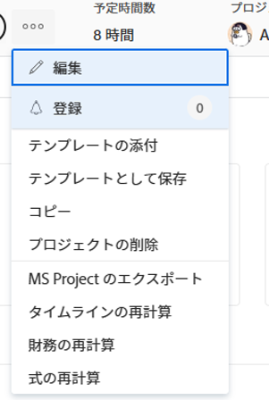

# プロジェクトの Microsoft Project へのエクスポート

Adobe Workfront プロジェクトを Microsoft Project に書き出すことができます。

>[!IMPORTANT]
>
>* すべての Workfront フィールドが Microsoft Project ファイルに転送されるわけではありません。\
>  Workfront と Microsoft Project の間のフィールドの互換性の詳細については、[Microsoft Project フィールドの Adobe Workfront プロジェクトへのマッピング](../../../manage-work/projects/manage-projects/map-ms-project-fields-to-workfront.md)を参照してください。
>* あるアプリケーションから別のアプリケーションにプロジェクトを転送する回数を制限することをお勧めします。
>

## アクセス要件

+++ 展開すると、この記事の機能のアクセス要件が表示されます。

<table style="table-layout:auto"> 
 <col> 
 <col> 
 <tbody> 
  <tr> 
   <td role="rowheader">Adobe Workfront パッケージ</td> 
   <td> 
任意
 </td> 
  </tr> 
  <tr> 
   <td role="rowheader">Adobe Workfront プラン</td> 
   <td> 
ライト以上

   
レビュー以上

</td> 
  </tr> 
  <tr> 
   <td role="rowheader">アクセスレベル設定</td> 
   <td> 
プロジェクトに対する表示以上のアクセス権
 </td> 
  </tr> 
  <tr> 
   <td role="rowheader">オブジェクト権限</td> 
   <td> 
 プロジェクトの表示またはそれ以上の権限
</td> 
  </tr> 
 </tbody> 
</table>

*このテーブルの詳細については、[Workfront ドキュメントのアクセス要件 ](/help/quicksilver/administration-and-setup/add-users/access-levels-and-object-permissions/access-level-requirements-in-documentation.md) を参照してください。

+++

<!--Old:

<table style="table-layout:auto"> 
 <col> 
 <col> 
 <tbody> 
  <tr> 
   <td role="rowheader">Adobe Workfront plan*</td> 
   <td> 
Any
 </td> 
  </tr> 
  <tr> 
   <td role="rowheader">Adobe Workfront license*</td> 
   <td> 
Review or higher
 </td> 
  </tr> 
  <tr> 
   <td role="rowheader">Access level configurations*</td> 
   <td> 
View or higher access to Projects
 
<b>NOTE</b>
   
   If you still don't have access, ask your Workfront administrator if they set additional restrictions in your access level. For information about access to projects, see <a href="../../../administration-and-setup/add-users/configure-and-grant-access/grant-access-projects.md" class="MCXref xref">Grant access to projects</a>. For information on how a Workfront administrator can change your access level, see <a href="../../../administration-and-setup/add-users/configure-and-grant-access/create-modify-access-levels.md" class="MCXref xref">Create or modify custom access levels</a>. 
 </td> 
  </tr> 
  <tr> 
   <td role="rowheader">Object permissions</td> 
   <td> 
 View or higher permissions to the project
 
For information about project permissions, see <a href="../../../workfront-basics/grant-and-request-access-to-objects/share-a-project.md" class="MCXref xref">Share a project in Adobe Workfront</a>.
 
For information on requesting additional access, see <a href="../../../workfront-basics/grant-and-request-access-to-objects/request-access.md" class="MCXref xref">Request access to objects </a>.
 </td> 
  </tr> 
 </tbody> 
</table>-->

## Workfront から Microsoft Project へのプロジェクトの書き出し

プロジェクトは、Workfront のプロジェクトページ、プロジェクトリスト、レポートから書き出すことができます。

1. 書き出すプロジェクトに移動し、プロジェクト名の右側にある **その他** アイコン  をクリックします

   

   または

   プロジェクトリストまたはレポートに移動してプロジェクトを選択し、リストの上部にある「詳細」アイコン  をクリックします。

   

1. **MS Project をエクスポート** をクリックします。

   プロジェクトが XML ファイルとしてコンピューターにダウンロードされ、Microsoft Project に読み込む準備が整います。
