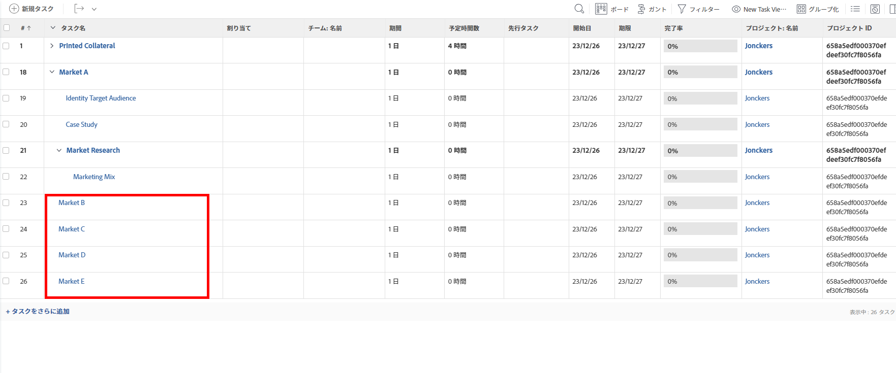
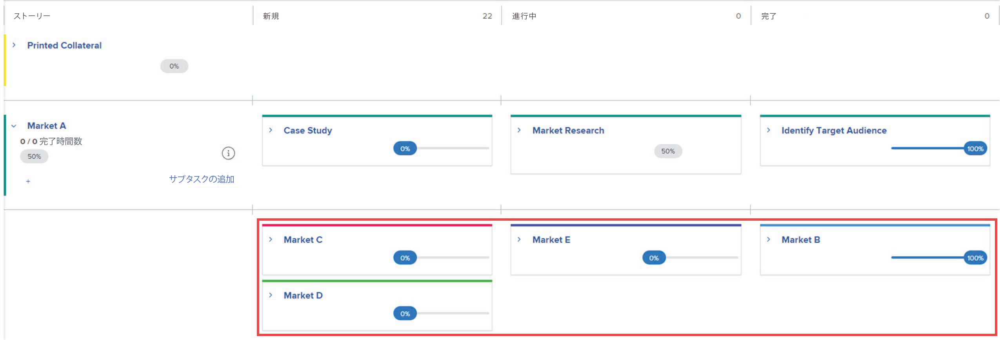
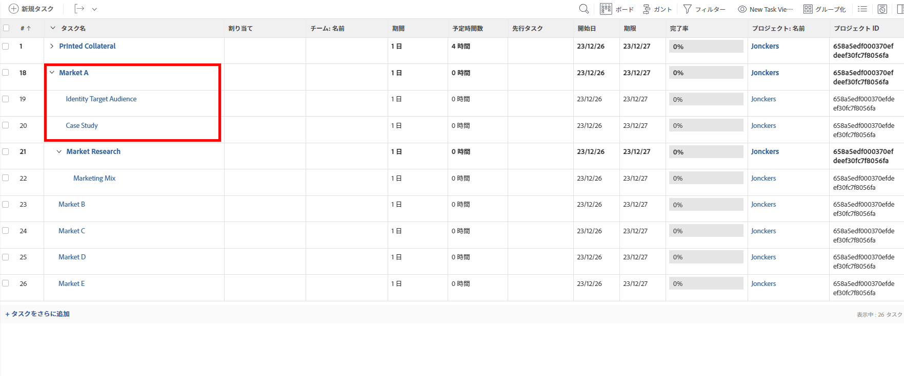
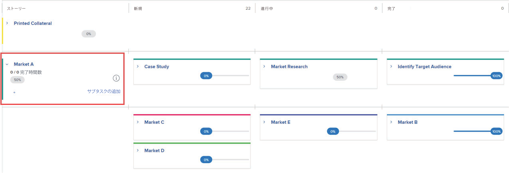
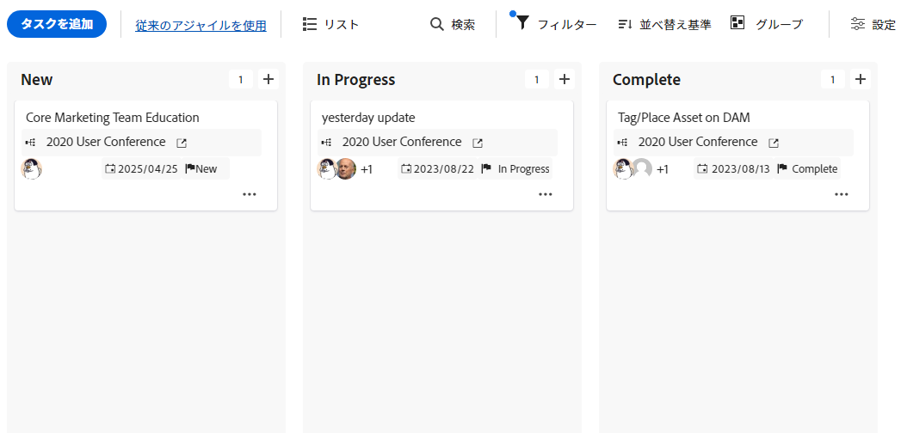

# アジャイルビューでのプロジェクト管理

{{highlighted-preview}}

<!--
Required plans, license types, and access

<table style="table-layout:auto"> 
 <col> 
 <col> 
 <tbody> 
  <tr> 
   <td> 
<a href="https://www.workfront.com/plans" target="_blank">Adobe Workfront Plan</a> 
 </td> 
   <td> 
Team, Pro, Business, or Enterprise 
 </td> 
  </tr> 
  <tr> 
   <td> 
Workfront License Type
 </td> 
   <td> 
Review, Work, or Plan 
 </td> 
  </tr> 
   <tr data-mc-conditions="QuicksilverOrClassic.Draft mode"> 
    <td> 
Permissions in the access model
 </td> 
    <td> <li>Edit access and ability to create reports, dashboards, and calendars</li> </td> 
   </tr>
 </tbody> 
</table>
-->

一般的にアジャイルプラクティスに伴う管理上の課題（チームバックログの管理や反復の作成など）がなくても、プロジェクトにアジャイル機能を活用できます。

チームバックログを使用し、バックログ上のタスクから反復を作成できるアジャイル環境で作業する場合は、 [機敏な環境での作業](../../../agile/work-in-an-agile-environment/work-in-an-agile-environment.md).

## アクセス要件

この記事の手順を実行するには、次のアクセス権が必要です。

<table style="table-layout:auto"> 
 <col> 
 <col> 
 <tbody> 
  <tr> 
   <td role="rowheader">Adobe Workfront plan*</td> 
   <td> 
任意
 </td> 
  </tr> 
  <tr> 
   <td role="rowheader">Adobe Workfront license*</td> 
   <td> 
レビュー以上
 </td> 
  </tr> 
  <tr> 
   <td role="rowheader">アクセスレベル設定*</td> 
   <td> 
次の領域へのアクセスを編集します。
 
    <ul> 
     <li> 
プロジェクト
 </li> 
     <li> 
レポート、ダッシュボード、カレンダー
 </li> 
     <li> 
フィルター、表示、グループ化
 </li> 
    </ul> 
注意：まだアクセス権がない場合は、Workfront管理者に、アクセスレベルに追加の制限を設定しているかどうかを問い合わせてください。 Workfront管理者がアクセスレベルを変更する方法について詳しくは、 <a href="../../../administration-and-setup/add-users/configure-and-grant-access/create-modify-access-levels.md" class="MCXref xref">カスタムアクセスレベルの作成または変更</a>.
 </td> 
  </tr> 
  <tr> 
   <td role="rowheader">オブジェクト権限</td> 
   <td> 
プロジェクトに対する権限を表示
 
追加のアクセス権のリクエストについて詳しくは、 <a href="../../../workfront-basics/grant-and-request-access-to-objects/request-access.md" class="MCXref xref">オブジェクトへのアクセスのリクエスト </a>.
 </td> 
  </tr> 
 </tbody> 
</table>

&#42;保有しているプラン、ライセンスの種類、アクセス権を確認するには、Workfront管理者に問い合わせてください。

## アジャイルプロジェクトについて

>[!NOTE]
>
>この節は、レガシーのアジャイルビューにのみ適用され、プロジェクトのボードビューには適用されません。

* [プロジェクトのアジャイル機能](#agile-functionality-in-a-project)
* [プロジェクトでアジャイルビューを使用する場合と反復で使用する場合の違い](#differences-when-using-the-agile-view-on-a-project-versus-on-an-iteration)

### プロジェクトのアジャイル機能 {#agile-functionality-in-a-project}

アジャイルビューでプロジェクトを管理する場合は、次のアジャイル機能を使用できます。

* 完了状態\
  完了ステータスについて詳しくは、 [反復完了ステータスの概要](../../../agile/use-scrum-in-an-agile-team/burndown/iteration-completion-status-overview.md).

* ストーリーボード\
  ストーリーボードについて詳しくは、 [スクラムボード](../../../agile/use-scrum-in-an-agile-team/scrum-board/scrum-board.md) 」セクションに入力します。

プロジェクトでアジャイルビューを使用する場合と、純粋にアジャイルな環境で（バックログと反復を使用して）作業する場合では、いくつかの違いがあります。 詳しくは、 [プロジェクトでアジャイルビューを使用する場合と反復で使用する場合の違い](#differences-when-using-the-agile-view-on-a-project-versus-on-an-iteration) 」を参照してください。

### プロジェクトでアジャイルビューを使用する場合と反復で使用する場合の違い {#differences-when-using-the-agile-view-on-a-project-versus-on-an-iteration}

* [タスクとサブタスクは、ストーリーボード上の様々な表示ルールに従います](#tasks-and-subtasks-follow-different-display-rules-on-the-story-board)
* [バックログと繰り返しは使用されません](#backlogs-and-iterations-are-not-used)
* [タスクの順序はアジャイルビューで維持され、順序を変更できません](#task-order-is-maintained-in-the-agile-view-and-cannot-be-reordered)
* [タスクは計画時間でのみ測定されます](#tasks-are-measured-only-in-planned-hours)
* [アジャイルチームは使用されていません](#the-agile-team-is-not-used)
* [プロジェクトの各ユーザーは、異なるアジャイルビューでプロジェクトを表示できます](#each-user-on-the-project-can-view-the-project-in-a-different-agile-view)

#### タスクとサブタスクは、ストーリーボード上の様々な表示ルールに従います {#tasks-and-subtasks-follow-different-display-rules-on-the-story-board}

* 親タスクもサブタスクも持たないタスクは、常にストーリーボード上に単一ストーリーカードとして表示されます。\
  たとえば、これらのタスクは、プロジェクトの一覧表示で次のように表示されます。

   これらのタスクは、プロジェクトのアジャイルビューでは次のように表示されます。

  

* サブタスクを持つ親タスクは、常に **ストーリー** ストーリーボードの列。 サブタスクは、親タスクのスイムレーンに表示されます。\
  たとえば、これらのタスクは、プロジェクトの一覧表示で次のように表示されます。

  \
  これらのタスクは、プロジェクトのアジャイルビューでは次のように表示されます。

  

* 第 2 レベルのサブタスク（サブタスクのサブタスク）は、直近の親タスクの上にぶら下がったグレーのカードとして表示されます。
* 第 3 レベルのサブタスク（サブタスクのサブタスクのサブタスク）は、ストーリーボードには表示されません。

#### バックログと繰り返しは使用されません {#backlogs-and-iterations-are-not-used}

アジャイルビューでプロジェクトを表示する場合、次のアジャイルコンポーネントは使用されません。

* **バックログ：** プロジェクト内のタスクはストーリーとして自動的に表示されるので、バックログは使用されません。
* **反復：** 作業が完了する日付を定義する反復を作成するのではなく、プロジェクトタイムラインで現在指定されている日が稼働日になります。

#### タスクの順序はアジャイルビューで維持され、順序を変更できません {#task-order-is-maintained-in-the-agile-view-and-cannot-be-reordered}

プロジェクトをアジャイルストーリーボードで表示するとき、プロジェクト内でのタスクの表示順序が維持されます。

プロジェクトをアジャイルビューで表示する場合、プロジェクト内のタスクを並べ替えることはできません。 タスクの順序を変更すると、依存関係を持つ他のタスクに影響を与える可能性があるので、タスクの順序を変更するには、標準ビューでプロジェクトを表示する必要があります。

#### タスクは計画時間でのみ測定されます {#tasks-are-measured-only-in-planned-hours}

プロジェクト上のタスクは、常に計画時間数で測定されます。

反復では、タスク（ストーリー）を時間単位またはポイント単位で測定できます。

#### アジャイルチームは使用されていません {#the-agile-team-is-not-used}

アジャイルチームは、割り当てられた反復作業を完了するので、アジャイルビューでプロジェクトを表示する場合は、アジャイルチームは使用されません。

代わりに、プロジェクト上のユーザーは基本的に、そのプロジェクトの俊敏なチームになります。

#### プロジェクトの各ユーザーは、異なるアジャイルビューでプロジェクトを表示できます {#each-user-on-the-project-can-view-the-project-in-a-different-agile-view}

俊敏な反復とは異なり、プロジェクトのユーザーは俊敏なビューを自分でカスタマイズできますが、他のユーザーは俊敏なビューを別の方法で使用できます。

アジャイル反復では、アジャイルストーリーボードで利用可能な情報（利用可能なステータス列など）は、チームレベルで決定されます。

アジャイルビューのカスタマイズ方法について詳しくは、 [アジャイルビューの作成またはカスタマイズ](../../../reports-and-dashboards/reports/reporting-elements/views-overview.md#customizing-an-agile-view) in [Adobe Workfrontの概要を表示](../../../reports-and-dashboards/reports/reporting-elements/views-overview.md).

## アジャイルビューでのプロジェクトの表示

1. アジャイルビューで表示するプロジェクトに移動します。
1. 次をクリック： **アジャイル** アイコン .

   または

   次をクリック： **ボード** アイコン .

   デフォルトのアジャイルビューにプロジェクトが表示されます。

   プレビュー環境では、ボードビューがデフォルトで表示されます。

   

   （レガシーアジャイルビューのみ）以前にカスタムアジャイルビューでプロジェクトを表示した場合、デフォルトのアジャイルビューではなく、そのビューでプロジェクトが表示されます。

1. （オプション）「 **設定** をクリックして、列とカードのオプションを設定します。

   詳しくは、 [ボード列を管理](/help/quicksilver/agile/get-started-with-boards/manage-board-columns.md) および [カードに表示するフィールドのカスタマイズ](/help/quicksilver/agile/get-started-with-boards/customize-fields-on-card.md). プロジェクトのボードビューでは、列ポリシーを定義できません。

1. （オプション）「 **レガシーアジャイルを使用** を使用して、ボードビューの代わりにレガシーアジャイルビューを使用します。

1. （オプション — レガシーアジャイルビューのみ）カスタムアジャイルビューを作成した場合、または別のユーザーがカスタムアジャイルビューを作成して共有した場合、デフォルトのアジャイルビューの代わりに表示できます。

   次をクリック： **表示** ドロップダウンメニューから、表示するカスタムアジャイルビューをクリックします。

   カスタムアジャイルビューは、次に **アジャイル** アイコン

   新しいアジャイルビューの作成方法について詳しくは、 [アジャイルビューの作成とカスタマイズ](#create-and-customize-agile-views).

   プロジェクトがカスタムアジャイルビューに表示されます。

1. （条件付き — レガシーアジャイルビューのみ）プロジェクト内のタスクで「新規」、「処理中」、「完了」（アジャイルビューのデフォルトステータス）以外のステータスを使用している場合、それらのステータスのタスクをアジャイルビューに追加する必要があります。

   タスクのステータスが「アジャイルストーリー」ボードに表示されない場合、タスク自体は「アジャイルストーリー」ボードに表示されません（ただし、タスクの「完了率」は、親タスクの「完了率」と、プロジェクト全体の「完了率」に影響します）。

   アジャイルビューにステータスを追加するには、記事の「アジャイルビューの作成またはカスタマイズ」の節に従って、新しいアジャイルビューを作成するか、既存のアジャイルビューをカスタマイズします [Adobe Workfrontの概要を表示](../../../reports-and-dashboards/reports/reporting-elements/views-overview.md).

1. （オプション）リスト表示に戻るには、 **リスト** アイコン\
   

## アジャイルビューの作成とカスタマイズ {#create-and-customize-agile-views}

>[!NOTE]
>
>この節は、レガシーのアジャイルビューにのみ適用され、プロジェクトのボードビューには適用されません。

Workfrontの標準ビューと同様に、既存のアジャイルビューをカスタマイズしたり、新しいアジャイルビューをゼロから作成したりできます。 標準ビューとは異なり、既存のアジャイルビューに基づいて新しいアジャイルビューを作成することはできません。

アジャイルビューの作成とカスタマイズについて詳しくは、この記事の「アジャイルビューの作成またはカスタマイズ」の節を参照してください [Adobe Workfrontの概要を表示](../../../reports-and-dashboards/reports/reporting-elements/views-overview.md).

## 既存のアジャイルビューの共有

>[!NOTE]
>
>この節は、レガシーのアジャイルビューにのみ適用され、プロジェクトのボードビューには適用されません。

アジャイルビューの共有方法について詳しくは、 [フィルター、表示またはグループ化の共有](../../../reports-and-dashboards/reports/reporting-elements/share-filter-view-grouping.md).

## 既存のアジャイルビューの削除

>[!NOTE]
>
>この節は、レガシーのアジャイルビューにのみ適用され、プロジェクトのボードビューには適用されません。

ビューの削除方法について詳しくは、この記事の「ビューの削除」の節を参照してください [Adobe Workfrontの概要を表示](../../../reports-and-dashboards/reports/reporting-elements/views-overview.md).
