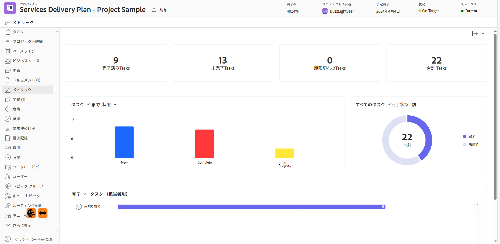
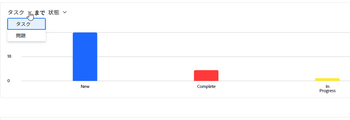
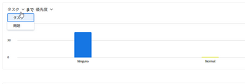
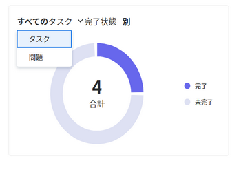
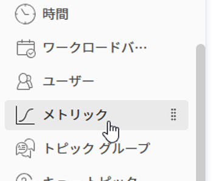

# プロジェクト指標の概要

プロジェクト指標を使用すると、プロジェクトのパフォーマンスに関する概要をグラフ形式で表示できます。

## アクセス要件

<table style="table-layout:auto"> 
 <col> 
 <col> 
 <tbody> 
  <tr> 
   <td role="rowheader">Workfront プラン*</td> 
   <td> 
任意
 </td> 
  </tr> 
  <tr> 
   <td role="rowheader">Workfront ライセンス*</td> 
   <td> 
レビュー以上 
 </td> 
  </tr> 
  <tr> 
   <td role="rowheader">アクセスレベル*</td> 
   <td> 
プロジェクトへの表示アクセス
 
<b>メモ</b>

まだアクセス権がない場合は、Workfront 管理者に問い合わせて、アクセスレベルに追加の制限が設定されているかどうかを確認してください。プロジェクトへのアクセスについて詳しくは、<a href="../../../administration-and-setup/add-users/configure-and-grant-access/grant-access-projects.md" class="MCXref xref">プロジェクトへのアクセス権の付与</a>を参照してください。Workfront 管理者がアクセスレベルを変更する方法について詳しくは、<a href="../../../administration-and-setup/add-users/configure-and-grant-access/create-modify-access-levels.md" class="MCXref xref">カスタムアクセスレベルの作成または変更</a>を参照してください。 
 </td>
</tr> 
  <tr> 
   <td role="rowheader">オブジェクト権限</td> 
   <td> 
プロジェクトに対する権限の表示
 
 プロジェクト権限について詳しくは、<a href="../../../workfront-basics/grant-and-request-access-to-objects/share-a-project.md" class="MCXref xref">Adobe Workfront でのプロジェクトの共有</a>を参照してください。
 
追加のアクセス権のリクエストについて詳しくは、<a href="../../../workfront-basics/grant-and-request-access-to-objects/request-access.md" class="MCXref xref">オブジェクトへのアクセス権のリクエスト</a>を参照してください。
 </td> 
  </tr> 
 </tbody> 
</table>

*保有するプラン、ライセンスタイプまたはアクセス権を確認するには、Workfront 管理者にお問い合わせください。

## 前提条件

プロジェクトの左側のパネルから指標領域にアクセスするには、次の操作を行う必要があります。

* レイアウトテンプレートのプロジェクト領域で、左側のパネルの「指標」オプションを有効にします。

  Workfront の管理者またはグループ管理者がレイアウトテンプレートを使用して左側のパネルをカスタマイズする方法について詳しくは、[レイアウトテンプレートを使用した左側のパネルのカスタマイズ](../../../administration-and-setup/customize-workfront/use-layout-templates/customize-left-panel.md)を参照してください。

## プロジェクトの指標領域の概要

プロジェクト指標を使用すると、プロジェクトで発生していることをビジュアライゼーションで表示し、プロジェクトのニーズやステータスをすばやく評価できます。

指標領域では、プロジェクト全体の健全性のほか、次の情報を確認できます。

* 作業がアクティブまたは停止している場所
* 割り当てられた作業項目を開いたユーザー
* 予定完了日を超過した、または予定完了日に近いタスクやイシューの詳細

また、各グラフを詳しく調べて、特定のカテゴリのタスクやイシューをより詳細に調べることもできます。

これらのタスクやイシューの確認について詳しくは、[指標の詳細を表示](#view-metrics-details)を参照してください。

>[!TIP]
>
>プログラムやポートフォリオ内のプロジェクトのグループに関する指標を上位レベルで表示するには、拡張分析領域に移動します。\
>拡張分析について詳しくは、[拡張分析の概要](../../../enhanced-analytics/enhanced-analytics-overview.md)を参照してください。

## プロジェクトの KPI

主要業績評価指標（KPI）は、指標領域の上部に表示されます。

これらの KPI は、次のカテゴリに分類されます。

| 完了タスク | **完了タスク**&#x200B;には、完了ステータスのタスクの数が表示されます。この数値には、「完了」と同等のカスタムステータスを持つタスクも含まれます。 |
|---|---|
| 未完了タスク | **未完了タスク**&#x200B;には、「完了」ステータス、「クローズ」ステータス、または「完了」と同等のステータスではないタスクの数が表示されます。 |
| 期限切れタスク | **期限切れタスク**&#x200B;には、予定完了日を超過しており、「完了」ステータス、「クローズ」ステータス、「完了」または「クローズ」と同等のステータスではないタスクの数が表示されます。 |
| 合計タスク数 | **合計タスク数**&#x200B;には、プロジェクト内のタスクの合計数が表示されます。 |

>[!TIP]
>
>特定の KPI の作業項目リストを表示するには、その KPI をクリックします。このリストでは、特定の作業アイテムをクリックして、新規タブに詳細を表示できます。\
>\
>詳しくは、[指標の詳細を表示](#view-metrics-details)を参照してください。

## タスクまたはイシューの棒グラフ

プロジェクト KPI の下に表示される棒グラフで、プロジェクト内の作業項目のステータスや優先度を確認できます。タスクビューはデフォルトで選択されています。

このグラフでステータスを選択すると、プロジェクトのタスクまたはイシューのステータスをすべて表示できます。各ステータスは、グラフの棒でグループ化されます。このグラフには、すべてのデフォルトのシステムステータスとカスタムステータスが表示されます。

このグラフで優先度を選択すると、プロジェクトのタスクまたはイシューの優先度をすべて表示できます。

>[!TIP]
>
>特定のステータスまたは優先度を持つ作業項目のリストを表示するには、グラフの棒をクリックします。このリストでは、特定の作業アイテムをクリックして、新規タブに詳細を表示できます。\
>\
>詳しくは、[指標の詳細を表示](#view-metrics-details)を参照してください。

## ドーナツグラフ

プロジェクト KPI の下にあるドーナツグラフを使用すると、プロジェクト内の完了作業アイテムと未完了作業アイテムの比率を確認できます。

グラフの上にあるドロップダウンメニューで、次の項目を選択できます。

| すべてのタスク | 「**タスク**」を選択すると、プロジェクト内のタスクの合計数と、完了したタスクと未完了のタスクの比率が表示されます。 |
|---|---|
| すべてのイシュー | 「**イシュー**」を選択すると、プロジェクト内のイシューの合計数と、完了したイシューと未完了のイシューの比率が表示されます。 |

>[!TIP]
>
>完了または未完了な作業アイテムのリストを表示するには、ドーナツグラフで該当するセクションをクリックします。このリストでは、特定の作業アイテムをクリックして、新規タブに詳細を表示できます。\
>\
>詳しくは、[指標の詳細の表示](#view-metrics-details)を参照してください。

## 担当者の棒グラフ

担当者の棒グラフには、プロジェクト内の各ユーザーに割り当てられたタスクの数が表示されます。この数は、ドロップダウンメニューから選択したカテゴリによって異なります。

次のカテゴリでプロジェクトのタスク割り当てを確認することを選択できます。

| 完了 | 「**完了**」を選択すると、各ユーザーに割り当てられたタスクの完了した数が表示されます。 |
|---|---|
| 未完了 | 「**未完了**」を選択すると、各ユーザーに割り当てられている、まだ完了していないタスクの数が表示されます。 |
| 予定 | 「**予定**」を選択すると、各ユーザーに割り当てられている、予定開始日にまだ達していないタスクの数が表示されます。 |
| 期限切れ | 「**期限切れ**」を選択すると、各ユーザーに割り当てられている、予定完了日を過ぎていて、まだ完了していないタスクの数が表示されます。 |

>[!TIP]
>
>選択したカテゴリで特定のユーザーに割り当てられている作業アイテムのリストを表示するには、グラフでユーザー名の横にあるバーをクリックします。このリストでは、特定の作業アイテムをクリックして、新規タブに詳細を表示できます。\
>\
>詳しくは、[指標の詳細の表示](#view-metrics-details)を参照してください。

## 指標の詳細の表示 {#view-metrics-details}

指標エリアでグラフを操作して、グラフの様々な側面を確認したり、グラフ内のタスクやイシューをより詳細に調べたりできます。

1. 指標を表示するプロジェクトに移動します。
1. 左側のパネルで、「**さらに表示**」をクリックして、さらにセクションを表示し、「**指標**」をクリックします。\
   指標エリアのグラフには、デフォルトでタスクの情報が表示されます。\
   

1. （条件付き）グラフにドロップダウン矢印が表示される場合、**ドロップダウン矢印**&#x200B;アイコン  をクリックし、メニューから必要なオプションを選択します。\
   各グラフのメニューに表示されるオプションについて詳しくは、上記の関連する節を参照してください。

1. （オプション）ページ上の指標のタスクやイシューを詳しく調べるには、以下の手順を実行します。

   1. 詳細を表示する要素（特定のユーザーに割り当てられたタスク、優先度の高いイシュー、すべての期限切れのタスクなど）をクリックします。

      タスクまたはイシューのリストが表示されます。

      

   1. リストの下部にある矢印を使用して、確認するタスクまたはイシューを見つけます。

      または

      特定のページにタスクやイシューを表示するには、特定の数を選択します。

      

   1. さらに詳細を表示するには、タスクまたはイシューを選択します。

      タスクまたはイシューが新規タブで開きます。

1. （オプション）プロジェクト指標ダッシュボードを .png ファイルに書き出すには、**書き出し**&#x200B;アイコン  をクリックし、ドロップダウンメニューから「**PNG として書き出し**」を選択します。

   >[!TIP]
   >
   >ダッシュボードを書き出すと、書き出されたファイルには、現在ビューポートに表示されている内容のみが含まれます。書き出されたファイルに特定の要素を含めるには、ページ上を上下にスクロールするか、ブラウザーのズーム設定を調整する必要が生じる場合があります。
