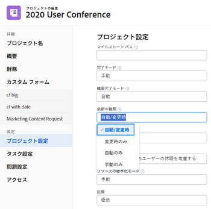
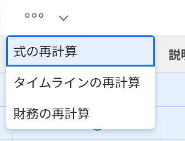

# プロジェクトタイムラインの再計算

タイムラインの再計算を使用すると、管理者は、プロジェクトに関連する様々な要因がプロジェクトのタイムラインに与える影響を確認できます。プロジェクトのタイムラインは、予定日と見込み日を指します。

プロジェクトの範囲外でスケジュールや人員の休暇、その他の項目に変更を加えても、プロジェクトのタイムラインに直ちには影響しません。タイムラインを再計算すると、プロジェクトタイムラインに影響が出ます。再計算が行われるまで、外部の影響はプロジェクトに作用しません。

この記事では、タイムラインの再計算がどのように発生するかについて説明します。

## アクセス要件

<!--drafted for P&P: 

<table style="table-layout:auto"> 
 <col> 
 <col> 
 <tbody> 
  <tr> 
   <td role="rowheader">Adobe Workfront plan*</td> 
   <td> 
Any
 </td> 
  </tr> 
  <tr> 
   <td role="rowheader">Adobe Workfront license*</td> 
   <td> 
Current license: Standard 
 
   Or
   
Legacy license: Plan 

   </td> 
  </tr> 
  <tr> 
   <td role="rowheader">Access level configurations*</td> 
   <td> 
Edit access to Projects
 
System administrator to recalculate timeline for all projects in the system
 
<b>NOTE</b>
   
   If you still don't have access, ask your Workfront administrator if they set additional restrictions in your access level. For information on how a Workfront administrator can modify your access level, see <a href="../../../administration-and-setup/add-users/configure-and-grant-access/create-modify-access-levels.md" class="MCXref xref">Create or modify custom access levels</a>.
 </td> 
  </tr> 
  <tr> 
   <td role="rowheader">Object permissions</td> 
   <td> 
Manage permissions to a project
 
For information on requesting additional access, see <a href="../../../workfront-basics/grant-and-request-access-to-objects/request-access.md" class="MCXref xref">Request access to objects </a>.
 </td> 
  </tr> 
 </tbody> 
</table>
-->
タイムラインの自動再計算は、プロジェクトの作業に関わるユーザーに対して特別なアクセス権を付与することなく行われます。

ただし、プロジェクトのタイムラインを手動で再計算するには、次のアクセス権が必要です。

<table style="table-layout:auto"> 
 <col> 
 <col> 
 <tbody> 
  <tr> 
   <td role="rowheader">Adobe Workfront プラン*</td> 
   <td> 
任意
 </td> 
  </tr> 
  <tr> 
   <td role="rowheader">Adobe Workfront ライセンス*</td> 
   <td> 
プラン 
 </td> 
  </tr> 
  <tr> 
   <td role="rowheader">アクセスレベル設定*</td> 
   <td> 
プロジェクトへのアクセスを編集
 
システム内のすべてのプロジェクトのタイムラインを再計算するシステム管理者
 
<b>メモ</b>

まだアクセス権がない場合は、Workfront 管理者に問い合わせて、アクセスレベルに追加の制限が設定されているかどうかを確認してください。Workfront 管理者がアクセスレベルを変更する方法について詳しくは、<a href="../../../administration-and-setup/add-users/configure-and-grant-access/create-modify-access-levels.md" class="MCXref xref">カスタムアクセスレベルの作成または変更</a>を参照してください。
 </td>
</tr> 
  <tr> 
   <td role="rowheader">オブジェクト権限</td> 
   <td> 
プロジェクトに対して権限を管理
 
追加のアクセス権のリクエストについて詳しくは、<a href="../../../workfront-basics/grant-and-request-access-to-objects/request-access.md" class="MCXref xref">オブジェクトへのアクセス権のリクエスト</a>を参照してください。
 </td> 
  </tr> 
 </tbody> 
</table>

&#42;保有するプラン、ライセンスタイプ、アクセス権を確認するには、Workfront 管理者に問い合わせてください。

## 自動再計算

デフォルトでは、プロジェクトの範囲が変更された時、または毎晩、プロジェクトのタイムラインは自動的に毎日再計算されます。Workfront の管理者は、設定のプロジェクト環境設定エリアの「タイムライン」設定を管理することで、毎晩、または範囲の変更ごとに、タイムラインを自動的に計算するかどうかを決定します。詳しくは、[プロジェクトのタイムライン再計算の設定](../../../administration-and-setup/set-up-workfront/configure-system-defaults/configure-timeline-recalculations-projects.md)を参照してください。

>[!NOTE]
>
>プロジェクトのタイムラインが 15 年を超える場合、そのプロジェクトの自動再計算は無効になります。15 年を超えるプロジェクトに対して選択できるのは、「更新タイプ」の「手動」のみです。プロジェクト上の日付を 15 年未満に変更した場合は、タイムラインを自動的に計算する前に 1 回手動で再計算する必要があります。

* [プロジェクトタイムラインの自動再計算](#automatic-recalculation-of-project-timelines)
* [プロジェクトタイムラインの自動再計算を引き起こすアクション](#actions-that-trigger-an-automatic-recalculation-of-project-timelines)

### プロジェクトタイムラインの自動再計算 {#automatic-recalculation-of-project-timelines}

Adobe Workfrontでは、次の条件がすべて満たされたプロジェクトのタイムラインが毎日再計算されます。

* ステータスが「現在」であること
* プロジェクトの「更新タイプ」が「自動」または「自動と変更時」に設定されている

  プロジェクトの更新タイプについて詳しくは、[プロジェクト更新タイプの概要](../../../manage-work/projects/planning-a-project/project-update-type-overview.md)を参照してください。

* 過去 3 か月以内に最終更新日があること\
  Workfrontの管理者は、[プロジェクトのタイムライン再計算の設定](../../../administration-and-setup/set-up-workfront/configure-system-defaults/configure-timeline-recalculations-projects.md)に記載されているように、このデフォルト機能を変更できます。

* プロジェクトタイムラインの最終計算日が現在のカレンダー日内にないこと。つまり、プロジェクトタイムラインの最終計算日が現在の日の 00:00 より前になっています。

プロジェクトのタイムラインを更新する頻度を設定できます。プロジェクトタイムラインを更新すると、プロジェクトに加えた変更に基づいて再計算されます。

<!--
<MadCap:conditionalText data-mc-conditions="QuicksilverOrClassic.Draft mode">
or changes made to another project that the timeline is dependent on
</MadCap:conditionalText>
-->

<!--

(NOTE: above, the last part is drafted because of this: I don't think this is right because we told people that in the case of cross-project predecessors, the timeline must be calculated manually for the successor to see the updates in the predecessor's project. Drafting for now.)

-->

詳しくは、[プロジェクトの更新タイプを選択](../../../manage-work/projects/manage-projects/select-project-update-type.md)を参照してください。

<!--

(NOTE:&nbsp;content moved to the article linked above)

You can configure how the timeline for your project is updated:

<ol>
<li value="1">Go to the project for which you want to configure how the timeline is updated.</li>
<li value="2"> 
  Click the <strong>More</strong> icon  to the right of the project name, then click&nbsp; <strong>Edit</strong>. 
 
The <strong>Edit Project</strong> dialog box is displayed.
 </li>
<li value="3"> 
Click<strong>Settings.</strong> 
 </li>
<li value="4">In the <strong>Update Type</strong> drop-down list, select from the following options: <strong>- Automatic and On Change:</strong> (Default setting) The project timeline is updated each time a change occurs in the project or in another project that the timeline is dependent on. The project timeline is also updated each night.  This is the recommended setting for this field because it ensures that the project timeline is always up to date. When you update a task or the project and trigger a timeline recalculation, all available dates are immediately displayed, allowing you to continue working. On projects with more than 100 tasks, dates that require longer calculations are dimmed.

 This indicates that the recalculation is not yet finished, and the dates are subject to change.  <strong>- Change Only:</strong> The project timeline is updated each time a change occurs in the project or in another project that the timeline is dependent on; scheduled updates do not occur. You might want to select this option if changes rarely occur in the project or in other projects that the timeline is dependent on. <strong>- Automatic Only:</strong> The project timeline is updated each night; it is not updated immediately after changes are made. You might want to select this option if many changes occur each day in the project or in other projects that the timeline is dependent on. <note type="note">
A project does not automatically recalculate each night if it is in Planning status. It only recalculates on change.
</note> <strong>- Manual Only:</strong> The project timeline is updated only when you select the option to Recalculate Timelines, as described in <a href="#manual-recalculation" class="MCXref xref">Manual recalculation</a>. You might want to select this option if you are making many changes to the project at one time, and you want the timeline recalculation to occur after all of the changes have been made (rather than after each individual change). For more information about the project Update Type, see <a href="../../../manage-work/projects/manage-projects/select-project-update-type.md" class="MCXref xref">Select the project Update Type </a><note type="note">
If the timeline of a project is longer than 15 years, the automatic recalculation is disabled. If you change the dates on the project to less than 15 years, you must manually recalculate your timeline one time before it is calculated automatically.
</note></li>
<li value="5">Click <strong>Save Changes.</strong></li>
</ol>

-->

### プロジェクトタイムラインの自動再計算を引き起こすアクション {#actions-that-trigger-an-automatic-recalculation-of-project-timelines}

プロジェクトの存続期間中の様々な範囲の変更により、以下のアクションを含めて、プロジェクトのタイムラインが自動的に再計算されます。

* タスクのステータスの更新。
* タスクを別のプロジェクトに移動。
* タスクの予定日または予定完了日の更新。
* 期間タイプ、タスクの制約、またはタスクの担当者数の更新。
* 先行タスクの関係の更新。
* タスクへの承認の追加によって、タスクの予定完了日にも時間を追加。\
  承認設定について詳しくは、[グローバル承認設定の指定](../../../administration-and-setup/customize-workfront/configure-approval-milestone-processes/establish-approval-settings.md)を参照してください。

## 手動再計算 {#manual-recalculation}

プロジェクト所有者は、個々のプロジェクトのタイムラインを手動で再計算できます。Workfront の管理者は、Workfront のすべてのタイムラインを手動で再計算できます。

* [個々のプロジェクトのタイムラインを再計算するか、一括して再計算](#recalculate-timelines-for-individual-projects-or-in-bulk)
* [「プロジェクトを編集」ボックスでタイムラインを手動で一括再計算](#manually-recalculate-timelines-in-bulk-in-the-edit-projects-box)
* [システム内のすべてのプロジェクトのタイムラインを再計算（Workfront 管理者のみ）](#recalculate-timelines-for-all-projects-in-the-system-workfront-administrators-only)

### 個々のプロジェクトのタイムラインを再計算するか、一括して再計算 {#recalculate-timelines-for-individual-projects-or-in-bulk}

プロジェクトのタイムラインは、プロジェクトページ、またはプロジェクトリストやレポートから、Workfront で再計算できます。

1. タイムラインを再計算するプロジェクトに移動し、プロジェクト名の左側にある&#x200B;**その他**&#x200B;アイコン  をクリックします。

   

   または

   プロジェクトリストまたはレポートに移動して、1 つまたは複数のプロジェクトを選択し、リストの上部にある&#x200B;**その他**&#x200B;アイコン  をクリックします。

   

   >[!TIP]
   >
   >プロジェクトの複雑さに応じて、最適なパフォーマンスを確保するためにタイムラインを一括で再計算する場合は、多数のプロジェクトを選択しないことをお勧めします。プロジェクトが複雑になりすぎる原因として、複数の依存関係や割り当て、大量のカスタムフィールドなどが挙げられます。

1. **タイムラインを再計算**&#x200B;をクリックします。

   タイムラインが再計算されると、再計算が成功したことを示すメッセージが表示されます。

   >[!TIP]
   >
   >タイムラインの再計算が完了する前は、予定日または見込み日の一部が淡色表示になる場合があります。これは、再計算がまだ終わっておらず、日程が変更される可能性があることを意味します。

### 「プロジェクトを編集」ボックスでタイムラインを手動で一括再計算 {#manually-recalculate-timelines-in-bulk-in-the-edit-projects-box}

複数のプロジェクトのタイムラインを一括編集することで、手動で再計算することができます。

>[!TIP]
>
>プロジェクトの複雑さに応じて、最適なパフォーマンスを確保するために、大量のプロジェクトを一括編集する際には選択しないことをお勧めします。プロジェクトが複雑すぎる原因として考えられるものとしては、複数の依存関係や割り当てまたは多数のカスタムフィールドなどがあります。

1. プロジェクトのリストに移動します。
1. リスト内の複数のプロジェクトを選択し、「**編集**」をクリックします。
1. 「**設定**」をクリックし、「**タイムラインを再計算**」を選択します。

1. 「**変更を保存**」をクリックします。

### システム内のすべてのプロジェクトのタイムラインを再計算（Workfront 管理者のみ） {#recalculate-timelines-for-all-projects-in-the-system-workfront-administrators-only}

Workfront の管理者は、「タイムラインを再計算」の診断を実行して、Workfront システム内のすべてのタイムラインを直ちに再計算できます。これにより、すべてのプロジェクトマネージャーは、予定日と見込み日の両方に対する外部の変更の影響を即座に確認できます。

Workfront サイト全体のタイムラインの再計算について詳しくは、[プロジェクトのタイムライン再計算の設定](../../../administration-and-setup/set-up-workfront/configure-system-defaults/configure-timeline-recalculations-projects.md)の記事の「Workfront インスタンス全体のタイムラインの再計算」の節を参照してください。

<!--

<h2>Project Update Types</h2>

(NOTE: drafted and moved to thisa rticle: /Content/Manage work/Projects/Planning a Project/project-update-type-overview.htm)

For information about how to update the project's Update Type, see <a href="../../../manage-work/projects/manage-projects/select-project-update-type.md" class="MCXref xref">Select the project Update Type </a>. 
 <note type="important">
If the timeline of a project is longer than 15 years, Workfront does not calculate the timeline automatically or on change. The Update Type of a project longer than 15 years is always Manual.
</note>

You can select how each project calculates its timeline by choosing between the following Update Types:
 <note type="important">
If the timeline of a project is longer than 15 years, Workfront does not calculate the timeline automatically or on change. The Update Type of a project longer than 15 years is always Manual.
</note>
<ul>
<li> 
<strong>Automatic and On Change:</strong>&nbsp;This is the default setting. The project timeline is updated each time a change occurs&nbsp;in the project or in another project that the timeline is dependent on. The project timeline is also updated each night.&nbsp;  This is the recommended setting as it ensures that the project timeline is always up to date.
 
When you update a task or the project and trigger a timeline recalculation, all available dates are immediately displayed, allowing you to continue working. On projects with more than 100 tasks, dates that require longer calculations are dimmed. 
 
  
 
This indicates that the recalculation is not yet finished, and the dates are subject to change. 
 </li>
<li><strong>Change Only:</strong>&nbsp;The project timeline is updated each time a change occurs in the project or in another project that the timeline is dependent on; scheduled updates do not occur.  You might want to select this option if you are concerned about system performance and if&nbsp;changes rarely occur in the project or in other projects that the timeline is dependent on.</li>
<li> 
<strong>Automatic Only:</strong>&nbsp;The project timeline is updated each night; it is not updated immediately after changes are made. You might want to select this option if you are concerned about system performance and if many changes occur each day in the project or in other projects that the timeline is dependent on.
 <note type="note">
A project does not automatically recalculate each night if it is in Planning status. It only recalculates on change.
</note> </li>
<li><strong>Manual Only:</strong>&nbsp;The project timeline is updated only&nbsp;when you select the option to <strong>Recalculate Timelines</strong>, as described in the section "Manual Recalculation" in&nbsp;the article <a href="#" class="MCXref xref selected">Recalculate project timelines</a>. You might want to select this option if you are making many changes to the project at one time, and you want the timeline recalculation to occur after all of the changes have been made (rather than after each individual change).</li>
</ul>

-->
