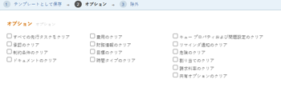
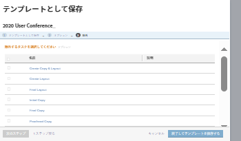

# プロジェクトをテンプレートとして保存

<!--

(NOTE: Keep this the way it is in the Managing Projects area because the functionality in the UI is "Save as template" at the project level, so users see that in the UI; there is another article that this links to which is more in depth (step-by-step). This functionality needs to stay in both projects AND templates areas.)

-->

プロジェクトが将来再び発生することが決定した場合は、その既存のプロジェクトからテンプレートを作成できます。次に、テンプレートを再度使用して、同様の情報を含む可能性がある、または既存のプロジェクトと同じタイムラインや割り当てを共有する可能性のある今後のプロジェクトを作成できます。

## アクセス要件

<!--drafted for P&P:
<table style="table-layout:auto"> 
 <col> 
 <col> 
 <tbody> 
  <tr> 
   <td role="rowheader">Adobe Workfront plan*</td> 
   <td> 
Any 
 </td> 
  </tr> 
  <tr> 
   <td role="rowheader">Adobe Workfront license*</td> 
   <td> 
Current license: Standard 

   Or 
   
Legacy license: Plan 
 
   </td> 
  </tr> 
  <tr> 
   <td role="rowheader">Access level configurations*</td> 
   <td> 
Edit access to Templates
 
<b>NOTE</b>
   
   If you still don't have access, ask your Workfront administrator if they set additional restrictions in your access level. For information on how a Workfront administrator can modify your access level, see <a href="../../../administration-and-setup/add-users/configure-and-grant-access/create-modify-access-levels.md" class="MCXref xref">Create or modify custom access levels</a>.
 </td> 
  </tr> 
  <tr> 
   <td role="rowheader">Object permissions</td> 
   <td> 
View or higher permissions to a project 
 
You obtain Manage permissions to the template after you save the project as a template
 
For information on requesting additional access, see <a href="../../../workfront-basics/grant-and-request-access-to-objects/request-access.md" class="MCXref xref">Request access to objects </a>.
 </td> 
  </tr> 
 </tbody> 
</table>
-->

この記事の手順を実行するには、次のアクセス権が必要です。

<table style="table-layout:auto"> 
 <col> 
 <col> 
 <tbody> 
  <tr> 
   <td role="rowheader">Adobe Workfront プラン*</td> 
   <td> 
任意 
 </td> 
  </tr> 
  <tr> 
   <td role="rowheader">Adobe Workfront ライセンス*</td> 
   <td> 
プラン 
 </td> 
  </tr> 
  <tr> 
   <td role="rowheader">アクセスレベル設定*</td> 
   <td> 
テンプレートへの編集アクセス
 
<b>メモ</b>

まだアクセス権がない場合は、Workfront 管理者に問い合わせて、アクセスレベルに追加の制限が設定されているかどうかを確認してください。Workfront 管理者がアクセスレベルを変更する方法について詳しくは、<a href="../../../administration-and-setup/add-users/configure-and-grant-access/create-modify-access-levels.md" class="MCXref xref">カスタムアクセスレベルの作成または変更</a>を参照してください。
 </td>
</tr> 
  <tr> 
   <td role="rowheader">オブジェクト権限</td> 
   <td> 
プロジェクトに対する表示権限またはそれ以上の権限 
 
プロジェクトをテンプレートとして保存した後、テンプレートに対する管理権限を取得します。
 
追加のアクセス権のリクエストについて詳しくは、<a href="../../../workfront-basics/grant-and-request-access-to-objects/request-access.md" class="MCXref xref">オブジェクトへのアクセス権のリクエスト</a>を参照してください。
 </td> 
  </tr> 
 </tbody> 
</table>

&#42;保有するプラン、ライセンスタイプ、アクセス権を確認するには、Workfront 管理者に問い合わせてください。

## プロジェクトをテンプレートとして保存

1. テンプレートとして保存するプロジェクトに移動します。
1. **その他**&#x200B;メニュー 、「**テンプレートとして保存**」の順にクリックします。
1. テンプレートに次の情報を指定します。

   <table style="table-layout:auto"> 
    <col> 
    <col> 
    <tbody> 
     <tr> 
      <td role="rowheader">名前</td> 
      <td>テンプレートの名前を指定します。</td> 
     </tr> 
     <tr> 
      <td role="rowheader">説明</td> 
      <td>テンプレートの説明を入力します。</td> 
     </tr> 
     <tr> 
      <td role="rowheader">アクティブ</td> 
      <td> 
次のオプションから選択します。
 
       <ul> 
        <li> 
<strong>はい</strong>：他のユーザーがテンプレートを見つけてプロジェクトに添付することができます。
 </li> 
        <li><strong>いいえ</strong>：他のユーザーはテンプレートを見つけることができず、プロジェクトに添付できません。</li> 
       </ul> </td> 
     </tr> 
     <tr> 
      <td role="rowheader">カスタムフォーム</td> 
      <td>ドロップダウンリストを使用して、テンプレートに添付するカスタムフォームを選択します。カスタムフォームがすでにプロジェクトに関連付けられている場合は、それらのカスタムフォームのデータフィールドがすべて表示されます。 1 つのテンプレートに最大 10 個のカスタムフォームを含めることができます。</td> 
     </tr> 
    </tbody> 
   </table>

1. 「**フォームの管理**」をクリックして、フォームを削除または並べ替えます。テンプレートのカスタムフォームを削除して並べ替える方法については、[カスタムフォーム](../../../administration-and-setup/customize-workfront/create-manage-custom-forms/create-and-manage-custom-forms.md)を参照してください。

   

1. 「**次の手順**」をクリックします。
1. **オプション**&#x200B;セクションで、テンプレートから削除する情報の横にあるチェックボックスを選択します。

   

1. 「**次の手順**」をクリックします。
1. **除外**&#x200B;セクションで、プロジェクトから除外するタスクを選択します。

   

1. 「**完了してテンプレートを保存**」をクリックします。

   テンプレートが使用可能なテンプレートのリストに表示され、既存のプロジェクトに添付することも、新しいプロジェクトの作成に使用することもできます。
