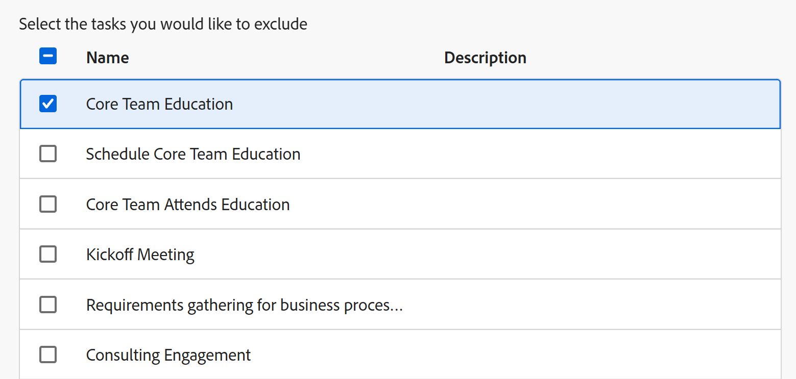

# プロジェクトをテンプレートとして保存

<!--Audited: 6/2025-->

<!--

(NOTE: Keep this the way it is in the Managing Projects area because the functionality in the UI is "Save as template" at the project level, so users see that in the UI; there is another article that this links to which is more in depth (step-by-step). This functionality needs to stay in both projects AND templates areas.)

-->

<!--

The highlighted information on this page refers to functionality not yet generally available. It is available only in the Preview environment for all customers. The same features will also be available in the Production environment for all customers after a week from the Preview release.     

For more information, see [Interface modernization](/help/quicksilver/product-announcements/product-releases/interface-modernization/interface-modernization.md). 

-->

プロジェクトが将来再び発生することが決定した場合は、その既存のプロジェクトからテンプレートを作成できます。次に、テンプレートを再度使用して、同様の情報を含む可能性がある、または既存のプロジェクトと同じタイムラインや割り当てを共有する可能性のある今後のプロジェクトを作成できます。

## アクセス要件

+++ 展開すると、この記事の機能のアクセス要件が表示されます。 

<table style="table-layout:auto"> 
 <col> 
 <col> 
 <tbody> 
  <tr> 
   <td role="rowheader">Adobe Workfront パッケージ</td> 
   <td> 
任意
 </td> 
  </tr> 
  <tr> 
   <td role="rowheader">Adobe Workfront プラン</td> 
   <td> 
標準

   
プラン
 
   </td> 
  </tr> 
  <tr> 
   <td role="rowheader">アクセスレベル設定</td> 
   <td> 
テンプレートへの編集アクセス
 /td&gt; 
  </tr> 
  <tr> 
   <td role="rowheader">オブジェクト権限</td> 
   <td> 
プロジェクトに対する表示権限またはそれ以上の権限 
 
プロジェクトをテンプレートとして保存した後、テンプレートに対する管理権限を取得します。
 </td> 
  </tr> 
 </tbody> 
</table>

詳しくは、[Workfront ドキュメントのアクセス要件](/help/quicksilver/administration-and-setup/add-users/access-levels-and-object-permissions/access-level-requirements-in-documentation.md)を参照してください。

+++

<!--Old:

<table style="table-layout:auto"> 
 <col> 
 <col> 
 <tbody> 
  <tr> 
   <td role="rowheader">Adobe Workfront plan</td> 
   <td> 
Any 
 </td> 
  </tr> 
  <tr> 
   <td role="rowheader">Adobe Workfront license*</td> 
   <td> 
New: Standard 

   Or 
   
Current: Plan 
 
   </td> 
  </tr> 
  <tr> 
   <td role="rowheader">Access level configurations</td> 
   <td> 
Edit access to Templates
 /td> 
  </tr> 
  <tr> 
   <td role="rowheader">Object permissions</td> 
   <td> 
View or higher permissions to a project 
 
You obtain Manage permissions to the template after you save the project as a template
 </td> 
  </tr> 
 </tbody> 
</table>-->

## プロジェクトをテンプレートとして保存

<!--
Saving a project as a template differs in the Production and the Preview environments. 

### Save a project as a template in the Production environment

1. Go to the project that you want to save as a template. 
1. Click the **More** menu , then **Save as Template**. 
1. Specify the following information for the template:

   <table style="table-layout:auto"> 
    <col> 
    <col> 
    <tbody> 
     <tr> 
      <td role="rowheader">Name</td> 
      <td>Specify a name for the template.</td> 
     </tr> 
     <tr> 
      <td role="rowheader">Description</td> 
      <td>Provide a description for the template.</td> 
     </tr> 
     <tr> 
      <td role="rowheader">Is Active</td> 
      <td> 
Select from the following options:
 
       <ul> 
        <li> 
<strong>Yes</strong>: Other users can find the template and attach it to projects.
 </li> 
        <li><strong>No</strong>: Other users cannot find the template and cannot attach it to projects.</li> 
       </ul> </td> 
     </tr> 
     <tr> 
      <td role="rowheader">Custom Forms</td> 
      <td>Use the drop-down list to select any custom forms to attach to the template. If any custom forms have already been associated with the project, all of the data fields from those custom forms are displayed. You can include up to 10 custom forms on a single template.</td> 
     </tr> 
    </tbody> 
   </table>

1. Click **Manage Forms** to remove or reorder the forms. For information about how to remove and reorder custom forms on the template, see [Custom forms](../../../administration-and-setup/customize-workfront/create-manage-custom-forms/create-and-manage-custom-forms.md).

   

1. Click **Next Step.**
1. In the **Options** section, select the checkbox beside any information you want to clear from the template.

   

1. Click **Next Step.**
1. In the **Exclude** section, select any tasks that you want to exclude from the project.

   

1. Click **Finish and Save Template.**

   Your template now appears in the list of available templates and can either be attached to an existing project or used to create a new one.

### Save a project as a template in the Preview environment

-->

1. テンプレートとして保存するプロジェクトに移動します。
1. **その他** メニュー  をクリックしてから、**テンプレートとして保存** をクリックします。
1. **テンプレートとして保存** セクションで、テンプレートの次の情報を指定します。

   <table style="table-layout:auto"> 
    <col> 
    <col> 
    <tbody> 
     <tr> 
      <td role="rowheader">テンプレート名</td> 
      <td>テンプレートの名前を指定します。</td> 
     </tr> 
     <tr> 
      <td role="rowheader">説明</td> 
      <td>テンプレートの説明を入力します。</td> 
     </tr> 
     <tr> 
      <td role="rowheader">アクティブ</td> 
      <td> 
次のオプションから選択します。
 
       <ul> 
        <li> 
<strong>はい</strong>：他のユーザーがテンプレートを見つけてプロジェクトに添付することができます。
 </li> 
        <li><strong>いいえ</strong>：他のユーザーはテンプレートを見つけることができず、プロジェクトに添付できません。</li> 
       </ul> </td> 
     </tr> 
     <tr> 
      <td role="rowheader">カスタムフォーム</td> 
      <td>ドロップダウンリストを使用して、テンプレートに添付するカスタムフォームを選択します。カスタムフォームがすでにプロジェクトに関連付けられている場合は、それらのカスタムフォームのデータフィールドがすべて表示されます。 1 つのテンプレートに最大 10 個のカスタムフォームを含めることができます。</td> 
     </tr> 
    </tbody> 
   </table>

1. 左側のパネルで **カスタムForms** をクリックして、フォームを削除または並べ替えます。

   フォームを並べ替えるには、フォームを正しい順序でドラッグ&amp;ドロップします。
フォームを削除するには、フォームを選択して「**削除**」をクリックします。 **キャンセル** をクリックして、選択したフォームを削除します。

   

1. 必要に応じて、添付されたカスタムフォームの情報を更新します。 情報がテンプレートに転送されます。

1. 左側のパネルで **オプション** をクリックし、テンプレートに転送する情報の横にあるチェックボックスを選択します。 選択解除された項目は、テンプレートに転送されません。 デフォルトでは、すべてのオプションの選択は解除されています。

   

1. 左側のパネルで **除外** をクリックし、プロジェクトから除外するタスクを選択します。 デフォルトでは、すべてのタスクの選択は解除されています。

   

1. 画面の右上隅にある「**終了してテンプレートを保存**」をクリックします。

   テンプレートが使用可能なテンプレートのリストに表示され、既存のプロジェクトに添付することも、新しいプロジェクトの作成に使用することもできます。

