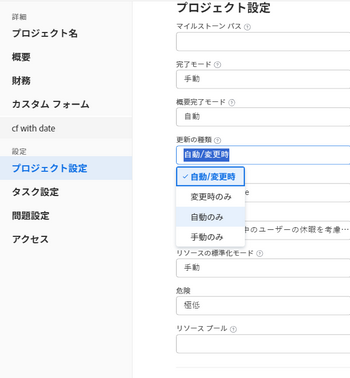

# プロジェクトの更新タイプの選択

プロジェクトの更新タイプを選択することにより、プロジェクトのタイムラインに加えた変更が親タスクまたはプロジェクトに保存される頻度を制御できます。

プロジェクトのタイムラインが更新されると、プロジェクト、そのタスク、またはタイムラインが依存する別のプロジェクトに対して行われた変更に基づいて、プロジェクトのタイムラインが再計算されます。

例えば、プロジェクトのタスクに対して次の変更を加えると、プロジェクトのタイムラインに対する更新がトリガーされます。

* タスクの日付を更新
* タスクの先行関係を変更
* 親子関係を変更し、タスクの制約や期間タイプを変更するだけでなく、割り当てを追加または削除します。

## アクセス要件

<!-- drafted for P&P:

<table style="table-layout:auto"> 
 <col> 
 <col> 
 <tbody> 
  <tr> 
   <td role="rowheader">Adobe Workfront plan*</td> 
   <td> 
Any 
 </td> 
  </tr> 
  <tr> 
   <td role="rowheader">Adobe Workfront license*</td> 
   <td> 
Current license: Standard
 
   Or
   
Legacy license: Plan 
 </td> 
  </tr> 
  <tr> 
   <td role="rowheader">Access level configurations*</td> 
   <td> 
Edit access to Projects
 
<b>NOTE</b>
   
   If you still don't have access, ask your Workfront administrator if they set additional restrictions in your access level. For information on how a Workfront administrator can modify your access level, see <a href="../../../administration-and-setup/add-users/configure-and-grant-access/create-modify-access-levels.md" class="MCXref xref">Create or modify custom access levels</a>.
 </td> 
  </tr> 
  <tr> 
   <td role="rowheader">Object permissions</td> 
   <td> 
Manage permissions to a project
 
For information on requesting additional access, see <a href="../../../workfront-basics/grant-and-request-access-to-objects/request-access.md" class="MCXref xref">Request access to objects </a>.
 </td> 
  </tr> 
 </tbody> 
</table>
-->

この記事の手順を実行するには、次のアクセス権が必要です。

<table style="table-layout:auto"> 
 <col> 
 <col> 
 <tbody> 
  <tr> 
   <td role="rowheader">Adobe Workfront プラン*</td> 
   <td> 
任意 
 </td> 
  </tr> 
  <tr> 
   <td role="rowheader">Adobe Workfront ライセンス*</td> 
   <td> 
プラン 
 </td> 
  </tr> 
  <tr> 
   <td role="rowheader">アクセスレベル設定*</td> 
   <td> 
プロジェクトへのアクセスを編集
 
<b>メモ</b>

まだアクセス権がない場合は、Workfront 管理者に問い合わせて、アクセスレベルに追加の制限が設定されているかどうかを確認してください。Workfront 管理者がアクセスレベルを変更する方法について詳しくは、<a href="../../../administration-and-setup/add-users/configure-and-grant-access/create-modify-access-levels.md" class="MCXref xref">カスタムアクセスレベルの作成または変更</a>を参照してください。
 </td>
</tr> 
  <tr> 
   <td role="rowheader">オブジェクト権限</td> 
   <td> 
プロジェクトに対して権限を管理
 
追加のアクセス権のリクエストについて詳しくは、<a href="../../../workfront-basics/grant-and-request-access-to-objects/request-access.md" class="MCXref xref">オブジェクトへのアクセス権のリクエスト</a>を参照してください。
 </td> 
  </tr> 
 </tbody> 
</table>

&#42;保有するプラン、ライセンスタイプ、アクセス権を確認するには、Workfront 管理者に問い合わせてください。

## プロジェクトの更新タイプを更新

タスクが更新されると、その親オブジェクト（親タスクまたはプロジェクト）が更新タイプで指定された時間に更新されます。プロジェクトの更新タイプを指定するには：

1. 更新タイプを指定するプロジェクトに移動します。
1. プロジェクト名の横にある「その他」メニュー  をクリックし、「**編集**」をクリックします。

1. 「**プロジェクト****設定**」をクリックします。

   

1. 「**更新タイプ**」フィールドで、変更があったときに Workfront がプロジェクトのタイムラインを自動的に毎日計算するか、またはプロジェクトマネージャーが手動で計算するかを選択します。

   以下のリストのオプションから選択します。 

   >[!IMPORTANT]
   >
   >プロジェクトのタイムラインが 15 年を超える場合、Workfront は自動的にも変更時にもタイムラインを計算しません。15 年を超えるプロジェクトの更新タイプは、常に手動です。

   * **自動/変更時：**&#x200B;これはデフォルト設定です。プロジェクトのタイムラインは、プロジェクト内またはタイムラインが依存する別のプロジェクト内で変更が発生するたびに更新されます。また、プロジェクトのタイムラインは毎晩更新されます。\
     これは、プロジェクトタイムラインが常に最新であることが保証されるので、推奨される設定です。

     タスクまたはプロジェクトを更新し、タイムラインの再計算をトリガーすると、利用可能なすべての日付が直ちに表示され、作業を続行できます。タスクが 100 を超えるプロジェクトでは、計算に時間がかかる日付は淡色表示になります。

     

     これは、再計算がまだ完了しておらず、日付が変更される可能性があることを示しています。

   * **変更時のみ：**&#x200B;プロジェクトのタイムラインは、プロジェクト内またはタイムラインが依存する別のプロジェクト内で変更が発生するたびに更新されます。スケジュールされた更新は行われません。\
     システムのパフォーマンスが気になる場合や、プロジェクト内またはタイムラインが依存する他のプロジェクト内で変更がほとんど発生しない場合は、このオプションを選択するのがよいです。

   * **自動のみ**：プロジェクトタイムラインは毎晩更新されます。変更を加えてもすぐには更新されません。\
     システムのパフォーマンスが気になる場合や、プロジェクト内またはタイムラインが依存する他のプロジェクト内で毎日多くの変更が発生する場合は、このオプションを選択するのがよいです。

     >[!NOTE]
     >
     >計画中ステータスの場合、プロジェクトは毎晩自動的には再計算されません。変更時にのみ再計算されます。

   * **手動のみ：**&#x200B;プロジェクトのタイムラインは、[プロジェクトタイムラインを再計算](../../../manage-work/projects/manage-projects/recalculate-project-timeline.md)の記事の「手動再計算」の節で説明されているように、「**タイムラインを再計算**」オプションを選択した場合にのみ更新されます。\
     プロジェクトに一度に多くの変更を加え、個々を変更した後ではなくすべての変更が行われた後でタイムラインの再計算を実行する場合は、このオプションを選択できます。

1. 「**保存**」をクリックします。
