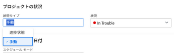

# プロジェクトの状況タイプを設定

プロジェクトマネージャーは、プロジェクトの状況タイプを更新して、プロジェクトの状況の計算方法を決定できます。プロジェクト状況は、プロジェクトの進行状況を視覚的に表したものです。

## アクセス要件

この記事の手順を実行するには、次のアクセス権が必要です。

<table style="table-layout:auto"> 
 <col> 
 <col> 
 <tbody> 
  <tr> 
   <td role="rowheader">Adobe Workfront プラン*</td> 
   <td> 
任意
 </td> 
  </tr> 
  <tr> 
   <td role="rowheader">Adobe Workfront ライセンス*</td> 
   <td> 
プラン 
 </td> 
  </tr> 
  <tr> 
   <td role="rowheader">アクセスレベル設定*</td> 
   <td> 
プロジェクトへのアクセスを編集
 
メモ：まだアクセス権がない場合は、アクセスレベルに追加の制限が設定されていないかどうか Workfront 管理者にお問い合わせください。プロジェクトへのアクセスについて詳しくは、<a href="../../../administration-and-setup/add-users/configure-and-grant-access/grant-access-projects.md" class="MCXref xref">プロジェクトへのアクセスの許可</a>を参照してください。Workfront 管理者がアクセスレベルを変更する方法について詳しくは、<a href="../../../administration-and-setup/add-users/configure-and-grant-access/create-modify-access-levels.md" class="MCXref xref">カスタムアクセスレベルの作成または変更</a>を参照してください。 
 </td> 
  </tr> 
  <tr> 
   <td role="rowheader">オブジェクト権限</td> 
   <td> 
    <ul> 
     <li> 
プロジェクトに参加権限でプロジェクト詳細エリアで状況タイプを編集 
 </li> 
     <li> 
プロジェクトに対する権限を管理して、「プロジェクトを編集」ボックスで状況タイプを編集します
 </li> 
    </ul> 
 プロジェクト権限について詳しくは、<a href="../../../workfront-basics/grant-and-request-access-to-objects/share-a-project.md" class="MCXref xref">Adobe Workfront でのプロジェクトの共有</a>を参照してください。
 
追加のアクセス権のリクエストについて詳しくは、<a href="../../../workfront-basics/grant-and-request-access-to-objects/request-access.md" class="MCXref xref">オブジェクトへのアクセス権のリクエスト</a>を参照してください。
 </td> 
  </tr> 
 </tbody> 
</table>

&#42;保有するプラン、ライセンスタイプ、アクセス権を確認するには、Workfront 管理者に問い合わせてください。

## プロジェクトの状況タイプの設定

1. 状況タイプを更新するプロジェクトに移動します。
1. 次のいずれかの操作を実行します。

   * プロジェクト名の右にある&#x200B;**その他**&#x200B;メニュー 、「**編集**」の順にクリックします。
   * 左側のパネルにある「**プロジェクト詳細**」をクリックします。

   

1. 「**状況タイプ**」フィールドで、次のいずれかを選択します。

   * **手動：** プロジェクト所有者が、プロジェクトに対して手動で状況を設定します。

     この場合、プロジェクト所有者は、プロジェクトヘッダーまたは「プロジェクト詳細」セクションで、プロジェクトの状況を更新できます。

   * **進捗ステータス：** Workfront は、プロジェクトの進捗ステータスに基づいて状況を設定します。進捗ステータスの計算方法について詳しくは、[プロジェクトの進捗ステータスの概要](../../../manage-work/projects/planning-a-project/project-progress-status.md)を参照してください。

1. 「プロジェクトを編集」ボックスの状況タイプを変更する場合は「**保存**」をクリックします。

   「プロジェクト詳細」セクションで状況タイプを変更する場合は「**変更を保存**」をクリックします。

 
