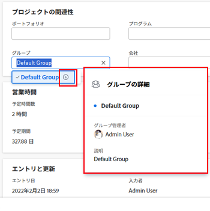

# プロジェクトの概要エリアで情報を管理する

<!--

(NOTE: some information in here is duplicated in Edit projects. If you need to update one of the fields in this area, do it in both places.)

-->

「プロジェクトの詳細」セクションの概要エリアにアクセスして、プロジェクトの情報を表示または編集できます。このエリアで表示または編集できるフィールドは限られています。プロジェクトのすべての情報の編集について詳しくは、[プロジェクトの編集](../../../manage-work/projects/manage-projects/edit-projects.md)を参照してください。

## アクセス要件

この記事の手順を実行するには、次のアクセス権が必要です。

<table style="table-layout:auto"> 
 <col> 
 <col> 
 <tbody> 
  <tr> 
   <td role="rowheader">Adobe Workfront プラン*</td> 
   <td> 
任意
 </td> 
  </tr> 
  <tr> 
   <td role="rowheader"> 
Adobe Workfront ライセンス*
 </td> 
   <td> 
レビュー以上
 </td> 
  </tr> 
  <tr> 
   <td role="rowheader">アクセスレベル設定*</td> 
   <td> 
プロジェクトへの表示アクセス権またはそれ以上の権限 

まだアクセス権がない場合は、Workfront 管理者に問い合わせて、アクセスレベルに追加の制限が設定されているかどうかを確認してください。Workfront 管理者がアクセスレベルを変更する方法について詳しくは、<a href="../../../administration-and-setup/add-users/configure-and-grant-access/create-modify-access-levels.md" class="MCXref xref">カスタムアクセスレベルの作成または変更</a>を参照してください。
 </td> 
  </tr> 
  <tr> 
   <td role="rowheader">オブジェクト権限</td> 
   <td> 
プロジェクトに関する限定的な情報を表示するためのプロジェクトへの表示アクセス権
 
   
プロジェクトに関する情報を編集するためのプロジェクトへの管理アクセス権
 
追加のアクセス権のリクエストについて詳しくは、<a href="../../../workfront-basics/grant-and-request-access-to-objects/request-access.md" class="MCXref xref">オブジェクトへのアクセス権のリクエスト</a>を参照してください。
 </td> 
  </tr> 
 </tbody> 
</table>

&#42;保有するプラン、ライセンスタイプ、アクセス権を確認するには、Workfront 管理者に問い合わせてください。

## 「概要」セクションへのアクセス

1. 「概要」セクションを表示するプロジェクトに移動します。
1. 左側のパネルの「**プロジェクト詳細**」をクリックします。
1. 「**概要**」セクションはプロジェクトの詳細の一部として最初に表示され、デフォルトで展開されます。

   または

   詳細セクションの右上隅にある&#x200B;**編集**&#x200B;アイコン  をクリックし、「**概要**」をクリックします。概要エリアが開き、編集できます。

   >[!NOTE]
   >
   >Workfront 管理者がレイアウトテンプレートを設定した方法によっては、「概要」セクションが最初に表示されない場合があり、その場合は折りたたまれています。詳しくは、[レイアウトテンプレートを使用して詳細ビューをカスタマイズ](../../../administration-and-setup/customize-workfront/use-layout-templates/customize-details-view-layout-template.md)を参照してください。

1. （条件付き）プロジェクト上で更新する必要があるが、このセクションに表示されない特定のフィールドがある場合、プロジェクト名の横にある&#x200B;**その他メニュー**  をクリックし、「**編集**」をクリックして、さらにプロジェクトフィールドを表示します。

   プロジェクトの編集について詳しくは、[プロジェクトの編集](../../../manage-work/projects/manage-projects/edit-projects.md)を参照してください。

1. 「**概要**」セクションに表示される以下の表のフィールドを編集または確認します。\
   編集可能なフィールドを編集するには、フィールドをクリックするか、「**+ 追加**」をクリックして空のフィールドに情報を追加します。

   >[!NOTE]
   >
   >Workfront 管理者がレイアウトテンプレートを設定した方法によっては、すべてのフィールドが表示されない場合があります。詳しくは、[レイアウトテンプレートを使用して詳細ビューをカスタマイズ](../../../administration-and-setup/customize-workfront/use-layout-templates/customize-details-view-layout-template.md)を参照してください。

   <table style="table-layout:auto"> 
    <col> 
    <col> 
    <tbody> 
    <tr> 
      <td role="rowheader"><b>フィールド</b></td> 
      <td><b>説明</b> </td> 
     </tr>
     <tr> 
      <td role="rowheader">説明</td> 
      <td>このプロジェクトの目的を説明します。 </td> 
     </tr> 
     <tr> 
      <td role="rowheader">URL</td> 
      <td>このフィールドに URL を挿入します。Workfront URL などの URL を指定できます。 </td> 
     </tr> 
     <tr> 
      <td role="rowheader">優先度</td> 
      <td>プロジェクトの指定された優先度または重要度として機能します。</td> 
     </tr> 
     <tr> 
      <td role="rowheader">ステータス</td> 
      <td> 
プロジェクトのステータス。 
 
ヒント：すべてのタスクとイシューが完了していない限り、プロジェクトを完了することはできません。プロジェクトの完了モードが自動に設定されている場合は、手動でプロジェクトを完了することはできません。 
 </td> 
     </tr> 
     <tr> 
      <td role="rowheader">状況タイプ</td> 
      <td>管理者がプロジェクトの条件を設定するか、Workfront が設定するかを決定します。プロジェクト条件について詳しくは、<a href="../../../manage-work/projects/manage-projects/project-condition-and-condition-type.md" class="MCXref xref">プロジェクト条件と条件タイプの概要</a>の記事を参照してください。</td> 
     </tr> 
     <tr> 
      <td role="rowheader">スケジュールモード</td> 
      <td>プロジェクトのスケジュール方法を設定します。例えば、プロジェクトが「開始日」からスケジュールされているか、「完了日」からスケジュールされているかなどです。 </td> 
     </tr> 
     <tr> 
      <td role="rowheader">予定開始日時</td> 
      <td> プロジェクトを開始する予定の日時。これは、プロジェクトが開始日からスケジュールされる際に、プロジェクトマネージャーが手動で設定します。Workfront は、プロジェクトのタスクの期間に基づいて、プロジェクトが完了日からスケジュールされる際に、この日付を自動的に設定します。</td> 
     </tr> 
     <tr> 
      <td role="rowheader">予定完了日時</td> 
      <td> プロジェクトを完了する予定の日時。これは、プロジェクトが完了日からスケジュールされる際に、プロジェクトマネージャーが手動で設定します。Workfront は、プロジェクトのタスクの期間に基づいて、プロジェクトが開始日からスケジュールされる際に、この日付を自動的に設定します。 </td> 
     </tr> 
     <tr> 
      <td role="rowheader">ポートフォリオ</td> 
      <td>プロジェクトに関連付けられたポートフォリオ。ポートフォリオをプロジェクトに追加する前に、ポートフォリオを作成する必要があります。 </td> 
     </tr> 
     <tr> 
      <td role="rowheader">プログラム</td> 
      <td>プロジェクトのポートフォリオに関連付けられたプログラム。プログラムをプロジェクトに追加する前に、プログラムを作成する必要があります。 </td> 
     </tr> 
     <tr> 
      <td role="rowheader">グループ</td> 
      <td> 
プロジェクトに関連付けられたグループ。
 
適切なグループを選択していることを確認するには、グループにカーソルを移動して、その横に表示される、情報アイコン  をクリックします。グループの上位のグループの階層や管理者など、グループに関する情報が一覧表示されるツールチップが表示されます。
 
  
 
      別のグループを指定しない限り、デフォルトでは、次のグループの 1 つがプロジェクトの作成時に自動的にプロジェクトに関連付けられます。
        <ul> 
         <li> 
プロジェクトをプロジェクトエリアから作成すると、プロジェクト作成者のホームグループがプロジェクトに関連付けられます。 
 </li> 
         <li> 
設定エリアのグループのメインページからプロジェクトを作成すると、そのグループは自動的にプロジェクトに関連付けられます。 
 </li> 
        </ul> 
 </td> 
     </tr> 
     <tr> 
      <td role="rowheader">会社</td> 
      <td>プロジェクトに関連付けられた会社。 </td> 
     </tr> 
     <tr> 
      <td role="rowheader">プロジェクト所有者 </td> 
      <td>これはプロジェクトの所有者です。 </td> 
     </tr> 
     <tr> 
      <td role="rowheader">プロジェクトスポンサー</td> 
      <td> 
これがプロジェクトの主な関係者です。これは通常、プロジェクトを監督および推進する幹部、または予算責任を負う人物です。
 </td> 
     </tr> 
     <tr> 
      <td role="rowheader">リソース管理者</td> 
      <td> 
これは、プロジェクト内のユーザーリソースを管理できる人物です。 
 
リソースマネージャーの詳細については、<a href="../../../manage-work/projects/planning-a-project/designate-resource-managers-for-projects-and-templates.md" class="MCXref xref">プロジェクトまたはテンプレートに対するリソースマネージャの指定</a>を参照してください。
 </td> 
     </tr> 
    </tbody> 
   </table>

   >[!TIP]
   >
   >「プロジェクト所有者」、「プロジェクトスポンサー」、「リソースマネージャー」の各フィールドを更新する際には、アバター、ユーザーの主要な役割またはメールアドレスに注意して、同じ名前のユーザーを区別します。
   >
   >ユーザーを追加したときに表示するには、少なくとも 1 つの担当業務に関連付ける必要があります。
   > 
   >ユーザーがユーザーのメールを表示するには、アクセスレベルで、連絡情報の表示の設定を有効にしておく必要があります。詳しくは、[ユーザーへのアクセス権の付与](../../../administration-and-setup/add-users/configure-and-grant-access/grant-access-other-users.md)を参照してください。

1. 「概要」セクションの次のフィールドをレビューします。次のフィールドは編集できません。

   | フィールド | 説明 |
   |---|---|
   | 参照番号 | これは自動生成されたフィールドで、プロジェクトごとに常に一意の値を持ちます。 |
   | 見込み開始日 | これは、完了した作業と残りの作業に基づいて、作業を開始する「リアルタイム」の日付です。 |
   | 見込み完了日 | 完了したタスクの進捗状況と、「新規」または「進行中」のステータスのタスクの進捗状況の更新に基づいて、プロジェクトが完了する「リアルタイム」の日付です。 |
   | 予定時間数 | プロジェクトで予定されている時間。この時間は、各タスクの予定時間の合計です。 |
   | 実際の時間数 | プロジェクトに記録された時間。これらの時間は、プロジェクト、タスク、またはプロジェクトのイシューに関する記録された時間の合計です。 |
   | 予定期間 | プロジェクトの最も早いタスクの予定開始日と最も遅いタスクの予定完了日の間の期間に基づいて、プロジェクトが実行する期間を示します。 |
   | 実際の期間 | プロジェクトのタスクの最も早い実際の開始日から最も遅い実際の完了日までの期間に基づいて、プロジェクトが実際に実行する期間を示します。 |
   | エントリ日 | プロジェクトが作成された日時。 |
   | 入力者 | プロジェクトを作成したユーザーの名前。 |
   | 最終更新日 | プロジェクトが最後に更新された日時。 |
   | 最終更新者 | プロジェクトを最後に更新したユーザーの名前。 |
   | テンプレート |   |

1. 会社が Adobe Workfront Scenario Planner の追加ライセンスを購入し、プロジェクトにリンクされたイニシアチブから公開された情報がある場合は、シナリオプランナーエリアで次のイニシアチブ情報をレビューします。

   <table style="table-layout:auto"> 
    <col> 
    <col> 
    <tbody> 
     <tr> 
      <td role="rowheader"><b>フィールド</b></td> 
      <td><b>説明</b> </td> 
     </tr>
     <tr> 
      <td role="rowheader">イニシアチブ期間 </td> 
      <td>プロジェクトがイニシアチブにリンクされている場合の、対応するイニシアチブの期間。このフィールドは編集できません。 </td> 
     </tr> 
     <tr> 
      <td role="rowheader">最終公開日 </td> 
      <td>対応するイニシアチブからプロジェクトが最後に公開された日付。 </td> 
     </tr> 
     <tr> 
      <td role="rowheader">イニシアチブ開始日 </td> 
      <td>プロジェクトがイニシアチブにリンクされる、イニシアチブの開始月の初日。 </td> 
     </tr> 
     <tr> 
      <td role="rowheader">イニシアチブ終了日 </td> 
      <td>プロジェクトがイニシアチブにリンクされる、イニシアチブの終了月の最終日。 </td> 
     </tr> 
     <tr> 
      <td role="rowheader">FTE と時間数のイニシアチブ担当業務 </td> 
      <td> 
関連付けられている担当業務とそのイニシアチブへの時間割り当てに関する情報。これには以下が含まれます。
 
       <ul> 
        <li>担当業務名</li> 
        <li>FTE の数</li> 
        <li> 
すべての FTE の時間数
 
時間数または FTE 数を使用して、プランまたはイニシアチブに必要な担当業務の量を見積もることができます。 
 
詳しくは、<a href="../../../scenario-planner/create-and-edit-plans.md" class="MCXref xref">シナリオプランナでのプランの作成と編集</a>を参照してください。 
 </li> 
       </ul> 
ヒント：イニシアチブ内の月ごとに担当業務の数が異なる場合、このフィールドには、イニシアチブに必要な担当業務の最大数が表示されます。例えば、1 月には 1 名のコンサルタントが、2 月には 2 名のコンサルタントが必要な場合、この列にはすべての月に対して、2 FTE と、2 FE に対応する時間数が表示されます。 
 </td> 
     </tr> 
    </tbody> 
   </table>

   プロジェクトとイニシアチブとのリンクについて詳しくは、[シナリオプランナーでイニシアチブを公開して、プロジェクトをアップデートまたは作成](../../../scenario-planner/publish-scenarios-update-projects.md)を参照してください。

1. 「**変更を保存**」をクリックします。
