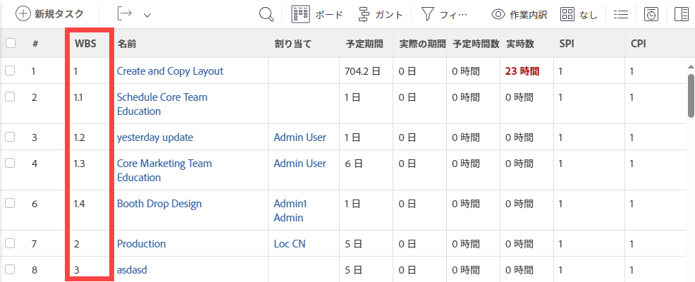

# プロジェクト内の作業分類構造の決定

プロジェクトの作業分類構造 (WBS) の定義とは、プロジェクト計画の最終的な概要を示す一連のアクティビティです。 WBS は、プロジェクトの結果を管理可能な作業要素に分割し、マイルストーンを定義し、作業割り当てを整理するために使用できます。

プロジェクトの Work Breakdown Structure を構築するには、プロジェクトへの編集アクセス権を持つ Plan ライセンスが必要です。 WBS の構築中に実行するアクティビティの数に応じて、Adobe Workfrontの他の領域への追加のアクセスが必要になる場合があります。

プロジェクトチームのユーザーへのトリガー通知を避けるため、作業分類構造を変更する際は、プロジェクトのステータスを Planning のままにすることをお勧めします。

## プロジェクトの成果物を定義

プロジェクトの目的は、内部および外部の関係者に具体的な成果物を提供することです。 プロジェクトの成果物は、プロジェクトを完了することで達成したい成果です。 結果は、ほとんど常に少なくとも 1 つの成果物に関連付けられ、すべての成果物はプロジェクトに関連付けられる必要があります。

プロジェクトの成果物は、消費財、知的生産（報告書など）、サービスのいずれかです。 例えば、プロジェクトの範囲が家を建てる場合、成果物の一部には次のものが含まれます。

* 建築計画の作成
* 配管工事の完了
* 電気工事
* 基礎の流れ
* 骨組み作業
* 家の売り出しを終えた。

サイズと範囲に応じて、プロジェクトは複数の成果物で構成できます。

成果物を特定したら、タスクに分割し始めることができます。 タスクとは、プロジェクトの全体的な結果を提供するために実現する出力です。 タスクを定義する際には、次のパラメーターを考慮に入れます。

* 完了に必要な時間。
* 作業を完了するために予算が必要です。
* 作業を完了するために必要なリソースです。
* タスクの論理タイムラインに基づくリソースのスケジュール。

タスクを定義する際は、1 つのタスクに対して多くの作業を計画し過ぎないようにしてください。 タスクに必要な作業時間が 40 時間（通常の 1 週間の作業）を超える場合、サブタスクでその作業量を分類する必要が生じる場合があります。 すべてのサブタスクを完了すると、メインタスクが完了します。

Workfrontで WBS の結果と成果物を定義するには、次のアクティビティを実行して、プロジェクトタスクの階層ビューを作成することをお勧めします。

* まだ作成していない場合は、新しいプロジェクトを作成します。\
  プロジェクトの作成について詳しくは、「 [プロジェクトの作成](../../../manage-work/projects/create-projects/create-project.md).

* 各結果と成果物の完了に必要なすべてのアクション項目のタスクを作成します。\
  タスクの作成について詳しくは、 [プロジェクトでのタスクの作成](../../../manage-work/tasks/create-tasks/create-tasks-in-project.md) .

* 先ほど作成したタスクから、主な成果であるタスクを特定し、マイルストーンに関連付けます。\
  マイルストーンタスクの作成について詳しくは、「 [マイルストーンパスを作成する](../../../administration-and-setup/customize-workfront/configure-approval-milestone-processes/create-milestone-path.md) および [タスクへのマイルストーンの関連付け](../../../manage-work/tasks/manage-tasks/associate-milestones-with-tasks.md).

* スコープが大きすぎるタスクをサブタスクに分類します。 成果物を定義する親に関連付けます。\
  サブタスクの作成について詳しくは、 [サブタスクを作成](../../../manage-work/tasks/create-tasks/create-subtasks.md).

* サブタスク間およびマイルストーン間の依存関係を特定します。\
  依存関係では、タスクの開始は、別のタスクまたはタスクのグループの完了に依存します。\
  タスクの依存関係について詳しくは、記事を参照してください [タスクの先行タスクの概要](../../../manage-work/tasks/use-prdcssrs/predecessors-overview.md) および [タスクリストに先行タスク関係を作成する](../../../manage-work/tasks/use-prdcssrs/create-predecessors-on-task-list.md).

* プロジェクトの有効期間中の任意の時点で、承認とレビューが必要かどうかを判断します。 このニーズに対処するための承認プロセスを作成します。\
  承認について詳しくは、 [作業項目の承認プロセスの作成](../../../administration-and-setup/customize-workfront/configure-approval-milestone-processes/create-approval-processes.md).

## 作業スケジュールおよびスケジュール制約の推定

プロジェクトの基本的なマイルストーンとタスク構造を作成したら、タスクの制約と期間を定義することで、プロジェクト全体の完了に要する時間を見積もることができます。

次の点に注意してください。

* タスクの制約は、タスクの作業を開始または終了するタイミングを定義します。

  タスク制約の定義について詳しくは、この記事を参照してください。 [タスク制約の概要](../../../manage-work/tasks/task-constraints/task-constraint-overview.md).

* タスクの期間とは、タスクを完了するのに使用できる期間です。 期間の見積もり時には、遅延の可能性を考慮した値を入力する必要が生じる場合があります。 同様のプロジェクトが過去に完了している場合は、この値を設定する場所を知っているかもしれません。

  期間は推定値なので、天気、停電、サプライヤーの問題、その他の予期しないイベントなど、タスクに影響を与える可能性のある要因を考慮するために、必ず楽観的な時間値を設定してください。 また、関連する先行タスクと依存タスクが存在するかどうか、および作業に制約を課し、タスクの完了に影響を与える方法を検討してください。

  タスクの「期間の種類」に応じて、プロジェクトの有効期間中にタスクの期間を変更できますが、これはプロジェクトのタイムラインにも影響します。 タスクの期間について詳しくは、 [タスクの期間と期間のタイプの概要](../../../manage-work/tasks/taskdurtn/task-duration-and-duration-type.md) .

## タスクを割り当て

各タスクの期間と制約を定義したら、誰が作業を完了するのに必要な時間とスキルを持っているかを判断できます。 Workfrontでは、次のエンティティにタスクを割り当てることができます。

* ユーザー\
  タスクに割り当てることができるのは、プランナーまたは作業者のアクセスレベルを持つユーザーのみです。 リクエスターとレビュー担当者にタスクを割り当てることはできますが、タスクを完了することはできません。 このため、タスクを割り当てることはお勧めしません。

  アクセスレベルと、Workfrontオブジェクトでユーザーが実行できる操作を定義する方法について詳しくは、 [アクセスレベルの概要](../../../administration-and-setup/add-users/access-levels-and-object-permissions/access-levels-overview.md).

* 担当業務
* チーム

タスクの割り当てについて詳しくは、 [タスクを割り当て](../../../manage-work/tasks/assign-tasks/assign-tasks-1.md) 」セクションに入力します。

## リソースの管理

Workfrontでのリソース管理を使用すると、プロジェクトを完了するのに十分なスタッフがいるかどうかを判断できます。 ユーザーがプロジェクトに追加されると、Workfrontに各ユーザーの使用率が表示されます。 リソースマネージャは、プロジェクトの期間中に、その人が他のプロジェクトに割り当てられた合計時間数を確認できます。

>[!NOTE]
>
>プロジェクトのステータスが「計画」である限り、ユーザーに割り当てられたタスクはタスクリストに表示されません。

会計年度または四半期の初めに、特定の作業内訳構造を知らずに、複数のプロジェクトにわたって、より高いレベルでリソースを管理する必要が生じる場合があります。\
より高いレベルでのリソースの使用計画の詳細については、「 [リソース計画の概要](../../../resource-mgmt/resource-planning/get-started-resource-planning.md).

1 つのプロジェクトの作業分類構造を構築するコンテキストでリソースを管理し、各タスクを正しいリソースに割り当てる場合は、必ず実行する必要のある作業に対してリソースをスケジュールする準備が整います。\
リソースのスケジュール設定について詳しくは、 [ワークロードバランサー：記事インデックス](../../../resource-mgmt/workload-balancer/workload-balancer.md) 」セクションに入力します。

## プロジェクトの財務を見積もる

Workfrontは、各タスクの予定コストとプロジェクトの総コストを計算します。 タスクの予定コストには、タスクのすべての費用に加えて、タスクに割り当てられた従業員または役割のコストが含まれます。 タスク、役割、従業員の時間別レートは、タスク、役割、ユーザーの作成時に割り当てられます。

プロジェクトの財政状況の詳細については、「 [プロジェクトの財政](../../../manage-work/projects/project-finances/project-finances-overview.md) .

## プロジェクトの承認ポイントの決定

Workfrontで承認プロセスを作成すると、進行状況や潜在的な問題領域を監視するために、プロジェクトのレビューポイントを設定できます。 承認プロセスを通じて、プロジェクト所有者は、遅れているタスクと早いタスクを識別し、タスクのステータスを変更した監査記録を表示し、問題の解決方法や、問題が終了した日時など、問題の履歴を確認できます。 プロジェクトのレビュー時に、必要に応じて、プロジェクトの所有者は、プロジェクト計画を実行および更新する手順を決定できます。

承認について詳しくは、 [作業項目の承認プロセスの作成](../../../administration-and-setup/customize-workfront/configure-approval-milestone-processes/create-approval-processes.md)

## WBS を表示

プロジェクトの WBS を理解するには、次のタスク要素を表示します。

* タスクの順序とタイムライン（計画開始日と完了日、およびタスク期間）
* 先行依存関係
* 子と親の関係
* 割り当て

WBS を完了したら、プロジェクトレベルまたはレポートのタスクリストで表示できます。

* [WBS をタスクリストに表示する](#view-the-wbs-in-a-task-list)
* [WBS をタスクレポートに表示する](#view-the-wbs-in-a-task-report)

### WBS をタスクリストに表示する {#view-the-wbs-in-a-task-list}

タスクリストは、プロジェクトレベルで表示できます。

1. 作業分類構造を表示するプロジェクトに移動します。
1. を選択します。 **タスク** タブをクリックします。
1. （オプション）「 」を選択します。 **なし** （内） **グループ化** ドロップダウンメニュー。

   作業分類構造では、WBS 内のタスクのインデントは表示されません。

1. 次から： **表示** ドロップダウンメニューで、 **作業の内訳** 表示。

   選択したビューの 2 番目の列に、作業分類構造が表示されます。

   

### WBS をタスクレポートに表示する {#view-the-wbs-in-a-task-report}

次のいずれかの方法で、タスクレポートを作成し、タスクの WBS を表示できます。

* レポートに既存の [ 作業内訳構造 ] ビューを適用します。
* 任意のカスタムレポートに Work Breakdown Structure 列を追加します。

>[!TIP]
>
>タスクが属するプロジェクトを明確にするために、プロジェクトのグループ化を追加することをお勧めします。 タスクのインデントは、タスクレポートには表示されません。

レポートの作成について詳しくは、 [カスタムレポートの作成](../../../reports-and-dashboards/reports/creating-and-managing-reports/create-custom-report.md).

## プロジェクトの WBS をテンプレートとして保存する

先ほど作成した WBS と同様に、作業スケジュールに従う他のプロジェクトで作業する場合は、プロジェクトをテンプレートとして保存することができます。 テンプレートを使用すると、今後の関連プロジェクトを作成する際の時間と労力を節約できます。

組織の回転率が低い場合は、ユーザーの割り当てが行われてテンプレートが保存されるまで待つことを検討します。 プロジェクトをテンプレートとして保存するタイミングに関係なく、テンプレートを新しいプロジェクトにアタッチする際に、ユーザーの割り当てや特定のタスクを削除できます。

次の作業分類構造要素を、別のプロジェクトで使用するために、テンプレートに保存できます。

* 先行依存関係
* 割り当て（プロジェクト所有者、スポンサー、リソースマネージャを含む）
* 承認プロセス
* タスクの制約
* ドキュメント
* 費用等の財務情報
* 目標
* 時間タイプ
* リクエストキューの構造
* リマインダー通知
* 危険
* 請求件の料率
* 情報の共有
* カスタムフォーム

プロジェクトをテンプレートとして保存する方法については、この記事を参照してください。 [プロジェクトからテンプレートを作成](../../../manage-work/projects/create-and-manage-templates/create-template-from-project.md) .
