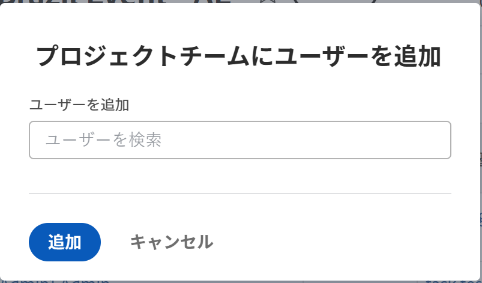

# プロジェクトチームを管理

プロジェクトチームは、プロジェクトに関連付けられているユーザーで構成されます。 プロジェクトチームのメンバーは、プロジェクトの「人」セクションに表示されます。

## アクセス要件

<!--drafted for P&P:
<table style="table-layout:auto"> 
 <col> 
 <col> 
 <tbody> 
  <tr> 
   <td role="rowheader">Adobe Workfront plan*</td> 
   <td> 
Any
 </td> 
  </tr> 
  <tr> 
   <td role="rowheader">Adobe Workfront license*</td> 
   <td> 
Current license: Standard 

   Or
   
Legacy license: Plan 

    </td> 
  </tr> 
  <tr> 
   <td role="rowheader">Access level configurations*</td> 
   <td> 
Edit access to Projects
 
View or higher access to Users
 
<b>NOTE</b> 
   
   If you still don't have access, ask your Workfront administrator if they set additional restrictions in your access level. For information on how a Workfront administrator can modify your access level, see <a href="../../../administration-and-setup/add-users/configure-and-grant-access/create-modify-access-levels.md" class="MCXref xref">Create or modify custom access levels</a>.
 </td> 
  </tr> 
  <tr> 
   <td role="rowheader">Object permissions</td> 
   <td> 
View or higher permissions to the project
 
For information on requesting additional access, see <a href="../../../workfront-basics/grant-and-request-access-to-objects/request-access.md" class="MCXref xref">Request access to objects </a>.
 </td> 
  </tr> 
 </tbody> 
</table>
-->

この記事の手順を実行するには、次のアクセス権が必要です。

<table style="table-layout:auto"> 
 <col> 
 <col> 
 <tbody> 
  <tr> 
   <td role="rowheader">Adobe Workfront plan*</td> 
   <td> 
任意
 </td> 
  </tr> 
  <tr> 
   <td role="rowheader">Adobe Workfront license*</td> 
   <td> 
計画 
 </td> 
  </tr> 
  <tr> 
   <td role="rowheader">アクセスレベル設定*</td> 
   <td> 
プロジェクトへのアクセスを編集
 
ユーザーへのアクセス権を表示するか、それ以上に設定する
 
<b>メモ</b>

まだアクセス権がない場合は、Workfront管理者に、アクセスレベルに追加の制限を設定しているかどうかを問い合わせてください。 Workfront管理者がアクセスレベルを変更する方法について詳しくは、 <a href="../../../administration-and-setup/add-users/configure-and-grant-access/create-modify-access-levels.md" class="MCXref xref">カスタムアクセスレベルの作成または変更</a>.
 </td>
</tr> 
  <tr> 
   <td role="rowheader">オブジェクト権限</td> 
   <td> 
プロジェクトに対する表示権限以上の権限
 
追加のアクセス権のリクエストについて詳しくは、 <a href="../../../workfront-basics/grant-and-request-access-to-objects/request-access.md" class="MCXref xref">オブジェクトへのアクセスのリクエスト </a>.
 </td> 
  </tr> 
 </tbody> 
</table>

*保有するプラン、ライセンスの種類、アクセス権を確認するには、Workfront管理者にお問い合わせください。

## プロジェクトチームにユーザーを追加する

プロジェクトチームにユーザーを追加すると、プロジェクトおよびプロジェクトのタスク、問題、ドキュメントに対する表示権限が付与されます。 詳しくは、 [プロジェクトチームの概要](../../../manage-work/projects/planning-a-project/project-team-overview.md).

>[!TIP]
>
>プロジェクトチームのユーザーは、プロジェクトのリソース管理ツールに自動的には追加されません。

次の方法でプロジェクトチームにユーザーを追加できます。

* [プロジェクトチームにユーザーを自動的に追加する](#automatically-add-users-to-a-project-team)
* [手動でプロジェクトチームにユーザーを追加する](#manually-add-users-to-a-project-team)

### プロジェクトチームにユーザーを自動的に追加する {#automatically-add-users-to-a-project-team}

プロジェクトで以下の役割を果たすユーザーは、プロジェクトチームに自動的に追加され、プロジェクトの作成時に「人」セクションに表示されます。

* プロジェクトの作成者
* プロジェクト所有者
* プロジェクトスポンサー

ユーザーが次の項目に割り当てられると、プロジェクトチームにも自動的に追加されます。

* タスク
* 問題

### 手動でプロジェクトチームにユーザーを追加する {#manually-add-users-to-a-project-team}

プロジェクト上で何の役割も果たさないユーザーが、プロジェクトの期間中に特定の更新や変更に関する通知を受け取る場合は、手動でプロジェクトチームに追加できます。

プロジェクトチームのユーザーに対して有効にできる通知の詳細については、 [Adobe Workfrontで使用可能なイベント通知](../../../administration-and-setup/manage-workfront/emails/event-notifications-available-in-wf.md).

<!--drafted - this used to be the case, in the note below but this limitation was removed on Jan 5, 2023 - as a patch, not a release feature:

>[!IMPORTANT]
>
>You can add to the Project Team only users that belong to the Group associated with the project. You cannot add users that belong to the Subgroups of the project's group. 

-->

1. ユーザーを追加するプロジェクトに移動します。

1. クリック **人** をクリックします。 クリックが必要になる場合があります **さらに表示** 1 つ目は

1. クリック **ユーザーを追加**.

   [ プロジェクトチームにユーザを追加 ] ダイアログボックスが表示されます。

   

1. 内 **ユーザーを追加** ボックスに、プロジェクトチームに追加するアクティブなWorkfrontユーザーの名前を入力し、ドロップダウンリストに表示されたら名前をクリックします。

   複数のユーザーをプロジェクトチームに追加するには、この手順を繰り返します。 ユーザーは、プロジェクトに関連付けられたグループに属している必要があります。

   >[!TIP]
   >
   >* チーム、グループ、会社またはジョブの役割を追加してユーザーを追加することはできません。
   >* ユーザーを追加する際に、アバター、ユーザーのプライマリの役割および電子メールアドレスに注目して、同じ名前のユーザーを区別します。 ユーザーを追加したときに表示するには、少なくとも 1 つのジョブの役割に関連付ける必要があります。

1. クリック **追加**.

   ユーザーは、プロジェクトに対する表示権限を取得し、プロジェクトチームの一部として、プロジェクトに関する通知を受け取ります。

## プロジェクトチームからユーザーを削除する

プロジェクト上のユーザーの役割からユーザーを削除しても、そのユーザーはプロジェクトチームの一員のままです。

プロジェクトチームからユーザーを削除し、そのユーザーがプロジェクトのタスクまたはタスクに割り当てられた場合、ユーザーはタスクと未完了のタスクに割り当てられていません。 この場合、タスクと問題はワークロード・バランサの未割り当て作業領域に戻ります。

完了したタスクとタスクに割り当てられたユーザーは、プロジェクトチームから削除しても、割り当てられたままになります。

プロジェクトチームからユーザーを削除する方法の詳細については、 [プロジェクトからユーザーを削除](../../../manage-work/projects/manage-projects/remove-users-from-projects.md).
