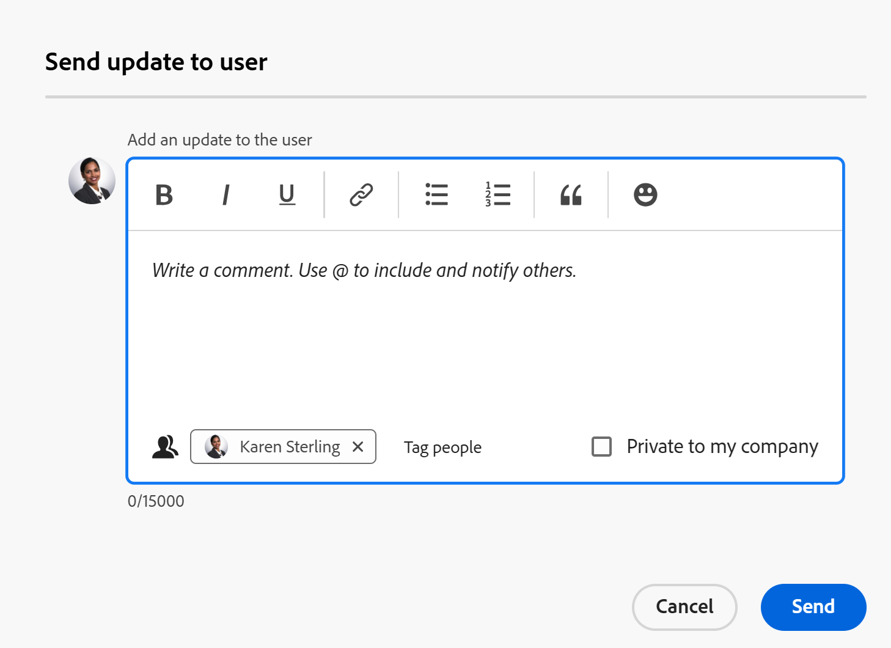
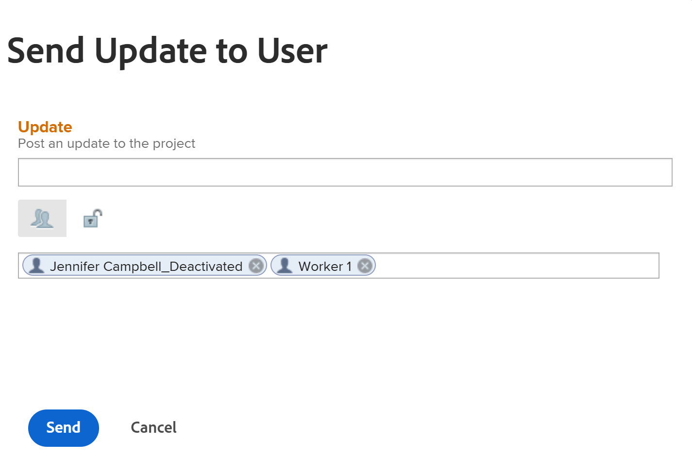

# プロジェクトチームの管理

<!--take preview and production references out at production - August 7-->

<!--
 

The highlighted information on this page refers to functionality not yet generally available. It is available only in the Preview environment for all customers. The same features will also be available in the Production environment for all customers after a week from the Preview release.      

For more information, see [Interface modernization](/help/quicksilver/product-announcements/product-releases/interface-modernization/interface-modernization.md).  

-->

プロジェクトチームは、プロジェクトに関連付けられているユーザーで構成されます。詳しくは、[プロジェクトチームの概要](/help/quicksilver/manage-work/projects/planning-a-project/project-team-overview.md)を参照してください。

プロジェクトチームのメンバーは、プロジェクトの「ユーザー」セクションに表示されます。

プロジェクトテンプレートの人物セクションに表示されるユーザーは、プロジェクトがテンプレートから作成された後、プロジェクトチームになります。

次のユーザーは、プロジェクトとテンプレートの両方について、プロジェクトチームに自動的に追加されます。

* 所有者
* スポンサー
* タスクに割り当てられたユーザー
* 課題に割り当てられたユーザー (プロジェクトのみ)

プロジェクトチームのユーザーは、プロジェクトに関する通知を受け取ります。 詳しくは、[ イベント通知タイプ ](/help/quicksilver/administration-and-setup/manage-workfront/emails/event-notifications-available-in-wf.md) を参照してください。

プロジェクトおよびテンプレートのチームのユーザーを追加（プロジェクトに対してのみ）、削除、または更新を送信することで、ユーザーを管理できます。

## アクセス要件

+++ アクセス要件表示拡張。 

<table style="table-layout:auto"> 
 <col> 
 <col> 
 <tbody> 
  <tr> 
   <td role="rowheader">Adobe Workfront プラン*</td> 
   <td> 
任意
 </td> 
  </tr> 
  <tr> 
   <td role="rowheader">Adobe Workfront プラン*</td> 
   <td> 
標準 

    
プラン 

    </td> 
  </tr> 
  <tr> 
   <td role="rowheader">アクセスレベル</td> 
   <td> 
プロジェクトとテンプレートへの編集アクセス権
 
ユーザーに対する表示以上のアクセス権
 </td> 
  </tr> 
  <tr> 
   <td role="rowheader">オブジェクト権限</td> 
   <td> 
プロジェクトまたはテンプレートに対する表示以上の権限
 </td> 
  </tr> 
 </tbody> 
</table>

*詳しくは、[Workfront ドキュメントのアクセス要件 ](/help/quicksilver/administration-and-setup/add-users/access-levels-and-object-permissions/access-level-requirements-in-documentation.md) を参照してください。

+++

<!--Old access: 

You must have the following access to perform the steps in this article:

<table style="table-layout:auto"> 
 <col> 
 <col> 
 <tbody> 
  <tr> 
   <td role="rowheader">Adobe Workfront plan*</td> 
   <td> 
Any
 </td> 
  </tr> 
  <tr> 
   <td role="rowheader">Adobe Workfront license*</td> 
   <td> 
Plan 
 </td> 
  </tr> 
  <tr> 
   <td role="rowheader">Access level configurations*</td> 
   <td> 
Edit access to Projects
 
View or higher access to Users
 
<b>NOTE</b> 
   
   If you still don't have access, ask your Workfront administrator if they set additional restrictions in your access level. For information on how a Workfront administrator can modify your access level, see <a href="../../../administration-and-setup/add-users/configure-and-grant-access/create-modify-access-levels.md" class="MCXref xref">Create or modify custom access levels</a>.
 </td> 
  </tr> 
  <tr> 
   <td role="rowheader">Object permissions</td> 
   <td> 
View or higher permissions to the project
 
For information on requesting additional access, see <a href="../../../workfront-basics/grant-and-request-access-to-objects/request-access.md" class="MCXref xref">Request access to objects </a>.
 </td> 
  </tr> 
 </tbody> 
</table>

*To find out what plan, license type, or access you have, contact your Workfront administrator.

## Add users to a Project Team

When you add users to the project team, they gain View permissions on the project and the tasks, issues, and documents of the project. For more information, see the article [Project Team overview](../../../manage-work/projects/planning-a-project/project-team-overview.md).

>[!TIP]
>
>Users on the Project Team are not automatically added to the resource management tools for the project.

You can add users to the project team in the following ways:

* [Automatically add users to a Project Team](#automatically-add-users-to-a-project-team) 
* [Manually add users to a Project Team](#manually-add-users-to-a-project-team)

### Automatically add users to a Project Team {#automatically-add-users-to-a-project-team}

The users that fulfill the following roles on the project are automatically added to the project team and appear  in the People section when the project is created:

* The creator of the project
* The project owner
* The project sponsor

Users are also automatically added to the project team when they are assigned to the following:

* Tasks
* Issues

### Manually add users to a Project Team {#manually-add-users-to-a-project-team}

If users that don't fulfill any role on the project want to be notified about certain updates or changes during the life of the project, you can manually add them to the project team. 

 For more information about what notifications can be enabled for users on the project team, see [Event notification types](../../../administration-and-setup/manage-workfront/emails/event-notifications-available-in-wf.md). 

 <!--drafted - this used to be the case, in the note below but this limitation was removed on Jan 5, 2023 - as a patch, not a release feature:

>[!IMPORTANT]
>
>You can add to the Project Team only users that belong to the Group associated with the project. You cannot add users that belong to the Subgroups of the project's group. 

-->

## プロジェクトでのユーザーの管理

1. プロジェクト チームを管理するプロジェクトに移動します。

   >[!TIP]
   >
   >ユーザーを「人物」セクションに表示するには、タスク、イシュー、またはプロジェクトの関係者としてユーザーが割り当てられている必要があります。

1. 左側のパネルで **人物** をクリックします。

1. 「**ユーザーを追加**」をクリックします。

   「チームへの **追加ユーザープロジェクト** ボックスが表示されます。

   

1. 「**ユーザーを追加**」ボックスで、プロジェクトチームに追加するアクティブなWorkfront ユーザーの名前の入力を開始し、リストに表示される名前をクリックします。

   複数のユーザーをプロジェクトチームに追加するには、この手順を繰り返します。ユーザーは、プロジェクトに関連付けられたグループに属している必要があります。

   >[!TIP]
   >
   >* チーム、グループ、会社または担当業務を追加してユーザーを追加することはできません。
   >* ユーザーを追加する際に、アバター、ユーザーのプライマリの役割およびメールアドレスに注目して、同名のユーザーを区別します。ユーザーを追加したときに表示するには、少なくとも 1 つの担当業務に関連付ける必要があります。
   >
   >  ユーザーがユーザーのメールを表示するには、アクセスレベルで、連絡情報の表示の設定を有効にしておく必要があります。詳しくは、[ユーザーへのアクセス権の付与](../../../administration-and-setup/add-users/configure-and-grant-access/grant-access-other-users.md)を参照してください。

1. 「**追加**」をクリックします。

   ユーザーは、プロジェクトに対する表示権限を取得し、プロジェクトチームの一部として、プロジェクトに関する通知を受け取ります。

1. （オプション）担当業務がタスク、イシュー、プロジェクトの承認に追加されたときにユーザーに通知を受信させたい場合は、ユーザーの **担当業務** 列内をクリックして、承認に関連付けられる担当業務を選択します。

   ユーザーは、選択した担当業務に割り当てられた承認に関連する通知を受け取ります。

   詳しくは、記事「プロジェクトチームの概要 [ の「役割ベースの承認」の節を参照し ](/help/quicksilver/manage-work/projects/planning-a-project/project-team-overview.md) ください。

1. リストで 1 人または複数のユーザーを選択し、**削除** アイコン  をクリックして、チームから削除します。

1. **Yes, 削除 Selected users**」をクリックして、ユーザーを確認してから削除します。

   ユーザーは削除され、未完了の作業項目から割り当て解除されます。

   詳細については、この記事の [プロジェクト チームからユーザーを削除する際の考慮事項](#considerations-for-removing-users-from-a-project-team) セクションを参照してください。
1. (オプション)このプロジェクトの更新をユーザーに送信するには、&lbrack; **更新すべてを選択** をクリックして、チーム上のすべてのユーザーに更新を送信します

   または

   リストから 1 人または複数のユーザーを選択し、「**ユーザーに更新を送信**」をクリックします。

   <!--update screen shot when they fix the bug - the text above the box needs to match the OLD box, below-->

   

   <!--Old UI for projects but the text above the comment box is right and matches the functionality):
   -->

   [ **送信 Update to ユーザー** ] ボックスが開きます。

1. 次のいずれかの操作を行います。

   * 選択したユーザーの更新プログラム追加。
   * カギのアイコンをクリックして、更新を会社内のユーザーに対して非公開にします。
   * 追加のユーザーにタグ付けして、同じ更新プログラムを受け取ります。
   * 「**送信**」をクリックします。

   更新内容がプロジェクトの「**更新**」セクションに追加され、選択したすべてのユーザーがタグ付きユーザーとして表示されます。

   ユーザーに対して有効になっている場合はユーザーにメール通知が届き、新しい更新に関するアプリ内通知が届く場合があります。

1. （任意） **エクスポート** アイコン  をクリックして、ユーザーのリストをファイルにエクスポートします

   または

   ユーザを選択し、 **書き出し** アイコンをクリックして、特定のユーザのみを書き出します。

## テンプレートでの人物の管理

1. プロジェクト チームを管理するテンプレートに移動します。

   >[!TIP]
   >
   >人物セクションに表示するには、タスクまたはテンプレートの関係者に割り当てられたユーザーが必要です。

1. 左側のパネルで **人物** をクリックします。

1. リストで 1 人または複数のユーザーを選択し、「**削除** アイコンをクリックして、チームから削除します。

1. **はい、選択したユーザーを削除** をクリックして、ユーザーを確認して削除します。

   ユーザーはテンプレートタスクから削除され、割り当て解除されます。

   詳細については、この記事の [プロジェクト チームからユーザーを削除する際の考慮事項](#considerations-for-removing-users-from-a-project-team) セクションを参照してください。

1. （任意）ユーザーに更新を送信するには、「**すべて更新**」をクリックして、リストのすべてのユーザーに更新を送信します

   または

   リストから 1 人または複数のユーザーを選択し、「**ユーザーに更新を送信**」をクリックします。

   <!--update screen shot for unshim production, notice the text above the box - it needs to say "Post an update to each person's profile"-->

   

   [ **送信 Update to ユーザー** ] ボックスが開きます。

1. 次の操作を実行します。

   * 選択したユーザーの更新プログラム追加。
   * &lbrack; **ユーザーにタグ付け** をクリックして、同じ更新プログラムを受信する追加のユーザータグします。
   * **自分の会社に非公開**&#x200B;オプションを選択して、更新を会社内のユーザーに対して非公開にします。
   * 「**送信**」をクリックします。

   更新内容は、タグ付けされた各ユーザーのプロファイルの「**更新**」セクションに追加されます。

   ユーザーに対して有効になっている場合は、電子メール 通知を受信し、新しい更新プログラムに関するアプリ内通知を受け取る場合があります。

1. **書き出し**&#x200B;アイコンをクリックして、ユーザーのリストをファイルに書き出します

   または

   ユーザーを選択して「**書き出し** アイコンをクリックし、特定のユーザーのみを書き出します。

## プロジェクトチームからユーザーを削除する際の考慮事項

プロジェクト上のユーザーの役割からユーザーを削除しても、そのユーザーはプロジェクトチームの一員に留まりす。

プロジェクトチームに送信された通知を受信しないようにするには、プロジェクトチームまたはプロジェクトの「ユーザー」セクションからユーザーを削除する必要があります。

プロジェクトのタスクまたはイシューに割り当てられているユーザーをプロジェクトチームから削除すると、そのユーザーは未完了のタスクとイシューから割り当て解除されます。この場合、タスクとイシューはワークロードバランサーの未割り当て作業エリアに戻ります。

完了したタスクと懸案事項に割り当てられているユーザーは、プロジェクト チームから削除した後も、均等タスクと懸案事項に割り当てられたままになります。

次のユーザーは、プロジェクトまたはテンプレートの [ユーザー] セクションから削除すると、プロジェクトのロールから削除されます。

* 未完了タスクに割り当てられたユーザー
* 未完了の問題に割り当てられたユーザー

次のユーザーは、プロジェクトまたはテンプレートの人物セクションから削除しても、プロジェクトでの役割から削除されません。

* 所有者
* スポンサー

プロジェクトチームからのユーザーの削除について詳しくは、[プロジェクトからのユーザーの削除](../../../manage-work/projects/manage-projects/remove-users-from-projects.md)を参照してください。

