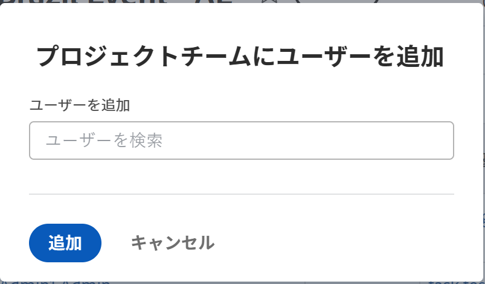
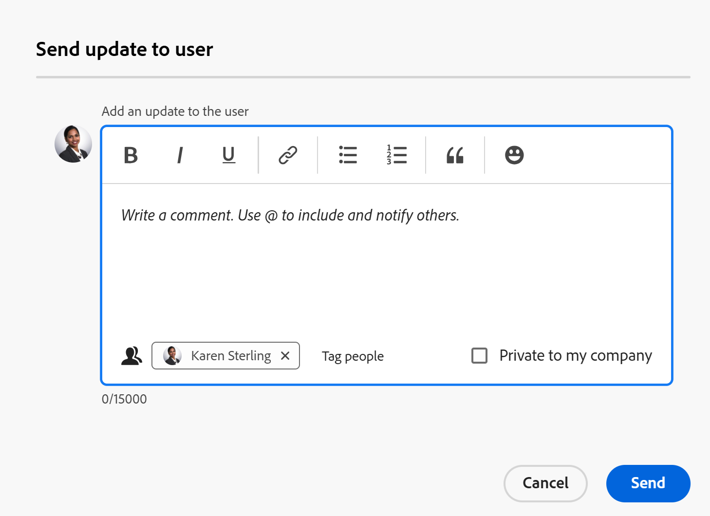
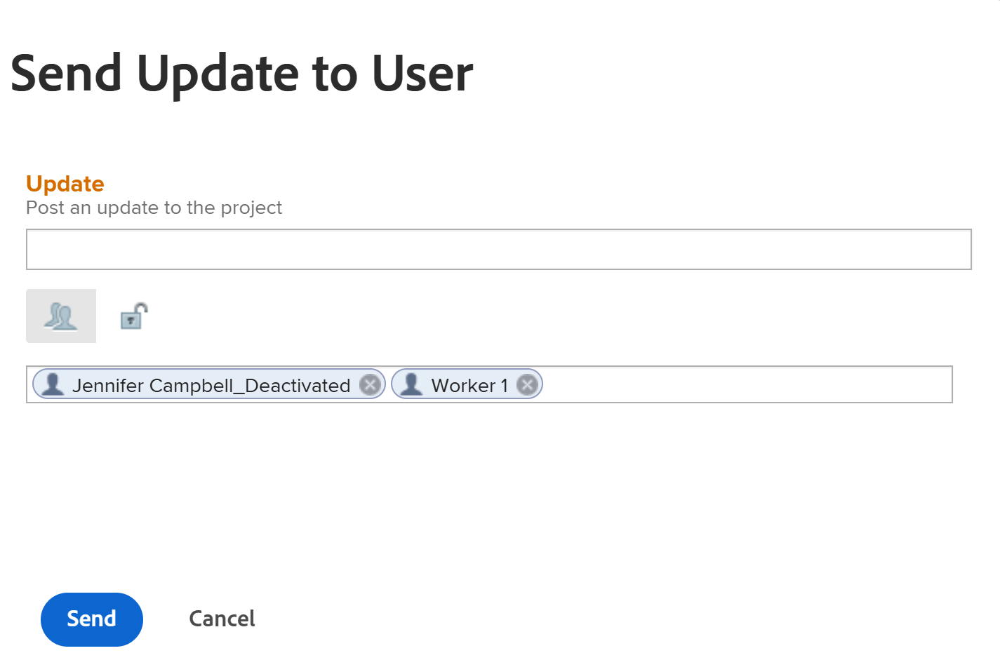
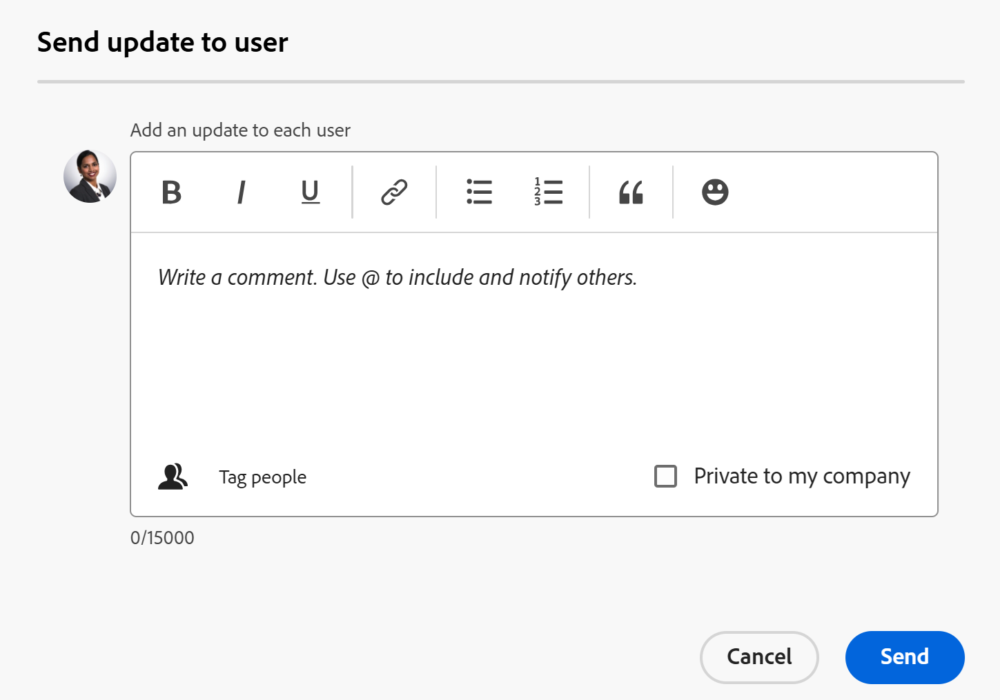

# プロジェクトチームの管理

<!--take preview and production references out at production - August 7-->

<!--

 

The highlighted information on this page refers to functionality not yet generally available. It is available only in the Preview environment for all customers. The same features will also be available in the Production environment for all customers after a week from the Preview release.      

For more information, see [Interface modernization](/help/quicksilver/product-announcements/product-releases/interface-modernization/interface-modernization.md).  

-->

プロジェクトチームは、プロジェクトに関連付けられているユーザーで構成されます。詳しくは、[プロジェクトチームの概要](/help/quicksilver/manage-work/projects/planning-a-project/project-team-overview.md)を参照してください。

プロジェクトチームのメンバーは、プロジェクトの「ユーザー」セクションに表示されます。

プロジェクトテンプレートの「人物」セクションに表示されるユーザーは、テンプレートからプロジェクトを作成した後で、プロジェクトチームになります。

プロジェクトとテンプレートの両方で、次のユーザーがプロジェクトチームに自動的に追加されます。

* 所有者
* スポンサー
* タスクに割り当てられたユーザー
* イシューに割り当てられたユーザー（プロジェクトのみ）

プロジェクトチームのユーザーは、プロジェクトに関する通知を受け取ります。 詳しくは、[&#x200B; イベント通知タイプ &#x200B;](/help/quicksilver/administration-and-setup/manage-workfront/emails/event-notifications-available-in-wf.md)を参照してください。

プロジェクトおよびテンプレートのチーム内のユーザーを管理するには、ユーザーを追加（プロジェクト専用）、削除、または更新を送信します。

## アクセス要件

+++ 展開すると、この記事の機能のアクセス要件が表示されます。 

<table style="table-layout:auto"> 
 <col> 
 <col> 
 <tbody> 
  <tr> 
   <td role="rowheader">Adobe Workfront パッケージ</td> 
   <td> 
任意
 </td> 
  </tr> 
  <tr> 
   <td role="rowheader">Adobe Workfront プラン</td> 
   <td> 
標準

    
プラン

    </td> 
  </tr> 
  <tr> 
   <td role="rowheader">アクセスレベル設定</td> 
   <td> 
プロジェクトとテンプレートへの編集アクセス権
 
ユーザーに対する表示以上のアクセス権
 </td> 
  </tr> 
  <tr> 
   <td role="rowheader">オブジェクト権限</td> 
   <td> 
プロジェクトまたはテンプレートに対する表示以上の権限
 </td> 
  </tr> 
 </tbody> 
</table>

詳しくは、[Workfront ドキュメントのアクセス要件](/help/quicksilver/administration-and-setup/add-users/access-levels-and-object-permissions/access-level-requirements-in-documentation.md)を参照してください。

+++

<!--
Old access: 

<table style="table-layout:auto"> 
 <col> 
 <col> 
 <tbody> 
  <tr> 
   <td role="rowheader">Adobe Workfront plan*</td> 
   <td> 
Any
 </td> 
  </tr> 
  <tr> 
   <td role="rowheader">Adobe Workfront license*</td> 
   <td> 
Standard 

    
Plan 

    </td> 
  </tr> 
  <tr> 
   <td role="rowheader">Access level</td> 
   <td> 
Edit access to Projects and Templates
 
View or higher access to Users
 </td> 
  </tr> 
  <tr> 
   <td role="rowheader">Object permissions</td> 
   <td> 
View or higher permissions to a project or to a template
 </td> 
  </tr> 
 </tbody> 
</table>

*For information, see [Access requirements in Workfront documentation](/help/quicksilver/administration-and-setup/add-users/access-levels-and-object-permissions/access-level-requirements-in-documentation.md).

## Add users to a Project Team

When you add users to the project team, they gain View permissions on the project and the tasks, issues, and documents of the project. For more information, see the article [Project Team overview](../../../manage-work/projects/planning-a-project/project-team-overview.md).

>[!TIP]
>
>Users on the Project Team are not automatically added to the resource management tools for the project.

You can add users to the project team in the following ways:

* [Automatically add users to a Project Team](#automatically-add-users-to-a-project-team) 
* [Manually add users to a Project Team](#manually-add-users-to-a-project-team)

### Automatically add users to a Project Team {#automatically-add-users-to-a-project-team}

The users that fulfill the following roles on the project are automatically added to the project team and appear  in the People section when the project is created:

* The creator of the project
* The project owner
* The project sponsor

Users are also automatically added to the project team when they are assigned to the following:

* Tasks
* Issues

### Manually add users to a Project Team {#manually-add-users-to-a-project-team}

If users that don't fulfill any role on the project want to be notified about certain updates or changes during the life of the project, you can manually add them to the project team. 

 For more information about what notifications can be enabled for users on the project team, see [Event notification types](../../../administration-and-setup/manage-workfront/emails/event-notifications-available-in-wf.md). 

 drafted - this used to be the case, in the note below but this limitation was removed on Jan 5, 2023 - as a patch, not a release feature:

>[!IMPORTANT]
>
>You can add to the Project Team only users that belong to the Group associated with the project. You cannot add users that belong to the Subgroups of the project's group. 

## Manage people on a project

1. Go to the project you want to manage the project team for.

   >[!TIP]
   >
   >You must have users assigned to tasks, issues or as stakeholders on the project to have them display in the People section.

1. Click **People** in the left panel. 

1. Click **Add users**. 

   The **Add users to Project Team** box displays.

   

1. In the **Add users** box, begin typing the name of an active Workfront user that you want to add to the project team, then click the name when it appears in the list.

   Repeat this step to add multiple users to the project team. The users must belong to the group associated with the project. 

   >[!TIP]
   >
   >* You cannot add users by adding their teams, groups, companies, or job roles.
   >* As you add the users, notice the avatar, the user's Primary Role, and their email address to distinguish between users with identical names. Users must be associated with at least one job role to view it as you add them.
   >
   >  You must have the View Contact Info setting enabled in your access level for Users to view users' emails. For information, see [Grant access to users](../../../administration-and-setup/add-users/configure-and-grant-access/grant-access-other-users.md).

1. Click **Add**.

   The users gain View permissions to the project and receive notifications about the project as part of the project team.

1. (Optional) If you want a user to receive a  notification when their job role is added to a task, issue, or project approval, click inside the **Job Role** column for the user, and select a job role that will be associated with the approval. 

   The users will receive notifications related to the approvals assigned to the selected job role. 

   For more information see the "Role-based approvals" section in the article [Project Team overview](/help/quicksilver/manage-work/projects/planning-a-project/project-team-overview.md).

1. Select one or several users in the list, then click the **Remove** icon  to remove them from the team. 
 
1. Click **Yes, Remove Selected Users** to confirm and remove the users.

   Users are removed and unassigned from incomplete work items.

   For more information, see the [Considerations for removing users from a project team](#considerations-for-removing-users-from-a-project-team) section in this article.
1. (Optional) To send an update for this project to users, click **Update All** to send the update to everyone on the team

   Or 

   Select one or multiple users in the list, then click **Send Update to User**.

   update screen shot when they fix the bug - the text above the box needs to match the OLD box, below

   

   Old UI for projects but the text above the comment box is right and matches the functionality):
   
-->

「**ユーザーに更新を送信」ボックスが開きます。**

1. 次のいずれかの操作を行います。

   * 選択したユーザーの更新を追加します。
   * ロックアイコンをクリックして、会社のユーザーに対してアップデートを非公開にします。
   * 追加のユーザーをタグ付けして、同じ更新を受け取ります。
   * 「**送信**」をクリックします。

   更新はプロジェクトの&#x200B;**更新** セクションに追加され、選択したすべてのユーザーがタグ付きユーザーとして表示されます。

   ユーザーは、有効になっている場合はメール通知を受け取り、新しい更新に関するアプリ内通知を受け取る場合があります。

1. （オプション） **書き出し** アイコン をクリックして、ユーザーのリストをファイルに書き出します

   または

   ユーザーを選択し、**書き出し** アイコンをクリックして、特定のユーザーのみを書き出します。

## テンプレート上の人物の管理

1. プロジェクトチームを管理するテンプレートに移動します。

   >[!TIP]
   >
   >タスクまたはテンプレート上の関係者としてユーザーを割り当てて、「人物」セクションに表示させる必要があります。

1. 左側のパネルで「**人**」をクリックします。

1. リスト内の1人または複数のユーザーを選択し、**削除** アイコンをクリックしてチームから削除します。

1. 「**はい、選択したユーザーを削除**」をクリックして、ユーザーを確認および削除します。

   ユーザーは削除され、テンプレートタスクから割り当て解除されます。

   詳しくは、この記事の「[&#x200B; プロジェクトチームからユーザーを削除する際の考慮事項](#considerations-for-removing-users-from-a-project-team)」を参照してください。

1. （オプション）更新をユーザーに送信するには、**すべてを更新**&#x200B;をクリックして、リスト内のすべてのユーザーに更新を送信します

   または

   リストから1人または複数のユーザーを選択し、**更新をユーザーに送信**&#x200B;をクリックします。

   <!--update screen shot for unshim production, notice the text above the box - it needs to say "Post an update to each person's profile"-->

   のユーザーボックスに更新を送信

   「**ユーザーに更新を送信」ボックスが開きます。**

1. 次の操作を実行します。

   * 選択したユーザーの更新を追加します。
   * 「**ユーザーにタグ付け**」をクリックして、追加のユーザーにタグ付けして、同じ更新プログラムを受信します。
   * 会社のユーザーに対してアップデートを非公開にするには、「**会社に対して非公開にする**」オプションを選択します。
   * 「**送信**」をクリックします。

     >[!TIP]
     >
     >会社に対する&#x200B;**非公開**&#x200B;設定は、Workfront プロファイルが会社に関連付けられている場合にのみ使用できます。

   更新は、タグ付けされた各ユーザーのプロファイルの&#x200B;**更新** セクションに追加されます。

   ユーザーは、有効になっている場合はメール通知を受け取り、新しい更新に関するアプリ内通知を受け取る場合があります。

1. **書き出し** アイコン をクリックして、ユーザーのリストをファイルに書き出します

   または

   ユーザーを選択し、**書き出し** アイコンをクリックして、特定のユーザーのみを書き出します。

## プロジェクトチームからユーザーを削除する際の考慮事項

プロジェクト上のユーザーの役割からユーザーを削除しても、そのユーザーはプロジェクトチームの一員に留まりす。

プロジェクトチームに送信された通知の受信を停止するには、プロジェクトチームからプロジェクトの「人物」セクションから削除する必要があります。

プロジェクトのタスクまたはイシューに割り当てられているユーザーをプロジェクトチームから削除すると、そのユーザーは未完了のタスクとイシューから割り当て解除されます。この場合、タスクとイシューはワークロードバランサーの未割り当て作業エリアに戻ります。

完了したタスクとイシューに割り当てられたユーザーは、プロジェクトチームから削除した後でも、タスクとイシューに割り当てられたままになります。

次のユーザーは、プロジェクトまたはテンプレートの「ユーザー」セクションから削除すると、プロジェクト上の役割から削除されます。

* 不完全なタスクに割り当てられたユーザー
* 不完全な問題に割り当てられたユーザー

次のユーザーは、プロジェクトまたはテンプレートの「ユーザー」セクションから削除しても、プロジェクト上の役割から削除されません。

* 所有者
* スポンサー

プロジェクトチームからのユーザーの削除について詳しくは、[プロジェクトからのユーザーの削除](../../../manage-work/projects/manage-projects/remove-users-from-projects.md)を参照してください。

