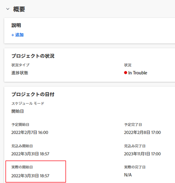

# プロジェクトの実際の開始日の概要

Adobe Workfront では、プロジェクト、タスクおよびイシューに実際の開始日があります。タスクおよびイシューの場合、この日付は「進行中」とマークされた日です。プロジェクトの場合、この日付はプロジェクトの最初のタスクが「進行中」としてマークされたか完了した日です。

## アクセス要件

この記事の手順を実行するには、次のアクセス権が必要です。

<table style="table-layout:auto"> 
 <col> 
 <col> 
 <tbody> 
  <tr> 
   <td role="rowheader">Adobe Workfront プラン*</td> 
   <td> 
任意
 </td> 
  </tr> 
  <tr> 
   <td role="rowheader">Adobe Workfront ライセンス*</td> 
   <td> 
レビュー以上
 </td> 
  </tr> 
  <tr> 
   <td role="rowheader">アクセスレベル設定*</td> 
   <td> 
プロジェクトに対する表示以上のアクセス権
 
メモ：まだアクセス権がない場合は、アクセスレベルに追加の制限が設定されていないかどうか Workfront 管理者にお問い合わせください。Workfront 管理者がアクセスレベルを変更する方法について詳しくは、<a href="../../../administration-and-setup/add-users/configure-and-grant-access/create-modify-access-levels.md" class="MCXref xref">カスタムアクセスレベルの作成または変更</a>を参照してください。
 </td> 
  </tr> 
  <tr> 
   <td role="rowheader">オブジェクト権限</td> 
   <td> 
プロジェクトに対する表示権限またはそれ以上の権限
 
追加のアクセス権のリクエストについて詳しくは、<a href="../../../workfront-basics/grant-and-request-access-to-objects/request-access.md" class="MCXref xref">オブジェクトへのアクセス権のリクエスト</a>を参照してください。
 </td> 
  </tr> 
 </tbody> 
</table>

&#42;保有するプラン、ライセンスタイプ、アクセス権を確認するには、Workfront 管理者に問い合わせてください。

## Workfront の実際の開始日に関する考慮事項

* 実際の開始日は、プロジェクト、タスクおよびイシューの「詳細」セクションにあります。 
* プロジェクト、タスクまたはイシューの実際の開始日は、これらの項目が作成される際には入力されません。
* 実際の開始日は、プロジェクト、タスクまたはイシューで実際に作業が始まったときに入力されます。
* プロジェクトの作業がまだ始まっていない場合、「プロジェクト詳細」タブには実際の開始日が表示されません。

  まだ作業がまだ始まっていない場合、「タスクの詳細」と「イシューの詳細」タブには実際の開始日は空白で表示されます。

* タスクやイシューの実際の開始日は手動で変更できますが、プロジェクトの実際の開始日は変更できません。

## プロジェクトの実際の開始日に関する考慮事項

* Workfront では、次のいずれかのアクションが行われた場合、プロジェクトの実際の日付が自動的に設定されます。

   * タスクの担当者がタスクのステータスを「*新規*」から「*新規*」と同等でない他のステータスに変更する。

   * タスクの担当者がタスクの完了率を変更する。

     >[!IMPORTANT]
     >
     >プロジェクトが「現在」とマークされている場合、プロジェクトの実際の開始日は入力されません。プロジェクトに実際の開始日が入力されるのは、プロジェクトのタスクで実際の作業が開始されたときです。

     こうした場合、プロジェクトの実際の開始日は、プロジェクトで最も早く発生するタスクに対してこれらのアクションが実行された日時に設定されます。これは、プロジェクトが実際にこの日時に開始されたことを示します。

## プロジェクトの実際の開始日を確認

プロジェクトの実際の開始日は、次の領域で確認できます。

* プロジェクトの「詳細」セクション。
* プロジェクトのレポートまたはビュー（レポートのプロジェクトオブジェクトに実際の開始日を追加した場合）。

  レポートの作成について詳しくは、[カスタムレポートの作成](../../../reports-and-dashboards/reports/creating-and-managing-reports/create-custom-report.md)を参照してください。

プロジェクトの「詳細」セクションで実際の開始日を確認する手順は、次のとおりです。

1. Workfront の右上隅にある&#x200B;**メインメニュー**&#x200B;アイコン  をクリックし、「**プロジェクト**」をクリックします。
1. 実際の開始日を表示するプロジェクトをクリックします。
1. 左側のパネルで「**プロジェクト詳細**」をクリックし、「**概要**」セクションに移動します。

   実際の開始日は、プロジェクトの他の日付と共に表示されます。

   

 
