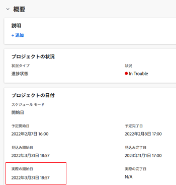

# プロジェクトの実際の開始日の概要

Adobe Workfront では、プロジェクト、タスクおよびイシューに実際の開始日があります。タスクおよびイシューの場合、この日付は「進行中」とマークされた日です。プロジェクトの場合、この日付はプロジェクトの最初のタスクが「進行中」としてマークされたか完了した日です。

## アクセス要件

+++ 展開すると、この記事の機能のアクセス要件が表示されます。 

<table style="table-layout:auto"> 
 <col> 
 <col> 
 <tbody> 
  <tr> 
   <td role="rowheader">Adobe Workfront パッケージ</td> 
   <td> 
任意
 </td> 
  </tr> 
  <tr> 
   <td role="rowheader">Adobe Workfront プラン</td> 
   <td>
明るいまたはそれ以上
 
   
レビュー以上
 </td> 
  </tr> 
  <tr> 
   <td role="rowheader">アクセスレベル設定</td> 
   <td> 
プロジェクトに対する表示以上のアクセス権
  </td> 
  </tr> 
  <tr> 
   <td role="rowheader">オブジェクト権限</td> 
   <td> 
プロジェクトに対する表示権限またはそれ以上の権限
  </td> 
  </tr> 
 </tbody> 
</table>

詳しくは、[Workfront ドキュメントのアクセス要件](/help/quicksilver/administration-and-setup/add-users/access-levels-and-object-permissions/access-level-requirements-in-documentation.md)を参照してください。

+++

<!--
Old:

<table style="table-layout:auto"> 
 <col> 
 <col> 
 <tbody> 
  <tr> 
   <td role="rowheader">Adobe Workfront plan*</td> 
   <td> 
Any
 </td> 
  </tr> 
  <tr> 
   <td role="rowheader">Adobe Workfront license*</td> 
   <td> 
Review or higher
 </td> 
  </tr> 
  <tr> 
   <td role="rowheader">Access level configurations*</td> 
   <td> 
View or higher access to Projects
 
Note: If you still don't have access, ask your Workfront administrator if they set additional restrictions in your access level. For information on how a Workfront administrator can modify your access level, see <a href="../../../administration-and-setup/add-users/configure-and-grant-access/create-modify-access-levels.md" class="MCXref xref">Create or modify custom access levels</a>.
 </td> 
  </tr> 
  <tr> 
   <td role="rowheader">Object permissions</td> 
   <td> 
View or higher permissions to a project
 
For information on requesting additional access, see <a href="../../../workfront-basics/grant-and-request-access-to-objects/request-access.md" class="MCXref xref">Request access to objects </a>.
 </td> 
  </tr> 
 </tbody> 
</table>
-->

## Workfrontでの実際の開始日に関する考慮事項

* 実際の開始日は、プロジェクト、タスクおよびイシューの「詳細」セクションにあります。
* プロジェクト、タスクまたはイシューの実際の開始日は、これらのアイテムの作成時には入力されません。
* 実際の開始日は、プロジェクト、タスク、イシューで実際に作業が開始されたときに入力されます。
* プロジェクトの作業がまだ開始されていない場合、「プロジェクトの詳細」タブに「実際の開始日」が表示されません。

  「実際の開始日」は、「タスク」タブと「イシューの詳細」タブで、作業がまだ開始されていない場合は空白で表示されます。

* タスクまたはイシューの実際の開始日を手動で変更することはできますが、プロジェクトの実際の開始日を変更することはできません。

## プロジェクトの実際の開始日についての考慮事項

* Workfrontは、次のいずれかが発生した場合に、プロジェクトの実際の日付を自動的に設定します。

   * タスクの担当者がタスクのステータスを「*新規*」から「*新規*」と同等でない他のステータスに変更する。

   * タスクの担当者がタスクの完了率を変更する。

     >[!IMPORTANT]
     >
     >プロジェクトが「現在」としてマークされている場合、プロジェクトの「実際の開始日」は入力されません。 実際の作業は、プロジェクトの実際の開始日よりも前に、プロジェクトのタスクで開始する必要があります。

     こうした場合、プロジェクトの実際の開始日は、プロジェクトで最も早く発生するタスクに対してこれらのアクションが実行された日時に設定されます。これは、プロジェクトが実際にこの日時に開始されたことを示します。

## プロジェクトの実際の開始日を探す

次の領域で、プロジェクトの実際の開始日を見つけることができます。

* プロジェクトの「詳細」セクション。
* プロジェクト レポートまたはビューで、レポート内のプロジェクト オブジェクトに&#x200B;**実際の開始日**&#x200B;を追加すると、

  レポートの作成について詳しくは、[カスタムレポートの作成](../../../reports-and-dashboards/reports/creating-and-managing-reports/create-custom-report.md)の記事を参照してください。

プロジェクトの「詳細」セクションで「実際の開始日」を検索するには、次の手順を実行します。

{{step1-to-projects}}

1. 実際の開始日を表示するプロジェクトをクリックします。
1. 左側のパネルで「**プロジェクトの詳細**」をクリックし、**概要** セクションに移動します。

   

   **実際の開始日**&#x200B;は、他のプロジェクトの日付と共に表示されます。

