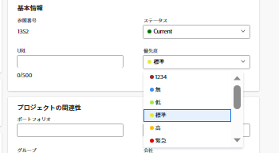

# プロジェクトの優先度の理解と更新

プロジェクトの優先度を使用する方法はいくつかあり、相互に通信しません。 プロジェクトの重要度を分類する際には、ニーズに合ったプロジェクトの優先度の 1 つを選択し、それを参照することをお勧めします。 

## アクセス要件

<!--drafted for P&P:

<table style="table-layout:auto"> 
 <col> 
 <col> 
 <tbody> 
  <tr> 
   <td role="rowheader">Adobe Workfront plan*</td> 
   <td> 
Any
 </td> 
  </tr> 
  <tr> 
   <td role="rowheader">Adobe Workfront license*</td> 
   <td> 
Current license: Standard 

   Or
   
Legacy license: Plan 
 </td> 
  </tr> 
  <tr> 
   <td role="rowheader">Access level configurations*</td> 
   <td> 
Edit access to Projects
 
<b>NOTE</b> 
   
   If you still don't have access, ask your Workfront administrator if they set additional restrictions in your access level. For information on how a Workfront administrator can modify your access level, see <a href="../../../administration-and-setup/add-users/configure-and-grant-access/create-modify-access-levels.md" class="MCXref xref">Create or modify custom access levels</a>.
 </td> 
  </tr> 
  <tr> 
   <td role="rowheader">Object permissions</td> 
   <td> 
Manage permissions to the project
 
For information on requesting additional access, see <a href="../../../workfront-basics/grant-and-request-access-to-objects/request-access.md" class="MCXref xref">Request access to objects </a>.
 </td> 
  </tr> 
 </tbody> 
</table>
-->
この記事の手順を実行するには、次のアクセス権が必要です。

<table style="table-layout:auto"> 
 <col> 
 <col> 
 <tbody> 
  <tr> 
   <td role="rowheader">Adobe Workfront plan*</td> 
   <td> 
任意
 </td> 
  </tr> 
  <tr> 
   <td role="rowheader">Adobe Workfront license*</td> 
   <td> 
計画 
 </td> 
  </tr> 
  <tr> 
   <td role="rowheader">アクセスレベル設定*</td> 
   <td> 
プロジェクトへのアクセスを編集
 
<b>メモ</b>

まだアクセス権がない場合は、Workfront管理者に、アクセスレベルに追加の制限を設定しているかどうかを問い合わせてください。 Workfront管理者がアクセスレベルを変更する方法について詳しくは、 <a href="../../../administration-and-setup/add-users/configure-and-grant-access/create-modify-access-levels.md" class="MCXref xref">カスタムアクセスレベルの作成または変更</a>.
 </td>
</tr> 
  <tr> 
   <td role="rowheader">オブジェクト権限</td> 
   <td> 
プロジェクトに対する権限の管理
 
追加のアクセス権のリクエストについて詳しくは、 <a href="../../../workfront-basics/grant-and-request-access-to-objects/request-access.md" class="MCXref xref">オブジェクトへのアクセスのリクエスト </a>.
 </td> 
  </tr> 
 </tbody> 
</table>

&#42;保有しているプラン、ライセンスの種類、アクセス権を確認するには、Workfront管理者に問い合わせてください。

## Adobe Workfrontのプロジェクト優先度のタイプ

Adobe Workfrontでプロジェクトのランク付けに使用できる優先度のタイプは次のとおりです。

* **「プロジェクトの優先度」フィールド**:プロジェクトには手動で優先度を割り当てることができます。

   「プロジェクト優先度」フィールドの詳細については、「 [プロジェクトの優先度に関する考慮事項](#considerations-about-project-priority) 」を参照してください。

* **Project Optimizer でのプロジェクトの優先Portfolio**&#x200B;プロジェクトがポートフォリオに関連付けられている場合は、次の手順を実行します。 

   Adobe Manager でのプロジェクトの優先度の詳細については、Portfolioの「 [Adobe Manager でのプロジェクトの優先順位Portfolio](../../../manage-work/portfolios/portfolio-optimizer/prioritize-projects-in-portfolio-optimizer.md).

* **リソースプランナーのプロジェクトの優先度**:「生産資源プランナ」のプロジェクトに手動で優先順位を付け、最初に生産資源を受け取るプロジェクトを指定できます。 

   リソース・プランナでのプロジェクトの優先順位付けの詳細は、この記事の「プロジェクト計画優先順位」の項を参照してください [リソースプランナーのナビゲーションの概要](../../../resource-mgmt/resource-planning/resource-planner-navigation.md).

## プロジェクトの優先度に関する考慮事項 {#considerations-about-project-priority}

優先度は、Workfrontのプロジェクトに関連付けることができます。 タスクと問題にも優先度があります。 プロジェクトの優先度を示すことは、そのプロジェクトがどれほど重要かをシステム内の全員に伝えます。

プロジェクトの「優先度」を選択する際は、次の点を考慮してください。

* Workfrontで使用可能な優先度はWorkfront管理者が定義します。 設定が完了すると、「優先度」フィールドでプロジェクトを関連付けることができます。 

   Workfrontでの優先度の作成について詳しくは、 [優先度の作成とカスタマイズ](../../../administration-and-setup/customize-workfront/creating-custom-status-and-priority-labels/create-customize-priorities.md).

* プロジェクトの「優先度」フィールドを更新しても、この「優先度」はPortfolio・オプティマイザまたはリソース・プランナには転送されません。 
* プロジェクトの優先度の値は、主にレポート目的で使用されます。

   例えば、このフィールドをプロジェクトフィルターで使用する場合、優先度が「至急」のすべてのプロジェクトを検索できます。 

* Workfrontの次の領域で、プロジェクトの優先度を更新できます。

   * 内 **プロジェクトを編集** ダイアログボックス
   * 内 **プロジェクトの詳細** タブをクリックします。
   * プロジェクトリストまたはレポート。

## プロジェクトの優先度フィールドを更新します

1. 優先度を更新するプロジェクトに移動します。
1. クリック **プロジェクトの詳細** をクリックします。
1. 次をクリック： **編集** アイコン  「プロジェクトの詳細」領域の右上隅にあるをクリックし、 **概要**.

1. 内 **優先度** フィールドで、次のオプションから選択します。

   * なし
   * 低
   * 標準

      これがデフォルトの優先順位です。

   * 高
   * 緊急

   

1. クリック **変更を保存**.

   他のユーザーとコミュニケーションを取り、プロジェクトの各優先順位が何を意味するかを理解する必要があります。
