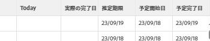
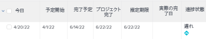
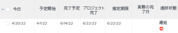

# プロジェクト進捗ステータスの概要

<!--Audited: 12/2023-->

Adobe Workfront では、タイムライン全体でプロジェクトの進行状況を確認することで、プロジェクトの進捗ステータスを決定します。タスクの進捗ステータスの値に基づいて、プロジェクトの状況を決定するように Workfront を設定できます。プロジェクト状況の設定について詳しくは、[プロジェクト状況と状況タイプの概要](../../../manage-work/projects/manage-projects/project-condition-and-condition-type.md)の記事を参照してください。

Workfrontのプロジェクトの進捗状況ステータスを次に示します。

<table style="table-layout:auto"> 
 <col> 
 <col> 
 <tbody> 
  <tr> 
   <td>予定通り</td> 
   <td> プロジェクトの進捗状況ステータスは次のとおりです。 <strong>オンタイム</strong> 次の場合：<ul><li>予測完了日と推定完了日の両方が、プロジェクトの計画完了日以前の場合</li></ul> 
  
 </td> 
  </tr> 
  <tr> 
   <td>リスクあり</td> 
   <td> プロジェクトの進捗状況ステータスは次のとおりです。 <strong>危険にさらされて</strong> if <strong>すべて</strong> 次のうちの 1 つが真です。<ul><li>「予測完了日」と「予測完了日」の両方が未来の日付です</li><li> 「予定完了日」と「予定完了日」の両方が「計画完了日」より後の日付です</li><li> 推定完了日が予定完了日より後です</li></ul>
  
 </td> 
  </tr> 
  <tr> 
   <td>遅れ</td> 
   <td> プロジェクトの進捗状況ステータスは次のとおりです。 <strong>後ろ</strong> if <strong>すべて</strong> 次のうちの 1 つが真です。<ul><li>「予測完了日」と「予測完了日」の両方が未来の日付です</li><li> 「予定完了日」と「予定完了日」の両方が、プロジェクトの「計画完了日」よりも後になっています</li><li> 推定完了日が予定完了日未満です</li></ul> 
  
 </td> 
  </tr> 
  <tr> 
   <td>遅延</td> 
   <td> 
     プロジェクトの進捗状況ステータスは次のとおりです。 <strong>遅延</strong> if <strong>どちらか</strong> 次のうちの 1 つが真です。<ul><li>プロジェクトが完了し、実績完了日が計画完了日より後になっている 
  
 </li> 
     <li> 
プロジェクトが完了しておらず、プロジェクトの計画完了日が過去の日付になっています 
  
 </li> 
    </ul> </td> 
  </tr> 
 </tbody> 
</table>

次の点に注意してください。

* プロジェクトの見込み完了日は、最新の見込み完了日を持つクリティカルパス上のタスクによって決まります。
* プロジェクトの推定完了日は、最新の推定完了日を持つクリティカルパス上のタスクによって決まります。

プロジェクトのクリティカルパスについて詳しくは、 [プロジェクトの概要の重要なパス](../../../manage-work/tasks/manage-tasks/critical-path.md).

見込み完了日については、[プロジェクト、タスクおよびイシューの見込み完了日の概要](../../../manage-work/projects/planning-a-project/project-projected-completion-date.md)を参照してください。
