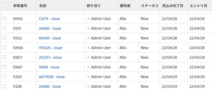

# プロジェクト、タスクおよび問題に関する予定完了日の概要

<!-- Audited: 1/2024 -->

「完了予定日」は、プロジェクト、タスクまたはイシューが完了する日時を示すリアルタイムの計算指標です。 プロジェクト、タスク、またはタスクが「完了」とマークされると、「完了予定日」が実際の完了日に変更されます。

次の項では、プロジェクト、タスク、問題に対する予定完了日の決定方法と、その見つけ方について説明します。

## アクセス要件

この記事の手順を実行するには、次のアクセス権が必要です。

<table style="table-layout:auto"> 
 <col> 
 <col> 
 <tbody> 
  <tr> 
   <td role="rowheader">Adobe Workfrontプラン</td> 
   <td> 
任意
 </td> 
  </tr> 
  <tr> 
   <td role="rowheader">Adobe Workfrontライセンス</td> 
   <td> 
   
新規： 
   <ul><li>
貢献者以上：レポートに予定完了日を表示する場合
</li> <li>
レポートを作成するための標準ライセンス
</li> </ul>

現在： 
   <ul><li>
レポートに完了予定日を表示する場合は、「確認」または「完了予定日」を設定します。
</li> 
   <li>
レポートを作成するためのプランライセンス
 </li></ul>
      </td> 
  </tr> 
  <tr> 
   <td role="rowheader">アクセスレベル設定*</td> 
   <td> 
プロジェクトへのアクセス権を表示または高くする
 
レポートを作成するには、レポート、ダッシュボード、カレンダーへの編集アクセス権が必要です
 
レポートを作成またはリスト表示を変更するには、フィルター、表示、グループに対する編集アクセス権が必要です
  </td> 
  </tr> 
  <tr> 
   <td role="rowheader">オブジェクトの権限</td> 
   <td> 
プロジェクトに対する表示権限またはそれ以上の権限
 </td> 
  </tr> 
 </tbody> 
</table>

この表の情報の詳細については、 [Workfrontドキュメントのアクセス要件](/help/quicksilver/administration-and-setup/add-users/access-levels-and-object-permissions/access-level-requirements-in-documentation.md).

## Adobe Workfrontが完了予定日を決定する方法

「予測完了日」は計算フィールドで、手動で変更することはできません。

「予測完了日」の決定に使用される基準は、表示するオブジェクトに応じて異なります。

* **プロジェクト：** プロジェクトの「完了予定日」は、プロジェクトの最新タスクの完了予定日と同じです。

  例えば、完了率が高いと、タスクの完了予定日が現在の日付に近づきます。 タスクのステータスが「新規」で、タスクの「計画完了日」が「クローズ」または「合格」の場合、「予定完了日」は将来の日付に移動します。

* **タスク：** タスクの予定完了日は、次の基準に基づいて決定されます。

   * **タスクの担当者がタスクに対して行った進捗状況の更新：** 進捗状況の更新には、完了率の変更やタスクのステータスの変更が含まれます。
   * **コミット日：** タスクの担当者がコミット日を指定した場合、「完了予定日」は「コミット日」に合わせて変更されます。

     コミット日の詳細については、「 [コミット日の概要](../../../manage-work/projects/updating-work-in-a-project/overview-of-commit-dates.md).

   * **先行タスク：** 先行タスクに遅延がない場合、「完了予定日」は「完了予定日」と一致する必要があります。 遅延が発生した場合、依存タスクには、「計画完了日」よりも「計画完了日」が大きい日付が表示されます。

     タスクの計画完了日の詳細は、 [タスクの概要計画完了日](../../../manage-work/tasks/task-information/task-planned-completion-date.md).

  >[!IMPORTANT]
  >
  >タスクの先行タスクに「実績完了日」がある場合、依存タスクには次のシナリオの説明に従って「予測完了日」が割り当てられます。
  >
  >
  >プロジェクトに Task A、Task B、Task C があり、Task B が Task A の後続タスク、Task C が Task B の後続タスク、Actual Completion Date が Task A に追加された場合、Task B に対して予測完了日が自動的に再計算されます ( **更新タイプ** プロジェクトの「自動」および「変更時」が設定されていますが、Task C では再計算されません。現在、Workfrontは、パフォーマンス上の理由から、更新された Task から 1 レベル上または下のタスクの「完了予定日」を計算します。 

* **問題：** 発行の「予定完了日」は、最初に、発行の「計画完了日」と一致するように設定されます。

  問題の担当者がコミット日を指定した場合、「完了予定日」と「完了予定日」の両方が「コミット日」に合わせて変更されます。

  コミット日の詳細については、「 [コミット日の概要](../../../manage-work/projects/updating-work-in-a-project/overview-of-commit-dates.md).

## 予定完了日の表示

プロジェクト、タスクおよびイシューの予定完了日をレポートで表示できます。 Workfrontの他の領域で、プロジェクトおよびタスクの完了予定日を表示できます。

### プロジェクトの予定完了日の表示 {#view-the-projected-completion-date-of-a-project}

1. 予定完了日を表示するプロジェクトに移動します。
1. クリック **プロジェクトの詳細** をクリックします。
1. 次を見つけます。 **予定完了日** フィールド **概要** > **プロジェクトの日付** 」セクションに入力します。

### タスクの予定完了日の表示 {#view-the-projected-completion-date-of-a-task}

1. 予定完了日を表示するタスクに移動します。
1. クリック **タスクの詳細** をクリックします。
1. 次を見つけます。 **予定完了日** フィールド **概要** > **タスクの日付と制約** 」セクションに入力します。

### 問題の予定完了日の表示 {#view-the-projected-completion-date-of-an-issue}

問題に関する「完了予定日」は、問題レポートまたはリスト表示でのみ表示できます。 リストビューの作成は、レポートでのビューの作成と似ています。

「完了予定日」を含む発行レポートを作成する手順は、次のとおりです。

1. 記事の説明に従って、問題レポートを作成します。 [カスタムレポートの作成](../../../reports-and-dashboards/reports/creating-and-managing-reports/create-custom-report.md).
1. を選択します。 **列（表示）** タブをクリックします。
1. クリック **列を追加**&#x200B;入力を開始します。 **予定完了日** （内） **この列に表示：** フィールドに入力します。

1. リストに表示されたら、選択します (「 **問題** オブジェクト。 
1. 「**保存して閉じる**」をクリックします。

   The **予定完了日** 列に値が入力されます。 

   
